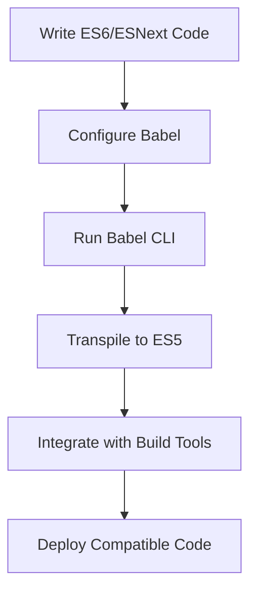

## 23.4 Transpiling with Babel

### Introduction to Babel

In the ever-evolving landscape of JavaScript, staying ahead with the latest features is crucial for modern web development. However, not all environments support the latest JavaScript syntax and features. This is where Babel comes into play. Babel is a powerful JavaScript compiler that allows developers to write code using the latest JavaScript standards and transpile it into a version compatible with older environments.

Babel's primary purpose is to enable developers to use next-generation JavaScript features without worrying about browser compatibility. By converting ES6/ESNext code into ES5, Babel ensures that your code runs smoothly across all browsers and environments.

### Setting Up Babel

To start using Babel in your project, you need to install it and configure it properly. Let's walk through the setup process.

#### Installing Babel

First, ensure you have Node.js and npm installed on your machine. Then, you can install Babel using npm:

```bash
npm install --save-dev @babel/core @babel/cli
```

- `@babel/core`: The core Babel library.
- `@babel/cli`: The command-line interface for Babel, allowing you to run Babel from the terminal.

#### Creating a Babel Configuration File

Babel uses a configuration file, typically named `.babelrc`, to determine how to transpile your code. This file is written in JSON format and specifies the presets and plugins Babel should use.

Here's a basic example of a `.babelrc` file:

```json
{
  "presets": ["@babel/preset-env"]
}
```

- **Presets**: Collections of plugins that enable specific language features. The `@babel/preset-env` preset allows you to use the latest JavaScript features by automatically determining the necessary plugins and polyfills based on your target environments.

### Understanding Babel Presets and Plugins

Babel's flexibility comes from its use of presets and plugins. Let's explore these components in more detail.

#### Presets

Presets are predefined sets of plugins that enable specific language features. The most commonly used preset is `@babel/preset-env`, which allows you to use the latest JavaScript features by automatically determining the necessary plugins and polyfills based on your target environments.

Here's how you can configure `@babel/preset-env` in your `.babelrc` file:

```json
{
  "presets": [
    ["@babel/preset-env", {
      "targets": "> 0.25%, not dead"
    }]
  ]
}
```

- **Targets**: Specify the environments you want to support. The example above targets browsers with more than 0.25% market share and excludes browsers that are no longer maintained.

#### Plugins

Plugins are individual transformations that Babel applies to your code. While presets are collections of plugins, you can also specify plugins individually in your Babel configuration.

For example, if you want to use the optional chaining operator (`?.`), you can add the corresponding plugin:

```json
{
  "plugins": ["@babel/plugin-proposal-optional-chaining"]
}
```

### Transpiling ES6/ESNext Code to ES5

Let's see Babel in action by transpiling some ES6/ESNext code to ES5.

#### Example Code

Consider the following ES6 code:

```javascript
const greet = (name = 'World') => {
  console.log(`Hello, ${name}!`);
};

greet();
```

#### Transpiling with Babel

To transpile this code using Babel, run the following command in your terminal:

```bash
npx babel src --out-dir lib
```

- `src`: The directory containing your source code.
- `lib`: The directory where the transpiled code will be output.

#### Transpiled Output

After running Babel, the transpiled ES5 code will look like this:

```javascript
"use strict";

var greet = function greet() {
  var name = arguments.length > 0 && arguments[0] !== undefined ? arguments[0] : 'World';
  console.log("Hello, ".concat(name, "!"));
};

greet();
```

### Integrating Babel with Build Tools

Babel is often used in conjunction with build tools like Webpack to streamline the development process. Let's explore how to integrate Babel with Webpack.

#### Setting Up Webpack

First, install Webpack and Babel loader:

```bash
npm install --save-dev webpack webpack-cli babel-loader
```

#### Configuring Webpack

Create a `webpack.config.js` file to configure Webpack:

```javascript
const path = require('path');

module.exports = {
  entry: './src/index.js',
  output: {
    filename: 'bundle.js',
    path: path.resolve(__dirname, 'dist')
  },
  module: {
    rules: [
      {
        test: /\.js$/,
        exclude: /node_modules/,
        use: {
          loader: 'babel-loader',
          options: {
            presets: ['@babel/preset-env']
          }
        }
      }
    ]
  }
};
```

- **Entry**: The entry point of your application.
- **Output**: The output configuration for the bundled file.
- **Module Rules**: Define how different types of modules should be processed. Here, we're using `babel-loader` to transpile JavaScript files.

#### Running Webpack

To bundle your application with Webpack, run the following command:

```bash
npx webpack --config webpack.config.js
```

### Considerations for Polyfills and Core-js

While Babel handles syntax transformations, it doesn't automatically include polyfills for new APIs. To ensure compatibility with older environments, you may need to include polyfills.

#### Using Core-js

Core-js is a popular library for polyfilling JavaScript features. You can configure Babel to include polyfills using `@babel/preset-env` and core-js.

First, install core-js:

```bash
npm install --save core-js
```

Then, update your `.babelrc` configuration:

```json
{
  "presets": [
    ["@babel/preset-env", {
      "useBuiltIns": "usage",
      "corejs": 3
    }]
  ]
}
```

- **useBuiltIns**: Specifies how polyfills are added. The `"usage"` option adds polyfills based on the features used in your code.
- **corejs**: Specifies the version of core-js to use.

### Visualizing Babel's Workflow

To better understand how Babel fits into the development workflow, let's visualize the process using a flowchart.



**Figure 1**: This flowchart illustrates the process of writing modern JavaScript code, configuring Babel, transpiling the code, integrating with build tools, and deploying the compatible code.

### Knowledge Check

Before we wrap up, let's reinforce what we've learned with a few questions:

- What is the primary purpose of Babel in JavaScript development?
- How do you configure Babel to target specific environments?
- What is the difference between presets and plugins in Babel?
- How can you integrate Babel with Webpack?
- Why might you need to include polyfills when using Babel?

### Conclusion

Transpiling with Babel is an essential skill for modern JavaScript developers. By enabling the use of next-generation JavaScript features, Babel ensures that your code remains compatible across all environments. Remember, this is just the beginning. As you progress, you'll build more complex and interactive web pages. Keep experimenting, stay curious, and enjoy the journey!

## Mastering Babel Transpiling: Test Your Knowledge



### What is the primary purpose of Babel in JavaScript development?

- [x] To enable the use of next-generation JavaScript features by transpiling code to be compatible with current environments.
- [ ] To minify JavaScript code for production.
- [ ] To bundle JavaScript modules into a single file.
- [ ] To provide a runtime environment for JavaScript.

> **Explanation:** Babel is primarily used to transpile modern JavaScript code into a version compatible with older environments.

### How do you configure Babel to target specific environments?

- [x] By specifying targets in the `@babel/preset-env` configuration.
- [ ] By using the `babel-targets` package.
- [ ] By setting the `env` option in the `.babelrc` file.
- [ ] By installing the `babel-env` plugin.

> **Explanation:** The `@babel/preset-env` preset allows you to specify target environments using the `targets` option.

### What is the difference between presets and plugins in Babel?

- [x] Presets are collections of plugins, while plugins are individual transformations.
- [ ] Plugins are collections of presets, while presets are individual transformations.
- [ ] Presets and plugins are the same in Babel.
- [ ] Presets are used for syntax transformations, while plugins are used for polyfills.

> **Explanation:** Presets are collections of plugins that enable specific language features, while plugins are individual transformations.

### How can you integrate Babel with Webpack?

- [x] By using the `babel-loader` in the Webpack configuration.
- [ ] By installing the `webpack-babel` package.
- [ ] By adding Babel as a plugin in the Webpack configuration.
- [ ] By using the `babel-webpack` command.

> **Explanation:** Babel can be integrated with Webpack by using the `babel-loader` in the Webpack configuration.

### Why might you need to include polyfills when using Babel?

- [x] To ensure compatibility with older environments that lack support for new APIs.
- [ ] To reduce the size of the transpiled code.
- [ ] To improve the performance of the transpiled code.
- [ ] To enable the use of experimental JavaScript features.

> **Explanation:** Polyfills are necessary to provide support for new APIs in environments that do not natively support them.

### What is the role of `@babel/preset-env` in Babel?

- [x] It allows you to use the latest JavaScript features by automatically determining the necessary plugins and polyfills.
- [ ] It minifies JavaScript code for production.
- [ ] It bundles JavaScript modules into a single file.
- [ ] It provides a runtime environment for JavaScript.

> **Explanation:** `@babel/preset-env` is a preset that enables the use of the latest JavaScript features by determining the necessary plugins and polyfills.

### How do you specify which JavaScript features to transpile with Babel?

- [x] By configuring the `presets` and `plugins` in the `.babelrc` file.
- [ ] By using the `babel-features` package.
- [ ] By setting the `features` option in the Babel CLI.
- [ ] By installing the `babel-features` plugin.

> **Explanation:** The features to transpile are specified by configuring the `presets` and `plugins` in the `.babelrc` file.

### What is the purpose of the `babel-loader` in Webpack?

- [x] To transpile JavaScript files using Babel during the build process.
- [ ] To minify JavaScript files for production.
- [ ] To bundle JavaScript modules into a single file.
- [ ] To provide a runtime environment for JavaScript.

> **Explanation:** The `babel-loader` is used in Webpack to transpile JavaScript files using Babel during the build process.

### How can you add polyfills to your project using Babel?

- [x] By configuring `@babel/preset-env` with `useBuiltIns` and `corejs` options.
- [ ] By installing the `babel-polyfill` package.
- [ ] By using the `babel-polyfills` plugin.
- [ ] By setting the `polyfills` option in the Babel CLI.

> **Explanation:** Polyfills can be added by configuring `@babel/preset-env` with `useBuiltIns` and `corejs` options.

### True or False: Babel automatically includes polyfills for new APIs.

- [ ] True
- [x] False

> **Explanation:** Babel does not automatically include polyfills for new APIs. You need to configure it to include polyfills using `@babel/preset-env` and core-js.




