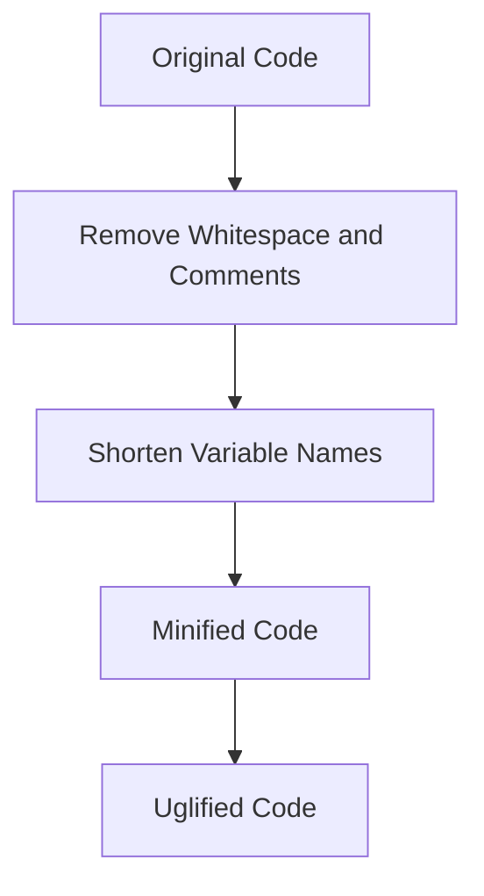

## 23.5 Code Minification and Uglification

In the world of modern web development, optimizing the performance of your JavaScript code is crucial. One of the most effective ways to achieve this is through code minification and uglification. These techniques help reduce the size of your JavaScript files, leading to faster load times and improved performance. In this section, we will explore what minification and uglification are, discuss popular tools like UglifyJS and Terser, and provide examples of how to configure these processes in your build systems. We will also highlight the benefits and potential downsides of these techniques, and discuss how source maps can aid in debugging minified code.

### What is Code Minification?

Code minification is the process of removing all unnecessary characters from source code without changing its functionality. This includes removing whitespace, comments, and shortening variable names. The primary goal of minification is to reduce the size of the code, which in turn decreases the amount of data that needs to be transferred over the network, leading to faster page load times.

#### Example of Minification

Consider the following simple JavaScript function:

```javascript
// Original Code
function addNumbers(a, b) {
    // This function adds two numbers
    return a + b;
}
```

After minification, the code might look like this:

```javascript
// Minified Code
function addNumbers(a,b){return a+b;}
```

As you can see, the minified version removes comments and unnecessary whitespace, resulting in a smaller file size.

### What is Code Uglification?

Uglification takes minification a step further by transforming the code into a form that is not only smaller but also harder to read. This is achieved by renaming variables and functions to shorter names, which can make the code less understandable to humans. While uglification can further reduce file size, it also serves as a basic form of obfuscation, making it more difficult for others to reverse-engineer the code.

#### Example of Uglification

Continuing with our previous example, uglification might transform the code as follows:

```javascript
// Uglified Code
function a(b,c){return b+c;}
```

Here, the function name and parameter names have been shortened, making the code less readable.

### Tools for Minification and Uglification

Several tools are available to automate the process of minification and uglification. Two of the most popular tools are UglifyJS and Terser.

#### UglifyJS

UglifyJS is a widely used JavaScript minification tool that can compress and mangle your code. It is highly configurable and can be integrated into various build systems.

- **Installation**: You can install UglifyJS via npm:

  ```bash
  npm install uglify-js --save-dev
  ```

- **Usage**: To minify a JavaScript file using UglifyJS, you can use the following command:

  ```bash
  npx uglifyjs input.js -o output.min.js
  ```

  This command will take `input.js` and produce a minified version `output.min.js`.

#### Terser

Terser is a modern JavaScript minification tool that is based on UglifyJS but offers better support for ES6+ syntax. It is known for its speed and efficiency.

- **Installation**: You can install Terser via npm:

  ```bash
  npm install terser --save-dev
  ```

- **Usage**: To minify a JavaScript file using Terser, you can use the following command:

  ```bash
  npx terser input.js -o output.min.js
  ```

  Similar to UglifyJS, this command will produce a minified version of your JavaScript file.

### Configuring Minification in Build Processes

Minification and uglification are often integrated into build processes using tools like Webpack, Gulp, or Grunt. Let's explore how you can configure these processes in a Webpack build.

#### Webpack Configuration

To use Terser with Webpack, you can configure it in your `webpack.config.js` file as follows:

```javascript
const TerserPlugin = require('terser-webpack-plugin');

module.exports = {
  mode: 'production',
  optimization: {
    minimize: true,
    minimizer: [new TerserPlugin()],
  },
};
```

This configuration tells Webpack to use Terser for minification when building your project in production mode.

### Benefits of Minification and Uglification

1. **Reduced Bandwidth Usage**: Smaller file sizes mean less data needs to be transferred over the network, reducing bandwidth usage.
2. **Faster Load Times**: Minified files load faster, improving the user experience.
3. **Improved Parsing Speed**: Smaller files are parsed more quickly by the browser, leading to faster execution.
4. **Basic Code Obfuscation**: Uglification provides a basic level of code obfuscation, making it harder for others to understand your code.

### Potential Downsides

1. **Obfuscated Code**: Uglification can make the code difficult to read and understand, which can be a challenge during debugging.
2. **Debugging Challenges**: Minified code can be harder to debug, as line numbers and variable names may not match the original source code.
3. **Source Maps**: To mitigate debugging challenges, source maps can be used to map minified code back to the original source code.

### Source Maps and Debugging

Source maps are files that map the minified code back to the original source code, making it easier to debug. They are essential when using minification and uglification, as they allow developers to see the original code in the browser's developer tools.

#### Generating Source Maps

Both UglifyJS and Terser support generating source maps. Here's how you can generate a source map with Terser:

```bash
npx terser input.js -o output.min.js --source-map
```

This command will generate a `output.min.js.map` file alongside the minified JavaScript file.

### Visualizing the Minification Process

To better understand the minification process, let's visualize how code is transformed from its original form to a minified and uglified version.



**Diagram Description**: This flowchart illustrates the transformation of JavaScript code from its original form to a minified and uglified version. The process involves removing whitespace and comments, shortening variable names, and producing a final minified and uglified code.

### Try It Yourself

To get hands-on experience with minification and uglification, try modifying the following code example:

```javascript
// Original Code
function multiplyNumbers(x, y) {
    // This function multiplies two numbers
    return x * y;
}
```

1. Use Terser to minify the code.
2. Experiment with different Terser options to see how they affect the output.
3. Generate a source map and use it to debug the minified code.

### References and Further Reading

- [MDN Web Docs: Minification](https://developer.mozilla.org/en-US/docs/Glossary/Minification)
- [UglifyJS GitHub Repository](https://github.com/mishoo/UglifyJS)
- [Terser Official Website](https://terser.org/)

### Knowledge Check

To reinforce your understanding of code minification and uglification, try answering the following questions.

## Understanding JavaScript Code Minification and Uglification



### What is the primary goal of code minification?

- [x] To reduce the size of the code
- [ ] To improve code readability
- [ ] To add new features to the code
- [ ] To increase the complexity of the code

> **Explanation:** The primary goal of code minification is to reduce the size of the code by removing unnecessary characters, which helps improve load times and performance.

### Which tool is known for better support of ES6+ syntax?

- [ ] UglifyJS
- [x] Terser
- [ ] Babel
- [ ] ESLint

> **Explanation:** Terser is known for its better support of ES6+ syntax compared to UglifyJS, making it a preferred choice for modern JavaScript projects.

### What is a potential downside of code uglification?

- [ ] Improved performance
- [x] Obfuscated code
- [ ] Reduced file size
- [ ] Faster parsing speed

> **Explanation:** A potential downside of code uglification is that it results in obfuscated code, making it harder to read and understand.

### How can source maps aid in debugging minified code?

- [x] By mapping minified code back to the original source code
- [ ] By increasing the file size
- [ ] By removing comments from the code
- [ ] By shortening variable names

> **Explanation:** Source maps aid in debugging by mapping the minified code back to the original source code, allowing developers to see the original code in the browser's developer tools.

### Which command generates a source map using Terser?

- [x] `npx terser input.js -o output.min.js --source-map`
- [ ] `npx terser input.js -o output.min.js`
- [ ] `npx uglifyjs input.js -o output.min.js --source-map`
- [ ] `npx babel input.js -o output.min.js --source-map`

> **Explanation:** The command `npx terser input.js -o output.min.js --source-map` generates a source map using Terser.

### What is the benefit of using minification in JavaScript?

- [x] Reduced bandwidth usage
- [ ] Increased code complexity
- [ ] Improved code readability
- [ ] Longer variable names

> **Explanation:** Minification reduces bandwidth usage by decreasing the file size, which helps improve load times and performance.

### Which of the following is a popular JavaScript minification tool?

- [x] UglifyJS
- [ ] ESLint
- [ ] Babel
- [ ] Webpack

> **Explanation:** UglifyJS is a popular JavaScript minification tool used to compress and mangle code.

### What does the `minimize` option in Webpack configuration do?

- [x] Enables code minification
- [ ] Disables code minification
- [ ] Increases file size
- [ ] Adds comments to the code

> **Explanation:** The `minimize` option in Webpack configuration enables code minification, reducing the size of the output files.

### True or False: Uglification is a form of code obfuscation.

- [x] True
- [ ] False

> **Explanation:** True. Uglification is a form of code obfuscation as it transforms the code into a form that is harder to read and understand.

### Which of the following is NOT a benefit of code minification?

- [ ] Faster load times
- [ ] Reduced bandwidth usage
- [x] Improved code readability
- [ ] Improved parsing speed

> **Explanation:** Improved code readability is not a benefit of code minification. Minification focuses on reducing file size, which can make the code less readable.



Remember, this is just the beginning. As you progress, you'll build more complex and interactive web pages. Keep experimenting, stay curious, and enjoy the journey!
