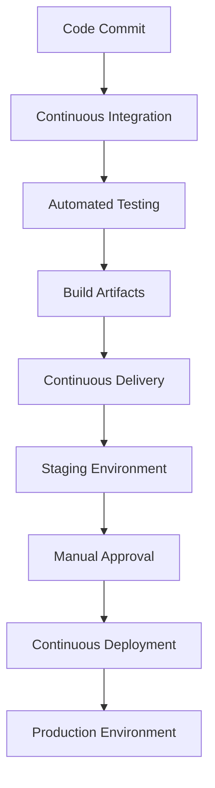

## 23.6 Continuous Integration Tools

Continuous Integration (CI) is a cornerstone of modern software development practices, particularly in the realm of JavaScript development. It involves the automation of building, testing, and deploying applications, which significantly improves code quality and facilitates team collaboration. In this section, we will delve into the concept of CI, explore popular CI tools, and provide practical examples of setting up a CI pipeline for a JavaScript project. We will also highlight best practices for integrating tests, linting, and builds, and discuss the role of CI in supporting continuous delivery and deployment.

### Understanding Continuous Integration

Continuous Integration is a development practice where developers integrate code into a shared repository frequently, ideally several times a day. Each integration is verified by an automated build and automated tests, allowing teams to detect problems early. The key benefits of CI include:

- **Early Detection of Errors**: By integrating frequently, errors can be detected and fixed early in the development process.
- **Improved Collaboration**: CI encourages developers to share their code and unit tests by merging their changes into a shared version control repository after every small task completion.
- **Reduced Integration Problems**: Frequent integrations reduce the number of conflicting changes and integration problems.
- **Faster Release Cycles**: Automated testing and builds allow for faster and more reliable release cycles.

### Popular Continuous Integration Tools

There are several CI tools available that cater to different needs and preferences. Here, we will discuss some of the most popular ones used in the JavaScript ecosystem.

#### Jenkins

[Jenkins](https://www.jenkins.io/) is an open-source automation server that provides hundreds of plugins to support building, deploying, and automating any project. It is highly customizable and can be used to automate various stages of the software development lifecycle.

- **Features**: Jenkins supports distributed builds, integrates with numerous version control systems, and has a vast plugin ecosystem.
- **Setup**: Jenkins can be installed on-premises or used as a cloud service. It requires a bit of setup and configuration but offers great flexibility.
- **Example**: Below is a simple Jenkins pipeline configuration for a JavaScript project using a `Jenkinsfile`.

```groovy
pipeline {
    agent any
    stages {
        stage('Install') {
            steps {
                sh 'npm install'
            }
        }
        stage('Lint') {
            steps {
                sh 'npm run lint'
            }
        }
        stage('Test') {
            steps {
                sh 'npm test'
            }
        }
        stage('Build') {
            steps {
                sh 'npm run build'
            }
        }
    }
}
```

#### Travis CI

[Travis CI](https://travis-ci.com/) is a hosted continuous integration service used to build and test software projects hosted on GitHub. It is known for its simplicity and ease of use.

- **Features**: Travis CI integrates seamlessly with GitHub, supports multiple languages, and provides a simple YAML configuration file.
- **Setup**: To use Travis CI, you need to sign up with your GitHub account and add a `.travis.yml` file to your repository.
- **Example**: Here is an example `.travis.yml` file for a Node.js project.

```yaml
language: node_js
node_js:
  - "14"
install:
  - npm install
script:
  - npm run lint
  - npm test
  - npm run build
```

#### CircleCI

[CircleCI](https://circleci.com/) is a cloud-based CI tool that automates the software development process using continuous integration and delivery. It is known for its speed and efficiency.

- **Features**: CircleCI offers parallelism, caching, and a robust set of integrations with other tools and services.
- **Setup**: CircleCI uses a configuration file called `config.yml` located in the `.circleci` directory of your repository.
- **Example**: Below is a sample `config.yml` for a JavaScript project.

```yaml
version: 2.1
jobs:
  build:
    docker:
      - image: circleci/node:14
    steps:
      - checkout
      - run: npm install
      - run: npm run lint
      - run: npm test
      - run: npm run build
```

#### GitHub Actions

[GitHub Actions](https://github.com/features/actions) is a CI/CD platform that allows you to automate your build, test, and deployment pipeline. It is tightly integrated with GitHub, making it a popular choice for projects hosted there.

- **Features**: GitHub Actions supports event-driven workflows, matrix builds, and a marketplace for reusable actions.
- **Setup**: Workflows are defined in YAML files located in the `.github/workflows` directory of your repository.
- **Example**: Here is an example workflow file for a JavaScript project.

```yaml
name: Node.js CI

on:
  push:
    branches: [ main ]
  pull_request:
    branches: [ main ]

jobs:
  build:
    runs-on: ubuntu-latest
    steps:
      - uses: actions/checkout@v2
      - name: Use Node.js
        uses: actions/setup-node@v2
        with:
          node-version: '14'
      - run: npm install
      - run: npm run lint
      - run: npm test
      - run: npm run build
```

#### GitLab CI/CD

[GitLab CI/CD](https://docs.gitlab.com/ee/ci/) is a part of GitLab, a web-based DevOps lifecycle tool that provides a Git repository manager. GitLab CI/CD is known for its deep integration with GitLab and its powerful features.

- **Features**: GitLab CI/CD offers a comprehensive set of features, including pipelines, environments, and monitoring.
- **Setup**: Pipelines are defined in a `.gitlab-ci.yml` file located in the root of your repository.
- **Example**: Below is a sample `.gitlab-ci.yml` for a JavaScript project.

```yaml
stages:
  - install
  - lint
  - test
  - build

install:
  stage: install
  script:
    - npm install

lint:
  stage: lint
  script:
    - npm run lint

test:
  stage: test
  script:
    - npm test

build:
  stage: build
  script:
    - npm run build
```

### Setting Up a CI Pipeline for a JavaScript Project

Setting up a CI pipeline involves defining the steps required to build, test, and deploy your application. Here is a step-by-step guide to setting up a CI pipeline for a JavaScript project using GitHub Actions:

1. **Create a GitHub Repository**: Start by creating a new repository on GitHub for your JavaScript project.

2. **Add a Workflow File**: Create a new directory called `.github/workflows` in the root of your repository and add a YAML file for your workflow.

3. **Define the Workflow**: Use the following example as a template to define your workflow.

```yaml
name: JavaScript CI

on:
  push:
    branches: [ main ]
  pull_request:
    branches: [ main ]

jobs:
  build:
    runs-on: ubuntu-latest
    steps:
      - uses: actions/checkout@v2
      - name: Setup Node.js
        uses: actions/setup-node@v2
        with:
          node-version: '14'
      - run: npm install
      - run: npm run lint
      - run: npm test
      - run: npm run build
```

4. **Commit and Push**: Commit your changes and push them to the main branch of your repository.

5. **Monitor the Workflow**: Navigate to the "Actions" tab in your GitHub repository to monitor the progress of your workflow.

### Best Practices for Integrating Tests, Linting, and Builds

To make the most of your CI pipeline, consider the following best practices:

- **Automate Everything**: Automate as many tasks as possible, including testing, linting, and building.
- **Keep Builds Fast**: Optimize your build process to keep it fast and efficient. Use caching and parallelism where possible.
- **Fail Fast**: Configure your CI pipeline to fail fast if any step fails. This helps identify issues early.
- **Use Version Control**: Store your CI configuration files in version control to track changes and collaborate with your team.
- **Integrate Code Quality Tools**: Use tools like ESLint for linting and Jest for testing to maintain code quality.
- **Monitor and Report**: Set up notifications and reports to keep your team informed about the status of the CI pipeline.

### The Role of CI in Supporting Continuous Delivery and Deployment

Continuous Integration is a critical component of Continuous Delivery (CD) and Continuous Deployment. By automating the integration process, CI lays the foundation for CD, which involves automatically deploying code changes to a staging or production environment. This automation reduces the risk of human error and ensures that code changes are thoroughly tested before deployment.

- **Continuous Delivery**: With CI in place, teams can implement CD to automatically deploy code changes to a staging environment for further testing and validation.
- **Continuous Deployment**: For teams practicing Continuous Deployment, CI ensures that every code change that passes the CI pipeline is automatically deployed to production.

### Visualizing a CI/CD Pipeline

To better understand the flow of a CI/CD pipeline, let's visualize it using a Mermaid.js diagram.



**Diagram Description**: This diagram illustrates the flow of a CI/CD pipeline, starting from a code commit, followed by continuous integration, automated testing, building artifacts, continuous delivery to a staging environment, manual approval, and finally continuous deployment to a production environment.

### Conclusion

Continuous Integration is an essential practice for modern JavaScript development, enabling teams to automate the building, testing, and deployment of applications. By leveraging popular CI tools like Jenkins, Travis CI, CircleCI, GitHub Actions, and GitLab CI/CD, developers can improve code quality, enhance collaboration, and accelerate release cycles. Remember, this is just the beginning. As you progress, you'll build more complex and interactive CI/CD pipelines. Keep experimenting, stay curious, and enjoy the journey!

## Knowledge Check: Continuous Integration Tools



### What is the primary purpose of Continuous Integration (CI)?

- [x] To automate the integration of code changes into a shared repository
- [ ] To manually test code changes
- [ ] To deploy code changes to production
- [ ] To write code documentation

> **Explanation:** Continuous Integration automates the integration of code changes into a shared repository, allowing for early detection of errors.

### Which CI tool is known for its simplicity and ease of use, especially with GitHub?

- [ ] Jenkins
- [x] Travis CI
- [ ] CircleCI
- [ ] GitLab CI/CD

> **Explanation:** Travis CI is known for its simplicity and ease of use, particularly with GitHub.

### What file format is commonly used for configuring CI pipelines in GitHub Actions?

- [ ] JSON
- [x] YAML
- [ ] XML
- [ ] INI

> **Explanation:** GitHub Actions uses YAML files for configuring CI pipelines.

### Which CI tool is tightly integrated with GitLab?

- [ ] Jenkins
- [ ] Travis CI
- [ ] CircleCI
- [x] GitLab CI/CD

> **Explanation:** GitLab CI/CD is tightly integrated with GitLab, providing a comprehensive set of features.

### What is a key benefit of using Continuous Integration?

- [x] Early detection of errors
- [ ] Manual code reviews
- [ ] Slower release cycles
- [ ] Increased manual testing

> **Explanation:** Continuous Integration allows for early detection of errors by automating the integration and testing process.

### Which of the following is a best practice for CI pipelines?

- [x] Automate everything
- [ ] Keep builds slow
- [ ] Avoid version control
- [ ] Ignore code quality tools

> **Explanation:** Automating as many tasks as possible is a best practice for CI pipelines.

### What is the role of CI in Continuous Deployment?

- [x] Ensures code changes are thoroughly tested before deployment
- [ ] Manually deploys code changes
- [ ] Writes code documentation
- [ ] Increases manual testing

> **Explanation:** CI ensures that code changes are thoroughly tested before deployment, supporting Continuous Deployment.

### Which CI tool uses a `Jenkinsfile` for pipeline configuration?

- [x] Jenkins
- [ ] Travis CI
- [ ] CircleCI
- [ ] GitHub Actions

> **Explanation:** Jenkins uses a `Jenkinsfile` for pipeline configuration.

### What is the purpose of the `stages` keyword in a `.gitlab-ci.yml` file?

- [x] To define the sequence of jobs in a pipeline
- [ ] To specify the programming language
- [ ] To set environment variables
- [ ] To configure version control

> **Explanation:** The `stages` keyword in a `.gitlab-ci.yml` file defines the sequence of jobs in a pipeline.

### Continuous Integration is a critical component of Continuous Delivery.

- [x] True
- [ ] False

> **Explanation:** Continuous Integration is a critical component of Continuous Delivery, as it automates the integration and testing process, laying the foundation for automated deployments.


