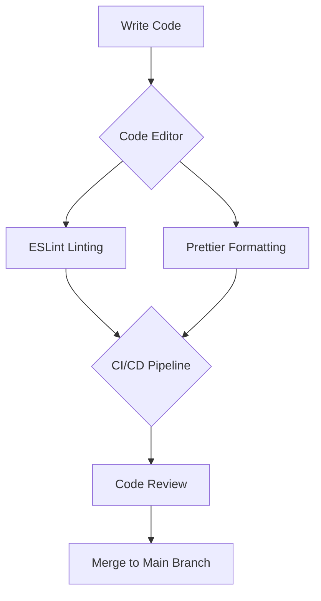

## 23.7 Linting and Formatting Automation

In modern web development, maintaining a consistent code style and catching errors early in the development process are crucial for ensuring code quality and reducing technical debt. Linting and formatting automation play a significant role in achieving these goals. In this section, we will explore the tools and practices for automating code linting and formatting in JavaScript development, focusing on popular tools like ESLint and Prettier.

### Introduction to Linting and Formatting

Linting is the process of analyzing code to identify potential errors, enforce coding standards, and improve code quality. Linters can catch syntax errors, enforce stylistic conventions, and highlight potential bugs. Formatting, on the other hand, involves automatically adjusting the code's layout to adhere to a consistent style guide, making it easier to read and maintain.

### ESLint: The JavaScript Linter

[ESLint](https://eslint.org/) is a widely-used linter for JavaScript that helps developers identify and fix problems in their code. It is highly configurable and supports custom rules, making it suitable for a variety of coding standards and styles.

#### Key Features of ESLint

- **Customizable Rules**: ESLint allows developers to define their own rules or use predefined ones to enforce coding standards.
- **Plugin Support**: ESLint's plugin system enables the addition of third-party rules and configurations.
- **Integration with Code Editors**: ESLint integrates seamlessly with popular code editors like Visual Studio Code, Atom, and Sublime Text.
- **Support for Modern JavaScript**: ESLint supports ES6 and beyond, including JSX and TypeScript.

#### Setting Up ESLint

To get started with ESLint, you need to install it as a development dependency in your project:

```bash
npm install eslint --save-dev
```

Once installed, you can initialize ESLint in your project using the following command:

```bash
npx eslint --init
```

This command will guide you through a series of questions to set up your ESLint configuration file (`.eslintrc.json`).

#### Configuring ESLint

ESLint's configuration file allows you to specify rules, environments, and parser options. Here's an example of a basic ESLint configuration:

```json
{
  "env": {
    "browser": true,
    "es2021": true
  },
  "extends": "eslint:recommended",
  "parserOptions": {
    "ecmaVersion": 12,
    "sourceType": "module"
  },
  "rules": {
    "indent": ["error", 2],
    "linebreak-style": ["error", "unix"],
    "quotes": ["error", "double"],
    "semi": ["error", "always"]
  }
}
```

In this configuration, we specify the environment (`browser`), extend the recommended ESLint rules, and define custom rules for indentation, linebreaks, quotes, and semicolons.

### Prettier: Automated Code Formatting

[Prettier](https://prettier.io/) is an opinionated code formatter that enforces a consistent style by parsing your code and reprinting it with its own rules. Unlike linters, Prettier focuses solely on formatting, ensuring that your code looks the same regardless of who wrote it.

#### Key Features of Prettier

- **Automatic Formatting**: Prettier formats your code automatically, reducing the need for manual adjustments.
- **Support for Multiple Languages**: Prettier supports JavaScript, TypeScript, CSS, HTML, and more.
- **Integration with Code Editors**: Prettier integrates with popular code editors, allowing for on-save formatting.
- **Configurable Options**: While opinionated, Prettier offers some configuration options to suit your preferences.

#### Setting Up Prettier

To use Prettier in your project, install it as a development dependency:

```bash
npm install prettier --save-dev
```

You can create a Prettier configuration file (`.prettierrc`) to customize its behavior:

```json
{
  "printWidth": 80,
  "tabWidth": 2,
  "useTabs": false,
  "semi": true,
  "singleQuote": true,
  "trailingComma": "es5",
  "bracketSpacing": true
}
```

This configuration specifies options such as line width, tab width, and quote style.

### Integrating ESLint and Prettier

While ESLint and Prettier serve different purposes, they can be used together to ensure both code quality and consistent formatting. However, conflicts can arise between ESLint's stylistic rules and Prettier's formatting. To resolve these conflicts, you can use the `eslint-config-prettier` package, which disables ESLint rules that conflict with Prettier:

```bash
npm install eslint-config-prettier --save-dev
```

Add `prettier` to the `extends` array in your ESLint configuration:

```json
{
  "extends": [
    "eslint:recommended",
    "prettier"
  ]
}
```

### Integrating with Code Editors

Both ESLint and Prettier offer plugins for popular code editors, enabling real-time linting and formatting. For example, in Visual Studio Code, you can install the ESLint and Prettier extensions from the marketplace. Once installed, configure your editor to format on save and display linting errors inline.

### Integrating with CI/CD Pipelines

Automating linting and formatting in your CI/CD pipelines ensures that code quality checks are consistently applied across your team. You can add ESLint and Prettier checks to your build process using npm scripts or task runners like Gulp or Grunt.

Here's an example of a script in `package.json` to run ESLint and Prettier checks:

```json
{
  "scripts": {
    "lint": "eslint 'src/**/*.js'",
    "format": "prettier --check 'src/**/*.js'"
  }
}
```

In your CI/CD configuration, run these scripts to enforce code quality before merging changes.

### Benefits of Consistent Code Style

Enforcing a consistent code style across your codebase offers several benefits:

- **Improved Readability**: Consistent formatting makes code easier to read and understand.
- **Reduced Code Review Time**: With automated formatting, code reviews can focus on logic rather than style.
- **Early Error Detection**: Linters catch potential errors before they reach production, reducing bugs.
- **Enhanced Collaboration**: A unified code style facilitates collaboration among team members.

### Conclusion

Automating linting and formatting in JavaScript development is essential for maintaining code quality and consistency. By integrating tools like ESLint and Prettier into your development workflow, you can enforce coding standards, reduce errors, and streamline collaboration. Remember, this is just the beginning. As you progress, you'll build more complex and interactive web pages. Keep experimenting, stay curious, and enjoy the journey!

### Try It Yourself

Experiment with the following code snippet by modifying the ESLint and Prettier configurations to see how they affect your code:

```javascript
// Example JavaScript code
function greet(name) {
  console.log("Hello, " + name + "!");
}

greet("World");
```

Try changing the quote style, indentation, or adding/removing semicolons to observe how ESLint and Prettier enforce your rules.

### Visualizing the Linting and Formatting Workflow



**Diagram Description**: This flowchart illustrates the typical workflow of linting and formatting automation in a development environment. Code is written in an editor, linted by ESLint, and formatted by Prettier. The CI/CD pipeline ensures these checks are applied before code review and merging.

### Knowledge Check

## Quiz: Mastering Linting and Formatting Automation in JavaScript



### What is the primary purpose of ESLint in JavaScript development?

- [x] To identify and fix potential errors in the code
- [ ] To format the code according to a style guide
- [ ] To compile JavaScript code to machine code
- [ ] To manage project dependencies

> **Explanation:** ESLint is a tool used to identify and fix potential errors in JavaScript code, enforcing coding standards and improving code quality.

### How does Prettier differ from ESLint?

- [x] Prettier focuses solely on code formatting
- [ ] Prettier is used for error detection
- [ ] Prettier is a JavaScript compiler
- [ ] Prettier manages project dependencies

> **Explanation:** Prettier is an opinionated code formatter that focuses solely on formatting code, whereas ESLint is used for error detection and enforcing coding standards.

### Which package helps resolve conflicts between ESLint and Prettier?

- [x] eslint-config-prettier
- [ ] eslint-plugin-prettier
- [ ] prettier-eslint
- [ ] eslint-plugin-react

> **Explanation:** The `eslint-config-prettier` package disables ESLint rules that conflict with Prettier, allowing both tools to work together seamlessly.

### What command initializes ESLint in a project?

- [x] npx eslint --init
- [ ] npm install eslint
- [ ] npx prettier --init
- [ ] npm run eslint

> **Explanation:** The `npx eslint --init` command initializes ESLint in a project, guiding the user through the setup process.

### What is a benefit of integrating linting and formatting into CI/CD pipelines?

- [x] Ensures consistent code quality checks across the team
- [ ] Compiles JavaScript code to machine code
- [ ] Manages project dependencies
- [ ] Automatically deploys code to production

> **Explanation:** Integrating linting and formatting into CI/CD pipelines ensures that code quality checks are consistently applied across the team, maintaining a high standard of code quality.

### Which of the following is a key feature of Prettier?

- [x] Automatic code formatting
- [ ] Error detection
- [ ] Dependency management
- [ ] Code compilation

> **Explanation:** Prettier's key feature is automatic code formatting, which ensures a consistent style across the codebase.

### What is the purpose of the `.eslintrc.json` file?

- [x] To configure ESLint rules and settings
- [ ] To manage project dependencies
- [ ] To compile JavaScript code
- [ ] To format code according to a style guide

> **Explanation:** The `.eslintrc.json` file is used to configure ESLint rules and settings, specifying how the linter should analyze the code.

### How can you run ESLint checks in a project?

- [x] By using the command `npm run lint`
- [ ] By using the command `npm install eslint`
- [ ] By using the command `npx prettier --check`
- [ ] By using the command `npm run build`

> **Explanation:** You can run ESLint checks in a project by using the command `npm run lint`, assuming the script is defined in the `package.json` file.

### What is a benefit of using a consistent code style?

- [x] Improved readability and maintainability
- [ ] Faster code compilation
- [ ] Reduced file size
- [ ] Increased execution speed

> **Explanation:** A consistent code style improves readability and maintainability, making it easier for developers to understand and work with the code.

### True or False: Prettier can be used to detect syntax errors in JavaScript code.

- [ ] True
- [x] False

> **Explanation:** False. Prettier is a code formatter and does not detect syntax errors. ESLint is used for error detection and enforcing coding standards.



By mastering linting and formatting automation, you can significantly enhance your JavaScript development workflow, ensuring high-quality, consistent code across your projects.
