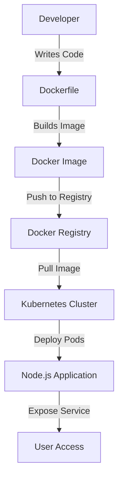

## 23.8 Deployments with Docker and Kubernetes

In the modern web development landscape, deploying applications efficiently and reliably is crucial. Docker and Kubernetes have emerged as powerful tools for containerization and orchestration, enabling developers to deploy JavaScript applications in scalable and portable environments. In this section, we'll explore how to leverage these technologies to streamline your deployment processes.

### Understanding Docker

Docker is a platform that allows developers to automate the deployment of applications inside lightweight, portable containers. These containers include everything needed to run the application, such as the code, runtime, libraries, and system tools, ensuring consistency across different environments.

#### Benefits of Using Docker

- **Portability**: Containers can run on any system that supports Docker, eliminating environment-specific issues.
- **Isolation**: Each container runs in its own isolated environment, preventing conflicts between applications.
- **Scalability**: Easily scale applications by running multiple containers.
- **Efficiency**: Containers are lightweight and share the host OS kernel, reducing overhead compared to virtual machines.

### Creating Dockerfiles for Node.js Applications

To containerize a Node.js application, you need to create a Dockerfile, which is a text document that contains all the commands to assemble the image.

#### Example Dockerfile for a Node.js Application

```dockerfile
# Use the official Node.js image as the base image
FROM node:14

# Set the working directory
WORKDIR /usr/src/app

# Copy package.json and package-lock.json
COPY package*.json ./

# Install dependencies
RUN npm install

# Copy the rest of the application code
COPY . .

# Expose the application port
EXPOSE 3000

# Start the application
CMD ["node", "app.js"]
```

**Explanation:**

- **FROM**: Specifies the base image to use. Here, we use the official Node.js image.
- **WORKDIR**: Sets the working directory inside the container.
- **COPY**: Copies files from the host to the container.
- **RUN**: Executes commands inside the container. We use it to install dependencies.
- **EXPOSE**: Informs Docker that the container listens on the specified network ports.
- **CMD**: Specifies the command to run when the container starts.

### Containerizing Front-End Applications

Front-end applications can also be containerized using Docker. Typically, these applications are built into static files that can be served by a web server like Nginx.

#### Example Dockerfile for a React Application

```dockerfile
# Use a Node.js image to build the application
FROM node:14 as build

WORKDIR /app

COPY package*.json ./

RUN npm install

COPY . .

RUN npm run build

# Use an Nginx image to serve the static files
FROM nginx:alpine

COPY --from=build /app/build /usr/share/nginx/html

EXPOSE 80

CMD ["nginx", "-g", "daemon off;"]
```

**Explanation:**

- **Multi-stage builds**: We use a Node.js image to build the application and an Nginx image to serve it. This reduces the final image size by excluding unnecessary build tools.
- **COPY --from=build**: Copies the build output from the first stage to the Nginx server's document root.

### Introduction to Kubernetes

Kubernetes is an open-source platform for automating the deployment, scaling, and management of containerized applications. It provides a robust framework for running distributed systems resiliently.

#### Key Concepts in Kubernetes

- **Pods**: The smallest deployable units in Kubernetes, which can contain one or more containers.
- **Nodes**: Machines (physical or virtual) that run the pods.
- **Clusters**: A set of nodes managed by Kubernetes.
- **Services**: Define a logical set of pods and a policy to access them.
- **Deployments**: Manage the deployment and scaling of a set of pods.

### Deploying Applications to a Kubernetes Cluster

To deploy an application to Kubernetes, you need to define a deployment configuration and a service configuration.

#### Example Kubernetes Deployment for a Node.js Application

```yaml
apiVersion: apps/v1
kind: Deployment
metadata:
  name: nodejs-app
spec:
  replicas: 3
  selector:
    matchLabels:
      app: nodejs
  template:
    metadata:
      labels:
        app: nodejs
    spec:
      containers:
      - name: nodejs
        image: nodejs-app:latest
        ports:
        - containerPort: 3000
```

**Explanation:**

- **replicas**: Specifies the number of pod replicas to run.
- **selector**: Defines how the deployment finds the pods it manages.
- **template**: Specifies the pod configuration, including the container image and ports.

#### Example Kubernetes Service for a Node.js Application

```yaml
apiVersion: v1
kind: Service
metadata:
  name: nodejs-service
spec:
  type: LoadBalancer
  selector:
    app: nodejs
  ports:
  - protocol: TCP
    port: 80
    targetPort: 3000
```

**Explanation:**

- **type: LoadBalancer**: Exposes the service externally using a cloud provider's load balancer.
- **selector**: Matches the pods to route traffic to.
- **ports**: Maps the service port to the container port.

### Best Practices for Kubernetes Deployments

- **Resource Management**: Define resource requests and limits for containers to ensure efficient use of cluster resources.
- **Scaling**: Use horizontal pod autoscaling to automatically adjust the number of pods based on CPU utilization or other metrics.
- **Rolling Updates**: Deploy new versions of applications without downtime using rolling updates.
- **Configuration Management**: Use ConfigMaps and Secrets to manage configuration data and sensitive information.

### Security Considerations

- **Network Policies**: Define network policies to control traffic between pods.
- **Pod Security Policies**: Enforce security settings for pods, such as running as non-root users.
- **Image Security**: Regularly scan container images for vulnerabilities and use trusted image registries.

### Try It Yourself

Experiment with the provided Dockerfiles and Kubernetes configurations. Try modifying the Node.js application to add new features or change the number of replicas in the Kubernetes deployment to see how it affects scalability.

### Visualizing Docker and Kubernetes Workflow



**Diagram Explanation:**

- **Developer**: Writes code and Dockerfile.
- **Dockerfile**: Used to build the Docker image.
- **Docker Image**: Pushed to a Docker registry.
- **Kubernetes Cluster**: Pulls the image and deploys it as pods.
- **Node.js Application**: Runs inside the pods.
- **User Access**: Users access the application through a service.

### References and Links

- [Docker Documentation](https://docs.docker.com/)
- [Kubernetes Documentation](https://kubernetes.io/docs/home/)
- [Node.js Official Website](https://nodejs.org/)
- [Nginx Official Website](https://www.nginx.com/)

### Knowledge Check

- What are the benefits of using Docker for application deployment?
- How does Kubernetes help in managing containerized applications?
- What is the purpose of a Dockerfile?
- How can you scale applications in Kubernetes?
- What are some security considerations when deploying applications with Kubernetes?

### Embrace the Journey

Remember, mastering Docker and Kubernetes is a journey. As you progress, you'll gain the skills to deploy complex, scalable applications with ease. Keep experimenting, stay curious, and enjoy the journey!

## Quiz: Mastering Deployments with Docker and Kubernetes



### What is the primary benefit of using Docker for application deployment?

- [x] Portability across different environments
- [ ] Increased application speed
- [ ] Reduced code complexity
- [ ] Enhanced security

> **Explanation:** Docker containers are portable and can run consistently across different environments, eliminating environment-specific issues.

### Which command is used to build a Docker image from a Dockerfile?

- [x] docker build
- [ ] docker run
- [ ] docker create
- [ ] docker start

> **Explanation:** The `docker build` command is used to create a Docker image from a Dockerfile.

### What is a Kubernetes Pod?

- [x] The smallest deployable unit in Kubernetes
- [ ] A virtual machine
- [ ] A container registry
- [ ] A network policy

> **Explanation:** A Pod is the smallest deployable unit in Kubernetes and can contain one or more containers.

### How does Kubernetes achieve application scaling?

- [x] By adjusting the number of pod replicas
- [ ] By increasing CPU speed
- [ ] By adding more memory to nodes
- [ ] By reducing application size

> **Explanation:** Kubernetes scales applications by adjusting the number of pod replicas based on defined metrics.

### What is the purpose of a Kubernetes Service?

- [x] To expose a set of pods to network traffic
- [ ] To store application logs
- [ ] To manage container images
- [ ] To define security policies

> **Explanation:** A Kubernetes Service exposes a set of pods to network traffic, allowing users to access the application.

### Which Kubernetes object is used to manage application updates?

- [x] Deployment
- [ ] Pod
- [ ] Service
- [ ] ConfigMap

> **Explanation:** A Deployment manages application updates, scaling, and rollback of pods.

### What is a ConfigMap in Kubernetes?

- [x] A way to manage configuration data
- [ ] A security policy
- [ ] A container image
- [ ] A network policy

> **Explanation:** A ConfigMap is used to manage configuration data separately from container images.

### How can you ensure secure communication between Kubernetes pods?

- [x] By defining network policies
- [ ] By using larger pod sizes
- [ ] By increasing pod replicas
- [ ] By reducing container size

> **Explanation:** Network policies control traffic between pods, ensuring secure communication.

### What is the role of a Docker Registry?

- [x] To store and distribute Docker images
- [ ] To run Docker containers
- [ ] To build Docker images
- [ ] To manage Kubernetes clusters

> **Explanation:** A Docker Registry stores and distributes Docker images for deployment.

### True or False: Kubernetes can only run on cloud environments.

- [ ] True
- [x] False

> **Explanation:** Kubernetes can run on both cloud and on-premises environments, providing flexibility in deployment.




