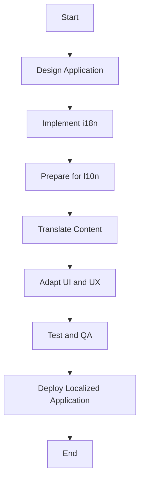

## 24.1 Understanding i18n and l10n

In today's interconnected world, creating applications that cater to a global audience is more important than ever. This section delves into the concepts of internationalization (i18n) and localization (l10n), essential practices for making your JavaScript applications accessible and user-friendly across different regions and cultures.

### What is Internationalization (i18n)?

Internationalization, often abbreviated as i18n (where 18 represents the number of letters between 'i' and 'n'), is the process of designing and preparing your application to support various languages and regions without requiring engineering changes. It involves creating a flexible codebase that can adapt to different languages, cultures, and regions.

#### Key Aspects of Internationalization

- **Separation of Content and Code**: Ensure that text and other locale-specific elements are separate from the code. This allows for easy translation and adaptation.
- **Use of Locale-Sensitive Functions**: Implement functions that can handle different formats for dates, numbers, and currencies based on the user's locale.
- **Support for Multiple Character Sets**: Ensure your application can handle various character sets, including those for non-Latin scripts.

### What is Localization (l10n)?

Localization, abbreviated as l10n, is the process of adapting your application to a specific locale or market. This involves translating text, adjusting layouts, and modifying other elements to suit the cultural and linguistic preferences of the target audience.

#### Key Aspects of Localization

- **Translation of Text**: Convert all user-facing text into the target language.
- **Cultural Adaptation**: Modify content to reflect cultural nuances, such as date formats, currency symbols, and color schemes.
- **Legal and Regulatory Compliance**: Ensure that your application adheres to local laws and regulations.

### Differences Between i18n and l10n

While internationalization and localization are closely related, they serve different purposes:

- **Internationalization** is about building the architecture that supports multiple languages and regions.
- **Localization** is about customizing the application for a specific language and region.

Think of internationalization as the foundation and localization as the customization on top of that foundation.

### Benefits of i18n and l10n

Implementing i18n and l10n in your applications offers numerous benefits:

- **Expanded Market Reach**: By supporting multiple languages and regions, you can reach a broader audience.
- **Improved User Experience**: Users are more likely to engage with applications that cater to their language and cultural preferences.
- **Competitive Advantage**: Offering localized content can set your application apart from competitors who only offer content in one language.

### Challenges in i18n and l10n

Despite the benefits, there are several challenges involved in implementing i18n and l10n:

- **Complexity in Code Management**: Separating content from code and managing multiple translations can be complex.
- **Resource Intensive**: Translating content and adapting it for different cultures requires time and resources.
- **Testing and Quality Assurance**: Ensuring that localized versions of your application function correctly and provide a consistent user experience can be challenging.

### Planning for Localization Early

To effectively implement i18n and l10n, it's crucial to plan for localization early in the development process. Here are some best practices:

- **Design with Flexibility**: Create a flexible design that can accommodate different text lengths and layouts.
- **Use Locale-Aware Libraries**: Leverage libraries and frameworks that support i18n and l10n, such as `i18next` or `Globalize.js`.
- **Automate Translation Processes**: Use tools and services that automate translation and localization tasks to streamline the process.

### Code Example: Implementing i18n in JavaScript

Let's explore a simple example of how to implement i18n in a JavaScript application using the `i18next` library.

```javascript
// Import the i18next library
import i18next from 'i18next';

// Initialize i18next with language resources
i18next.init({
  lng: 'en', // Set the default language
  resources: {
    en: {
      translation: {
        welcome: "Welcome to our application!",
        goodbye: "Goodbye!"
      }
    },
    es: {
      translation: {
        welcome: "¡Bienvenido a nuestra aplicación!",
        goodbye: "¡Adiós!"
      }
    }
  }
});

// Function to change language
function changeLanguage(language) {
  i18next.changeLanguage(language);
  updateContent();
}

// Function to update content based on selected language
function updateContent() {
  document.getElementById('welcome').innerText = i18next.t('welcome');
  document.getElementById('goodbye').innerText = i18next.t('goodbye');
}

// Initial content update
updateContent();
```

In this example, we initialize `i18next` with English and Spanish translations. The `changeLanguage` function allows users to switch between languages, and the `updateContent` function updates the text on the page based on the selected language.

### Visualizing the i18n and l10n Process

To better understand the i18n and l10n process, let's visualize the workflow using a Mermaid.js diagram.



**Diagram Description**: This flowchart illustrates the process of designing an application with internationalization, preparing it for localization, translating content, adapting the user interface and user experience, testing, and deploying the localized application.

### Knowledge Check

- **Question**: What is the primary difference between internationalization and localization?
- **Question**: Why is it important to separate content from code in i18n?
- **Question**: What are some challenges involved in implementing i18n and l10n?

### Summary

In this section, we explored the concepts of internationalization and localization, highlighting their importance in reaching a global audience. We discussed the benefits and challenges of i18n and l10n and provided a code example to illustrate how to implement these practices in a JavaScript application. Remember, planning for localization early in the development process is crucial for creating applications that are accessible and user-friendly across different regions and cultures.

### Try It Yourself

Experiment with the provided code example by adding additional languages and translations. Consider how you might handle different date formats or currency symbols based on the user's locale.

### Embrace the Journey

Remember, this is just the beginning. As you progress, you'll build more complex and interactive applications that cater to a global audience. Keep experimenting, stay curious, and enjoy the journey!

## Mastering i18n and l10n in JavaScript



### What is the primary goal of internationalization (i18n)?

- [x] To design applications that can support multiple languages and regions without requiring code changes
- [ ] To translate content into different languages
- [ ] To adapt applications for specific cultural preferences
- [ ] To ensure compliance with local laws

> **Explanation:** Internationalization focuses on creating a flexible codebase that can support various languages and regions without requiring engineering changes.

### What does localization (l10n) involve?

- [ ] Designing the architecture for multiple languages
- [x] Adapting applications for specific locales and markets
- [ ] Ensuring applications can handle different character sets
- [ ] Using locale-sensitive functions

> **Explanation:** Localization involves adapting applications for specific locales, including translating text and adjusting layouts for cultural preferences.

### Why is it important to separate content from code in i18n?

- [x] To facilitate easy translation and adaptation
- [ ] To improve application performance
- [ ] To reduce code complexity
- [ ] To enhance security

> **Explanation:** Separating content from code allows for easy translation and adaptation, making it simpler to support multiple languages.

### Which of the following is a challenge in implementing i18n and l10n?

- [x] Complexity in code management
- [ ] Improved user experience
- [ ] Expanded market reach
- [ ] Competitive advantage

> **Explanation:** Managing multiple translations and separating content from code can be complex and resource-intensive.

### What is a benefit of implementing i18n and l10n?

- [x] Expanded market reach
- [ ] Increased code complexity
- [ ] Higher development costs
- [ ] Limited user engagement

> **Explanation:** By supporting multiple languages and regions, applications can reach a broader audience and improve user engagement.

### What is the role of locale-sensitive functions in i18n?

- [x] To handle different formats for dates, numbers, and currencies
- [ ] To translate text into different languages
- [ ] To separate content from code
- [ ] To adapt applications for specific cultural preferences

> **Explanation:** Locale-sensitive functions handle different formats for dates, numbers, and currencies based on the user's locale.

### What is a key aspect of localization?

- [ ] Designing a flexible codebase
- [x] Translating user-facing text
- [ ] Supporting multiple character sets
- [ ] Using locale-sensitive functions

> **Explanation:** Localization involves translating user-facing text and adapting content for specific cultural preferences.

### Why should localization be planned early in the development process?

- [x] To create a flexible design that accommodates different text lengths and layouts
- [ ] To reduce development costs
- [ ] To improve application security
- [ ] To enhance application performance

> **Explanation:** Planning for localization early ensures that the design can accommodate different text lengths and layouts, making it easier to adapt the application for various languages.

### What is the purpose of using libraries like i18next in JavaScript?

- [x] To streamline the process of internationalization and localization
- [ ] To improve application performance
- [ ] To enhance security
- [ ] To reduce code complexity

> **Explanation:** Libraries like i18next help streamline the process of internationalization and localization by providing tools for managing translations and adapting content.

### True or False: Internationalization and localization are the same processes.

- [ ] True
- [x] False

> **Explanation:** Internationalization and localization are related but distinct processes. Internationalization involves designing the architecture to support multiple languages, while localization involves adapting the application for specific languages and regions.




