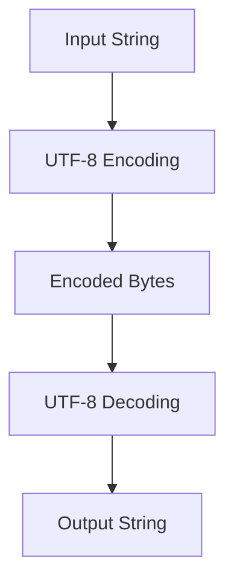

## 24.10 Unicode Support and Character Encodings

In the realm of modern web development, ensuring that your applications can handle a wide variety of characters and symbols is crucial. This is where Unicode and character encodings come into play. In this section, we will delve into the importance of Unicode support, explore UTF-8 encoding, and discuss best practices for handling multibyte characters and emojis. We will also address common issues like mojibake and provide solutions to prevent them.

### Understanding Unicode and UTF-8 Encoding

#### What is Unicode?

Unicode is a universal character encoding standard that assigns a unique number to every character, regardless of platform, program, or language. This standard aims to support the digital representation of text in most of the world's writing systems, making it essential for internationalization and localization.

#### What is UTF-8?

UTF-8 (Unicode Transformation Format - 8-bit) is a variable-length character encoding for Unicode. It is the most widely used encoding on the web and is backward compatible with ASCII. UTF-8 uses one to four bytes to represent a character, allowing it to efficiently encode a vast array of characters.

### Handling Multibyte Characters and Emojis

JavaScript strings are sequences of 16-bit code units, which can lead to challenges when dealing with multibyte characters and emojis. Let's explore how to handle these characters effectively.

#### Example: Handling Multibyte Characters

Consider the following example, which demonstrates how to correctly handle multibyte characters in JavaScript:

```javascript
// Example of a string containing multibyte characters
const text = "Hello, 世界! 🌍";

// Correctly iterating over characters
for (const char of text) {
  console.log(char);
}

// Output:
// H
// e
// l
// l
// o
// ,
//  
// 世
// 界
// !
//  
// 🌍
```

In this example, we use a `for...of` loop to iterate over each character in the string, ensuring that multibyte characters and emojis are handled correctly.

#### Example: Handling Emojis

Emojis are often represented as surrogate pairs in JavaScript. Here's how you can handle them:

```javascript
// Example of handling emojis
const emojiText = "I love 🍕 and 🎉!";

// Using Array.from to handle emojis correctly
const characters = Array.from(emojiText);
console.log(characters);

// Output:
// [ 'I', ' ', 'l', 'o', 'v', 'e', ' ', '🍕', ' ', 'a', 'n', 'd', ' ', '🎉', '!' ]
```

By using `Array.from`, we can correctly split the string into individual characters, including emojis.

### Common Problems and Solutions

#### Mojibake: What is it and How to Prevent It?

Mojibake refers to the garbled text that appears when character encoding is not handled correctly. This often occurs when text is encoded in one character set and decoded in another.

##### Preventing Mojibake

To prevent mojibake, ensure that you consistently use UTF-8 encoding throughout your application. This includes setting the correct encoding in HTML documents and HTTP headers:

```html
<!-- Setting UTF-8 encoding in HTML -->
<meta charset="UTF-8">
```

```javascript
// Setting UTF-8 encoding in HTTP headers
response.setHeader('Content-Type', 'text/html; charset=UTF-8');
```

### Best Practices for String Manipulation and Storage

#### Use Unicode-Aware Functions

When manipulating strings, use Unicode-aware functions to ensure proper handling of multibyte characters:

- **String.prototype.normalize()**: Normalize strings to a consistent form.
- **Intl.Collator**: Compare strings in a locale-aware manner.
- **String.prototype.codePointAt()**: Access the code point of a character.

#### Store Text in UTF-8

Always store text data in UTF-8 encoding to ensure compatibility and prevent data corruption. Most modern databases and file systems support UTF-8.

### Libraries for Unicode Handling

Several libraries can assist with Unicode handling in JavaScript:

- **[unicode.js](https://github.com/mathiasbynens/unicode.js)**: A library for Unicode string manipulation.
- **[punycode.js](https://github.com/bestiejs/punycode.js)**: A library for converting Unicode strings to Punycode and vice versa.
- **[Intl API](https://developer.mozilla.org/en-US/docs/Web/JavaScript/Reference/Global_Objects/Intl)**: Built-in JavaScript API for internationalization.

### Visualizing Character Encoding

To better understand how character encoding works, let's visualize the process of encoding and decoding a string using UTF-8:



This diagram illustrates the flow of encoding an input string into UTF-8 bytes and then decoding it back into a string.

### Knowledge Check

- **What is Unicode, and why is it important for web development?**
- **How does UTF-8 encoding differ from ASCII?**
- **What is mojibake, and how can it be prevented?**
- **Why should you use Unicode-aware functions for string manipulation?**

### Try It Yourself

Experiment with the code examples provided in this section. Try modifying the strings to include different multibyte characters and emojis. Observe how the code handles these characters and consider how you might apply these techniques in your own projects.

### Summary

In this section, we explored the importance of Unicode support and character encodings in JavaScript. We discussed UTF-8 encoding, handling multibyte characters and emojis, and preventing common issues like mojibake. By following best practices and utilizing the right tools, you can ensure that your applications handle text data accurately and efficiently.

Remember, this is just the beginning. As you progress, you'll build more complex and interactive web pages. Keep experimenting, stay curious, and enjoy the journey!

## Unicode and Character Encoding Quiz



### What is Unicode?

- [x] A universal character encoding standard
- [ ] A programming language
- [ ] A type of database
- [ ] A web browser

> **Explanation:** Unicode is a universal character encoding standard that assigns a unique number to every character.

### What is UTF-8?

- [x] A variable-length character encoding for Unicode
- [ ] A fixed-length character encoding
- [ ] A type of database
- [ ] A programming language

> **Explanation:** UTF-8 is a variable-length character encoding for Unicode, using one to four bytes to represent a character.

### How can you prevent mojibake?

- [x] By consistently using UTF-8 encoding
- [ ] By using ASCII encoding
- [ ] By using different encodings for input and output
- [ ] By avoiding multibyte characters

> **Explanation:** Mojibake can be prevented by consistently using UTF-8 encoding throughout your application.

### Which function can be used to normalize strings?

- [x] String.prototype.normalize()
- [ ] String.prototype.toUpperCase()
- [ ] String.prototype.trim()
- [ ] String.prototype.split()

> **Explanation:** String.prototype.normalize() is used to normalize strings to a consistent form.

### What is the purpose of Intl.Collator?

- [x] To compare strings in a locale-aware manner
- [ ] To convert strings to uppercase
- [ ] To split strings into arrays
- [ ] To trim whitespace from strings

> **Explanation:** Intl.Collator is used to compare strings in a locale-aware manner.

### Which library can assist with Unicode string manipulation?

- [x] unicode.js
- [ ] lodash
- [ ] jQuery
- [ ] React

> **Explanation:** unicode.js is a library for Unicode string manipulation.

### What is the output of the following code?

```javascript
const text = "Hello, 世界! 🌍";
console.log(Array.from(text));
```

- [x] [ 'H', 'e', 'l', 'l', 'o', ',', ' ', '世', '界', '!', ' ', '🌍' ]
- [ ] [ 'H', 'e', 'l', 'l', 'o', ',', ' ', '世', '界', '!', ' ', '🌍', '!' ]
- [ ] [ 'H', 'e', 'l', 'l', 'o', ',', '世', '界', '!', '🌍' ]
- [ ] [ 'H', 'e', 'l', 'l', 'o', '世', '界', '!', '🌍' ]

> **Explanation:** Array.from correctly splits the string into individual characters, including multibyte characters and emojis.

### What is the purpose of punycode.js?

- [x] To convert Unicode strings to Punycode and vice versa
- [ ] To manipulate arrays
- [ ] To handle HTTP requests
- [ ] To create animations

> **Explanation:** punycode.js is a library for converting Unicode strings to Punycode and vice versa.

### Which encoding is backward compatible with ASCII?

- [x] UTF-8
- [ ] UTF-16
- [ ] UTF-32
- [ ] ISO-8859-1

> **Explanation:** UTF-8 is backward compatible with ASCII.

### True or False: JavaScript strings are sequences of 8-bit code units.

- [ ] True
- [x] False

> **Explanation:** JavaScript strings are sequences of 16-bit code units.



---
