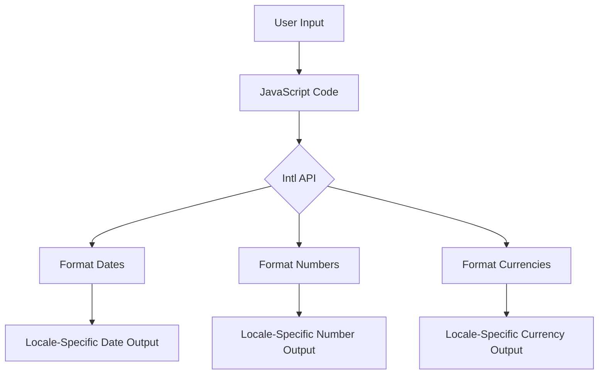

## 24.2 Formatting Numbers, Dates, and Currencies

In today's globalized world, web applications must cater to users from diverse locales, each with unique preferences for displaying numbers, dates, and currencies. JavaScript provides robust tools for internationalization (i18n) through the `Intl` API, enabling developers to format these elements according to various cultural norms.

### Introduction to the JavaScript Internationalization API

The `Intl` API is a powerful feature in JavaScript that allows developers to format numbers, dates, times, and currencies based on locale-specific conventions. This API is part of the ECMAScript Internationalization API Specification and is supported in all modern browsers.

#### Key Components of the `Intl` API

- **`Intl.NumberFormat`**: For formatting numbers and currencies.
- **`Intl.DateTimeFormat`**: For formatting dates and times.
- **`Intl.PluralRules`**: For handling pluralization.
- **`Intl.RelativeTimeFormat`**: For formatting relative time strings.

Let's explore how to use these components to format numbers, dates, and currencies effectively.

### Formatting Dates with `Intl.DateTimeFormat`

The `Intl.DateTimeFormat` object enables developers to format dates and times according to the conventions of a specific locale. It provides a way to display dates in a manner that is familiar to users from different regions.

#### Basic Usage

To format a date, create an instance of `Intl.DateTimeFormat` with the desired locale and options:

```javascript
// Create a date object
const date = new Date('2024-11-25T10:00:00Z');

// Format the date for the US locale
const usFormatter = new Intl.DateTimeFormat('en-US');
console.log(usFormatter.format(date)); // Output: 11/25/2024

// Format the date for the German locale
const deFormatter = new Intl.DateTimeFormat('de-DE');
console.log(deFormatter.format(date)); // Output: 25.11.2024
```

#### Customizing Date and Time Formats

You can customize the output by specifying options such as `year`, `month`, `day`, `hour`, `minute`, and `second`:

```javascript
const options = { year: 'numeric', month: 'long', day: 'numeric' };
const customFormatter = new Intl.DateTimeFormat('en-GB', options);
console.log(customFormatter.format(date)); // Output: 25 November 2024
```

#### Handling Time Zones

Time zones can significantly affect how dates and times are displayed. The `Intl.DateTimeFormat` API allows you to specify a time zone:

```javascript
const timeZoneOptions = { timeZone: 'America/New_York', hour: '2-digit', minute: '2-digit' };
const timeZoneFormatter = new Intl.DateTimeFormat('en-US', timeZoneOptions);
console.log(timeZoneFormatter.format(date)); // Output: 05:00 AM
```

### Formatting Numbers and Currencies with `Intl.NumberFormat`

The `Intl.NumberFormat` object is used to format numbers, including currencies, percentages, and other numeric values, according to locale-specific conventions.

#### Basic Number Formatting

To format a number, create an instance of `Intl.NumberFormat` with the desired locale:

```javascript
const number = 1234567.89;

// Format the number for the US locale
const usNumberFormatter = new Intl.NumberFormat('en-US');
console.log(usNumberFormatter.format(number)); // Output: 1,234,567.89

// Format the number for the German locale
const deNumberFormatter = new Intl.NumberFormat('de-DE');
console.log(deNumberFormatter.format(number)); // Output: 1.234.567,89
```

#### Currency Formatting

To format a number as currency, specify the `style` and `currency` options:

```javascript
const currencyOptions = { style: 'currency', currency: 'USD' };
const currencyFormatter = new Intl.NumberFormat('en-US', currencyOptions);
console.log(currencyFormatter.format(number)); // Output: $1,234,567.89
```

#### Percentage Formatting

For percentages, use the `style` option set to `'percent'`:

```javascript
const percentageFormatter = new Intl.NumberFormat('en-US', { style: 'percent' });
console.log(percentageFormatter.format(0.123)); // Output: 12%
```

### Handling Pluralization and Gender-Specific Terms

The `Intl.PluralRules` object helps in determining the plural form of a word based on a number. This is crucial for languages with complex pluralization rules.

#### Basic Pluralization

```javascript
const pluralRules = new Intl.PluralRules('en-US');

console.log(pluralRules.select(1)); // Output: one
console.log(pluralRules.select(2)); // Output: other
```

#### Gender-Specific Terms

While the `Intl` API does not directly handle gender-specific terms, you can use it in conjunction with libraries like [MessageFormat.js](https://messageformat.github.io/messageformat/) to manage gender and pluralization.

### Considerations for Time Zones and Daylight Saving Time

When working with dates and times, consider the impact of time zones and daylight saving time (DST). JavaScript's `Date` object and the `Intl` API can handle these complexities, but it's essential to be aware of potential pitfalls.

- **Time Zone Offsets**: Be mindful of the difference between UTC and local time.
- **Daylight Saving Time**: Ensure your application accounts for DST changes, especially when scheduling events or calculating durations.

### Libraries for Advanced Formatting

While the `Intl` API is powerful, there are libraries that offer additional functionality and ease of use:

- **[Moment.js](https://momentjs.com/)**: A comprehensive library for parsing, validating, manipulating, and formatting dates.
- **[date-fns](https://date-fns.org/)**: A modern JavaScript date utility library that provides a variety of functions for date manipulation.

These libraries can simplify complex date and time operations, especially when dealing with time zones and DST.

### Try It Yourself

Experiment with the following code examples to deepen your understanding of the `Intl` API:

1. Modify the date formatting example to display the date in a different locale.
2. Change the currency in the currency formatting example to another currency, such as EUR or JPY.
3. Use the `Intl.PluralRules` API to handle pluralization in a different language.

### Visualizing JavaScript's Interaction with Dates and Numbers



*Figure 1: Interaction between user input, JavaScript code, and the Intl API to produce locale-specific outputs.*

### Summary

In this section, we've explored how to use the JavaScript `Intl` API to format numbers, dates, and currencies according to different locales. By leveraging this powerful API, you can ensure your web applications are accessible and user-friendly for a global audience. Remember to consider time zones and DST when working with dates and times, and explore libraries like Moment.js and date-fns for advanced formatting needs.

### Knowledge Check

## Mastering JavaScript Internationalization: Quiz on Formatting Numbers, Dates, and Currencies



### What is the primary purpose of the `Intl` API in JavaScript?

- [x] To format numbers, dates, and currencies according to locale-specific conventions
- [ ] To perform mathematical calculations
- [ ] To handle network requests
- [ ] To manage user authentication

> **Explanation:** The `Intl` API is designed to format numbers, dates, and currencies based on locale-specific conventions.

### How do you format a date for the German locale using `Intl.DateTimeFormat`?

- [x] `new Intl.DateTimeFormat('de-DE').format(new Date())`
- [ ] `new Intl.DateTimeFormat('en-US').format(new Date())`
- [ ] `new Intl.DateTimeFormat('fr-FR').format(new Date())`
- [ ] `new Intl.DateTimeFormat('es-ES').format(new Date())`

> **Explanation:** The `'de-DE'` locale code is used to format dates according to German conventions.

### Which option is used to format a number as currency with `Intl.NumberFormat`?

- [x] `{ style: 'currency', currency: 'USD' }`
- [ ] `{ style: 'decimal' }`
- [ ] `{ style: 'percent' }`
- [ ] `{ style: 'unit' }`

> **Explanation:** The `style` option set to `'currency'` and specifying a `currency` code formats the number as currency.

### What does the `Intl.PluralRules` object help with?

- [x] Determining the plural form of a word based on a number
- [ ] Formatting dates and times
- [ ] Parsing JSON data
- [ ] Managing user sessions

> **Explanation:** `Intl.PluralRules` is used to determine the correct plural form of a word based on a given number.

### Which library is known for advanced date manipulation in JavaScript?

- [x] Moment.js
- [ ] Lodash
- [ ] Axios
- [ ] D3.js

> **Explanation:** Moment.js is a popular library for advanced date manipulation in JavaScript.

### How can you specify a time zone when formatting a date with `Intl.DateTimeFormat`?

- [x] By using the `timeZone` option
- [ ] By using the `locale` option
- [ ] By using the `currency` option
- [ ] By using the `style` option

> **Explanation:** The `timeZone` option allows you to specify a time zone when formatting a date.

### What is the output of `new Intl.NumberFormat('en-US', { style: 'percent' }).format(0.25)`?

- [x] 25%
- [ ] 0.25
- [ ] 250%
- [ ] 2.5%

> **Explanation:** The `style: 'percent'` option formats the number as a percentage, resulting in `25%`.

### Which of the following is a consideration when working with dates and times?

- [x] Time zones and daylight saving time
- [ ] File system permissions
- [ ] Network latency
- [ ] User authentication

> **Explanation:** Time zones and daylight saving time are important considerations when working with dates and times.

### What is the purpose of the `Intl.RelativeTimeFormat` object?

- [x] To format relative time strings
- [ ] To format currency values
- [ ] To parse JSON data
- [ ] To manage user sessions

> **Explanation:** `Intl.RelativeTimeFormat` is used to format relative time strings, such as "3 days ago."

### True or False: The `Intl` API can handle gender-specific terms directly.

- [ ] True
- [x] False

> **Explanation:** The `Intl` API does not directly handle gender-specific terms; additional libraries may be needed.



Remember, this is just the beginning. As you progress, you'll build more complex and interactive web pages. Keep experimenting, stay curious, and enjoy the journey!


