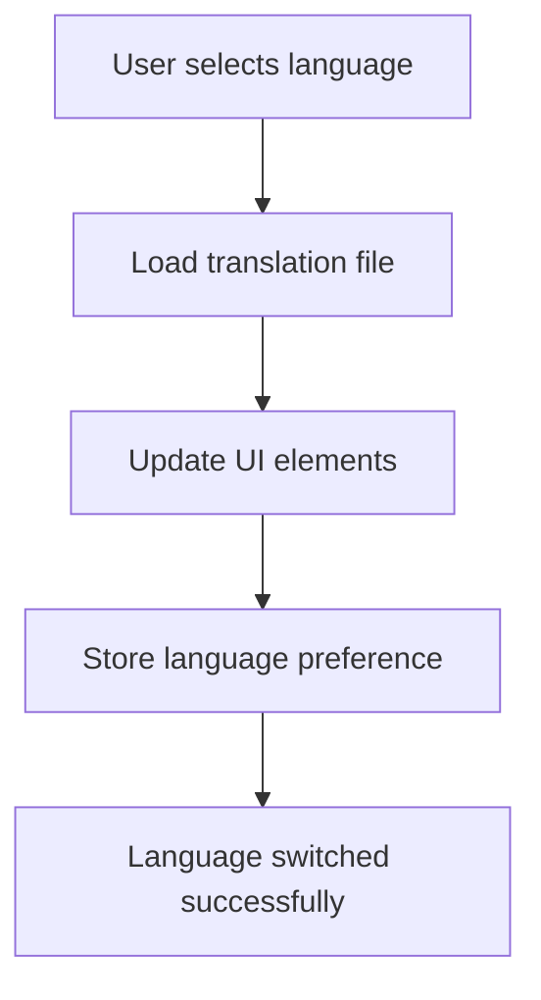

## 24.3 Handling Multiple Languages

In today's globalized world, supporting multiple languages in your applications is crucial for reaching a broader audience. This section will guide you through the strategies and best practices for handling multiple languages in JavaScript applications, focusing on language detection, organizing translation files, dynamic language switching, and managing translations effectively.

### Understanding Language Detection

Language detection is the first step in providing a localized experience for users. It involves determining the user's preferred language and serving content in that language. Here are some common techniques for detecting the user's language:

1. **Browser Language Settings**: Most browsers send the user's preferred language in the `Accept-Language` HTTP header. You can access this information in JavaScript using the `navigator.language` or `navigator.languages` properties.

   ```javascript
   // Detecting the user's preferred language
   const userLanguage = navigator.language || navigator.languages[0];
   console.log(`User's preferred language: ${userLanguage}`);
   ```

2. **Geo-Location**: You can use the user's geographical location to infer their language. However, this method should be used cautiously, as it may not always accurately reflect the user's language preference.

3. **User Profile Settings**: If your application requires user authentication, you can allow users to set their preferred language in their profile settings.

4. **Cookies or Local Storage**: Store the user's language preference in cookies or local storage for subsequent visits.

### Organizing Translation Files

Organizing translation files efficiently is crucial for managing translations and updating content. Here are some common formats and strategies for organizing translation files:

1. **JSON Files**: JSON is a popular format for storing translations due to its simplicity and ease of use in JavaScript applications.

   ```json
   // en.json
   {
     "greeting": "Hello",
     "farewell": "Goodbye"
   }

   // es.json
   {
     "greeting": "Hola",
     "farewell": "Adiós"
   }
   ```

2. **PO Files**: Portable Object (PO) files are commonly used in applications that require more complex translation management. They are often used with tools like GNU gettext.

3. **YAML Files**: YAML is another human-readable format that can be used for translation files. It is particularly useful for applications that require nested translations.

4. **Key-Value Pairs**: Organize translations as key-value pairs, where keys are unique identifiers for each translatable string, and values are the translations.

### Dynamic Language Switching

Dynamic language switching allows users to change the language of the application without reloading the page. This enhances the user experience by providing seamless transitions between languages. Here's how you can implement dynamic language switching:

1. **Load Translations Dynamically**: Use JavaScript to load translation files dynamically based on the user's selected language.

   ```javascript
   // Function to load translations
   async function loadTranslations(language) {
     const response = await fetch(`/translations/${language}.json`);
     const translations = await response.json();
     return translations;
   }

   // Example usage
   loadTranslations('es').then(translations => {
     console.log(translations.greeting); // Output: Hola
   });
   ```

2. **Update UI Elements**: Once the translations are loaded, update the UI elements with the new translations.

   ```javascript
   // Function to update UI elements
   function updateUI(translations) {
     document.getElementById('greeting').textContent = translations.greeting;
     document.getElementById('farewell').textContent = translations.farewell;
   }

   // Example usage
   loadTranslations('es').then(updateUI);
   ```

3. **Persist Language Preference**: Store the user's language preference in cookies or local storage to maintain consistency across sessions.

### Best Practices for Managing Translations

Managing translations effectively is essential for maintaining a high-quality user experience. Here are some best practices to consider:

1. **Use a Translation Management System (TMS)**: Tools like [Transifex](https://www.transifex.com/) and [Crowdin](https://crowdin.com/) facilitate translation management by providing a centralized platform for managing translations, collaborating with translators, and tracking changes.

2. **Keep Translations Up-to-Date**: Regularly update translations to reflect changes in the source content. Use version control to track changes and collaborate with translators.

3. **Test Translations Thoroughly**: Test translations in different languages to ensure they are accurate and contextually appropriate. Use automated testing tools to verify translations programmatically.

4. **Handle Plurals and Gender**: Consider language-specific rules for plurals and gender when managing translations. Use libraries like [i18next](https://www.i18next.com/) to handle complex language rules.

5. **Optimize for Performance**: Minimize the size of translation files and use caching strategies to improve performance. Consider lazy loading translations to reduce initial load times.

### Tools and Services for Translation Management

Several tools and services can help streamline the translation management process:

- **[Transifex](https://www.transifex.com/)**: A cloud-based localization platform that supports collaboration with translators and integrates with various development workflows.

- **[Crowdin](https://crowdin.com/)**: A localization management platform that offers features like translation memory, machine translation, and integration with popular version control systems.

- **[i18next](https://www.i18next.com/)**: A powerful internationalization framework for JavaScript that supports dynamic language switching, pluralization, and more.

- **[Phrase](https://phrase.com/)**: A translation management system that provides an API for integrating translations into your application and supports collaboration with translators.

### Visualizing the Language Switching Process

To better understand the language switching process, let's visualize it using a flowchart:



**Figure 1**: Flowchart illustrating the process of dynamic language switching in a JavaScript application.

### Knowledge Check

To reinforce your understanding of handling multiple languages in JavaScript applications, consider the following questions:

- How can you detect a user's preferred language in a web application?
- What are some common formats for organizing translation files?
- How can you implement dynamic language switching in a JavaScript application?
- What are some best practices for managing translations effectively?
- What tools and services can help streamline the translation management process?

### Summary

Handling multiple languages in JavaScript applications involves detecting the user's preferred language, organizing translation files efficiently, implementing dynamic language switching, and managing translations effectively. By following best practices and leveraging tools and services, you can provide a seamless and localized experience for users worldwide.

Remember, this is just the beginning. As you progress, you'll build more complex and interactive web applications that cater to a global audience. Keep experimenting, stay curious, and enjoy the journey!

## Quiz: Mastering Language Handling in JavaScript Applications



### What is a common method for detecting a user's preferred language in a web application?

- [x] Using the `navigator.language` property
- [ ] Using the `document.language` property
- [ ] Using the `window.language` property
- [ ] Using the `location.language` property

> **Explanation:** The `navigator.language` property is commonly used to detect the user's preferred language in a web application.

### Which format is commonly used for storing translations in JavaScript applications?

- [x] JSON
- [ ] XML
- [ ] CSV
- [ ] HTML

> **Explanation:** JSON is a popular format for storing translations in JavaScript applications due to its simplicity and ease of use.

### How can you implement dynamic language switching in a JavaScript application?

- [x] By loading translation files dynamically and updating UI elements
- [ ] By reloading the entire page with a new language
- [ ] By using inline translations in HTML
- [ ] By changing the browser's language settings

> **Explanation:** Dynamic language switching can be implemented by loading translation files dynamically and updating UI elements without reloading the page.

### What is a best practice for managing translations in a JavaScript application?

- [x] Using a Translation Management System (TMS)
- [ ] Hardcoding translations in the source code
- [ ] Using inline translations in HTML
- [ ] Storing translations in a database

> **Explanation:** Using a Translation Management System (TMS) is a best practice for managing translations efficiently and collaborating with translators.

### Which tool is commonly used for internationalization in JavaScript applications?

- [x] i18next
- [ ] jQuery
- [ ] Bootstrap
- [ ] AngularJS

> **Explanation:** i18next is a powerful internationalization framework for JavaScript that supports dynamic language switching and more.

### What is a key benefit of using JSON for translation files?

- [x] Simplicity and ease of use in JavaScript applications
- [ ] Ability to store binary data
- [ ] Compatibility with all programming languages
- [ ] Built-in support for plurals and gender

> **Explanation:** JSON is simple and easy to use in JavaScript applications, making it a popular choice for translation files.

### How can you persist a user's language preference across sessions?

- [x] By storing the preference in cookies or local storage
- [ ] By using session variables
- [ ] By modifying the browser's settings
- [ ] By using server-side sessions

> **Explanation:** Storing the user's language preference in cookies or local storage allows it to persist across sessions.

### What is a common challenge when managing translations?

- [x] Handling plurals and gender-specific translations
- [ ] Storing translations in a database
- [ ] Using inline translations in HTML
- [ ] Hardcoding translations in the source code

> **Explanation:** Handling plurals and gender-specific translations can be challenging due to language-specific rules.

### Which service provides a platform for managing translations and collaborating with translators?

- [x] Transifex
- [ ] GitHub
- [ ] Slack
- [ ] Trello

> **Explanation:** Transifex is a cloud-based localization platform that facilitates translation management and collaboration.

### True or False: Dynamic language switching requires reloading the entire page.

- [ ] True
- [x] False

> **Explanation:** Dynamic language switching does not require reloading the entire page; it involves updating UI elements with new translations.


