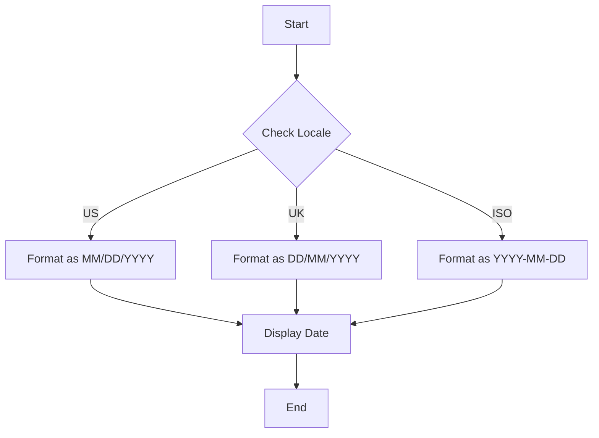

## 24.4 Regional Settings and Locale Data

In the globalized world of web development, creating applications that cater to diverse audiences is crucial. This involves not only translating text but also adapting to regional settings and locale data. This section delves into the importance of respecting regional conventions, formatting measurements, handling addresses and phone numbers, and considering cultural norms and expectations. By the end of this guide, you'll be equipped to build applications that feel native to users from different parts of the world.

### Importance of Respecting Regional Conventions

Respecting regional conventions is more than just a courtesy; it's a necessity for user satisfaction and engagement. When users interact with an application that aligns with their cultural and regional norms, they are more likely to trust and continue using it. This involves understanding and implementing various aspects of localization, such as:

- **Date and Time Formats**: Different regions have distinct ways of representing dates and times. For example, the U.S. uses MM/DD/YYYY, while many European countries use DD/MM/YYYY.
- **Currency and Number Formats**: Currency symbols, decimal separators, and thousand separators vary across locales.
- **Measurement Units**: The metric system is widely used globally, but the imperial system is prevalent in the U.S.
- **Address and Phone Number Formats**: These can vary significantly, affecting how users input and view this information.

### Formatting Measurements: Metric vs. Imperial Units

When developing applications that involve measurements, it's essential to accommodate both metric and imperial units. This ensures that users from different regions can interact with the application comfortably.

#### Example: Converting Measurements

Let's consider a simple example of converting temperatures between Celsius and Fahrenheit:

```javascript
// Function to convert Celsius to Fahrenheit
function celsiusToFahrenheit(celsius) {
    return (celsius * 9/5) + 32;
}

// Function to convert Fahrenheit to Celsius
function fahrenheitToCelsius(fahrenheit) {
    return (fahrenheit - 32) * 5/9;
}

// Example usage
console.log(`25°C is ${celsiusToFahrenheit(25)}°F`);
console.log(`77°F is ${fahrenheitToCelsius(77)}°C`);
```

Incorporate similar functions for other measurements like distance (kilometers vs. miles) and weight (kilograms vs. pounds). This flexibility can be crucial for applications in fields like e-commerce, travel, and health.

### Handling Addresses and Phone Numbers

Addresses and phone numbers are another area where regional differences are pronounced. Libraries like [libphonenumber](https://github.com/google/libphonenumber) can help manage these variations effectively.

#### Using libphonenumber for Phone Number Formatting

`libphonenumber` is a powerful library for parsing, formatting, and validating international phone numbers. Here's how you can use it:

```javascript
// Import the library
const libphonenumber = require('libphonenumber-js');

// Parse and format a phone number
const phoneNumber = libphonenumber.parsePhoneNumberFromString('+14155552671', 'US');
console.log(phoneNumber.formatInternational()); // Outputs: +1 415 555 2671

// Validate a phone number
if (phoneNumber.isValid()) {
    console.log('The phone number is valid.');
} else {
    console.log('The phone number is invalid.');
}
```

This library supports a wide range of countries and formats, making it an invaluable tool for applications that require phone number input.

#### Address Formatting Considerations

Address formats can vary significantly between countries. For instance, the order of street address, city, postal code, and country can differ. While there isn't a one-size-fits-all library for addresses, you can implement custom solutions or use APIs that provide localized address formats.

### Cultural Norms and Expectations

Beyond technical formatting, understanding cultural norms and expectations is vital. This includes:

- **Color Symbolism**: Colors can have different meanings in different cultures. For example, white is often associated with purity in Western cultures but can signify mourning in some Asian cultures.
- **Icons and Symbols**: Ensure that icons and symbols are universally understood or localized appropriately.
- **User Interface Layouts**: Consider right-to-left (RTL) support for languages like Arabic and Hebrew.

### Testing with Users from Different Locales

Testing is a critical step in ensuring that your application meets the needs of users from various locales. Here are some strategies:

- **User Testing**: Conduct tests with users from different regions to gather feedback on usability and cultural appropriateness.
- **Automated Testing**: Use tools that simulate different locales to test your application's behavior.
- **Feedback Loops**: Implement mechanisms for users to provide feedback on localization issues.

### Visualizing Locale Data Handling

To better understand how locale data handling works, let's visualize the process of formatting a date based on locale settings using a flowchart.



This flowchart illustrates how an application might decide on a date format based on the user's locale settings.

### Key Takeaways

- **Respect Regional Conventions**: Adapting to regional settings enhances user experience and trust.
- **Use Libraries**: Leverage libraries like `libphonenumber` for handling complex locale-specific data.
- **Consider Cultural Norms**: Beyond technical aspects, cultural understanding is crucial for localization.
- **Test Extensively**: Ensure your application is tested with users from different locales to catch potential issues.

### Embrace the Journey

Remember, mastering regional settings and locale data is an ongoing journey. As you continue to develop globally accessible applications, keep experimenting, stay curious, and enjoy the process of learning and adapting to new challenges.

## Mastering Regional Settings and Locale Data in JavaScript



### What is the primary benefit of respecting regional conventions in web applications?

- [x] Enhances user satisfaction and engagement
- [ ] Increases application speed
- [ ] Reduces server load
- [ ] Simplifies codebase

> **Explanation:** Respecting regional conventions enhances user satisfaction and engagement by making the application feel more native to users from different regions.

### Which library is commonly used for handling international phone numbers in JavaScript?

- [ ] moment.js
- [x] libphonenumber
- [ ] lodash
- [ ] axios

> **Explanation:** `libphonenumber` is a library used for parsing, formatting, and validating international phone numbers.

### How does the metric system differ from the imperial system?

- [x] The metric system uses units like meters and kilograms, while the imperial system uses units like feet and pounds.
- [ ] The metric system is only used in Europe, while the imperial system is used worldwide.
- [ ] The metric system is based on multiples of 12, while the imperial system is based on multiples of 10.
- [ ] The metric system is used for time measurement, while the imperial system is used for distance.

> **Explanation:** The metric system uses units like meters and kilograms, while the imperial system uses units like feet and pounds.

### What is a common challenge when handling addresses in international applications?

- [ ] Ensuring addresses are stored in uppercase
- [x] Varying formats for street address, city, postal code, and country
- [ ] Converting addresses to GPS coordinates
- [ ] Encrypting address data

> **Explanation:** Address formats can vary significantly between countries, affecting how users input and view this information.

### Which of the following is a cultural consideration when localizing applications?

- [x] Color symbolism
- [ ] Code minification
- [ ] Server-side rendering
- [ ] API rate limiting

> **Explanation:** Color symbolism is a cultural consideration, as colors can have different meanings in different cultures.

### What is the purpose of testing with users from different locales?

- [x] To gather feedback on usability and cultural appropriateness
- [ ] To increase server capacity
- [ ] To reduce application size
- [ ] To simplify code logic

> **Explanation:** Testing with users from different locales helps gather feedback on usability and cultural appropriateness.

### What does the flowchart in the article illustrate?

- [x] The process of formatting a date based on locale settings
- [ ] The process of converting currency values
- [ ] The process of validating phone numbers
- [ ] The process of encrypting user data

> **Explanation:** The flowchart illustrates how an application might decide on a date format based on the user's locale settings.

### Which of the following is NOT a regional setting consideration?

- [ ] Date and time formats
- [ ] Currency and number formats
- [ ] Measurement units
- [x] JavaScript variable naming conventions

> **Explanation:** JavaScript variable naming conventions are not related to regional settings.

### What is the benefit of using libraries like libphonenumber?

- [x] They simplify handling complex locale-specific data
- [ ] They increase application speed
- [ ] They reduce server load
- [ ] They provide encryption for user data

> **Explanation:** Libraries like `libphonenumber` simplify handling complex locale-specific data such as phone numbers.

### True or False: Address formats are consistent across all countries.

- [ ] True
- [x] False

> **Explanation:** Address formats can vary significantly between countries, affecting how users input and view this information.



By understanding and implementing these concepts, you'll be well on your way to creating applications that are truly global in reach and appeal. Keep exploring, and remember that every step you take towards mastering regional settings and locale data brings you closer to building more inclusive and user-friendly applications.
