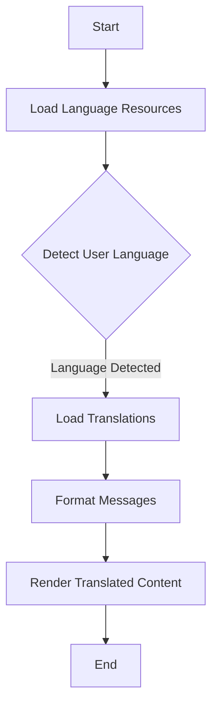

## 24.5 Using Libraries like Globalize and i18next

In today's globalized world, creating applications that cater to a diverse audience is more important than ever. Internationalization (i18n) and localization (l10n) are crucial processes that allow applications to adapt to different languages and regions. JavaScript, being a versatile language, offers several libraries to simplify these processes. Two of the most popular libraries are **Globalize** and **i18next**. In this section, we'll explore their capabilities, how to integrate them into your projects, and how they handle translations, formatting, and pluralization.

### Introduction to Internationalization and Localization

Before diving into the libraries, let's briefly discuss what internationalization and localization entail:

- **Internationalization (i18n)**: The process of designing a software application so that it can be adapted to various languages and regions without engineering changes. This involves abstracting text and cultural elements from the codebase.

- **Localization (l10n)**: The process of adapting internationalized software for a specific region or language by adding locale-specific components and translating text.

### Globalize: A Comprehensive i18n Library

[Globalize](https://github.com/globalizejs/globalize) is a powerful library for internationalization and localization in JavaScript. It provides a comprehensive set of tools for formatting numbers, dates, and currencies, as well as handling translations and pluralization.

#### Key Features of Globalize

- **Number, Date, and Currency Formatting**: Globalize allows you to format numbers, dates, and currencies according to locale-specific conventions.
- **Message Translation and Pluralization**: It supports message translation and pluralization, making it easier to handle different languages.
- **Locale Data**: Globalize uses the Unicode CLDR (Common Locale Data Repository) for locale data, ensuring accurate and up-to-date information.
- **Modular Design**: The library is modular, allowing you to include only the parts you need, which helps reduce bundle size.

#### Integrating Globalize into Your Project

To start using Globalize, you need to install it via npm:

```bash
npm install globalize cldr-data
```

Next, you need to load the necessary CLDR data. Here's a basic example of how to set up Globalize for number formatting:

```javascript
const Globalize = require("globalize");

// Load CLDR data
Globalize.load(require("cldr-data").entireSupplemental());
Globalize.load(require("cldr-data").entireMainFor("en", "es"));

// Set the locale
const globalizeEn = Globalize("en");
const globalizeEs = Globalize("es");

// Format numbers
console.log(globalizeEn.numberFormatter()(1234567.89)); // "1,234,567.89"
console.log(globalizeEs.numberFormatter()(1234567.89)); // "1.234.567,89"
```

#### Handling Translations and Pluralization

Globalize allows you to define messages and handle pluralization using its message formatter. Here's an example:

```javascript
Globalize.loadMessages({
  en: {
    hello: "Hello, {name}!",
    items: "You have {count, plural, one {# item} other {# items}}."
  },
  es: {
    hello: "¡Hola, {name}!",
    items: "Tienes {count, plural, one {# artículo} other {# artículos}}."
  }
});

const messageFormatterEn = globalizeEn.messageFormatter("hello");
const messageFormatterEs = globalizeEs.messageFormatter("hello");

console.log(messageFormatterEn({ name: "John" })); // "Hello, John!"
console.log(messageFormatterEs({ name: "Juan" })); // "¡Hola, Juan!"
```

### i18next: A Powerful Translation Framework

[i18next](https://www.i18next.com/) is another popular library for internationalization in JavaScript. It is known for its flexibility and extensive ecosystem, including plugins for React, Vue, and Angular.

#### Key Features of i18next

- **Language Detection**: i18next can automatically detect the user's language and switch between languages dynamically.
- **Lazy Loading**: It supports lazy loading of language resources, which helps improve performance.
- **Pluralization and Context**: i18next provides advanced pluralization and context-based translations.
- **Rich Ecosystem**: The library has a rich ecosystem with plugins for various frameworks and tools, such as React-i18next.

#### Integrating i18next into Your Project

To use i18next, you need to install it via npm:

```bash
npm install i18next
```

Here's a basic setup for i18next:

```javascript
const i18next = require("i18next");

i18next.init({
  lng: "en",
  resources: {
    en: {
      translation: {
        welcome: "Welcome to our application!",
        items: "You have {{count}} item",
        items_plural: "You have {{count}} items"
      }
    },
    es: {
      translation: {
        welcome: "¡Bienvenido a nuestra aplicación!",
        items: "Tienes {{count}} artículo",
        items_plural: "Tienes {{count}} artículos"
      }
    }
  }
});

console.log(i18next.t("welcome")); // "Welcome to our application!"
console.log(i18next.t("items", { count: 1 })); // "You have 1 item"
console.log(i18next.t("items", { count: 5 })); // "You have 5 items"
```

#### Advanced Features of i18next

i18next supports advanced features like language detection and lazy loading. Here's how you can set up language detection:

```javascript
const LanguageDetector = require("i18next-browser-languagedetector");

i18next
  .use(LanguageDetector)
  .init({
    detection: {
      order: ["querystring", "cookie", "localStorage", "navigator"],
      caches: ["cookie"]
    },
    resources: {
      en: {
        translation: {
          welcome: "Welcome to our application!"
        }
      },
      es: {
        translation: {
          welcome: "¡Bienvenido a nuestra aplicación!"
        }
      }
    }
  });

console.log(i18next.t("welcome")); // Automatically detects and translates based on language
```

### Community Support and Ecosystem

Both Globalize and i18next have strong community support and extensive ecosystems. For example, **React-i18next** is a popular plugin that integrates i18next with React, providing hooks and components for easy translation management.

#### React-i18next Example

Here's a simple example of using React-i18next in a React application:

```javascript
import React from "react";
import ReactDOM from "react-dom";
import { useTranslation, initReactI18next } from "react-i18next";
import i18next from "i18next";

i18next
  .use(initReactI18next)
  .init({
    resources: {
      en: {
        translation: {
          welcome: "Welcome to our application!"
        }
      },
      es: {
        translation: {
          welcome: "¡Bienvenido a nuestra aplicación!"
        }
      }
    },
    lng: "en",
    fallbackLng: "en"
  });

function App() {
  const { t } = useTranslation();

  return <h1>{t("welcome")}</h1>;
}

ReactDOM.render(<App />, document.getElementById("root"));
```

### Visualizing the Translation Process

To better understand how these libraries work, let's visualize the translation process using a flowchart:



**Caption**: This flowchart illustrates the process of loading language resources, detecting the user's language, and rendering translated content using libraries like Globalize and i18next.

### Try It Yourself

Experiment with the code examples provided above. Try adding new languages, modifying translations, or integrating these libraries into your existing projects. Explore the documentation for [Globalize](https://github.com/globalizejs/globalize) and [i18next](https://www.i18next.com/) to discover more features and customization options.

### Knowledge Check

- What are the main differences between Globalize and i18next?
- How do these libraries handle pluralization?
- What are the benefits of lazy loading language resources?
- How can you integrate i18next with a React application?

### Summary

In this section, we've explored the capabilities of Globalize and i18next, two powerful libraries for internationalization and localization in JavaScript. We've seen how to integrate them into projects, handle translations, and manage language resources effectively. With strong community support and extensive ecosystems, these libraries are excellent choices for building applications that cater to a global audience.

Remember, this is just the beginning. As you progress, you'll build more complex and interactive applications that can adapt to diverse languages and regions. Keep experimenting, stay curious, and enjoy the journey!

## Mastering Internationalization with Globalize and i18next



### What is the primary purpose of internationalization (i18n)?

- [x] To design software that can be adapted to various languages and regions without engineering changes.
- [ ] To translate software into multiple languages.
- [ ] To optimize software for performance.
- [ ] To secure software against vulnerabilities.

> **Explanation:** Internationalization is about designing software to be adaptable to various languages and regions without requiring changes to the codebase.

### Which library uses the Unicode CLDR for locale data?

- [x] Globalize
- [ ] i18next
- [ ] React-i18next
- [ ] None of the above

> **Explanation:** Globalize uses the Unicode CLDR (Common Locale Data Repository) for accurate and up-to-date locale data.

### How does i18next handle language detection?

- [x] It can automatically detect the user's language and switch between languages dynamically.
- [ ] It requires manual configuration for each language.
- [ ] It does not support language detection.
- [ ] It only supports detection through cookies.

> **Explanation:** i18next supports automatic language detection and can switch languages dynamically based on user preferences.

### What is a key feature of React-i18next?

- [x] It provides hooks and components for easy translation management in React applications.
- [ ] It is a standalone library for internationalization.
- [ ] It only supports static translations.
- [ ] It does not integrate with React.

> **Explanation:** React-i18next is a plugin that integrates i18next with React, offering hooks and components for managing translations.

### Which of the following is a benefit of lazy loading language resources?

- [x] Improved performance by loading only necessary resources.
- [ ] Increased bundle size.
- [ ] Slower application startup time.
- [ ] Reduced translation accuracy.

> **Explanation:** Lazy loading improves performance by loading only the necessary language resources when needed, reducing the initial bundle size.

### What command is used to install Globalize via npm?

- [x] npm install globalize cldr-data
- [ ] npm install i18next
- [ ] npm install react-i18next
- [ ] npm install globalize

> **Explanation:** The command `npm install globalize cldr-data` installs Globalize along with the necessary CLDR data.

### How does Globalize handle pluralization?

- [x] By using message formatters that support pluralization rules.
- [ ] By translating each plural form separately.
- [ ] By ignoring pluralization.
- [ ] By using a fixed set of plural forms.

> **Explanation:** Globalize uses message formatters that support pluralization rules to handle different plural forms in translations.

### What is the role of the `useTranslation` hook in React-i18next?

- [x] To provide translation functions within React components.
- [ ] To initialize i18next.
- [ ] To load language resources.
- [ ] To detect the user's language.

> **Explanation:** The `useTranslation` hook provides translation functions within React components, allowing easy access to translations.

### Which library is known for its modular design, allowing inclusion of only necessary parts?

- [x] Globalize
- [ ] i18next
- [ ] React-i18next
- [ ] None of the above

> **Explanation:** Globalize has a modular design, allowing developers to include only the necessary parts, reducing the bundle size.

### True or False: i18next can only be used with React applications.

- [ ] True
- [x] False

> **Explanation:** i18next is a versatile library that can be used with various frameworks and environments, not just React.


