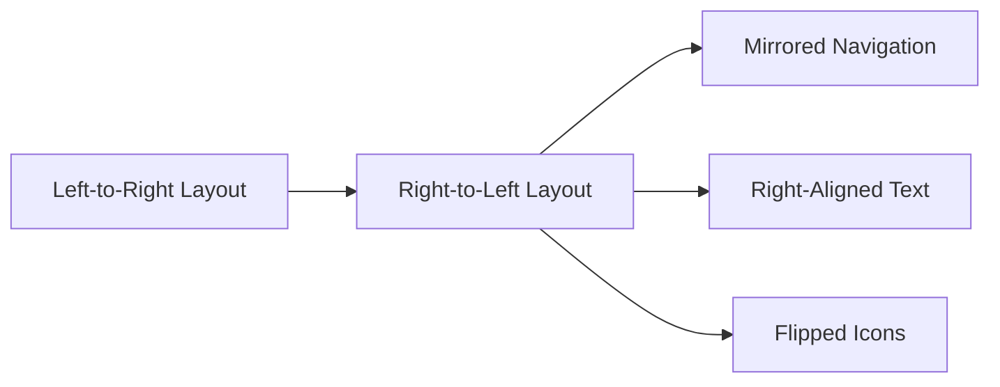

## 24.6 Right-to-Left (RTL) Language Support

In the realm of web development, supporting multiple languages is crucial for reaching a global audience. Among these languages, right-to-left (RTL) languages such as Arabic, Hebrew, and Persian present unique challenges and requirements. This section delves into the intricacies of RTL language support, offering insights into CSS techniques, UI adjustments, and testing considerations to ensure your web applications are accessible and user-friendly for RTL language speakers.

### Understanding RTL Languages

Right-to-left languages are those in which text is read from right to left. This directionality affects not only the text but also the overall layout and design of web applications. Here are some key considerations when dealing with RTL languages:

- **Text Direction**: Text in RTL languages flows from right to left, which means that the starting point of lines and paragraphs is on the right side of the page.
- **Layout Mirroring**: The entire layout of a web page may need to be mirrored to accommodate RTL text, affecting elements such as navigation bars, buttons, and icons.
- **Cultural Context**: Beyond technical adjustments, it's important to consider cultural nuances and preferences that may influence design choices.

### CSS Techniques for RTL Support

CSS provides several properties that are instrumental in supporting RTL languages. Two of the most important properties are `direction` and `unicode-bidi`.

#### The `direction` Property

The `direction` property in CSS is used to set the text direction of an element. It can take two values: `ltr` (left-to-right) and `rtl` (right-to-left).

```css
/* Set the direction to right-to-left */
body {
  direction: rtl;
}
```

When the `direction` property is set to `rtl`, the browser automatically adjusts the alignment of text and certain layout elements to accommodate the RTL flow.

#### The `unicode-bidi` Property

The `unicode-bidi` property is used in conjunction with the `direction` property to control the embedding levels of bidirectional text. It is particularly useful when dealing with mixed-direction text, such as an English phrase within an Arabic paragraph.

```css
/* Ensure proper embedding of bidirectional text */
span {
  unicode-bidi: bidi-override;
  direction: rtl;
}
```

### Adjusting UI Components for RTL

When designing for RTL languages, it's essential to consider how UI components are affected. Here are some common adjustments:

#### Text Alignment

Text alignment should be adjusted to match the reading direction. For RTL languages, text is typically right-aligned.

```css
/* Right-align text for RTL languages */
p {
  text-align: right;
}
```

#### Mirroring Layouts

Layouts often need to be mirrored to provide a natural user experience for RTL speakers. This includes reversing the order of elements such as navigation menus and sidebars.

```css
/* Example of mirroring a flexbox layout */
.container {
  display: flex;
  flex-direction: row-reverse;
}
```

#### Icons and Images

Icons and images may also need to be flipped or mirrored to maintain consistency with the RTL layout. This can be achieved using CSS transformations.

```css
/* Flip an icon for RTL layout */
.icon {
  transform: scaleX(-1);
}
```

### Tools and Libraries for RTL Support

Several tools and libraries can assist in implementing RTL support in web applications:

- **[Bootstrap RTL](https://github.com/morteza/bootstrap-rtl)**: A version of Bootstrap that includes RTL support, making it easier to create responsive designs for RTL languages.
- **[RTLCSS](https://rtlcss.com/)**: A tool that automates the process of converting LTR CSS to RTL, simplifying the development process.
- **[i18next](https://www.i18next.com/)**: A powerful internationalization framework that supports RTL languages and provides tools for managing translations.

### Testing Considerations and Common Pitfalls

Testing is a critical aspect of ensuring that your web application provides a seamless experience for RTL language users. Here are some key considerations:

#### Cross-Browser Testing

Ensure that your RTL support works consistently across different browsers and devices. Use tools like BrowserStack or Sauce Labs to test your application in various environments.

#### User Testing

Engage native speakers of RTL languages to test your application. They can provide valuable feedback on the usability and cultural appropriateness of your design.

#### Common Pitfalls

- **Ignoring Non-Text Elements**: Remember that RTL support affects more than just text. Ensure that all UI components, including buttons and icons, are properly adjusted.
- **Overlooking Mixed-Content Scenarios**: Pay attention to scenarios where RTL and LTR content are mixed, such as numbers or English words within an Arabic sentence.

### Visualizing RTL Layout Adjustments

To better understand how RTL support affects web layouts, let's visualize a simple layout transformation using Mermaid.js.



**Diagram Description**: This diagram illustrates the transformation of a left-to-right layout into a right-to-left layout, highlighting key changes such as mirrored navigation, right-aligned text, and flipped icons.

### Try It Yourself

Experiment with the following code snippet to see how RTL support can be implemented in a simple web page:

```html
<!DOCTYPE html>
<html lang="ar">
<head>
    <meta charset="UTF-8">
    <meta name="viewport" content="width=device-width, initial-scale=1.0">
    <style>
        body {
            direction: rtl;
            text-align: right;
        }
        .container {
            display: flex;
            flex-direction: row-reverse;
        }
        .icon {
            transform: scaleX(-1);
        }
    </style>
    <title>RTL Example</title>
</head>
<body>
    <div class="container">
        <div class="icon">🔍</div>
        <p>مرحبا بكم في موقعنا</p>
    </div>
</body>
</html>
```

**Instructions**: Try modifying the text and layout properties to see how they affect the RTL presentation. Consider adding more elements and experimenting with different CSS properties.

### Key Takeaways

- **RTL languages require special consideration** in web design, affecting text direction, layout, and UI components.
- **CSS properties like `direction` and `unicode-bidi`** are essential tools for implementing RTL support.
- **Testing is crucial** to ensure a seamless experience for RTL language users, involving both technical and user testing.
- **Tools and libraries** can simplify the process of adding RTL support to your web applications.

### Embrace the Journey

Remember, supporting RTL languages is an ongoing process that requires attention to detail and a willingness to adapt. As you continue to develop your skills, you'll find new ways to create inclusive and accessible web applications for users around the world. Keep experimenting, stay curious, and enjoy the journey!

## Quiz: Mastering RTL Language Support in Web Development



### What does RTL stand for in web development?

- [x] Right-to-Left
- [ ] Read-the-Layout
- [ ] Rotate-the-Layout
- [ ] Reverse-the-List

> **Explanation:** RTL stands for Right-to-Left, referring to languages where text is read from right to left.

### Which CSS property is used to set the text direction for RTL languages?

- [x] direction
- [ ] text-align
- [ ] unicode-bidi
- [ ] transform

> **Explanation:** The `direction` property is used to set the text direction to RTL or LTR.

### What is the purpose of the `unicode-bidi` property?

- [x] To control the embedding levels of bidirectional text
- [ ] To align text to the right
- [ ] To flip icons horizontally
- [ ] To change the text color

> **Explanation:** The `unicode-bidi` property is used to manage the embedding levels of bidirectional text, especially in mixed-direction scenarios.

### How can you mirror a flexbox layout for RTL support?

- [x] Use `flex-direction: row-reverse;`
- [ ] Use `text-align: right;`
- [ ] Use `transform: scaleX(-1);`
- [ ] Use `unicode-bidi: bidi-override;`

> **Explanation:** Setting `flex-direction` to `row-reverse` mirrors the layout for RTL support.

### Which tool can automate the conversion of LTR CSS to RTL?

- [x] RTLCSS
- [ ] Bootstrap RTL
- [ ] i18next
- [ ] BrowserStack

> **Explanation:** RTLCSS is a tool that automates the conversion of LTR CSS to RTL.

### Why is user testing important for RTL support?

- [x] To gather feedback from native speakers on usability and cultural appropriateness
- [ ] To ensure the code is error-free
- [ ] To check browser compatibility
- [ ] To optimize performance

> **Explanation:** User testing with native speakers helps ensure the design is culturally appropriate and user-friendly.

### What is a common pitfall when implementing RTL support?

- [x] Ignoring non-text elements like buttons and icons
- [ ] Overusing the `direction` property
- [ ] Not using `unicode-bidi`
- [ ] Testing only on one browser

> **Explanation:** A common pitfall is ignoring non-text elements, which also need adjustment for RTL support.

### Which library is useful for managing translations in RTL languages?

- [x] i18next
- [ ] RTLCSS
- [ ] Bootstrap RTL
- [ ] Sauce Labs

> **Explanation:** i18next is a framework that supports RTL languages and helps manage translations.

### What is the effect of setting `transform: scaleX(-1);` on an element?

- [x] It flips the element horizontally
- [ ] It rotates the element 90 degrees
- [ ] It scales the element vertically
- [ ] It changes the element's color

> **Explanation:** The `transform: scaleX(-1);` CSS property flips an element horizontally.

### True or False: RTL support only affects text elements.

- [ ] True
- [x] False

> **Explanation:** RTL support affects both text and non-text elements, including layout and UI components.


