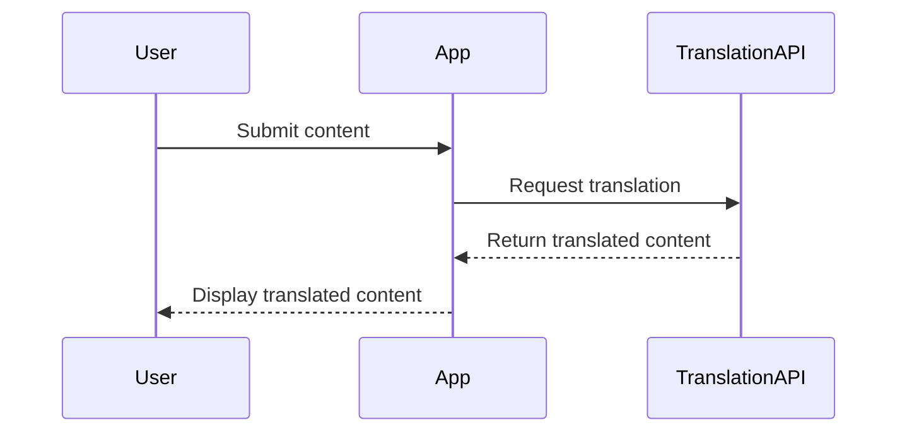

## 24.7 Dynamic Content Translation

In the ever-expanding global market, the ability to translate dynamic content effectively is crucial for web applications aiming to reach a diverse audience. Unlike static content, which can be pre-translated and stored, dynamic content requires real-time translation, often involving user-generated text or data fetched from external sources. This section delves into the techniques and best practices for translating dynamic content in JavaScript applications, focusing on integration with translation APIs, the use of placeholders and variables, and considerations for accuracy, context, and performance.

### Limitations of Pre-Translated Static Content

Static content translation involves translating fixed text strings in your application, which can be stored in resource files or databases. While this approach is straightforward and efficient for content that doesn't change frequently, it falls short when dealing with dynamic content. Here are some limitations:

- **Lack of Flexibility**: Static translations cannot accommodate user-generated content or data fetched from APIs, which may vary with each request.
- **Scalability Issues**: As the volume of dynamic content grows, maintaining static translations becomes impractical.
- **Context Sensitivity**: Static translations may not capture the nuances or context of dynamic content, leading to inaccuracies.

### Integrating with Translation APIs

To overcome the limitations of static translations, integrating with translation APIs is a viable solution. These APIs provide real-time translation services, allowing applications to translate content on-the-fly. One popular choice is the [Google Translate API](https://cloud.google.com/translate), which supports numerous languages and offers robust features.

#### Example: Using Google Translate API

Let's explore how to integrate the Google Translate API into a JavaScript application to translate dynamic content.

```javascript
// Import the required libraries
const axios = require('axios');

// Function to translate text using Google Translate API
async function translateText(text, targetLanguage) {
    const apiKey = 'YOUR_API_KEY'; // Replace with your Google Cloud API key
    const url = `https://translation.googleapis.com/language/translate/v2?key=${apiKey}`;

    try {
        const response = await axios.post(url, {
            q: text,
            target: targetLanguage
        });

        // Extract translated text from the response
        const translatedText = response.data.data.translations[0].translatedText;
        return translatedText;
    } catch (error) {
        console.error('Error translating text:', error);
        return null;
    }
}

// Example usage
translateText('Hello, world!', 'es').then(translated => {
    console.log('Translated text:', translated); // Output: "Hola, mundo!"
});
```

In this example, we use the `axios` library to make HTTP requests to the Google Translate API. The `translateText` function takes the text to be translated and the target language code as parameters, sending a POST request to the API and returning the translated text.

#### Considerations for API Integration

- **API Key Management**: Securely manage your API keys to prevent unauthorized access and potential misuse.
- **Rate Limiting**: Be aware of the API's rate limits to avoid exceeding usage quotas, which can lead to additional costs or service interruptions.
- **Error Handling**: Implement robust error handling to manage network issues, API errors, or invalid responses gracefully.

### Use of Placeholders and Variables in Translations

When translating dynamic content, it's essential to handle placeholders and variables correctly to maintain the integrity of the original message. Placeholders are often used to insert dynamic values into translated strings, such as user names, dates, or numbers.

#### Example: Using Placeholders in Translations

Consider a message template that includes a user's name and a date:

```javascript
const messageTemplate = 'Hello, {name}! Your appointment is on {date}.';

// Function to replace placeholders with actual values
function formatMessage(template, values) {
    return template.replace(/{(\w+)}/g, (match, key) => values[key] || match);
}

// Example usage
const values = { name: 'Alice', date: '2024-11-25' };
const formattedMessage = formatMessage(messageTemplate, values);
console.log(formattedMessage); // Output: "Hello, Alice! Your appointment is on 2024-11-25."
```

In this example, the `formatMessage` function replaces placeholders in the template with corresponding values from the `values` object. This approach ensures that dynamic content is accurately inserted into translated messages.

### Translation Accuracy and Context

Achieving accurate translations requires more than just converting words from one language to another. Context plays a crucial role in determining the correct translation, especially for languages with complex grammar or cultural nuances.

#### Strategies for Ensuring Accuracy

- **Contextual Information**: Provide additional context to the translation API, such as the type of content or its intended audience, to improve translation accuracy.
- **Post-Translation Review**: Implement a review process where native speakers or language experts verify translations for accuracy and appropriateness.
- **Custom Translation Models**: Use custom models or glossaries to handle domain-specific terminology or phrases that may not be accurately translated by generic models.

### Performance Implications and Potential Costs

Real-time translation of dynamic content can have significant performance implications, especially for applications with high traffic or large volumes of content. Additionally, using translation APIs often incurs costs based on usage.

#### Performance Considerations

- **Caching Translations**: Cache translated content to reduce the number of API calls and improve response times. Consider using a caching strategy that balances freshness and performance.
- **Batch Processing**: Translate multiple pieces of content in a single API call to reduce overhead and improve efficiency.
- **Asynchronous Processing**: Use asynchronous operations to handle translations without blocking the main application thread, ensuring a smooth user experience.

#### Cost Management

- **Monitor Usage**: Regularly monitor API usage to identify patterns and optimize translation requests.
- **Optimize Requests**: Minimize unnecessary translations by checking if content has changed before making API calls.
- **Explore Alternatives**: Consider open-source translation tools or self-hosted solutions if API costs become prohibitive.

### Visualizing the Translation Workflow

To better understand the process of dynamic content translation, let's visualize the workflow using a sequence diagram.



This diagram illustrates the interaction between the user, the application, and the translation API. The user submits content, the application requests a translation from the API, and the translated content is returned and displayed to the user.

### Knowledge Check

To reinforce your understanding of dynamic content translation, consider the following questions:

1. What are the limitations of static content translation?
2. How can placeholders be used effectively in dynamic translations?
3. What are some strategies for ensuring translation accuracy?
4. How can performance be optimized when using translation APIs?
5. What are the potential costs associated with using translation APIs?

### Summary and Key Takeaways

Dynamic content translation is a powerful tool for reaching a global audience, but it requires careful consideration of accuracy, context, performance, and cost. By integrating translation APIs, using placeholders effectively, and implementing strategies for accuracy and efficiency, developers can create applications that deliver seamless multilingual experiences.

Remember, this is just the beginning. As you progress, you'll build more complex and interactive web pages. Keep experimenting, stay curious, and enjoy the journey!

## Dynamic Content Translation in JavaScript: Quiz



### What is a limitation of static content translation?

- [x] It cannot accommodate user-generated content.
- [ ] It is always more accurate than dynamic translation.
- [ ] It is less expensive than dynamic translation.
- [ ] It requires more computational resources.

> **Explanation:** Static content translation cannot handle user-generated content, which is dynamic and varies with each request.

### Which API is commonly used for real-time translation in JavaScript applications?

- [x] Google Translate API
- [ ] Bing Translate API
- [ ] Yandex Translate API
- [ ] IBM Watson Language Translator

> **Explanation:** The Google Translate API is a popular choice for real-time translation in JavaScript applications.

### How can placeholders be used in translations?

- [x] By inserting dynamic values into translated strings.
- [ ] By replacing static content with dynamic content.
- [ ] By converting numbers into text.
- [ ] By translating content into multiple languages simultaneously.

> **Explanation:** Placeholders are used to insert dynamic values, such as user names or dates, into translated strings.

### What is a strategy for ensuring translation accuracy?

- [x] Provide contextual information to the translation API.
- [ ] Use only static translations.
- [ ] Avoid using placeholders.
- [ ] Translate content manually.

> **Explanation:** Providing contextual information helps improve translation accuracy by giving the API more context about the content.

### How can performance be optimized when using translation APIs?

- [x] Cache translated content.
- [ ] Use synchronous processing.
- [x] Batch process multiple translations.
- [ ] Increase the number of API calls.

> **Explanation:** Caching and batch processing can optimize performance by reducing the number of API calls and improving efficiency.

### What is a potential cost associated with using translation APIs?

- [x] Usage-based fees.
- [ ] Increased server load.
- [ ] Longer development time.
- [ ] Reduced translation accuracy.

> **Explanation:** Translation APIs often charge based on usage, which can lead to costs if not managed properly.

### What is the purpose of using asynchronous processing in translation?

- [x] To handle translations without blocking the main application thread.
- [ ] To increase the number of API calls.
- [ ] To improve translation accuracy.
- [ ] To reduce the need for placeholders.

> **Explanation:** Asynchronous processing allows translations to occur without blocking the main application thread, ensuring a smooth user experience.

### What is a benefit of using custom translation models?

- [x] Handling domain-specific terminology.
- [ ] Reducing translation costs.
- [ ] Eliminating the need for placeholders.
- [ ] Increasing the number of supported languages.

> **Explanation:** Custom translation models can handle domain-specific terminology more accurately than generic models.

### What is a key consideration when managing API keys?

- [x] Securely managing them to prevent unauthorized access.
- [ ] Sharing them with all team members.
- [ ] Storing them in the application code.
- [ ] Using the same key for multiple APIs.

> **Explanation:** API keys should be securely managed to prevent unauthorized access and potential misuse.

### True or False: Dynamic content translation can be achieved without using any APIs.

- [ ] True
- [x] False

> **Explanation:** Dynamic content translation typically requires APIs to provide real-time translation services.


