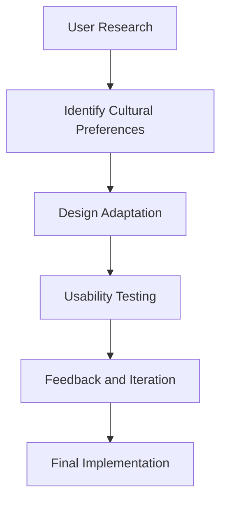

## 24.8 Cultural Considerations in UI/UX

In today's globalized world, designing user interfaces (UI) and user experiences (UX) that resonate with diverse cultural backgrounds is crucial. As developers and designers, we must ensure that our applications are not only functional but also culturally sensitive and inclusive. This section delves into the cultural considerations necessary for effective UI/UX design, providing insights into how cultural differences impact user interface preferences and offering strategies for creating culturally appropriate applications.

### Understanding Cultural Impact on UI/UX Design

Cultural differences can significantly influence how users perceive and interact with digital interfaces. Factors such as language, color symbolism, iconography, and imagery can vary widely across cultures, affecting user experience and satisfaction.

#### Language and Text

Language is a fundamental aspect of culture that directly impacts UI/UX design. Beyond translation, consider the following:

- **Text Direction**: Languages such as Arabic and Hebrew are read from right to left, requiring a mirrored layout compared to left-to-right languages like English.
- **Character Length**: Some languages, like German, tend to have longer words, which can affect text layout and design.
- **Tone and Formality**: Different cultures have varying expectations regarding formality and tone in communication. Ensure that the language used in your application aligns with cultural norms.

#### Color Symbolism

Colors carry different meanings across cultures, and using them appropriately is essential for effective UI/UX design.

- **Red**: In Western cultures, red often signifies danger or urgency, while in China, it symbolizes luck and prosperity.
- **White**: Associated with purity in Western cultures, white is often linked to mourning in some Asian cultures.
- **Green**: While green is associated with nature and tranquility in many cultures, it can symbolize infidelity in some regions.

#### Iconography and Imagery

Icons and images are powerful tools in UI/UX design, but their interpretation can vary widely across cultures.

- **Gestures**: Hand gestures, such as the thumbs-up, may be positive in some cultures but offensive in others.
- **Animals**: Certain animals may hold cultural significance; for example, the owl is a symbol of wisdom in Western cultures but can represent bad luck in some Asian cultures.

### The Importance of User Research and Testing

Conducting thorough user research and testing in target regions is vital to understanding cultural preferences and expectations. This process involves:

- **User Interviews and Surveys**: Gather insights directly from users in different cultural contexts to understand their needs and preferences.
- **Usability Testing**: Test your application with users from various cultural backgrounds to identify potential issues and areas for improvement.
- **A/B Testing**: Experiment with different design elements to determine which resonate best with your target audience.

### Adapting Content to Meet Cultural Norms and Legal Requirements

Adapting content to align with cultural norms and legal requirements is essential for creating culturally sensitive applications.

#### Cultural Norms

- **Visual Design**: Ensure that visual elements, such as colors and images, align with cultural expectations and do not offend or alienate users.
- **Content**: Tailor content to reflect cultural values and interests, avoiding stereotypes and assumptions.

#### Legal Requirements

- **Data Privacy**: Different regions have varying data privacy laws, such as GDPR in Europe. Ensure compliance with local regulations.
- **Accessibility**: Adhere to accessibility standards, such as WCAG, to ensure your application is usable by people with disabilities.

### Encouraging Inclusivity and Respect in Design Choices

Inclusivity and respect are fundamental principles in UI/UX design. By embracing these values, we can create applications that are welcoming and accessible to all users.

- **Diverse Representation**: Use diverse imagery and content that reflects the varied backgrounds of your users.
- **Inclusive Language**: Avoid gender-specific pronouns and use language that is inclusive and respectful.
- **Feedback Mechanisms**: Provide users with the opportunity to give feedback on cultural aspects of your application, allowing for continuous improvement.

### Code Example: Implementing Language Support in JavaScript

Let's explore a simple example of implementing language support in a JavaScript application. This example demonstrates how to dynamically change the language of an application based on user preference.

```javascript
// Define translations for different languages
const translations = {
  en: {
    welcome: "Welcome",
    goodbye: "Goodbye"
  },
  es: {
    welcome: "Bienvenido",
    goodbye: "Adiós"
  },
  fr: {
    welcome: "Bienvenue",
    goodbye: "Au revoir"
  }
};

// Function to change language
function changeLanguage(language) {
  const elements = document.querySelectorAll("[data-translate]");
  elements.forEach((element) => {
    const key = element.getAttribute("data-translate");
    element.textContent = translations[language][key];
  });
}

// Example usage
document.getElementById("language-select").addEventListener("change", (event) => {
  changeLanguage(event.target.value);
});
```

In this example, we define translations for English, Spanish, and French. The `changeLanguage` function updates the text content of elements with the `data-translate` attribute based on the selected language. This approach allows for easy expansion to support additional languages.

### Visualizing Cultural Adaptation in UI Design

To better understand how cultural adaptation can be visualized in UI design, consider the following diagram illustrating the process of adapting a user interface for different cultural contexts.



**Diagram Description**: This flowchart represents the iterative process of adapting a user interface for cultural differences. It begins with user research to identify cultural preferences, followed by design adaptation, usability testing, feedback and iteration, and finally, the implementation of the culturally adapted design.

### Knowledge Check

To reinforce your understanding of cultural considerations in UI/UX design, consider the following questions:

1. How can cultural differences impact the perception of color in UI design?
2. Why is it important to conduct user research in target regions?
3. What are some legal requirements to consider when designing for different cultures?
4. How can inclusivity be encouraged in UI/UX design?

### Embrace the Journey

Designing for cultural diversity is an ongoing journey that requires continuous learning and adaptation. By embracing cultural sensitivity and inclusivity, we can create applications that resonate with users worldwide. Remember, this is just the beginning. As you progress, you'll build more culturally aware and inclusive applications. Keep experimenting, stay curious, and enjoy the journey!

### Quiz: Cultural Considerations in UI/UX



### How can cultural differences impact the perception of color in UI design?

- [x] Colors carry different meanings across cultures.
- [ ] Colors are universally interpreted the same way.
- [ ] Color perception is not influenced by culture.
- [ ] Colors have no impact on user experience.

> **Explanation:** Colors carry different meanings across cultures, affecting how users perceive and interact with interfaces.

### Why is it important to conduct user research in target regions?

- [x] To understand cultural preferences and expectations.
- [ ] To avoid legal requirements.
- [ ] To ensure the application is functional.
- [ ] To reduce development costs.

> **Explanation:** Conducting user research in target regions helps understand cultural preferences and expectations, leading to more effective UI/UX design.

### What are some legal requirements to consider when designing for different cultures?

- [x] Data privacy laws and accessibility standards.
- [ ] Language translation.
- [ ] Iconography preferences.
- [ ] Color symbolism.

> **Explanation:** Legal requirements such as data privacy laws and accessibility standards must be considered when designing for different cultures.

### How can inclusivity be encouraged in UI/UX design?

- [x] Use diverse imagery and inclusive language.
- [ ] Focus solely on functionality.
- [ ] Ignore cultural differences.
- [ ] Use a single design for all cultures.

> **Explanation:** Inclusivity can be encouraged by using diverse imagery and inclusive language, ensuring the application is welcoming to all users.

### Which of the following is a cultural consideration in UI/UX design?

- [x] Language and text direction.
- [ ] Code optimization.
- [ ] Server configuration.
- [ ] Database indexing.

> **Explanation:** Language and text direction are cultural considerations that impact UI/UX design.

### What is the significance of color symbolism in UI design?

- [x] Colors can convey different meanings in different cultures.
- [ ] Colors are only used for aesthetic purposes.
- [ ] Colors have no impact on user perception.
- [ ] Colors are universally interpreted the same way.

> **Explanation:** Colors can convey different meanings in different cultures, affecting user perception and interaction.

### How can user feedback improve cultural adaptation in UI design?

- [x] By identifying areas for improvement and adaptation.
- [ ] By reducing development time.
- [ ] By eliminating the need for testing.
- [ ] By standardizing design across cultures.

> **Explanation:** User feedback helps identify areas for improvement and adaptation, enhancing cultural sensitivity in UI design.

### What role does iconography play in cultural considerations for UI/UX?

- [x] Icons can be interpreted differently across cultures.
- [ ] Icons have a universal meaning.
- [ ] Icons are irrelevant to cultural considerations.
- [ ] Icons are only decorative elements.

> **Explanation:** Icons can be interpreted differently across cultures, making them an important consideration in UI/UX design.

### Why is it important to adapt content to meet cultural norms?

- [x] To ensure the application is culturally appropriate and effective.
- [ ] To reduce server load.
- [ ] To improve code efficiency.
- [ ] To standardize design.

> **Explanation:** Adapting content to meet cultural norms ensures the application is culturally appropriate and effective for users.

### True or False: Cultural considerations in UI/UX design are only relevant for international applications.

- [ ] True
- [x] False

> **Explanation:** Cultural considerations in UI/UX design are relevant for all applications, as they enhance inclusivity and user experience across diverse user groups.



By understanding and implementing cultural considerations in UI/UX design, we can create applications that are not only functional but also resonate with users from diverse cultural backgrounds. This approach fosters inclusivity, respect, and a positive user experience, ultimately leading to more successful and widely adopted applications.
