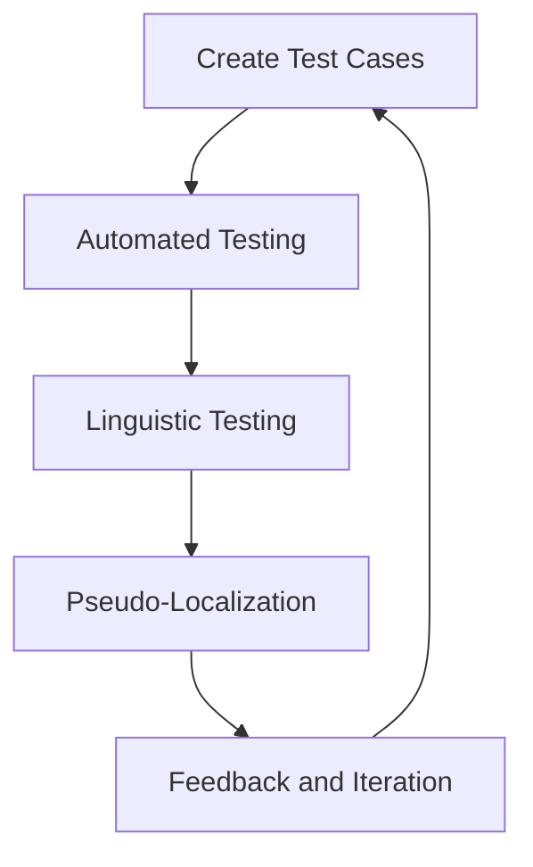

## 24.9 Testing Internationalized Applications

In today's global market, developing applications that cater to a diverse audience is essential. Internationalization (i18n) and localization (l10n) are critical processes that allow applications to support multiple languages and regional settings. However, ensuring that these applications function correctly across all supported locales presents unique challenges. In this section, we will explore strategies and tools for testing internationalized applications, ensuring functionality and correctness across all supported languages.

### Understanding the Challenges of Testing Localized Content

Testing internationalized applications involves more than just verifying translations. It requires a comprehensive approach to ensure that the application behaves correctly in different cultural contexts. Here are some common challenges:

1. **Text Expansion and Contraction**: Different languages have varying lengths for the same content. For example, German text is often longer than English, while Chinese text is typically shorter. This can affect UI layout and design.

2. **Date and Time Formats**: Different regions use different formats for dates and times. An application must correctly display these formats based on the user's locale.

3. **Number and Currency Formats**: Similar to dates, numbers and currencies are formatted differently across regions. For instance, the decimal separator in the US is a period, while in many European countries, it's a comma.

4. **Cultural Sensitivity**: Colors, symbols, and images may have different meanings in different cultures. It's crucial to ensure that the application's content is culturally appropriate.

5. **Right-to-Left (RTL) Languages**: Languages like Arabic and Hebrew are read from right to left, requiring specific adjustments in the UI layout.

6. **Character Encoding**: Ensuring that the application supports various character sets, including Unicode, is vital for displaying text correctly in different languages.

### Guidelines for Creating Test Cases Covering Different Locales

Creating effective test cases for internationalized applications involves considering the various aspects of localization. Here are some guidelines:

1. **Locale-Specific Test Cases**: Develop test cases for each supported locale, focusing on locale-specific features such as date, time, number, and currency formats.

2. **UI Layout and Design**: Test the application's UI to ensure it accommodates text expansion and contraction. Verify that the layout remains consistent and usable across different languages.

3. **Functional Testing**: Ensure that all application features work correctly in each locale. This includes verifying that locale-specific data is processed and displayed correctly.

4. **Linguistic Testing**: Conduct linguistic testing to verify the quality of translations. This involves checking for grammatical errors, cultural appropriateness, and consistency in terminology.

5. **RTL Language Support**: For applications supporting RTL languages, test the UI layout and navigation to ensure they function correctly.

6. **Accessibility Testing**: Ensure that the application is accessible to users with disabilities in all supported locales. This includes verifying screen reader compatibility and keyboard navigation.

### Automated Testing Tools and Frameworks for i18n Testing

Automated testing is essential for efficiently testing internationalized applications. Several tools and frameworks support i18n testing:

1. **Selenium**: Selenium is a popular open-source tool for automating web browsers. It can be used to test internationalized applications by simulating user interactions in different locales.

2. **WebDriverIO**: Built on top of Selenium, WebDriverIO provides a more user-friendly API for writing automated tests. It supports testing in multiple languages and locales.

3. **TestCafe**: TestCafe is an end-to-end testing framework that supports testing applications in different locales. It provides features for simulating user interactions and verifying UI elements.

4. **Jest**: Jest is a JavaScript testing framework that can be used for unit and integration testing. It supports mocking and can be extended to test internationalized applications.

5. **Cypress**: Cypress is a modern testing framework that provides a fast and reliable way to test web applications. It supports testing in different locales and can be integrated with other tools for comprehensive i18n testing.

6. **i18n Testing Libraries**: Libraries like `i18next` and `react-i18next` provide tools for managing translations and testing internationalized applications.

### The Importance of Linguistic Testing for Translation Quality

Linguistic testing is a crucial aspect of testing internationalized applications. It involves verifying the quality of translations to ensure they are accurate, culturally appropriate, and consistent. Here are some key considerations:

1. **Translation Accuracy**: Verify that translations are accurate and convey the intended meaning. This involves checking for grammatical errors, spelling mistakes, and incorrect terminology.

2. **Cultural Appropriateness**: Ensure that translations are culturally appropriate and do not offend or confuse users. This includes verifying the use of idioms, expressions, and cultural references.

3. **Consistency in Terminology**: Ensure that terminology is consistent across the application. This involves verifying that the same terms are used consistently in different parts of the application.

4. **Feedback from Native Speakers**: Involve native speakers in the testing process to provide feedback on translations. This can help identify issues that automated tools may miss.

### Using Pseudo-Localization to Identify Potential Issues

Pseudo-localization is a technique used to identify potential localization issues early in the development process. It involves replacing text in the application with pseudo-translations that mimic the characteristics of different languages. Here are some benefits of pseudo-localization:

1. **Identifying Text Expansion Issues**: Pseudo-localization can help identify UI layout issues caused by text expansion. By using longer pseudo-translations, developers can verify that the UI accommodates longer text.

2. **Testing Character Encoding**: Pseudo-localization can help identify character encoding issues by using characters from different scripts, such as Cyrillic or Chinese.

3. **Verifying RTL Support**: Pseudo-localization can be used to test RTL support by using pseudo-translations that mimic RTL languages.

4. **Early Detection of Localization Bugs**: By using pseudo-localization early in the development process, developers can identify and fix localization issues before they become more challenging to address.

### Code Example: Automated Testing with Selenium

Let's explore a simple example of using Selenium to automate testing of an internationalized application. We'll simulate a user interaction in a web application that supports multiple languages.

```javascript
const { Builder, By, Key, until } = require('selenium-webdriver');

(async function testInternationalizedApp() {
    // Initialize the WebDriver
    let driver = await new Builder().forBrowser('chrome').build();

    try {
        // Navigate to the application
        await driver.get('http://example.com');

        // Select the language dropdown and choose a different language
        await driver.findElement(By.id('language-dropdown')).click();
        await driver.findElement(By.xpath("//option[@value='es']")).click(); // Select Spanish

        // Verify that the page content is displayed in the selected language
        let heading = await driver.findElement(By.tagName('h1')).getText();
        console.assert(heading === 'Bienvenido', 'The heading is not in Spanish');

        // Perform other interactions and verifications as needed
    } finally {
        // Quit the driver
        await driver.quit();
    }
})();
```

**Explanation**: In this example, we use Selenium to automate the testing of a web application that supports multiple languages. We simulate a user selecting a different language from a dropdown and verify that the page content is displayed in the selected language.

### Visualizing the Localization Testing Workflow

Below is a diagram illustrating the workflow for testing internationalized applications. It highlights the key steps involved in the process, from creating test cases to conducting linguistic testing and using automated tools.



**Description**: This diagram represents the iterative process of testing internationalized applications. It begins with creating test cases, followed by automated testing, linguistic testing, and pseudo-localization. Feedback is gathered and used to iterate on the process.

### Knowledge Check

To reinforce your understanding of testing internationalized applications, consider the following questions:

1. What are some common challenges of testing localized content?
2. How can pseudo-localization help identify potential localization issues?
3. What are some automated testing tools that support i18n testing?
4. Why is linguistic testing important for translation quality?
5. How can you ensure that an application supports RTL languages?

### Exercises

1. **Create Test Cases**: Develop test cases for a sample application that supports multiple locales. Focus on testing locale-specific features such as date, time, and currency formats.

2. **Automate Testing**: Use Selenium or another automated testing tool to simulate user interactions in a web application that supports multiple languages.

3. **Conduct Linguistic Testing**: Involve native speakers in the testing process to provide feedback on translations. Identify any issues with translation accuracy, cultural appropriateness, and consistency in terminology.

4. **Implement Pseudo-Localization**: Use pseudo-localization to identify potential localization issues in a sample application. Verify that the UI accommodates text expansion and supports different character encodings.

### Summary

Testing internationalized applications is a complex but essential process for ensuring that applications function correctly across multiple locales. By understanding the challenges of testing localized content, creating comprehensive test cases, and using automated tools and frameworks, developers can ensure that their applications provide a seamless experience for users worldwide. Remember, this is just the beginning. As you progress, you'll build more complex and interactive web pages. Keep experimenting, stay curious, and enjoy the journey!

## Testing Internationalized Applications: Strategies and Tools



### What is a common challenge of testing localized content?

- [x] Text expansion and contraction
- [ ] Consistent UI design
- [ ] Single language support
- [ ] Limited user interactions

> **Explanation:** Text expansion and contraction are common challenges because different languages have varying lengths for the same content, affecting UI layout and design.

### How can pseudo-localization help in testing?

- [x] Identify text expansion issues
- [ ] Improve translation accuracy
- [ ] Enhance cultural appropriateness
- [ ] Increase application speed

> **Explanation:** Pseudo-localization helps identify text expansion issues by using longer pseudo-translations, allowing developers to verify that the UI accommodates longer text.

### Which tool is commonly used for automated testing of internationalized applications?

- [x] Selenium
- [ ] Photoshop
- [ ] Excel
- [ ] WordPress

> **Explanation:** Selenium is a popular open-source tool for automating web browsers and can be used to test internationalized applications by simulating user interactions in different locales.

### Why is linguistic testing important?

- [x] To verify translation quality
- [ ] To increase application speed
- [ ] To reduce server load
- [ ] To enhance graphics

> **Explanation:** Linguistic testing is important to verify the quality of translations, ensuring they are accurate, culturally appropriate, and consistent.

### What is a benefit of using pseudo-localization?

- [x] Early detection of localization bugs
- [ ] Faster application deployment
- [ ] Reduced server costs
- [ ] Improved graphics quality

> **Explanation:** Pseudo-localization allows for early detection of localization bugs by using pseudo-translations that mimic the characteristics of different languages.

### Which aspect is crucial for testing RTL languages?

- [x] UI layout and navigation
- [ ] Server configuration
- [ ] Database indexing
- [ ] Network speed

> **Explanation:** For applications supporting RTL languages, testing the UI layout and navigation is crucial to ensure they function correctly.

### What is a key consideration in linguistic testing?

- [x] Translation accuracy
- [ ] Server uptime
- [ ] Network latency
- [ ] Database size

> **Explanation:** Translation accuracy is a key consideration in linguistic testing to ensure that translations convey the intended meaning without errors.

### Which framework supports end-to-end testing for i18n?

- [x] TestCafe
- [ ] Photoshop
- [ ] Excel
- [ ] WordPress

> **Explanation:** TestCafe is an end-to-end testing framework that supports testing applications in different locales, providing features for simulating user interactions and verifying UI elements.

### What is the purpose of pseudo-localization?

- [x] To identify potential localization issues
- [ ] To increase application speed
- [ ] To enhance graphics
- [ ] To reduce server load

> **Explanation:** The purpose of pseudo-localization is to identify potential localization issues early in the development process by using pseudo-translations that mimic the characteristics of different languages.

### True or False: Automated testing is not necessary for internationalized applications.

- [ ] True
- [x] False

> **Explanation:** False. Automated testing is essential for efficiently testing internationalized applications, ensuring functionality and correctness across multiple locales.


