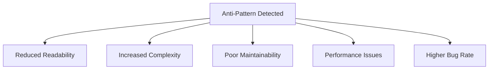

## 25.1 Recognizing Anti-Patterns in JavaScript

In the world of software development, design patterns are celebrated as solutions to common problems. However, not all patterns are beneficial. Anti-patterns, the focus of this section, are common responses to recurring problems that are ineffective and counterproductive. Recognizing and avoiding these anti-patterns is crucial for maintaining high-quality, efficient, and maintainable JavaScript code.

### What Are Anti-Patterns?

Anti-patterns are essentially poor solutions to common programming problems. They often arise from a lack of understanding, experience, or foresight. While they may seem like quick fixes, anti-patterns can lead to code that is difficult to understand, maintain, and extend. They can introduce bugs, reduce performance, and make collaboration challenging.

#### Impact on Code Quality

The presence of anti-patterns in code can significantly degrade its quality. Here are some of the impacts:

- **Reduced Readability**: Anti-patterns often result in convoluted code that is hard to read and understand.
- **Increased Complexity**: They can introduce unnecessary complexity, making the codebase harder to manage.
- **Poor Maintainability**: Code riddled with anti-patterns is difficult to maintain and extend, leading to higher costs and effort.
- **Performance Issues**: Some anti-patterns can lead to inefficient code, causing performance bottlenecks.
- **Higher Bug Rate**: Anti-patterns can introduce subtle bugs that are hard to detect and fix.

### Importance of Recognizing and Refactoring Anti-Patterns

Recognizing anti-patterns is the first step toward refactoring them into more effective solutions. By identifying these patterns early, developers can:

- **Improve Code Quality**: Refactoring anti-patterns enhances readability, maintainability, and performance.
- **Facilitate Collaboration**: Clean, well-structured code is easier for teams to work on collaboratively.
- **Reduce Technical Debt**: Addressing anti-patterns helps prevent the accumulation of technical debt.
- **Enhance Learning**: Understanding why certain patterns are anti-patterns fosters better programming practices.

### General Strategies for Identifying Anti-Patterns

Identifying anti-patterns requires a keen eye and a solid understanding of best practices. Here are some strategies to help you spot them:

1. **Code Reviews**: Regular code reviews can help identify anti-patterns by bringing fresh perspectives to the code.
2. **Automated Tools**: Use linters and static analysis tools to detect common anti-patterns and code smells.
3. **Continuous Learning**: Stay updated with best practices and common pitfalls in JavaScript development.
4. **Refactoring Sessions**: Regularly schedule time to refactor and improve existing code.
5. **Peer Programming**: Collaborate with peers to gain insights into potential anti-patterns in your code.

### Setting the Stage for Specific Anti-Patterns

In the following sections, we will delve into specific anti-patterns commonly found in JavaScript development. Each anti-pattern will be dissected to understand its characteristics, why it is considered an anti-pattern, and how to refactor it into a more effective solution.

### Encouraging a Mindset of Continuous Improvement

Recognizing and refactoring anti-patterns is not a one-time task but a continuous process. Embrace a mindset of continuous improvement by:

- **Adopting Best Practices**: Regularly update your knowledge of best practices and integrate them into your workflow.
- **Seeking Feedback**: Encourage feedback from peers and mentors to identify areas for improvement.
- **Experimenting and Learning**: Don't be afraid to experiment with new techniques and learn from failures.
- **Documenting Lessons Learned**: Keep a record of lessons learned from past projects to avoid repeating mistakes.

### Code Example: Identifying and Refactoring an Anti-Pattern

Let's explore a simple example of an anti-pattern in JavaScript and how to refactor it.

#### Example: The "Magic Numbers" Anti-Pattern

Magic numbers are numeric literals that appear in code without explanation. They can make code difficult to understand and maintain.

```javascript
// Anti-pattern: Magic numbers
function calculateDiscount(price) {
    return price * 0.15; // What does 0.15 represent?
}
```

**Refactored Code:**

```javascript
// Refactored: Use named constants
const DISCOUNT_RATE = 0.15;

function calculateDiscount(price) {
    return price * DISCOUNT_RATE;
}
```

In the refactored code, we replaced the magic number `0.15` with a named constant `DISCOUNT_RATE`, making the code more readable and maintainable.

### Visualizing the Impact of Anti-Patterns

To better understand the impact of anti-patterns, let's visualize how they can affect code quality and maintainability.



**Diagram Description**: This flowchart illustrates the negative impacts of anti-patterns on code quality, including reduced readability, increased complexity, poor maintainability, performance issues, and a higher bug rate.

### References and Links

For further reading on anti-patterns and best practices in JavaScript, consider exploring the following resources:

- [MDN Web Docs: JavaScript Guide](https://developer.mozilla.org/en-US/docs/Web/JavaScript/Guide)
- [Refactoring Guru: Anti-Patterns](https://refactoring.guru/antipatterns)
- [JavaScript: The Good Parts by Douglas Crockford](https://www.oreilly.com/library/view/javascript-the-good/9780596517748/)

### Knowledge Check

To reinforce your understanding of anti-patterns, consider the following questions:

1. What is an anti-pattern, and how does it differ from a design pattern?
2. Why is it important to recognize and refactor anti-patterns in your code?
3. What are some common impacts of anti-patterns on code quality?
4. How can code reviews help in identifying anti-patterns?
5. What is the "magic numbers" anti-pattern, and how can it be refactored?

### Embrace the Journey

Remember, recognizing and refactoring anti-patterns is a journey, not a destination. As you progress in your JavaScript development career, you'll encounter various challenges and opportunities to improve your code. Keep experimenting, stay curious, and enjoy the journey!

### Quiz: Test Your Knowledge on Recognizing Anti-Patterns in JavaScript



### What is an anti-pattern in software development?

- [x] A common but ineffective solution to a recurring problem
- [ ] A well-established solution to a common problem
- [ ] A design pattern used in software architecture
- [ ] A type of algorithm used in programming

> **Explanation:** An anti-pattern is a common but ineffective solution to a recurring problem, often leading to negative consequences in code quality.

### Why is it important to recognize anti-patterns in code?

- [x] To improve code quality and maintainability
- [ ] To increase the complexity of the code
- [ ] To introduce more bugs into the code
- [ ] To make the code harder to read

> **Explanation:** Recognizing anti-patterns is important to improve code quality, maintainability, and readability, and to reduce bugs.

### Which of the following is a common impact of anti-patterns?

- [x] Reduced readability
- [ ] Improved performance
- [ ] Simplified code structure
- [ ] Enhanced collaboration

> **Explanation:** Anti-patterns often lead to reduced readability, making the code harder to understand and maintain.

### How can code reviews help in identifying anti-patterns?

- [x] By providing fresh perspectives on the code
- [ ] By increasing the number of bugs in the code
- [ ] By making the code more complex
- [ ] By reducing the need for documentation

> **Explanation:** Code reviews provide fresh perspectives on the code, helping to identify anti-patterns and areas for improvement.

### What is the "magic numbers" anti-pattern?

- [x] Using numeric literals without explanation
- [ ] Using named constants for numeric values
- [ ] Using variables for all numeric values
- [ ] Using strings instead of numbers

> **Explanation:** The "magic numbers" anti-pattern involves using numeric literals without explanation, making the code harder to understand.

### How can the "magic numbers" anti-pattern be refactored?

- [x] By using named constants for numeric values
- [ ] By removing all numeric values from the code
- [ ] By converting numbers to strings
- [ ] By using variables for all numeric values

> **Explanation:** Refactoring the "magic numbers" anti-pattern involves using named constants for numeric values to improve readability.

### What is a benefit of refactoring anti-patterns?

- [x] Improved code maintainability
- [ ] Increased code complexity
- [ ] Higher bug rate
- [ ] Reduced code readability

> **Explanation:** Refactoring anti-patterns improves code maintainability, making it easier to manage and extend.

### What is a strategy for identifying anti-patterns in code?

- [x] Regular code reviews
- [ ] Ignoring code smells
- [ ] Increasing code complexity
- [ ] Avoiding peer programming

> **Explanation:** Regular code reviews are a strategy for identifying anti-patterns by bringing fresh perspectives to the code.

### What mindset should developers adopt to avoid anti-patterns?

- [x] Continuous improvement and best practices adherence
- [ ] Ignoring feedback from peers
- [ ] Avoiding learning new techniques
- [ ] Focusing solely on quick fixes

> **Explanation:** Developers should adopt a mindset of continuous improvement and best practices adherence to avoid anti-patterns.

### True or False: Anti-patterns can lead to performance issues in code.

- [x] True
- [ ] False

> **Explanation:** Anti-patterns can lead to performance issues by introducing inefficient code and bottlenecks.



By understanding and addressing anti-patterns, you can significantly enhance the quality and maintainability of your JavaScript code. Keep striving for excellence and continuous improvement in your development journey!
