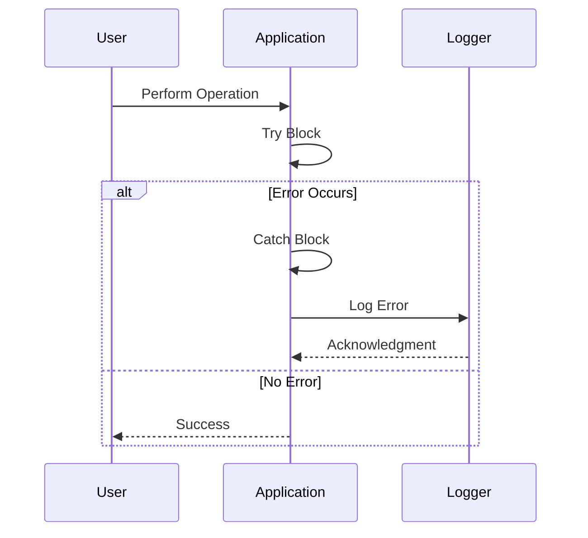

## 25.10 Not Handling Errors Properly

In the world of software development, errors are inevitable. However, how we handle these errors can significantly impact the robustness, security, and user experience of our applications. In JavaScript, improper error handling can lead to application crashes, security vulnerabilities, and a poor user experience. This section explores the consequences of inadequate error handling, common pitfalls, and best practices to ensure your JavaScript applications are resilient and secure.

### The Importance of Robust Error Handling

Error handling is a critical aspect of software development. It ensures that your application can gracefully recover from unexpected conditions, providing a seamless experience for users. Proper error handling can prevent application crashes, protect sensitive data, and provide developers with valuable insights for debugging and improving the application.

### Common Pitfalls in Error Handling

Let's explore some common pitfalls in error handling that developers often encounter:

#### Empty Catch Blocks

An empty catch block is a classic example of poor error handling. It suppresses errors without providing any feedback or logging, leaving developers in the dark about what went wrong.

```javascript
try {
    // Code that may throw an error
    riskyOperation();
} catch (error) {
    // Empty catch block - error is suppressed
}
```

**Why It's a Problem:** Suppressing errors without logging them can lead to silent failures, making it difficult to diagnose and fix issues.

#### Suppressing Errors Without Logging

Similar to empty catch blocks, suppressing errors without logging them can hide critical information that could be used for debugging.

```javascript
try {
    // Code that may throw an error
    riskyOperation();
} catch (error) {
    // Suppressing error without logging
    console.log("An error occurred.");
}
```

**Why It's a Problem:** While this example logs a generic message, it doesn't provide any details about the error, making it challenging to identify the root cause.

#### Throwing Generic Errors Without Context

Throwing generic errors without context can make it difficult for developers to understand what went wrong and where.

```javascript
function performOperation() {
    if (someConditionFails) {
        throw new Error("Operation failed");
    }
}
```

**Why It's a Problem:** Generic error messages lack specificity, making it hard to diagnose the issue. Providing context can significantly aid in debugging.

### Best Practices for Error Handling

To avoid these pitfalls, let's explore some best practices for error handling in JavaScript:

#### Using Try/Catch Blocks Appropriately

Use try/catch blocks to handle errors gracefully. Ensure that you catch specific errors and provide meaningful messages.

```javascript
try {
    // Code that may throw an error
    riskyOperation();
} catch (error) {
    console.error("Error during risky operation:", error.message);
}
```

**Explanation:** This example logs the error message, providing context about where the error occurred.

#### Providing Meaningful Error Messages

When throwing errors, provide detailed messages that offer context and guidance for resolving the issue.

```javascript
function performOperation() {
    if (someConditionFails) {
        throw new Error("Operation failed: Condition XYZ was not met.");
    }
}
```

**Explanation:** This error message provides specific information about the condition that caused the failure.

#### Implementing Global Error Handlers

Global error handlers can catch unhandled errors and provide a centralized location for logging and handling them.

```javascript
window.onerror = function (message, source, lineno, colno, error) {
    console.error("Global error handler:", message, "at", source, ":", lineno, ":", colno);
};
```

**Explanation:** This example sets up a global error handler that logs unhandled errors, providing valuable information for debugging.

#### Logging Errors for Monitoring and Debugging

Logging errors is crucial for monitoring application health and diagnosing issues. Use logging libraries or services to capture and store error logs.

```javascript
try {
    // Code that may throw an error
    riskyOperation();
} catch (error) {
    logErrorToService(error);
}

function logErrorToService(error) {
    // Send error details to a logging service
    console.error("Logging error:", error);
}
```

**Explanation:** This example logs errors to a service, enabling developers to monitor and analyze error trends.

### Handling Asynchronous Errors

Asynchronous programming introduces additional challenges for error handling. Let's explore some considerations for handling asynchronous errors:

#### Promises and Error Handling

When working with promises, use `.catch()` to handle errors. Ensure that you handle errors at the appropriate level in the promise chain.

```javascript
fetchData()
    .then(response => processData(response))
    .catch(error => console.error("Error fetching data:", error));
```

**Explanation:** This example uses `.catch()` to handle errors that occur during the fetch operation.

#### Async/Await and Try/Catch

When using async/await, wrap asynchronous code in try/catch blocks to handle errors.

```javascript
async function fetchData() {
    try {
        const response = await fetch("https://api.example.com/data");
        const data = await response.json();
        return data;
    } catch (error) {
        console.error("Error fetching data:", error);
    }
}
```

**Explanation:** This example uses a try/catch block to handle errors in an async function.

#### Global Error Handling for Promises

Use `window.onunhandledrejection` to catch unhandled promise rejections globally.

```javascript
window.onunhandledrejection = function (event) {
    console.error("Unhandled promise rejection:", event.reason);
};
```

**Explanation:** This example sets up a global handler for unhandled promise rejections, providing a safety net for asynchronous errors.

### Visualizing Error Handling in JavaScript

To better understand error handling in JavaScript, let's visualize the flow of error handling using a sequence diagram.



**Diagram Description:** This sequence diagram illustrates the flow of error handling in a JavaScript application. When a user performs an operation, the application executes a try block. If an error occurs, the catch block logs the error, and the logger acknowledges it. If no error occurs, the application returns success to the user.

### References and Links

For further reading on error handling in JavaScript, consider the following resources:

- [MDN Web Docs: Error Handling](https://developer.mozilla.org/en-US/docs/Web/JavaScript/Guide/Control_flow_and_error_handling)
- [W3Schools: JavaScript Errors](https://www.w3schools.com/js/js_errors.asp)
- [Node.js Error Handling Best Practices](https://nodejs.dev/learn/error-handling-in-nodejs)

### Knowledge Check

To reinforce your understanding of error handling in JavaScript, consider the following questions:

1. What are the consequences of not handling errors properly in a JavaScript application?
2. Why is it important to provide meaningful error messages?
3. How can global error handlers improve error handling in an application?
4. What is the purpose of logging errors, and how can it benefit developers?
5. How do you handle errors in asynchronous code using promises and async/await?

### Embrace the Journey

Remember, mastering error handling is a journey. As you progress, you'll build more resilient and secure applications. Keep experimenting, stay curious, and enjoy the journey!

### Quiz: Mastering JavaScript Error Handling



### What is a common pitfall in error handling?

- [x] Empty catch blocks
- [ ] Using try/catch blocks
- [ ] Providing meaningful error messages
- [ ] Logging errors

> **Explanation:** Empty catch blocks suppress errors without providing any feedback or logging, making it difficult to diagnose issues.

### Why is it important to provide meaningful error messages?

- [x] To aid in debugging and understanding the issue
- [ ] To suppress errors
- [ ] To make the application run faster
- [ ] To avoid using try/catch blocks

> **Explanation:** Meaningful error messages provide context and guidance for resolving issues, aiding in debugging.

### How can global error handlers improve error handling?

- [x] By catching unhandled errors and providing a centralized location for logging
- [ ] By suppressing errors
- [ ] By making the application run faster
- [ ] By avoiding the use of try/catch blocks

> **Explanation:** Global error handlers catch unhandled errors and provide a centralized location for logging, improving error handling.

### What is the purpose of logging errors?

- [x] To monitor application health and diagnose issues
- [ ] To suppress errors
- [ ] To make the application run faster
- [ ] To avoid using try/catch blocks

> **Explanation:** Logging errors helps monitor application health and diagnose issues, providing valuable insights for developers.

### How do you handle errors in asynchronous code using promises?

- [x] Using .catch() to handle errors in the promise chain
- [ ] Using empty catch blocks
- [ ] Suppressing errors without logging
- [ ] Throwing generic errors without context

> **Explanation:** Using .catch() in the promise chain handles errors in asynchronous code effectively.

### What is the benefit of using async/await with try/catch?

- [x] It allows handling errors in asynchronous code using a familiar try/catch syntax
- [ ] It suppresses errors
- [ ] It makes the application run faster
- [ ] It avoids using promises

> **Explanation:** Async/await with try/catch allows handling errors in asynchronous code using a familiar syntax, improving readability and error handling.

### How can you catch unhandled promise rejections globally?

- [x] Using window.onunhandledrejection
- [ ] Using empty catch blocks
- [ ] Suppressing errors without logging
- [ ] Throwing generic errors without context

> **Explanation:** window.onunhandledrejection catches unhandled promise rejections globally, providing a safety net for asynchronous errors.

### What is the consequence of suppressing errors without logging?

- [x] Silent failures, making it difficult to diagnose issues
- [ ] Improved application performance
- [ ] Faster execution of code
- [ ] Better user experience

> **Explanation:** Suppressing errors without logging leads to silent failures, making it difficult to diagnose issues.

### Why is it important to handle errors in asynchronous code?

- [x] To prevent application crashes and ensure smooth user experience
- [ ] To suppress errors
- [ ] To make the application run faster
- [ ] To avoid using promises

> **Explanation:** Handling errors in asynchronous code prevents application crashes and ensures a smooth user experience.

### True or False: Throwing generic errors without context is a good practice.

- [ ] True
- [x] False

> **Explanation:** Throwing generic errors without context is not a good practice as it makes it difficult to understand and diagnose the issue.


