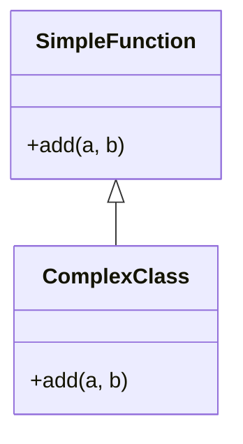

## 25.11 Overcomplicating with Unnecessary Abstractions

In the world of software development, especially in JavaScript, the temptation to over-engineer solutions is ever-present. This section addresses the anti-pattern of introducing unnecessary abstractions and complexity, which can make code harder to understand and maintain. We'll explore how over-engineering can harm a codebase, provide examples of unnecessary abstractions, and discuss principles like KISS and YAGNI to guide you in maintaining simplicity and clarity.

### Understanding Over-Engineering

Over-engineering occurs when developers introduce complexity into a codebase that is not required by the current or foreseeable requirements. This often manifests as unnecessary abstractions, excessive use of design patterns, or premature optimization. While the intention is usually to create a flexible and robust system, the result can be a codebase that is difficult to understand, maintain, and extend.

#### The Harm of Over-Engineering

1. **Increased Complexity**: Unnecessary abstractions can obscure the logic of the code, making it harder for developers to understand and work with it.
2. **Maintenance Challenges**: Complex systems are more challenging to maintain, leading to increased time and effort for bug fixes and feature enhancements.
3. **Performance Overheads**: Over-engineered solutions can introduce performance bottlenecks, as additional layers of abstraction may slow down execution.
4. **Reduced Agility**: A complex codebase can hinder the ability to quickly adapt to changing requirements or implement new features.

### Examples of Unnecessary Abstractions

Let's delve into some common scenarios where unnecessary abstractions can creep into JavaScript codebases.

#### Creating Classes for Simple Functions

JavaScript is a flexible language that supports both object-oriented and functional programming paradigms. However, this flexibility can lead to misuse, such as creating classes for simple functions.

```javascript
// Unnecessary class abstraction
class Adder {
  constructor() {}

  add(a, b) {
    return a + b;
  }
}

const adder = new Adder();
console.log(adder.add(2, 3)); // Output: 5

// Simpler function approach
function add(a, b) {
  return a + b;
}

console.log(add(2, 3)); // Output: 5
```

In this example, the `Adder` class adds unnecessary complexity to a simple addition operation. The function approach is more straightforward and easier to understand.

#### Using Design Patterns Where Not Needed

Design patterns are powerful tools for solving common problems, but they should be used judiciously. Applying a pattern where it is not needed can lead to over-engineering.

```javascript
// Over-engineered Singleton pattern for a simple configuration
class Config {
  constructor() {
    if (Config.instance) {
      return Config.instance;
    }
    this.settings = {};
    Config.instance = this;
  }

  set(key, value) {
    this.settings[key] = value;
  }

  get(key) {
    return this.settings[key];
  }
}

const config1 = new Config();
config1.set('theme', 'dark');

const config2 = new Config();
console.log(config2.get('theme')); // Output: dark

// Simpler object approach
const config = {
  settings: {},
  set(key, value) {
    this.settings[key] = value;
  },
  get(key) {
    return this.settings[key];
  }
};

config.set('theme', 'dark');
console.log(config.get('theme')); // Output: dark
```

In this case, the Singleton pattern adds unnecessary complexity to a simple configuration object. A plain object serves the purpose more efficiently.

#### Premature Optimization Without Evidence

Premature optimization refers to making changes to improve performance before there is evidence that such changes are necessary. This can lead to complex code that is difficult to maintain.

```javascript
// Premature optimization with caching
function computeExpensiveOperation(x) {
  const cache = {};
  if (cache[x]) {
    return cache[x];
  }
  const result = x * x; // Simulating an expensive operation
  cache[x] = result;
  return result;
}

console.log(computeExpensiveOperation(5)); // Output: 25

// Simpler approach without premature optimization
function computeSimpleOperation(x) {
  return x * x;
}

console.log(computeSimpleOperation(5)); // Output: 25
```

In this example, caching is introduced prematurely, adding complexity without evidence of performance issues. The simpler approach is more maintainable.

### Embracing the KISS Principle

The KISS (Keep It Simple, Stupid) principle advocates for simplicity in design. By keeping solutions simple, developers can create more maintainable and understandable codebases.

#### Applying KISS in JavaScript

- **Favor Simplicity**: Choose the simplest solution that meets the requirements.
- **Avoid Over-Abstracting**: Use abstractions only when they provide clear benefits.
- **Refactor Regularly**: Continuously refactor code to simplify and improve clarity.

### Balancing Abstraction with Simplicity

While simplicity is crucial, some level of abstraction is necessary for managing complexity in large codebases. The key is to find the right balance.

#### Guidelines for Balancing Abstraction

1. **Focus on Actual Requirements**: Implement abstractions based on current needs, not hypothetical future scenarios.
2. **Use YAGNI (You Aren't Gonna Need It)**: Avoid implementing features or abstractions that are not currently required.
3. **Iterate and Refactor**: Continuously evaluate and refactor abstractions to ensure they remain relevant and beneficial.

### Encouraging Simplicity and Clarity

By focusing on simplicity and clarity, developers can create codebases that are easier to understand, maintain, and extend. This requires a mindset shift from over-engineering to thoughtful design.

#### Practical Tips for Maintaining Simplicity

- **Write Clear and Concise Code**: Use descriptive variable and function names to enhance readability.
- **Document Thoughtfully**: Provide clear documentation to explain complex logic and decisions.
- **Review and Refactor**: Regularly review code to identify and eliminate unnecessary complexity.

### Visualizing Abstraction Levels

To better understand the impact of abstraction levels, let's visualize a simple example using a class diagram.



**Diagram Description**: This class diagram illustrates the relationship between a simple function and a complex class. The `SimpleFunction` class represents a straightforward implementation, while the `ComplexClass` introduces unnecessary complexity for the same operation.

### Knowledge Check

- **What is over-engineering, and how can it harm a codebase?**
- **Provide an example of unnecessary abstraction in JavaScript.**
- **Explain the KISS principle and how it applies to JavaScript development.**
- **What is YAGNI, and how does it help in maintaining simplicity?**

### Exercises

1. **Refactor a Complex Class**: Take a class that performs a simple operation and refactor it into a function.
2. **Identify Unnecessary Patterns**: Review a codebase and identify instances where design patterns are used unnecessarily.
3. **Apply KISS and YAGNI**: Implement a feature using the KISS and YAGNI principles, focusing on simplicity and actual requirements.

### Embrace the Journey

Remember, this is just the beginning. As you progress, you'll build more complex and interactive web applications. Keep experimenting, stay curious, and enjoy the journey!

### References and Links

- [MDN Web Docs: JavaScript](https://developer.mozilla.org/en-US/docs/Web/JavaScript)
- [W3Schools: JavaScript Tutorial](https://www.w3schools.com/js/)
- [Refactoring Guru: Design Patterns](https://refactoring.guru/design-patterns)

## Quiz: Understanding Overcomplicating with Unnecessary Abstractions



### What is over-engineering in software development?

- [x] Introducing unnecessary complexity into a codebase
- [ ] Simplifying code to improve readability
- [ ] Removing all abstractions from a codebase
- [ ] Using only functional programming paradigms

> **Explanation:** Over-engineering involves adding unnecessary complexity, which can make the codebase harder to maintain and understand.

### Which principle advocates for simplicity in design?

- [x] KISS (Keep It Simple, Stupid)
- [ ] DRY (Don't Repeat Yourself)
- [ ] SOLID
- [ ] YAGNI (You Aren't Gonna Need It)

> **Explanation:** The KISS principle emphasizes simplicity in design, making code easier to understand and maintain.

### What does YAGNI stand for?

- [x] You Aren't Gonna Need It
- [ ] You Always Get New Ideas
- [ ] Your Application Grows Naturally
- [ ] You Are Going Nowhere Immediately

> **Explanation:** YAGNI stands for "You Aren't Gonna Need It," encouraging developers to avoid implementing features that are not currently necessary.

### Why is creating classes for simple functions considered an unnecessary abstraction?

- [x] It adds complexity without providing additional benefits
- [ ] It makes the code more readable
- [ ] It enhances performance
- [ ] It simplifies debugging

> **Explanation:** Creating classes for simple functions adds unnecessary complexity, making the code harder to understand without providing significant benefits.

### What is a common consequence of over-engineering?

- [x] Increased maintenance challenges
- [ ] Improved performance
- [ ] Simplified codebase
- [ ] Enhanced readability

> **Explanation:** Over-engineering often leads to increased maintenance challenges due to the added complexity.

### How can premature optimization harm a codebase?

- [x] By introducing complexity without evidence of performance issues
- [ ] By improving performance too early
- [ ] By simplifying the code
- [ ] By removing necessary abstractions

> **Explanation:** Premature optimization can introduce unnecessary complexity without evidence of performance issues, making the code harder to maintain.

### What is the benefit of using the KISS principle?

- [x] It helps maintain simplicity and clarity in the codebase
- [ ] It encourages the use of complex design patterns
- [ ] It focuses on future-proofing the code
- [ ] It promotes the use of advanced abstractions

> **Explanation:** The KISS principle helps maintain simplicity and clarity, making the code easier to understand and maintain.

### How does YAGNI help in software development?

- [x] By avoiding the implementation of unnecessary features
- [ ] By encouraging the use of complex abstractions
- [ ] By focusing on future requirements
- [ ] By promoting premature optimization

> **Explanation:** YAGNI helps by avoiding the implementation of unnecessary features, keeping the codebase simple and focused on current requirements.

### What should be the focus when balancing abstraction with simplicity?

- [x] Actual requirements and current needs
- [ ] Hypothetical future scenarios
- [ ] Advanced design patterns
- [ ] Complex abstractions

> **Explanation:** Balancing abstraction with simplicity should focus on actual requirements and current needs, avoiding unnecessary complexity.

### True or False: Over-engineering can lead to reduced agility in a codebase.

- [x] True
- [ ] False

> **Explanation:** Over-engineering can lead to reduced agility, making it harder to adapt to changing requirements or implement new features due to increased complexity.


