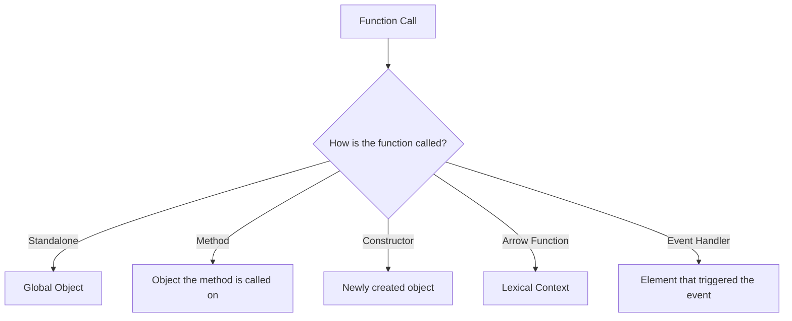

## 25.12 Misusing the `this` Keyword

The `this` keyword in JavaScript is a powerful tool that can lead to elegant solutions when used correctly. However, it is also a common source of confusion and bugs due to its dynamic nature. Understanding how `this` is determined in different contexts is crucial for mastering JavaScript and avoiding common pitfalls. In this section, we'll explore the nuances of `this`, common mistakes, and strategies to manage context effectively.

### Understanding `this` in JavaScript

In JavaScript, `this` is a special keyword that refers to the context in which a function is executed. The value of `this` is determined by how a function is called, not where it is defined. Let's explore the different contexts in which `this` can be used:

1. **Global Context**: In the global execution context (outside of any function), `this` refers to the global object. In browsers, this is typically the `window` object.

    ```javascript
    console.log(this); // In a browser, this logs the window object
    ```

2. **Function Context**: When a function is called as a standalone function, `this` refers to the global object (in non-strict mode) or `undefined` (in strict mode).

    ```javascript
    function showThis() {
        console.log(this);
    }
    showThis(); // Logs the global object or undefined in strict mode
    ```

3. **Method Context**: When a function is called as a method of an object, `this` refers to the object the method is called on.

    ```javascript
    const obj = {
        name: 'JavaScript',
        showThis: function() {
            console.log(this);
        }
    };
    obj.showThis(); // Logs the obj object
    ```

4. **Constructor Context**: When a function is used as a constructor with the `new` keyword, `this` refers to the newly created object.

    ```javascript
    function Person(name) {
        this.name = name;
    }
    const person = new Person('Alice');
    console.log(person.name); // Logs 'Alice'
    ```

5. **Arrow Functions**: Arrow functions do not have their own `this` context. Instead, they inherit `this` from the surrounding lexical context.

    ```javascript
    const obj = {
        name: 'JavaScript',
        showThis: () => {
            console.log(this);
        }
    };
    obj.showThis(); // Logs the global object or undefined in strict mode
    ```

### Common Mistakes with `this`

Misusing `this` often leads to unexpected behaviors and bugs. Let's explore some common mistakes:

#### Losing `this` Context in Callbacks

One of the most common mistakes is losing the `this` context when passing methods as callbacks. When a method is passed as a callback, it loses its original context.

```javascript
const obj = {
    name: 'JavaScript',
    showThis: function() {
        console.log(this.name);
    }
};

setTimeout(obj.showThis, 1000); // Logs undefined
```

In the example above, `setTimeout` calls `obj.showThis` as a standalone function, so `this` refers to the global object, not `obj`.

#### Binding Issues in Event Handlers

Another common mistake is not binding `this` correctly in event handlers. In event handlers, `this` refers to the element that triggered the event, not necessarily the object you expect.

```javascript
function Button(label) {
    this.label = label;
    this.handleClick = function() {
        console.log(this.label);
    };
}

const button = new Button('Click Me');
document.querySelector('button').addEventListener('click', button.handleClick); // Logs undefined
```

In this example, `this` inside `handleClick` refers to the button element, not the `Button` instance.

### Strategies to Preserve `this`

To avoid issues with `this`, you can use several strategies to preserve the correct context:

#### Using `bind()`, `call()`, or `apply()`

The `bind()` method creates a new function with `this` bound to a specified value. The `call()` and `apply()` methods invoke a function with a specified `this` value.

```javascript
const obj = {
    name: 'JavaScript',
    showThis: function() {
        console.log(this.name);
    }
};

setTimeout(obj.showThis.bind(obj), 1000); // Logs 'JavaScript'
```

In the example above, `bind(obj)` ensures that `this` inside `showThis` always refers to `obj`.

#### Employing Arrow Functions

Arrow functions inherit `this` from their surrounding lexical context, making them a great choice for preserving `this`.

```javascript
const obj = {
    name: 'JavaScript',
    showThis: function() {
        setTimeout(() => {
            console.log(this.name);
        }, 1000);
    }
};

obj.showThis(); // Logs 'JavaScript'
```

In this example, the arrow function inside `setTimeout` inherits `this` from `showThis`, which refers to `obj`.

#### Storing Reference to `this` in Variables

Another strategy is to store a reference to `this` in a variable, often named `self` or `that`.

```javascript
const obj = {
    name: 'JavaScript',
    showThis: function() {
        const self = this;
        setTimeout(function() {
            console.log(self.name);
        }, 1000);
    }
};

obj.showThis(); // Logs 'JavaScript'
```

By storing `this` in `self`, you can ensure that the correct context is preserved inside the callback.

### Best Practices to Avoid Confusion with `this`

To avoid confusion and bugs related to `this`, consider the following best practices:

- **Use Arrow Functions for Callbacks**: When possible, use arrow functions for callbacks to avoid losing `this` context.
- **Bind Methods in Constructors**: If you're using classes or constructor functions, bind methods in the constructor to ensure they have the correct `this` context.
- **Be Mindful of Event Handlers**: Remember that `this` in event handlers refers to the element that triggered the event. Use `bind()` or arrow functions if you need a different context.
- **Avoid Using `this` in Global Functions**: In global functions, `this` can be unpredictable. Consider using explicit parameters instead.
- **Use Strict Mode**: In strict mode, `this` is `undefined` in standalone functions, which can help catch errors early.

### Visualizing `this` Context

To better understand how `this` works in different contexts, let's visualize it using a flowchart:



**Figure 1**: Visualizing `this` in different contexts.

### Try It Yourself

Experiment with the following code examples to deepen your understanding of `this`. Try modifying the examples to see how `this` behaves in different scenarios.

```javascript
// Example 1: Losing `this` context
const obj = {
    name: 'JavaScript',
    showThis: function() {
        console.log(this.name);
    }
};

setTimeout(obj.showThis, 1000); // Try using bind() to fix this

// Example 2: Using arrow functions
const obj2 = {
    name: 'JavaScript',
    showThis: function() {
        setTimeout(() => {
            console.log(this.name);
        }, 1000);
    }
};

obj2.showThis(); // Try changing the arrow function to a regular function
```

### Knowledge Check

- What does `this` refer to in a standalone function in non-strict mode?
- How can you preserve `this` context in a callback function?
- What is the difference between `bind()`, `call()`, and `apply()`?
- How do arrow functions handle `this` differently from regular functions?

### Summary

Understanding and managing `this` is crucial for writing robust JavaScript code. By recognizing common pitfalls and employing strategies to preserve context, you can avoid bugs and unexpected behaviors. Remember, mastering `this` is an essential step in your journey to becoming a proficient JavaScript developer. Keep experimenting, stay curious, and enjoy the journey!

## Quiz: Mastering the `this` Keyword in JavaScript



### What does `this` refer to in a standalone function in non-strict mode?

- [x] The global object
- [ ] The function itself
- [ ] `undefined`
- [ ] The window object

> **Explanation:** In non-strict mode, `this` in a standalone function refers to the global object.

### How can you preserve `this` context in a callback function?

- [x] Use the `bind()` method
- [ ] Use the `call()` method
- [ ] Use the `apply()` method
- [ ] Use a regular function

> **Explanation:** The `bind()` method creates a new function with `this` bound to a specified value, preserving the context.

### What is the difference between `bind()`, `call()`, and `apply()`?

- [x] `bind()` returns a new function, `call()` and `apply()` invoke the function immediately
- [ ] `bind()` and `call()` are the same, `apply()` is different
- [ ] `bind()` and `apply()` are the same, `call()` is different
- [ ] All three are the same

> **Explanation:** `bind()` returns a new function with a bound `this`, while `call()` and `apply()` invoke the function immediately with a specified `this`.

### How do arrow functions handle `this` differently from regular functions?

- [x] Arrow functions inherit `this` from their lexical context
- [ ] Arrow functions have their own `this`
- [ ] Arrow functions do not use `this`
- [ ] Arrow functions always refer to the global object

> **Explanation:** Arrow functions do not have their own `this` and inherit it from the surrounding lexical context.

### What happens to `this` in a method when passed as a callback?

- [x] It loses its original context
- [ ] It retains its original context
- [ ] It becomes `undefined`
- [ ] It refers to the global object

> **Explanation:** When a method is passed as a callback, it loses its original context, and `this` may not refer to the expected object.

### Which method can be used to explicitly set `this` for a function call?

- [x] `call()`
- [ ] `bind()`
- [ ] `apply()`
- [ ] `setThis()`

> **Explanation:** The `call()` method can be used to invoke a function with a specified `this` value.

### In strict mode, what does `this` refer to in a standalone function?

- [x] `undefined`
- [ ] The global object
- [ ] The function itself
- [ ] The window object

> **Explanation:** In strict mode, `this` in a standalone function is `undefined`.

### How can you ensure `this` refers to the correct object in an event handler?

- [x] Use `bind()` or an arrow function
- [ ] Use a regular function
- [ ] Use `apply()`
- [ ] Use `call()`

> **Explanation:** Using `bind()` or an arrow function ensures `this` refers to the correct object in an event handler.

### What is a common variable name used to store a reference to `this`?

- [x] `self`
- [ ] `that`
- [ ] `context`
- [ ] `reference`

> **Explanation:** `self` is a common variable name used to store a reference to `this`.

### True or False: Arrow functions have their own `this` context.

- [ ] True
- [x] False

> **Explanation:** False. Arrow functions do not have their own `this` context; they inherit it from the surrounding lexical context.



Remember, mastering the `this` keyword is a journey. Keep practicing, and you'll find yourself writing more effective and bug-free JavaScript code. Happy coding!
