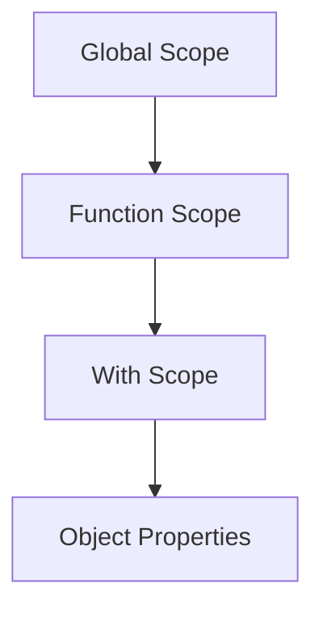

## 25.13 Using `eval` and `with` Statements

JavaScript is a powerful and flexible language, but with great power comes great responsibility. Two features of JavaScript that exemplify this are the `eval` and `with` statements. While they offer certain capabilities, they are generally considered anti-patterns due to the security risks, performance issues, and debugging challenges they introduce. In this section, we'll explore what these statements do, why they are problematic, and how you can avoid them in favor of safer, more maintainable code patterns.

### Understanding `eval` and `with`

#### What is `eval`?

The `eval` function in JavaScript takes a string as an argument and executes it as code within the current execution context. This means that `eval` can dynamically execute code that is constructed at runtime, which can be both powerful and dangerous.

```javascript
// Example of using eval
const code = "console.log('Hello, World!')";
eval(code); // Outputs: Hello, World!
```

#### What is `with`?

The `with` statement extends the scope chain for a statement. It allows you to add properties of an object to the scope chain, making it easier to access them without repeatedly referencing the object.

```javascript
// Example of using with
const obj = { a: 1, b: 2 };
with (obj) {
  console.log(a); // Outputs: 1
  console.log(b); // Outputs: 2
}
```

### Security Vulnerabilities of `eval`

Using `eval` poses significant security risks, primarily because it can execute arbitrary code. If user input is passed to `eval`, it can lead to code injection attacks, where malicious users execute harmful scripts.

#### Example of Security Risk

```javascript
// Dangerous use of eval with user input
const userInput = "alert('Hacked!')";
eval(userInput); // Executes the alert function
```

In this example, if `userInput` comes from an untrusted source, it could execute any JavaScript code, potentially compromising the security of the application.

### Performance Overheads and Debugging Difficulties

#### Performance Issues

`eval` can degrade performance because the JavaScript engine cannot optimize code that is dynamically generated. The engine must re-parse and re-compile the code every time `eval` is called, which is computationally expensive.

#### Debugging Challenges

Code executed via `eval` is harder to debug. Errors in dynamically generated code are not easily traceable, and stack traces may not provide meaningful information. This makes it difficult to identify and fix issues.

### Problems with `with`

The `with` statement can lead to ambiguous code, making it difficult to determine which scope a variable belongs to. This ambiguity can result in unexpected behavior and bugs that are hard to track down.

#### Example of Ambiguity

```javascript
const obj = { a: 1 };
const a = 2;

with (obj) {
  console.log(a); // Outputs: 1, but could be confusing
}
```

In this example, it might not be immediately clear whether `a` refers to `obj.a` or the global `a`.

### Alternatives and Best Practices

#### Avoiding Dynamic Code Execution

Instead of using `eval`, consider using safer alternatives such as:

- **Function Constructors**: Use `new Function()` to create functions dynamically, which is safer than `eval` because it does not have access to the local scope.

```javascript
// Using Function constructor
const func = new Function('a', 'b', 'return a + b');
console.log(func(1, 2)); // Outputs: 3
```

- **JSON Parsing**: For parsing JSON data, use `JSON.parse()` instead of `eval`.

```javascript
// Safe JSON parsing
const jsonString = '{"name": "John", "age": 30}';
const data = JSON.parse(jsonString);
console.log(data.name); // Outputs: John
```

#### Using Object Property Access Instead of `with`

Instead of using `with`, access object properties directly or use destructuring to simplify the code.

```javascript
// Direct property access
const obj = { a: 1, b: 2 };
console.log(obj.a); // Outputs: 1
console.log(obj.b); // Outputs: 2

// Using destructuring
const { a, b } = obj;
console.log(a); // Outputs: 1
console.log(b); // Outputs: 2
```

### Encouraging Safer, More Maintainable Code Patterns

By avoiding `eval` and `with`, you can write code that is more secure, performant, and easier to maintain. Embrace modern JavaScript features and best practices to achieve the same functionality without the drawbacks.

### Visualizing the Scope Chain with `with`

To better understand the impact of `with` on the scope chain, consider the following diagram:



**Figure 1**: The `with` statement introduces an additional scope layer, which can lead to ambiguity and confusion.

### References and Links

- [MDN Web Docs on `eval`](https://developer.mozilla.org/en-US/docs/Web/JavaScript/Reference/Global_Objects/eval)
- [MDN Web Docs on `with`](https://developer.mozilla.org/en-US/docs/Web/JavaScript/Reference/Statements/with)
- [JavaScript Security Best Practices](https://owasp.org/www-community/attacks/JavaScript_injection)

### Knowledge Check

- What are the primary risks associated with using `eval`?
- How does the `with` statement affect the scope chain?
- What are some alternatives to using `eval` for dynamic code execution?
- Why is it important to avoid using `with` in modern JavaScript?

### Exercises

1. Refactor the following code to avoid using `eval`:

```javascript
const expression = "3 + 4";
console.log(eval(expression)); // Outputs: 7
```

2. Rewrite the following code to eliminate the use of `with`:

```javascript
const obj = { x: 10, y: 20 };
with (obj) {
  console.log(x + y); // Outputs: 30
}
```

### Summary

In this section, we've explored the pitfalls of using `eval` and `with` statements in JavaScript. These features, while powerful, introduce significant security and performance issues, making them unsuitable for modern web development. By understanding the risks and adopting safer alternatives, you can write more secure, efficient, and maintainable JavaScript code. Remember, this is just the beginning. As you progress, you'll build more complex and interactive web applications. Keep experimenting, stay curious, and enjoy the journey!

## Mastering JavaScript: Avoiding `eval` and `with` Pitfalls



### What is a primary risk of using `eval` in JavaScript?

- [x] Security vulnerabilities
- [ ] Improved performance
- [ ] Enhanced readability
- [ ] Simplified debugging

> **Explanation:** `eval` can execute arbitrary code, leading to security vulnerabilities.

### How does the `with` statement affect the scope chain?

- [x] It adds an additional scope layer
- [ ] It removes the global scope
- [ ] It simplifies the scope chain
- [ ] It has no effect on the scope chain

> **Explanation:** The `with` statement introduces an additional scope layer, which can lead to ambiguity.

### What is a safer alternative to `eval` for parsing JSON data?

- [x] JSON.parse()
- [ ] new Function()
- [ ] eval()
- [ ] JSON.stringify()

> **Explanation:** `JSON.parse()` is a safe method for parsing JSON data.

### Why is `eval` considered a performance issue?

- [x] It requires re-parsing and re-compiling code
- [ ] It optimizes code execution
- [ ] It reduces memory usage
- [ ] It speeds up the JavaScript engine

> **Explanation:** `eval` requires the JavaScript engine to re-parse and re-compile code, which is computationally expensive.

### What is a common debugging challenge with `eval`?

- [x] Errors are not easily traceable
- [ ] It provides detailed stack traces
- [ ] It simplifies error handling
- [ ] It enhances code readability

> **Explanation:** Errors in dynamically generated code via `eval` are not easily traceable.

### Which statement is true about the `with` statement?

- [x] It can lead to ambiguous code
- [ ] It improves code clarity
- [ ] It enhances performance
- [ ] It simplifies debugging

> **Explanation:** The `with` statement can lead to ambiguous code, making it difficult to determine variable scope.

### What is a recommended practice instead of using `with`?

- [x] Direct object property access
- [ ] Using `eval`
- [ ] Adding more global variables
- [ ] Using nested `with` statements

> **Explanation:** Direct object property access is a safer and clearer alternative to using `with`.

### How can you dynamically create functions safely?

- [x] Using new Function()
- [ ] Using eval()
- [ ] Using with()
- [ ] Using JSON.parse()

> **Explanation:** `new Function()` can be used to create functions dynamically without accessing the local scope.

### What is a key takeaway regarding `eval` and `with`?

- [x] Avoid using them for more secure and maintainable code
- [ ] Use them to enhance performance
- [ ] They are essential for modern JavaScript
- [ ] They simplify code debugging

> **Explanation:** Avoiding `eval` and `with` leads to more secure and maintainable code.

### True or False: `eval` can execute code with access to the local scope.

- [x] True
- [ ] False

> **Explanation:** `eval` executes code within the current execution context, giving it access to the local scope.


