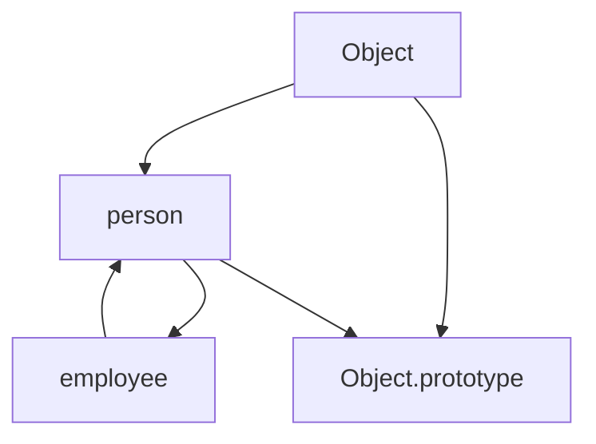

## 25.14 Polluting the Prototype Chain

JavaScript is a powerful and flexible language that allows developers to extend its built-in objects by modifying their prototypes. While this feature can be useful in certain scenarios, it also poses significant risks, especially when it comes to the concept of "polluting the prototype chain." In this section, we will delve into what the prototype chain is, the dangers of modifying native prototypes, and best practices to avoid these pitfalls.

### Understanding the Prototype Chain

In JavaScript, every object has a prototype, which is another object from which it inherits properties and methods. This forms a chain known as the prototype chain. When you access a property or method on an object, JavaScript first looks for it on the object itself. If it doesn't find it, it looks up the prototype chain until it either finds the property or reaches the end of the chain.

#### Example of the Prototype Chain

```javascript
// Define a simple object
const person = {
  name: 'Alice',
  greet() {
    console.log(`Hello, my name is ${this.name}`);
  }
};

// Create another object that inherits from person
const employee = Object.create(person);
employee.name = 'Bob';
employee.job = 'Developer';

// Access properties and methods
employee.greet(); // Output: Hello, my name is Bob
```

In this example, `employee` inherits the `greet` method from `person` through the prototype chain.

### Modifying Native Prototypes

JavaScript allows you to modify the prototypes of its built-in objects, such as `Array`, `Object`, and `String`. While this might seem like a convenient way to add new functionality, it can lead to serious issues.

#### Example of Modifying Native Prototypes

```javascript
// Adding a method to Array.prototype
Array.prototype.last = function() {
  return this[this.length - 1];
};

// Usage
const numbers = [1, 2, 3];
console.log(numbers.last()); // Output: 3
```

While this example works, it introduces several risks.

### Risks of Prototype Pollution

1. **Conflicts with Other Code and Libraries**: Modifying native prototypes can lead to conflicts if other code or libraries expect the prototypes to behave in a certain way. If two pieces of code modify the same prototype, they can interfere with each other, leading to unpredictable behavior.

2. **Breaking Future Compatibility**: JavaScript is an evolving language, and new methods are regularly added to its built-in objects. If you add a method to a native prototype that is later added to the language, your code could break or behave unexpectedly.

3. **Performance Issues**: Modifying prototypes can also have performance implications. JavaScript engines optimize for the default behavior of built-in objects, and changes to their prototypes can interfere with these optimizations.

### Best Practices to Avoid Prototype Pollution

To avoid the pitfalls of prototype pollution, consider the following best practices:

1. **Avoid Extending Native Prototypes**: As a general rule, avoid modifying the prototypes of built-in objects. Instead, use other techniques to achieve the desired functionality.

2. **Use Utility Libraries**: Libraries like [Lodash](https://lodash.com/) provide a wealth of utility functions that can be used without modifying native prototypes. These libraries are well-tested and widely used, reducing the risk of conflicts.

3. **Employ Composition Over Inheritance**: Instead of relying on inheritance and modifying prototypes, use composition to build objects with the desired functionality. This approach is more flexible and less prone to conflicts.

#### Example of Using Lodash

```javascript
// Using Lodash to get the last element of an array
const _ = require('lodash');
const numbers = [1, 2, 3];
console.log(_.last(numbers)); // Output: 3
```

### Visualizing the Prototype Chain

To better understand how the prototype chain works, let's visualize it using a diagram.



**Figure 1**: This diagram illustrates the prototype chain for the `employee` object, which inherits from `person`, which in turn inherits from `Object`.

### Knowledge Check

- **What is the prototype chain in JavaScript?**
- **Why is modifying native prototypes considered risky?**
- **What are some alternatives to modifying native prototypes?**

### Exercises

1. **Identify Prototype Pollution**: Review a piece of JavaScript code and identify any instances of prototype pollution. Suggest alternative approaches to achieve the same functionality without modifying native prototypes.

2. **Refactor with Lodash**: Take a piece of code that modifies a native prototype and refactor it to use Lodash or another utility library instead.

### Summary

In this section, we've explored the concept of the prototype chain in JavaScript and the dangers of polluting it by modifying native prototypes. By understanding these risks and following best practices, you can write more robust and maintainable JavaScript code. Remember, the key is to avoid modifying native prototypes and to use composition and utility libraries to achieve the desired functionality.

### Embrace the Journey

Remember, mastering JavaScript and its design patterns is a journey. By learning to avoid common pitfalls like prototype pollution, you're taking an important step towards becoming a more skilled and effective developer. Keep experimenting, stay curious, and enjoy the journey!

## Quiz: Understanding Prototype Chain Pollution



### What is the prototype chain in JavaScript?

- [x] A series of linked objects from which properties and methods are inherited.
- [ ] A method to create new objects.
- [ ] A function that modifies object properties.
- [ ] A way to optimize JavaScript code.

> **Explanation:** The prototype chain is a series of linked objects from which properties and methods are inherited in JavaScript.

### Why is modifying native prototypes risky?

- [x] It can lead to conflicts with other code and libraries.
- [x] It can break future compatibility.
- [ ] It improves performance.
- [ ] It is a recommended practice.

> **Explanation:** Modifying native prototypes can lead to conflicts with other code and libraries and break future compatibility.

### What is a safer alternative to modifying native prototypes?

- [x] Using utility libraries like Lodash.
- [ ] Modifying the global object.
- [ ] Using `eval` to add methods.
- [ ] Directly modifying the DOM.

> **Explanation:** Using utility libraries like Lodash is a safer alternative to modifying native prototypes.

### What is an example of prototype pollution?

- [x] Adding a method to `Array.prototype`.
- [ ] Creating a new object with `Object.create()`.
- [ ] Using a closure to encapsulate data.
- [ ] Declaring a variable with `let`.

> **Explanation:** Adding a method to `Array.prototype` is an example of prototype pollution.

### What is a benefit of using composition over inheritance?

- [x] It reduces the risk of conflicts.
- [x] It provides more flexibility.
- [ ] It requires modifying native prototypes.
- [ ] It is less efficient.

> **Explanation:** Composition reduces the risk of conflicts and provides more flexibility compared to inheritance.

### Which library is recommended for utility functions without modifying prototypes?

- [x] Lodash
- [ ] jQuery
- [ ] React
- [ ] Angular

> **Explanation:** Lodash is recommended for utility functions without modifying prototypes.

### What is a potential consequence of prototype pollution?

- [x] Unpredictable behavior in code.
- [ ] Improved code readability.
- [ ] Faster execution time.
- [ ] Increased security.

> **Explanation:** Prototype pollution can lead to unpredictable behavior in code.

### How can prototype pollution affect performance?

- [x] It can interfere with JavaScript engine optimizations.
- [ ] It speeds up code execution.
- [ ] It has no effect on performance.
- [ ] It reduces memory usage.

> **Explanation:** Prototype pollution can interfere with JavaScript engine optimizations, affecting performance.

### What is the prototype chain used for?

- [x] Inheriting properties and methods.
- [ ] Declaring variables.
- [ ] Executing functions.
- [ ] Modifying the DOM.

> **Explanation:** The prototype chain is used for inheriting properties and methods in JavaScript.

### True or False: Modifying native prototypes is a best practice in JavaScript.

- [ ] True
- [x] False

> **Explanation:** Modifying native prototypes is not a best practice in JavaScript due to the risks of conflicts and future compatibility issues.


