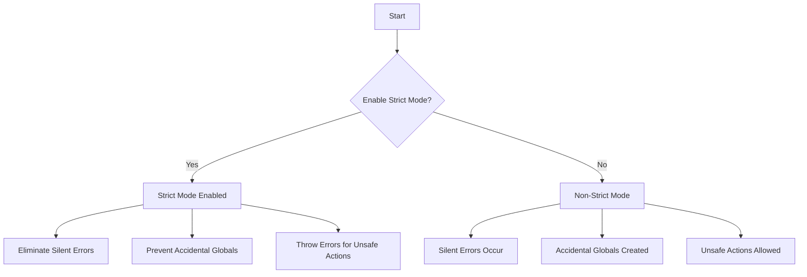

## 25.15 Not Using Strict Mode

JavaScript's strict mode is a powerful feature that enhances the language's error-checking capabilities, leading to more robust and maintainable code. In this section, we will delve into what strict mode is, how to enable it, and the significant changes it brings to JavaScript's behavior. We'll also explore the pitfalls of not using strict mode and provide examples to illustrate these concepts.

### What is Strict Mode?

Strict mode is a way to opt into a restricted variant of JavaScript, introduced in ECMAScript 5. It intentionally changes the semantics of the language to eliminate some of the silent errors and improve the overall performance of your code. By enforcing stricter parsing and error handling, strict mode helps developers write cleaner and more reliable JavaScript code.

#### Enabling Strict Mode

To enable strict mode, simply include the string `'use strict';` at the beginning of your JavaScript file or function. This directive tells the JavaScript engine to execute the code in strict mode.

```javascript
// Enabling strict mode for the entire script
'use strict';

function exampleFunction() {
    // Function code here
}

// Enabling strict mode for a specific function
function anotherExample() {
    'use strict';
    // Function code here
}
```

### Changes in Behavior Under Strict Mode

Strict mode introduces several changes to JavaScript's behavior, making it more predictable and secure. Let's explore some of these changes:

#### Eliminating Silent Errors

One of the primary benefits of strict mode is its ability to eliminate silent errors. In non-strict mode, certain errors fail silently, making them difficult to detect and debug. Strict mode throws errors for these issues, allowing developers to catch and fix them early.

**Example: Assigning to a Non-Writable Property**

In non-strict mode, assigning a value to a non-writable property fails silently. In strict mode, it throws an error.

```javascript
'use strict';

const obj = {};
Object.defineProperty(obj, 'prop', {
    value: 42,
    writable: false
});

obj.prop = 17; // Throws a TypeError in strict mode
```

#### Preventing Accidental Globals

Strict mode prevents the accidental creation of global variables, a common source of bugs in JavaScript. In non-strict mode, assigning a value to an undeclared variable creates a global variable. In strict mode, this results in a reference error.

**Example: Accidental Global Variable**

```javascript
'use strict';

function createGlobal() {
    undeclaredVariable = 'This will throw an error'; // ReferenceError in strict mode
}

createGlobal();
```

#### Throwing Errors for Unsafe Actions

Strict mode throws errors for actions that are considered unsafe or potentially problematic. This includes attempting to delete undeletable properties, using `eval` in ways that affect scope, and more.

**Example: Deleting Undeletable Properties**

```javascript
'use strict';

delete Object.prototype; // Throws a TypeError in strict mode
```

### Code Examples: Behavior Differences Without Strict Mode

To understand the impact of not using strict mode, let's look at some examples where code behaves differently without it.

#### Example 1: Silent Assignment Failures

```javascript
// Non-strict mode
const obj = {};
Object.defineProperty(obj, 'prop', {
    value: 42,
    writable: false
});

obj.prop = 17; // Fails silently, no error thrown
console.log(obj.prop); // Outputs: 42
```

#### Example 2: Accidental Globals

```javascript
// Non-strict mode
function createGlobal() {
    undeclaredVariable = 'This becomes a global variable';
}

createGlobal();
console.log(undeclaredVariable); // Outputs: This becomes a global variable
```

### Encouraging the Use of Strict Mode

Using strict mode is a best practice for modern JavaScript development. It helps catch errors early, prevents common pitfalls, and enforces a cleaner coding style. By adopting strict mode, developers can improve the quality and maintainability of their codebases.

### Visualizing Strict Mode's Impact

To better understand the impact of strict mode, let's visualize how it affects variable scope and error handling.



**Diagram Description:** This flowchart illustrates the decision-making process when enabling strict mode and the resulting changes in behavior. Enabling strict mode leads to eliminating silent errors, preventing accidental globals, and throwing errors for unsafe actions. Without strict mode, these issues persist.

### References and Further Reading

- [MDN Web Docs: Strict mode](https://developer.mozilla.org/en-US/docs/Web/JavaScript/Reference/Strict_mode)
- [W3Schools: JavaScript Strict Mode](https://www.w3schools.com/js/js_strict.asp)

### Knowledge Check

- What is strict mode in JavaScript, and how is it enabled?
- How does strict mode help eliminate silent errors?
- What are the consequences of not using strict mode in terms of global variables?
- Can you provide an example of code that behaves differently with and without strict mode?

### Exercises

1. **Exercise 1:** Modify a piece of JavaScript code to enable strict mode and observe the changes in behavior. Identify any errors that strict mode helps catch.
2. **Exercise 2:** Write a function that attempts to create a global variable without declaring it. Enable strict mode and observe the error thrown.

### Embrace the Journey

Remember, adopting strict mode is just the beginning of writing better JavaScript code. As you continue to explore and experiment, you'll discover more ways to enhance your coding practices. Stay curious, keep learning, and enjoy the journey of mastering JavaScript!

## Quiz: Understanding JavaScript Strict Mode



### What is the primary purpose of JavaScript's strict mode?

- [x] To enforce stricter parsing and error handling
- [ ] To make JavaScript code run faster
- [ ] To add new syntax to JavaScript
- [ ] To enable backward compatibility with older browsers

> **Explanation:** The primary purpose of strict mode is to enforce stricter parsing and error handling, helping developers write cleaner and more reliable code.

### How do you enable strict mode in a JavaScript file?

- [x] By adding `'use strict';` at the beginning of the file
- [ ] By using a special keyword `strict`
- [ ] By setting a configuration in the browser
- [ ] By using a command-line argument

> **Explanation:** Strict mode is enabled by adding the string `'use strict';` at the beginning of a JavaScript file or function.

### What happens when you assign a value to an undeclared variable in strict mode?

- [x] A ReferenceError is thrown
- [ ] The variable is created as a global variable
- [ ] The assignment is ignored
- [ ] A warning is logged to the console

> **Explanation:** In strict mode, assigning a value to an undeclared variable results in a ReferenceError, preventing accidental global variable creation.

### Which of the following actions will throw an error in strict mode?

- [x] Deleting an undeletable property
- [ ] Using a variable before declaring it
- [ ] Creating a function without a return statement
- [ ] Using a for loop without an initializer

> **Explanation:** In strict mode, attempting to delete an undeletable property will throw a TypeError.

### What is the effect of strict mode on silent errors?

- [x] Silent errors are eliminated
- [ ] Silent errors are logged to the console
- [ ] Silent errors are converted to warnings
- [ ] Silent errors remain unchanged

> **Explanation:** Strict mode eliminates silent errors by throwing exceptions, allowing developers to catch and fix them early.

### How does strict mode affect the `this` keyword in functions?

- [x] `this` is `undefined` in functions not called as methods
- [ ] `this` is always the global object
- [ ] `this` is always the function itself
- [ ] `this` is always the window object

> **Explanation:** In strict mode, `this` is `undefined` in functions not called as methods, preventing unintended references to the global object.

### Which of the following is a benefit of using strict mode?

- [x] Improved code quality and maintainability
- [ ] Faster execution of JavaScript code
- [ ] Automatic error correction
- [ ] Compatibility with older JavaScript versions

> **Explanation:** Strict mode improves code quality and maintainability by enforcing stricter error checking and preventing common pitfalls.

### Can strict mode be enabled for specific functions only?

- [x] Yes, by adding `'use strict';` inside the function
- [ ] No, it must be enabled for the entire script
- [ ] Yes, by using a special function keyword
- [ ] No, it can only be enabled globally

> **Explanation:** Strict mode can be enabled for specific functions by adding `'use strict';` inside the function body.

### What is the impact of strict mode on the `eval` function?

- [x] `eval` cannot introduce new variables into the surrounding scope
- [ ] `eval` runs faster in strict mode
- [ ] `eval` is disabled in strict mode
- [ ] `eval` can only be used in global scope

> **Explanation:** In strict mode, `eval` cannot introduce new variables into the surrounding scope, preventing scope pollution.

### True or False: Strict mode is optional but recommended for better JavaScript development.

- [x] True
- [ ] False

> **Explanation:** Strict mode is optional but highly recommended as it helps catch errors early and enforces better coding practices.


