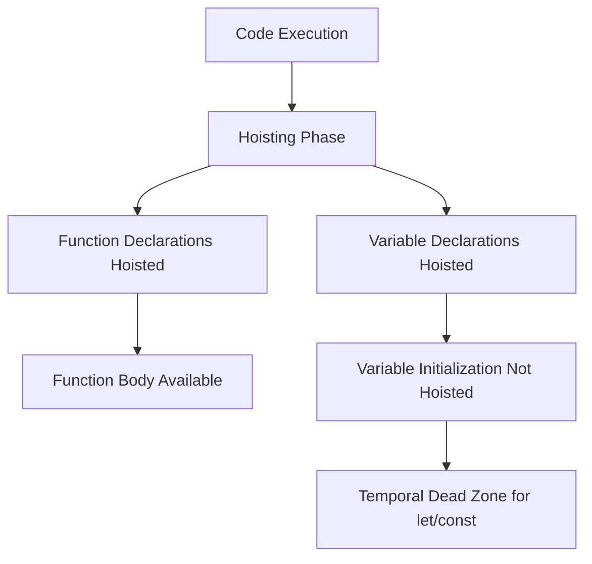

## 25.16 Common Mistakes with Hoisting

Hoisting is a JavaScript mechanism where variables and function declarations are moved to the top of their containing scope during the compile phase. This behavior can lead to unexpected results if not properly understood. In this section, we will explore how hoisting works, the differences between `var`, `let`, and `const`, common mistakes developers make, and best practices to avoid these pitfalls.

### Understanding Hoisting

Hoisting is a concept that many JavaScript developers encounter early in their learning journey. It refers to the process by which the JavaScript interpreter moves variable and function declarations to the top of their containing scope before code execution. This means that you can use variables and functions before they are declared in the code.

#### Function Hoisting

Functions in JavaScript are hoisted to the top of their scope. This allows you to call a function before it is defined in the code.

```javascript
// Function call before declaration
greet();

function greet() {
    console.log("Hello, World!");
}
```

In the example above, the function `greet` is hoisted, allowing it to be called before its declaration.

#### Variable Hoisting

Variables declared with `var` are hoisted to the top of their scope, but only the declaration is hoisted, not the initialization.

```javascript
console.log(message); // undefined
var message = "Hello, World!";
```

In this example, the declaration `var message` is hoisted, but the initialization `message = "Hello, World!"` is not. Therefore, `console.log(message)` outputs `undefined`.

### Differences Between `var`, `let`, and `const`

Understanding the differences in hoisting behavior between `var`, `let`, and `const` is crucial for avoiding common pitfalls.

#### `var` Hoisting

Variables declared with `var` are hoisted to the top of their function or global scope. This can lead to unexpected behavior, especially in loops or conditional statements.

```javascript
function example() {
    console.log(x); // undefined
    var x = 5;
    console.log(x); // 5
}
```

#### `let` and `const` Hoisting

Variables declared with `let` and `const` are also hoisted, but they are not initialized. They remain in a "temporal dead zone" (TDZ) until the declaration is encountered in the code.

```javascript
function example() {
    console.log(y); // ReferenceError: Cannot access 'y' before initialization
    let y = 10;
}
```

In this example, accessing `y` before its declaration results in a `ReferenceError`.

### Common Mistakes with Hoisting

#### Mistake 1: Assuming Initialization is Hoisted

A common mistake is assuming that both declaration and initialization are hoisted. This can lead to bugs when using `var`.

```javascript
function test() {
    console.log(a); // undefined
    var a = 10;
    console.log(a); // 10
}
```

#### Mistake 2: Misunderstanding Temporal Dead Zone

The temporal dead zone (TDZ) is a period during which a variable is hoisted but not yet initialized. Accessing the variable during this period results in a `ReferenceError`.

```javascript
function check() {
    console.log(b); // ReferenceError
    let b = 20;
}
```

#### Mistake 3: Using `var` in Loops

Using `var` in loops can lead to unexpected behavior due to hoisting and function scope.

```javascript
for (var i = 0; i < 3; i++) {
    setTimeout(() => console.log(i), 1000); // 3, 3, 3
}
```

In this example, `var i` is hoisted and shared across all iterations, resulting in `3` being logged three times.

### Best Practices to Avoid Hoisting Issues

#### Declare Variables at the Top of Their Scope

To avoid confusion and potential bugs, declare all variables at the top of their scope. This makes the code more predictable and easier to read.

```javascript
function example() {
    var x;
    console.log(x); // undefined
    x = 5;
    console.log(x); // 5
}
```

#### Use `let` and `const` Instead of `var`

Prefer `let` and `const` over `var` to avoid issues related to hoisting and scope. `let` and `const` provide block-level scope, reducing the risk of accidental hoisting.

```javascript
function loopExample() {
    for (let i = 0; i < 3; i++) {
        setTimeout(() => console.log(i), 1000); // 0, 1, 2
    }
}
```

#### Understand and Avoid the Temporal Dead Zone

Be aware of the temporal dead zone when using `let` and `const`. Ensure variables are not accessed before their declaration.

```javascript
function safeAccess() {
    let z;
    console.log(z); // undefined
    z = 30;
    console.log(z); // 30
}
```

### Importance of Code Readability and Predictability

Maintaining code readability and predictability is essential for effective software development. By understanding hoisting and following best practices, you can write code that is easier to understand and maintain.

- **Consistency**: Declare variables at the beginning of their scope to make the code more consistent.
- **Clarity**: Use `let` and `const` to clearly indicate the intended use of variables.
- **Avoid Errors**: Understanding hoisting helps avoid common errors and makes debugging easier.

### Visualizing Hoisting

To better understand hoisting, let's visualize how JavaScript handles variable and function declarations.



**Diagram Description**: This diagram illustrates the hoisting process in JavaScript. During the hoisting phase, function declarations and variable declarations are moved to the top of their scope. However, variable initializations are not hoisted, and `let`/`const` variables remain in a temporal dead zone until initialized.

### Try It Yourself

Experiment with the following code examples to deepen your understanding of hoisting. Try modifying the examples to see how changes affect the output.

```javascript
// Example 1: Function Hoisting
console.log(sayHello()); // "Hello, World!"

function sayHello() {
    return "Hello, World!";
}

// Example 2: Variable Hoisting with var
console.log(num); // undefined
var num = 42;
console.log(num); // 42

// Example 3: Temporal Dead Zone with let
try {
    console.log(value); // ReferenceError
    let value = 100;
} catch (error) {
    console.error(error.message);
}
```

### References and Further Reading

- [MDN Web Docs: Hoisting](https://developer.mozilla.org/en-US/docs/Glossary/Hoisting)
- [JavaScript.info: Hoisting](https://javascript.info/var)
- [W3Schools: JavaScript Hoisting](https://www.w3schools.com/js/js_hoisting.asp)

### Knowledge Check

- What is hoisting in JavaScript, and how does it affect variable and function declarations?
- How do `var`, `let`, and `const` differ in terms of hoisting behavior?
- What is the temporal dead zone, and how can it lead to errors?
- Why is it important to declare variables at the top of their scope?
- How can using `let` and `const` improve code readability and predictability?

### Summary

In this section, we explored the concept of hoisting in JavaScript, common mistakes developers make, and best practices to avoid these pitfalls. By understanding how hoisting works and following best practices, you can write more predictable and maintainable code. Remember, this is just the beginning. As you progress, you'll build more complex and interactive web applications. Keep experimenting, stay curious, and enjoy the journey!

## Quiz: Mastering Hoisting in JavaScript



### What is hoisting in JavaScript?

- [x] The process of moving variable and function declarations to the top of their scope during the compile phase.
- [ ] The process of optimizing code for performance.
- [ ] The process of converting JavaScript code to machine code.
- [ ] The process of managing memory allocation in JavaScript.

> **Explanation:** Hoisting is the process by which JavaScript moves variable and function declarations to the top of their containing scope during the compile phase.

### How does hoisting affect function declarations?

- [x] Function declarations are hoisted, allowing them to be called before they are defined.
- [ ] Function declarations are not hoisted, so they must be defined before they are called.
- [ ] Function declarations are partially hoisted, only the name is hoisted.
- [ ] Function declarations are hoisted only in strict mode.

> **Explanation:** Function declarations are fully hoisted, meaning they can be called before they are defined in the code.

### What is the temporal dead zone?

- [x] The period during which a `let` or `const` variable is hoisted but not yet initialized.
- [ ] The period during which a `var` variable is hoisted but not yet initialized.
- [ ] The period during which a function is hoisted but not yet defined.
- [ ] The period during which a variable is not accessible due to scope limitations.

> **Explanation:** The temporal dead zone is the period during which a `let` or `const` variable is hoisted but not yet initialized, leading to a `ReferenceError` if accessed.

### Which variable declaration keyword is block-scoped and prevents hoisting issues?

- [x] `let`
- [ ] `var`
- [ ] `function`
- [ ] `global`

> **Explanation:** `let` is block-scoped and helps prevent hoisting issues by keeping the variable within its block scope.

### What is a common mistake when using `var` in loops?

- [x] Assuming each iteration has its own scope, leading to unexpected behavior.
- [ ] Assuming `var` is block-scoped, leading to errors.
- [ ] Assuming `var` is not hoisted, leading to undefined variables.
- [ ] Assuming `var` is initialized before the loop starts.

> **Explanation:** A common mistake is assuming that `var` is block-scoped in loops, which can lead to unexpected behavior as `var` is function-scoped.

### How can you avoid hoisting issues in JavaScript?

- [x] Declare variables at the top of their scope.
- [x] Use `let` and `const` instead of `var`.
- [ ] Use `var` for all variable declarations.
- [ ] Avoid using functions.

> **Explanation:** Declaring variables at the top of their scope and using `let` and `const` instead of `var` can help avoid hoisting issues.

### What happens if you access a `let` variable before its declaration?

- [x] A `ReferenceError` is thrown.
- [ ] The variable is `undefined`.
- [ ] The variable is `null`.
- [ ] The variable is initialized with a default value.

> **Explanation:** Accessing a `let` variable before its declaration results in a `ReferenceError` due to the temporal dead zone.

### Why is it important to understand hoisting?

- [x] To write predictable and maintainable code.
- [ ] To optimize code for performance.
- [ ] To manage memory allocation.
- [ ] To convert JavaScript code to machine code.

> **Explanation:** Understanding hoisting is important for writing predictable and maintainable code, as it affects how variables and functions are accessed.

### Which of the following is true about `const` declarations?

- [x] `const` declarations are block-scoped and must be initialized at the time of declaration.
- [ ] `const` declarations are function-scoped and can be initialized later.
- [ ] `const` declarations are not hoisted.
- [ ] `const` declarations are mutable.

> **Explanation:** `const` declarations are block-scoped, must be initialized at the time of declaration, and are immutable.

### True or False: Variable initializations are hoisted in JavaScript.

- [ ] True
- [x] False

> **Explanation:** False. Only variable declarations are hoisted, not the initializations.


