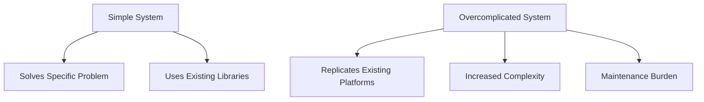

## 25.17 The Inner Platform Effect

In the realm of software development, the pursuit of creating efficient and innovative solutions can sometimes lead developers down a path where they inadvertently replicate existing systems or platforms. This phenomenon, known as the **Inner Platform Effect**, is an anti-pattern that results in overcomplicated systems that mimic the functionality of existing platforms or languages. In this section, we will delve into the origins of the inner platform effect, explore examples of its occurrence, discuss its drawbacks, and provide guidance on how to avoid falling into this trap.

### Understanding the Inner Platform Effect

The inner platform effect occurs when developers, often with the best intentions, create systems that are overly complex and attempt to replicate the capabilities of existing platforms or languages. This can happen when developers are not fully aware of the tools and libraries available to them, or when they believe they can create a more tailored solution by building from scratch. However, this approach often leads to systems that are difficult to maintain, understand, and extend.

#### Origins of the Inner Platform Effect

The term "inner platform effect" was coined to describe systems that are so flexible and abstract that they essentially become platforms themselves. This can occur when developers attempt to create a system that is capable of doing anything, rather than focusing on solving specific problems. The result is a system that is unnecessarily complex and often less efficient than using existing solutions.

### Examples of the Inner Platform Effect

To better understand the inner platform effect, let's explore some examples where this anti-pattern might manifest:

1. **Custom Frameworks**: A team decides to build their own web framework instead of using established ones like React, Angular, or Vue.js. While this might seem like a good idea to tailor the framework to specific needs, it often results in a framework that lacks the robustness, community support, and features of existing frameworks.

2. **Reinventing the Wheel**: Developers create their own data handling or validation libraries instead of leveraging well-tested libraries like Lodash or Joi. This can lead to bugs, security vulnerabilities, and increased maintenance overhead.

3. **Over-Abstracted Code**: A project where every component is abstracted to the point that it mimics the flexibility of a programming language itself. This can make the codebase difficult to navigate and understand, especially for new team members.

### Drawbacks of the Inner Platform Effect

The inner platform effect introduces several significant drawbacks that can hinder the development process and the overall quality of the software:

#### Increased Complexity

Creating a system that attempts to replicate the functionality of existing platforms inherently adds complexity. This complexity can make the system harder to understand, leading to increased development time and potential for errors.

#### Maintenance Burden

Systems affected by the inner platform effect often require more maintenance due to their complexity. As the system grows, maintaining and updating it becomes increasingly challenging, consuming valuable resources that could be better spent on new features or improvements.

#### Steep Learning Curve for New Team Members

New developers joining a team may find it difficult to understand a system that has been over-engineered. The steep learning curve can slow down onboarding and reduce productivity, as new team members spend more time trying to understand the intricacies of the system rather than contributing to its development.

### Avoiding the Inner Platform Effect

To avoid the pitfalls of the inner platform effect, developers should focus on leveraging existing platforms, frameworks, and libraries. Here are some strategies to help prevent this anti-pattern:

#### Leverage Existing Solutions

Before embarking on building a custom solution, thoroughly research existing platforms, frameworks, and libraries. Evaluate whether they can meet your needs and consider the benefits of using a well-supported and widely-used solution.

#### Focus on Solving the Actual Problem

When developing software, it's crucial to focus on solving the actual problem at hand rather than building unnecessary abstractions. Keep the scope of your project clear and avoid adding features or complexity that do not directly contribute to solving the problem.

#### Embrace Simplicity

Strive for simplicity in your designs and implementations. Simple solutions are often more robust, easier to maintain, and quicker to develop. Embrace the principle of "Keep It Simple, Stupid" (KISS) to guide your development process.

#### Encourage Code Reviews and Collaboration

Regular code reviews and collaboration among team members can help identify instances where the inner platform effect might be creeping into the codebase. Encourage open discussions about design decisions and seek feedback from peers to ensure the system remains focused and efficient.

### Code Example: Avoiding the Inner Platform Effect

Let's consider a scenario where a developer is tempted to create a custom data validation library. Instead, we'll demonstrate how to use an existing library like Joi to achieve the same goal with less complexity.

```javascript
// Import the Joi library for data validation
const Joi = require('joi');

// Define a schema for user data validation
const userSchema = Joi.object({
  username: Joi.string().alphanum().min(3).max(30).required(),
  email: Joi.string().email().required(),
  password: Joi.string().pattern(new RegExp('^[a-zA-Z0-9]{3,30}$')).required(),
  birth_year: Joi.number().integer().min(1900).max(2023)
});

// Sample user data to validate
const userData = {
  username: 'john_doe',
  email: 'john.doe@example.com',
  password: 'securePassword123',
  birth_year: 1990
};

// Validate the user data against the schema
const { error, value } = userSchema.validate(userData);

if (error) {
  console.error('Validation error:', error.details);
} else {
  console.log('Validated user data:', value);
}
```

In this example, we use the Joi library to define a schema for user data validation. By leveraging an existing library, we avoid the complexity and maintenance burden of creating a custom validation solution.

### Visualizing the Inner Platform Effect

To further illustrate the concept of the inner platform effect, let's use a Mermaid.js diagram to visualize the relationship between a simple system and an overcomplicated one.



**Diagram Description**: This diagram contrasts a simple system that solves a specific problem using existing libraries with an overcomplicated system that replicates existing platforms, leading to increased complexity and maintenance burden.

### Knowledge Check

To reinforce your understanding of the inner platform effect, consider the following questions:

1. What is the inner platform effect, and why is it considered an anti-pattern?
2. How can the inner platform effect increase the complexity of a system?
3. What are some strategies to avoid the inner platform effect in software development?
4. Why is it important to leverage existing platforms and libraries in development?
5. How can code reviews help prevent the inner platform effect?

### Key Takeaways

- The inner platform effect is an anti-pattern where developers create overcomplicated systems that duplicate existing functionalities.
- This effect can lead to increased complexity, maintenance burden, and a steep learning curve for new team members.
- To avoid the inner platform effect, leverage existing platforms, focus on solving the actual problem, and embrace simplicity.
- Regular code reviews and collaboration can help identify and prevent instances of the inner platform effect.

Remember, the goal of software development is to create efficient and effective solutions. By avoiding the inner platform effect, you can ensure that your systems remain focused, maintainable, and aligned with the needs of your users. Keep experimenting, stay curious, and enjoy the journey!

## Quiz: Understanding the Inner Platform Effect in JavaScript Development



### What is the inner platform effect?

- [x] An anti-pattern where developers create systems that duplicate existing functionalities.
- [ ] A design pattern for creating flexible systems.
- [ ] A method for optimizing code performance.
- [ ] A technique for improving user interfaces.

> **Explanation:** The inner platform effect is an anti-pattern where developers create unnecessarily complex systems that mimic existing platforms or languages.

### Which of the following is a drawback of the inner platform effect?

- [x] Increased complexity
- [ ] Improved performance
- [ ] Enhanced security
- [ ] Simplified codebase

> **Explanation:** The inner platform effect leads to increased complexity, making systems harder to understand and maintain.

### How can developers avoid the inner platform effect?

- [x] Leverage existing platforms and libraries
- [ ] Build custom solutions for every problem
- [ ] Focus on creating flexible systems
- [ ] Avoid using third-party tools

> **Explanation:** By leveraging existing platforms and libraries, developers can avoid the complexity and maintenance burden of creating custom solutions.

### Why is it important to focus on solving the actual problem in software development?

- [x] To avoid unnecessary abstractions and complexity
- [ ] To create more flexible systems
- [ ] To ensure maximum code reuse
- [ ] To improve user interface design

> **Explanation:** Focusing on solving the actual problem helps avoid unnecessary abstractions and complexity, keeping the system efficient and maintainable.

### What role do code reviews play in preventing the inner platform effect?

- [x] They help identify instances of unnecessary complexity.
- [ ] They ensure code is written in a specific style.
- [ ] They improve the performance of the code.
- [ ] They automate the testing process.

> **Explanation:** Code reviews allow team members to identify and address instances of unnecessary complexity, helping to prevent the inner platform effect.

### What is a common symptom of the inner platform effect?

- [x] Replicating existing platform functionalities
- [ ] Improved code readability
- [ ] Faster development cycles
- [ ] Reduced system complexity

> **Explanation:** A common symptom of the inner platform effect is the replication of existing platform functionalities, leading to increased complexity.

### What is a key strategy to avoid the inner platform effect?

- [x] Embrace simplicity in design and implementation
- [ ] Create custom solutions for all problems
- [ ] Focus on building flexible systems
- [ ] Avoid using third-party libraries

> **Explanation:** Embracing simplicity in design and implementation helps avoid unnecessary complexity and the inner platform effect.

### How does the inner platform effect impact new team members?

- [x] It creates a steep learning curve.
- [ ] It simplifies onboarding.
- [ ] It enhances collaboration.
- [ ] It reduces training time.

> **Explanation:** The inner platform effect creates a steep learning curve for new team members, making it difficult for them to understand the system.

### What is the benefit of using existing libraries like Joi for data validation?

- [x] Reduced complexity and maintenance burden
- [ ] Increased code flexibility
- [ ] Enhanced security features
- [ ] Improved user interface design

> **Explanation:** Using existing libraries like Joi reduces complexity and maintenance burden, as they are well-tested and widely supported.

### The inner platform effect can lead to increased complexity and maintenance burden.

- [x] True
- [ ] False

> **Explanation:** True. The inner platform effect often results in increased complexity and maintenance burden due to the replication of existing functionalities.


