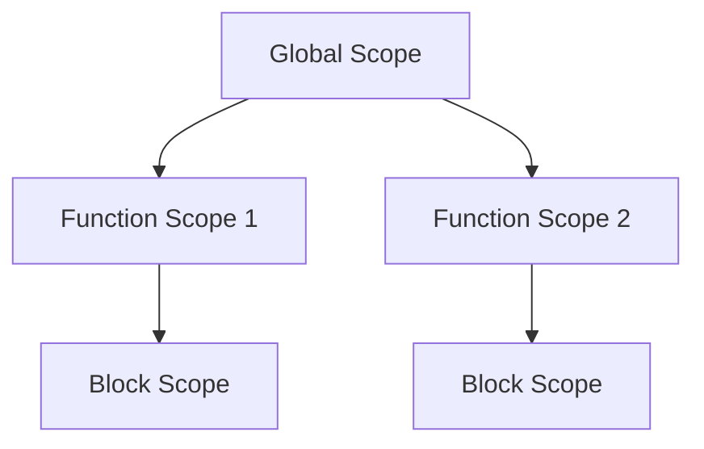

## 25.2 Overusing Global Variables

In the realm of JavaScript development, global variables often emerge as a convenient solution for storing data that needs to be accessed across different parts of an application. However, over-reliance on global variables can lead to significant issues in code maintainability, scalability, and reliability. This section delves into the intricacies of global variables, the risks they pose, and best practices for mitigating these risks.

### Understanding Global Scope in JavaScript

JavaScript's global scope is a space where variables, functions, and objects are accessible from anywhere in the code. When a variable is declared outside any function or block, it becomes part of the global scope. In browsers, the global scope is represented by the `window` object, while in Node.js, it is the `global` object.

```javascript
// Example of a global variable
var globalVar = "I am global";

// Accessible from any function
function showGlobalVar() {
    console.log(globalVar);
}

showGlobalVar(); // Output: I am global
```

#### Visualizing Global Scope

To better understand how global variables interact with the rest of your code, consider the following diagram that illustrates the relationship between global and local scopes:



In this diagram, the global scope (`A`) can access variables within function scopes (`B` and `C`), but the reverse is not true unless explicitly defined.

### Risks Associated with Global Variables

While global variables provide ease of access, they come with several risks:

#### 1. Name Collisions and Overwriting

Global variables are shared across the entire application, which increases the risk of name collisions. If two parts of the code define a global variable with the same name, one will overwrite the other, leading to unexpected behavior.

```javascript
// First script
var userName = "Alice";

// Second script
var userName = "Bob";

console.log(userName); // Output: Bob
```

#### 2. Difficulty in Tracking Variable Usage

As applications grow, tracking where and how global variables are used becomes challenging. This can lead to bugs that are difficult to diagnose and fix, as changes in one part of the code can inadvertently affect another.

#### 3. Increased Likelihood of Bugs

Global variables can lead to unintended side effects, especially in asynchronous code, where the timing of variable access can introduce subtle bugs.

### Code Example: Problems with Excessive Global Variables

Consider the following example, which demonstrates the pitfalls of using too many global variables:

```javascript
// Global variables
var counter = 0;
var user = "John Doe";
var isLoggedIn = false;

function incrementCounter() {
    counter++;
    console.log("Counter:", counter);
}

function loginUser(name) {
    user = name;
    isLoggedIn = true;
    console.log(user + " is logged in.");
}

incrementCounter();
loginUser("Jane Doe");
incrementCounter();
```

In this code, the global variables `counter`, `user`, and `isLoggedIn` are modified by different functions, making it difficult to track their state and leading to potential conflicts.

### Best Practices for Avoiding Global Variables

To mitigate the risks associated with global variables, consider the following best practices:

#### 1. Using Modules and Closures

Modules and closures provide a way to encapsulate variables and functions, limiting their scope and reducing the risk of name collisions.

```javascript
// Using an IIFE (Immediately Invoked Function Expression) for encapsulation
(function() {
    var privateCounter = 0;

    function increment() {
        privateCounter++;
        console.log("Private Counter:", privateCounter);
    }

    increment();
})();
```

#### 2. Encapsulating Code Within Functions or Objects

Encapsulation helps in organizing code and protecting variables from being accessed or modified globally.

```javascript
// Encapsulation using an object
var counterModule = (function() {
    var counter = 0;

    return {
        increment: function() {
            counter++;
            console.log("Counter:", counter);
        }
    };
})();

counterModule.increment();
```

#### 3. Employing the Module Pattern or ES6 Modules

The Module Pattern and ES6 Modules offer a structured way to organize code, promoting encapsulation and reuse.

```javascript
// ES6 Module example
// counter.js
let counter = 0;

export function increment() {
    counter++;
    console.log("Counter:", counter);
}

// main.js
import { increment } from './counter.js';

increment();
```

### Tools for Detecting Global Variables

Linters such as ESLint can help detect and warn about the use of global variables, encouraging better coding practices.

```json
// Example ESLint configuration
{
    "rules": {
        "no-undef": "error",
        "no-global-assign": "error"
    }
}
```

### Knowledge Check

- **What is the global scope in JavaScript, and how does it differ from local scope?**
- **What are the potential risks of using global variables in large applications?**
- **How can modules and closures help in reducing the reliance on global variables?**

### Summary

Overusing global variables in JavaScript can lead to code that is difficult to maintain, debug, and scale. By understanding the risks and implementing best practices such as using modules, closures, and encapsulation, developers can create more robust and reliable applications. Remember, this is just the beginning. As you progress, you'll build more complex and interactive web pages. Keep experimenting, stay curious, and enjoy the journey!

## Quiz: Understanding and Avoiding Global Variables in JavaScript



### What is a global variable in JavaScript?

- [x] A variable accessible from anywhere in the code
- [ ] A variable declared inside a function
- [ ] A variable that cannot be changed
- [ ] A variable that is only accessible in Node.js

> **Explanation:** A global variable is accessible from anywhere in the code, making it part of the global scope.

### What is a major risk of using global variables?

- [x] Name collisions and overwriting
- [ ] Improved performance
- [ ] Easier debugging
- [ ] Simplified code structure

> **Explanation:** Global variables can lead to name collisions and overwriting, causing unexpected behavior.

### How can you encapsulate code to avoid global variables?

- [x] Using modules and closures
- [ ] Declaring all variables at the top of the file
- [ ] Using only `let` and `const`
- [ ] Avoiding functions

> **Explanation:** Modules and closures help encapsulate code, reducing the reliance on global variables.

### Which tool can help detect global variables in your code?

- [x] ESLint
- [ ] Photoshop
- [ ] Microsoft Word
- [ ] Google Sheets

> **Explanation:** ESLint is a linter that can detect and warn about the use of global variables.

### What is the purpose of the Module Pattern?

- [x] To encapsulate code and promote reuse
- [ ] To make variables global
- [ ] To increase code complexity
- [ ] To slow down execution

> **Explanation:** The Module Pattern encapsulates code, promoting reuse and reducing global variable usage.

### What is the `window` object in browsers?

- [x] The global scope object
- [ ] A function
- [ ] A local variable
- [ ] A CSS property

> **Explanation:** In browsers, the `window` object represents the global scope.

### How can ES6 Modules help in avoiding global variables?

- [x] By encapsulating code and exporting only necessary parts
- [ ] By declaring all variables as `var`
- [ ] By using `eval` statements
- [ ] By avoiding functions

> **Explanation:** ES6 Modules encapsulate code, allowing only necessary parts to be exported and used.

### What is a closure in JavaScript?

- [x] A function that retains access to its lexical scope
- [ ] A global variable
- [ ] A CSS style
- [ ] A database query

> **Explanation:** A closure is a function that retains access to its lexical scope, even when executed outside of it.

### What does the `no-undef` rule in ESLint do?

- [x] Warns about the use of undeclared variables
- [ ] Increases code execution speed
- [ ] Makes all variables global
- [ ] Changes variable names

> **Explanation:** The `no-undef` rule warns about the use of undeclared variables, helping to avoid global variable issues.

### True or False: Global variables are always bad and should never be used.

- [ ] True
- [x] False

> **Explanation:** While global variables can cause issues, they are not inherently bad and can be used judiciously when necessary.


