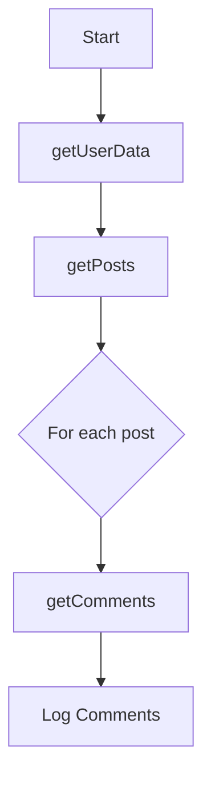

## 25.3 Callback Hell and the Pyramid of Doom

In the world of JavaScript, asynchronous programming is a powerful feature that allows developers to write non-blocking code. However, this power comes with its own set of challenges, one of which is the infamous "callback hell." This section explores what callback hell is, why it occurs, and how to avoid it using modern JavaScript techniques.

### Understanding Callback Hell

**Callback hell** refers to a situation in JavaScript programming where multiple nested callbacks are used to perform asynchronous operations. This nesting leads to code that is difficult to read and maintain, often resembling a pyramid shape, hence the term "pyramid of doom."

#### Example of Callback Hell

Consider the following example, which demonstrates a typical callback hell scenario:

```javascript
// Fetch user data, then fetch user's posts, then fetch comments for each post
getUserData(userId, function(user) {
    getPosts(user.id, function(posts) {
        posts.forEach(function(post) {
            getComments(post.id, function(comments) {
                console.log('Comments for post', post.id, ':', comments);
            });
        });
    });
});
```

In this example, each asynchronous operation depends on the result of the previous one, leading to deeply nested callbacks.

### Problems Caused by Callback Hell

Callback hell introduces several issues that can hinder the development process:

1. **Poor Readability**: The nested structure makes it difficult to follow the flow of the program. It becomes challenging to understand what the code is doing at a glance.

2. **Difficult Debugging and Error Handling**: With deeply nested callbacks, managing errors becomes cumbersome. Each callback must handle its own errors, leading to repetitive and scattered error handling logic.

3. **Increased Complexity**: As the number of nested callbacks grows, the complexity of the code increases, making it harder to maintain and extend.

### Strategies to Avoid Callback Hell

Fortunately, there are several strategies to mitigate the issues caused by callback hell:

#### 1. Using Named Functions

Instead of using anonymous functions for callbacks, you can define named functions. This approach improves readability and allows you to reuse functions.

```javascript
function handleComments(comments) {
    console.log('Comments:', comments);
}

function handlePosts(posts) {
    posts.forEach(function(post) {
        getComments(post.id, handleComments);
    });
}

getUserData(userId, function(user) {
    getPosts(user.id, handlePosts);
});
```

#### 2. Modularizing Code

Break down your code into smaller, reusable modules. This practice helps in organizing the code better and reduces nesting.

```javascript
function fetchCommentsForPost(post) {
    getComments(post.id, function(comments) {
        console.log('Comments for post', post.id, ':', comments);
    });
}

function fetchPostsForUser(user) {
    getPosts(user.id, function(posts) {
        posts.forEach(fetchCommentsForPost);
    });
}

getUserData(userId, fetchPostsForUser);
```

#### 3. Introducing Control Flow Libraries

Libraries like [Async.js](https://caolan.github.io/async/) provide utilities to manage asynchronous operations more effectively. They offer functions like `waterfall`, `series`, and `parallel` to control the flow of asynchronous tasks.

```javascript
const async = require('async');

async.waterfall([
    function(callback) {
        getUserData(userId, callback);
    },
    function(user, callback) {
        getPosts(user.id, function(err, posts) {
            callback(err, posts);
        });
    },
    function(posts, callback) {
        async.each(posts, function(post, cb) {
            getComments(post.id, function(err, comments) {
                console.log('Comments for post', post.id, ':', comments);
                cb(err);
            });
        }, callback);
    }
], function(err) {
    if (err) {
        console.error('Error:', err);
    } else {
        console.log('All operations completed successfully.');
    }
});
```

#### 4. Transitioning to Promises

Promises provide a cleaner way to handle asynchronous operations. They allow you to chain operations and handle errors in a centralized manner.

```javascript
getUserData(userId)
    .then(user => getPosts(user.id))
    .then(posts => {
        return Promise.all(posts.map(post => getComments(post.id)));
    })
    .then(commentsArray => {
        commentsArray.forEach((comments, index) => {
            console.log('Comments for post', index, ':', comments);
        });
    })
    .catch(error => {
        console.error('Error:', error);
    });
```

#### 5. Using Async/Await

The `async/await` syntax, introduced in ES2017, allows you to write asynchronous code that looks synchronous. This approach significantly improves readability and error handling.

```javascript
async function fetchComments() {
    try {
        const user = await getUserData(userId);
        const posts = await getPosts(user.id);
        for (const post of posts) {
            const comments = await getComments(post.id);
            console.log('Comments for post', post.id, ':', comments);
        }
    } catch (error) {
        console.error('Error:', error);
    }
}

fetchComments();
```

### Visualizing Callback Hell

To better understand the structure of callback hell, consider the following diagram:



**Diagram Description**: This flowchart illustrates the sequence of asynchronous operations in a callback hell scenario. Each step depends on the completion of the previous one, leading to a nested structure.

### Try It Yourself

Experiment with the provided code examples by modifying them to suit different scenarios. Try refactoring a callback hell example using Promises or `async/await` to see the difference in readability and maintainability.

### Knowledge Check

- What is callback hell, and why is it problematic?
- How can named functions improve the readability of nested callbacks?
- What are the benefits of using Promises over traditional callbacks?
- How does `async/await` improve error handling in asynchronous code?

### Key Takeaways

- Callback hell occurs when multiple nested callbacks lead to code that is hard to read and maintain.
- Strategies to avoid callback hell include using named functions, modularizing code, and utilizing control flow libraries.
- Transitioning to Promises or `async/await` can significantly improve the structure and readability of asynchronous code.

### Embrace the Journey

Remember, mastering asynchronous programming in JavaScript is a journey. As you explore different techniques to avoid callback hell, you'll gain a deeper understanding of how to write clean, maintainable code. Keep experimenting, stay curious, and enjoy the process!

### References and Links

- [MDN Web Docs: Promises](https://developer.mozilla.org/en-US/docs/Web/JavaScript/Guide/Using_promises)
- [Async.js Documentation](https://caolan.github.io/async/)
- [MDN Web Docs: async/await](https://developer.mozilla.org/en-US/docs/Web/JavaScript/Reference/Statements/async_function)

## Mastering Callback Hell and the Pyramid of Doom in JavaScript



### What is callback hell?

- [x] A situation where nested callbacks lead to hard-to-read and maintain code
- [ ] A method for handling synchronous operations
- [ ] A design pattern for organizing code
- [ ] A feature of JavaScript for error handling

> **Explanation:** Callback hell occurs when multiple nested callbacks make the code difficult to read and maintain.

### Which of the following is a problem caused by callback hell?

- [x] Poor readability
- [x] Difficult debugging and error handling
- [ ] Improved performance
- [ ] Simplified code structure

> **Explanation:** Callback hell leads to poor readability and difficult debugging due to deeply nested callbacks.

### How can named functions help avoid callback hell?

- [x] By improving readability and reusability
- [ ] By increasing code execution speed
- [ ] By reducing the number of lines of code
- [ ] By eliminating the need for asynchronous operations

> **Explanation:** Named functions improve readability and allow for reusability, reducing the complexity of nested callbacks.

### What is a benefit of using Promises over traditional callbacks?

- [x] Centralized error handling
- [ ] Faster execution
- [ ] Reduced memory usage
- [ ] Automatic code optimization

> **Explanation:** Promises allow for centralized error handling, making asynchronous code easier to manage.

### How does `async/await` improve asynchronous code?

- [x] By making it look synchronous
- [x] By improving readability
- [ ] By eliminating the need for callbacks
- [ ] By increasing execution speed

> **Explanation:** `async/await` syntax makes asynchronous code look synchronous, improving readability and error handling.

### Which library can help manage asynchronous operations in JavaScript?

- [x] Async.js
- [ ] jQuery
- [ ] Lodash
- [ ] Bootstrap

> **Explanation:** Async.js provides utilities to manage asynchronous operations effectively.

### What is the "pyramid of doom"?

- [x] A visual representation of deeply nested callbacks
- [ ] A JavaScript design pattern
- [ ] A method for optimizing code
- [ ] A tool for debugging

> **Explanation:** The "pyramid of doom" refers to the visual structure of deeply nested callbacks.

### What is a common strategy to avoid callback hell?

- [x] Using Promises
- [x] Using `async/await`
- [ ] Using synchronous code
- [ ] Using global variables

> **Explanation:** Using Promises and `async/await` are common strategies to avoid callback hell.

### What does the `async` keyword do in JavaScript?

- [x] Marks a function as asynchronous
- [ ] Converts a function to a callback
- [ ] Increases the speed of a function
- [ ] Automatically handles errors

> **Explanation:** The `async` keyword marks a function as asynchronous, allowing the use of `await` within it.

### True or False: Callback hell is a recommended practice for handling asynchronous operations.

- [ ] True
- [x] False

> **Explanation:** Callback hell is not recommended as it leads to code that is hard to read and maintain.




