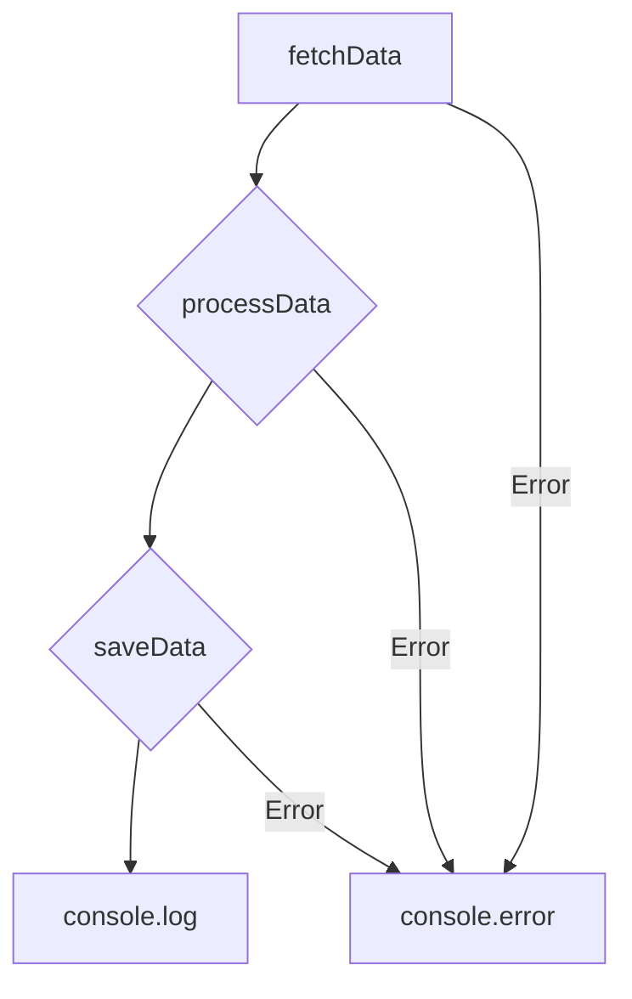
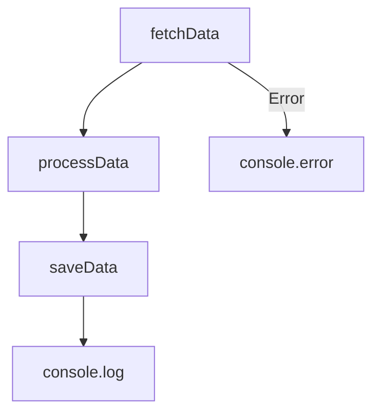

## 25.4 Nested Promises and Poor Async Handling

### Introduction

In the realm of JavaScript, asynchronous programming is a cornerstone for building responsive and efficient web applications. However, improper handling of asynchronous operations can lead to complex and hard-to-maintain code. One common anti-pattern is the misuse of Promises through unnecessary nesting, which can result in a situation akin to the infamous "callback hell." This section will explore how to avoid nested Promises, demonstrate best practices for Promise chaining, and introduce `async/await` as a cleaner alternative for managing asynchronous code.

### Understanding Nested Promises

Promises are a powerful feature in JavaScript that allow developers to handle asynchronous operations more gracefully than traditional callbacks. However, when Promises are nested unnecessarily, they can create a convoluted and difficult-to-read code structure. This often occurs when developers attempt to execute a sequence of asynchronous tasks without properly chaining Promises.

#### Example of Nested Promises

Consider the following example, where Promises are nested within each other:

```javascript
function fetchData() {
    return new Promise((resolve, reject) => {
        setTimeout(() => resolve('Data fetched'), 1000);
    });
}

function processData(data) {
    return new Promise((resolve, reject) => {
        setTimeout(() => resolve(`${data} processed`), 1000);
    });
}

function saveData(data) {
    return new Promise((resolve, reject) => {
        setTimeout(() => resolve(`${data} saved`), 1000);
    });
}

// Nested Promises
fetchData().then(data => {
    processData(data).then(processedData => {
        saveData(processedData).then(savedData => {
            console.log(savedData);
        }).catch(err => console.error('Error saving data:', err));
    }).catch(err => console.error('Error processing data:', err));
}).catch(err => console.error('Error fetching data:', err));
```

**Issues with Nested Promises:**
- **Readability**: The code becomes difficult to read and maintain as the nesting increases.
- **Error Handling**: Each Promise requires its own `catch` block, leading to repetitive and scattered error handling logic.

### Best Practices for Promise Chaining

To avoid the pitfalls of nested Promises, it's crucial to understand how to properly chain Promises. Promise chaining allows you to execute a sequence of asynchronous operations in a linear and readable manner.

#### Refactoring Nested Promises to Chained Promises

Let's refactor the previous example to use Promise chaining:

```javascript
fetchData()
    .then(data => processData(data))
    .then(processedData => saveData(processedData))
    .then(savedData => console.log(savedData))
    .catch(err => console.error('Error:', err));
```

**Benefits of Promise Chaining:**
- **Improved Readability**: The code is more linear and easier to follow.
- **Centralized Error Handling**: A single `catch` block can handle errors from any stage of the chain.

#### Key Considerations for Promise Chaining

- **Return Promises Correctly**: Ensure that each `then` block returns a Promise. This allows the chain to continue.
- **Use `then()` and `catch()` Appropriately**: Use `then()` to handle successful operations and `catch()` to handle errors.

### Introducing `async/await`

While Promise chaining improves readability, `async/await` offers an even cleaner syntax for handling asynchronous operations. Introduced in ECMAScript 2017, `async/await` allows you to write asynchronous code that looks synchronous, making it easier to read and maintain.

#### Refactoring with `async/await`

Let's refactor the Promise chain using `async/await`:

```javascript
async function handleData() {
    try {
        const data = await fetchData();
        const processedData = await processData(data);
        const savedData = await saveData(processedData);
        console.log(savedData);
    } catch (err) {
        console.error('Error:', err);
    }
}

handleData();
```

**Advantages of `async/await`:**
- **Synchronous-Like Syntax**: The code reads like synchronous code, making it more intuitive.
- **Simplified Error Handling**: Use `try/catch` blocks to handle errors, reducing the need for multiple `catch` statements.

### Visualizing Promise Chaining vs. Nested Promises

To better understand the difference between nested Promises and Promise chaining, let's visualize the flow using Mermaid.js diagrams.

#### Nested Promises Flow



#### Promise Chaining Flow



**Diagram Explanation:**
- **Nested Promises**: Each operation is nested within the previous one, leading to a more complex flow.
- **Promise Chaining**: Operations are executed in a linear sequence, with a single error handling path.

### Common Mistakes and How to Avoid Them

1. **Not Returning Promises**: Ensure each `then` block returns a Promise to maintain the chain.
2. **Ignoring Errors**: Always include a `catch` block to handle potential errors.
3. **Mixing `async/await` and `.then()`**: While possible, it's best to stick to one style for consistency.

### Try It Yourself

Experiment with the provided code examples by modifying the delay times or introducing errors to see how the error handling behaves. Try converting a nested Promise structure to use `async/await` and observe the improvements in readability.

### Knowledge Check

- What are the benefits of using Promise chaining over nested Promises?
- How does `async/await` improve the readability of asynchronous code?
- Why is centralized error handling important in asynchronous operations?

### Summary

In this section, we explored the anti-pattern of nested Promises and how it can lead to complex and hard-to-maintain code. By adopting best practices for Promise chaining and utilizing `async/await`, we can write cleaner, more readable asynchronous code. Remember, mastering asynchronous handling is key to building efficient and responsive web applications. Keep experimenting, stay curious, and enjoy the journey!

## Mastering JavaScript Promises and Async Handling



### What is a common issue with nested Promises?

- [x] They lead to complex and hard-to-read code.
- [ ] They are faster than chained Promises.
- [ ] They improve error handling.
- [ ] They are the recommended way to handle asynchronous operations.

> **Explanation:** Nested Promises can lead to complex and hard-to-read code, similar to callback hell.

### How does Promise chaining improve code readability?

- [x] By creating a linear flow of asynchronous operations.
- [ ] By nesting operations within each other.
- [ ] By using multiple `catch` blocks.
- [ ] By avoiding the use of Promises altogether.

> **Explanation:** Promise chaining creates a linear flow of asynchronous operations, improving readability.

### What is the main advantage of using `async/await`?

- [x] It allows asynchronous code to be written in a synchronous-like manner.
- [ ] It eliminates the need for error handling.
- [ ] It is faster than Promises.
- [ ] It requires no additional syntax.

> **Explanation:** `async/await` allows asynchronous code to be written in a synchronous-like manner, making it more intuitive.

### How can you handle errors in a Promise chain?

- [x] By using a single `catch` block at the end of the chain.
- [ ] By using multiple `catch` blocks after each `then`.
- [ ] By ignoring errors altogether.
- [ ] By using `try/catch` inside each `then`.

> **Explanation:** A single `catch` block at the end of the chain can handle errors from any stage of the chain.

### What should you ensure when using `then()` in a Promise chain?

- [x] That each `then` block returns a Promise.
- [ ] That each `then` block is nested.
- [ ] That each `then` block has its own `catch`.
- [ ] That each `then` block uses `async/await`.

> **Explanation:** Each `then` block should return a Promise to maintain the chain.

### What is a potential downside of mixing `async/await` and `.then()`?

- [x] It can lead to inconsistent code styles.
- [ ] It improves code readability.
- [ ] It eliminates the need for error handling.
- [ ] It is the recommended practice.

> **Explanation:** Mixing `async/await` and `.then()` can lead to inconsistent code styles.

### What is a benefit of centralized error handling in Promises?

- [x] It reduces repetitive error handling logic.
- [ ] It requires multiple `catch` blocks.
- [ ] It eliminates the need for error handling.
- [ ] It makes code harder to read.

> **Explanation:** Centralized error handling reduces repetitive error handling logic.

### What is the purpose of `await` in `async/await`?

- [x] To pause the execution of the function until the Promise resolves.
- [ ] To speed up asynchronous operations.
- [ ] To eliminate the need for Promises.
- [ ] To handle errors automatically.

> **Explanation:** `await` pauses the execution of the function until the Promise resolves.

### How can you convert a nested Promise structure to `async/await`?

- [x] By using `async` functions and `await` for each asynchronous operation.
- [ ] By nesting `await` within each other.
- [ ] By using multiple `catch` blocks.
- [ ] By avoiding the use of Promises.

> **Explanation:** Use `async` functions and `await` for each asynchronous operation to convert nested Promises to `async/await`.

### True or False: `async/await` can only be used with Promises.

- [x] True
- [ ] False

> **Explanation:** `async/await` is designed to work with Promises, allowing asynchronous code to be written in a synchronous-like manner.




