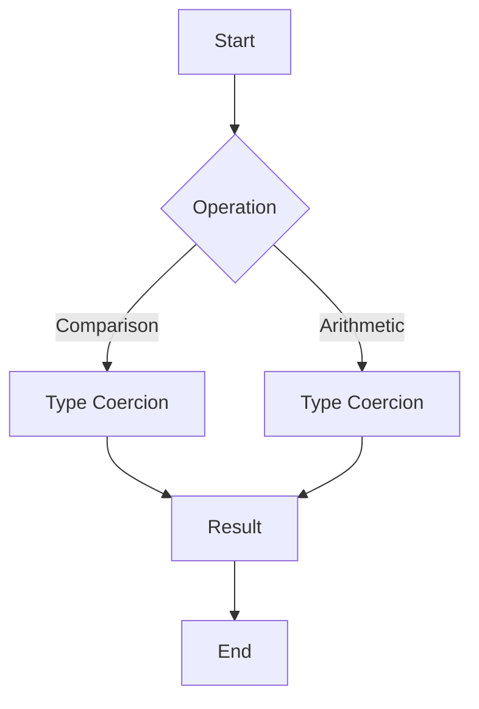

## 25.5 Implicit Type Coercion Issues

JavaScript, as a loosely typed language, allows for implicit type coercion, where the language automatically converts one data type to another. While this feature can be convenient, it often leads to unexpected behaviors and bugs. In this section, we will delve into the mechanics of implicit type coercion, examine common pitfalls, and discuss best practices to avoid these issues.

### Understanding Implicit Type Coercion

Implicit type coercion occurs when JavaScript automatically converts values from one type to another during operations. This can happen in various contexts, such as arithmetic operations, comparisons, and logical expressions. Let's explore some of these scenarios.

#### Type Coercion in Comparisons

One of the most common pitfalls of implicit type coercion is in comparisons. JavaScript provides two types of equality operators: `==` (loose equality) and `===` (strict equality). The `==` operator performs type coercion, converting operands to the same type before comparison, while `===` does not.

**Example:**

```javascript
console.log(0 == false); // true
console.log(0 === false); // false
```

In the first line, `0` is coerced to a boolean, resulting in `true`. In the second line, no coercion occurs, so the comparison is `false`.

#### Type Coercion in Arithmetic Operations

Arithmetic operations can also lead to implicit type coercion, especially when dealing with mixed types like strings and numbers.

**Example:**

```javascript
console.log('5' - 2); // 3
console.log('5' + 2); // '52'
```

In the first operation, the string `'5'` is coerced to a number. In the second operation, the number `2` is coerced to a string, resulting in concatenation.

### Common Pitfalls of Implicit Type Coercion

Implicit type coercion can lead to subtle bugs that are difficult to detect. Let's explore some common pitfalls.

#### Comparing Values with `==` Instead of `===`

Using `==` can lead to unexpected results due to type coercion.

**Example:**

```javascript
console.log(null == undefined); // true
console.log(null === undefined); // false
```

Here, `null` and `undefined` are considered equal with `==`, but not with `===`.

#### Arithmetic Operations on Mixed Types

Mixing strings and numbers in arithmetic operations can produce unexpected results.

**Example:**

```javascript
console.log('10' - '5' + 5); // 10
console.log('10' + '5' - 5); // 100
```

In the first line, both strings are coerced to numbers. In the second line, the strings are concatenated before the subtraction.

### Best Practices to Avoid Implicit Type Coercion Issues

To avoid the pitfalls of implicit type coercion, follow these best practices:

#### Use Strict Equality Operators

Always use `===` and `!==` to avoid unexpected type coercion.

**Example:**

```javascript
console.log('5' === 5); // false
console.log('5' !== 5); // true
```

#### Be Explicit About Type Conversions

Convert types explicitly using functions like `Number()`, `String()`, and `Boolean()`.

**Example:**

```javascript
let num = '5';
console.log(Number(num) + 2); // 7
```

#### Employ Type-Checking Functions

Use functions like `typeof` and `instanceof` to check types before operations.

**Example:**

```javascript
function add(a, b) {
  if (typeof a === 'number' && typeof b === 'number') {
    return a + b;
  }
  throw new Error('Both arguments must be numbers');
}

console.log(add(5, 10)); // 15
```

### Tools and Linters for Detecting Coercion Problems

Several tools and linters can help detect potential coercion issues in your code. These tools analyze your code and provide warnings or errors for potential problems.

#### ESLint

ESLint is a popular linter for JavaScript that can be configured to detect coercion issues.

**Example ESLint Configuration:**

```json
{
  "rules": {
    "eqeqeq": ["error", "always"]
  }
}
```

This configuration enforces the use of `===` and `!==`.

#### TypeScript

TypeScript adds static typing to JavaScript, helping to catch type-related errors at compile time.

**Example:**

```typescript
function add(a: number, b: number): number {
  return a + b;
}

console.log(add(5, 10)); // 15
```

### Visualizing Implicit Type Coercion

To better understand how implicit type coercion works, let's visualize the process using a flowchart.



**Figure 1:** This flowchart illustrates how JavaScript performs type coercion during operations.

### Knowledge Check

- **What is implicit type coercion?**
- **How does JavaScript handle comparisons with `==`?**
- **What are the best practices to avoid implicit type coercion issues?**

### Exercises

1. **Identify Coercion:** Review the following code and identify where implicit type coercion occurs. Suggest improvements.

   ```javascript
   let result = '10' + 20 - '5';
   console.log(result); // ?
   ```

2. **Refactor for Clarity:** Refactor the following code to avoid implicit type coercion.

   ```javascript
   function compare(a, b) {
     return a == b;
   }
   ```

### Key Takeaways

- **Implicit type coercion** can lead to unexpected behaviors and bugs.
- **Use strict equality operators** (`===`, `!==`) to avoid coercion in comparisons.
- **Be explicit about type conversions** to ensure clarity and correctness.
- **Employ tools and linters** like ESLint and TypeScript to detect and prevent coercion issues.

Remember, understanding and avoiding implicit type coercion is crucial for writing robust and maintainable JavaScript code. Keep experimenting, stay curious, and enjoy the journey!

## Quiz: Mastering Implicit Type Coercion in JavaScript



### What is implicit type coercion in JavaScript?

- [x] Automatic conversion of values from one type to another
- [ ] Manual conversion of values from one type to another
- [ ] A feature that prevents type conversion
- [ ] A method to explicitly convert types

> **Explanation:** Implicit type coercion is the automatic conversion of values from one type to another by JavaScript.

### Which operator should you use to avoid implicit type coercion in comparisons?

- [x] ===
- [ ] ==
- [ ] =
- [ ] !=

> **Explanation:** The `===` operator checks for strict equality without type coercion.

### What is the result of `'5' + 2` in JavaScript?

- [x] '52'
- [ ] 7
- [ ] 3
- [ ] '7'

> **Explanation:** The `+` operator concatenates the string `'5'` with the number `2`, resulting in `'52'`.

### How can you explicitly convert a string to a number in JavaScript?

- [x] Using the `Number()` function
- [ ] Using the `String()` function
- [ ] Using the `Boolean()` function
- [ ] Using the `Array()` function

> **Explanation:** The `Number()` function explicitly converts a string to a number.

### Which tool can help detect coercion issues in JavaScript code?

- [x] ESLint
- [ ] Babel
- [ ] Webpack
- [ ] Node.js

> **Explanation:** ESLint is a linter that can be configured to detect coercion issues in JavaScript code.

### What is the result of `null == undefined` in JavaScript?

- [x] true
- [ ] false
- [ ] null
- [ ] undefined

> **Explanation:** `null` and `undefined` are considered equal with the `==` operator due to type coercion.

### What is the result of `'10' - '5' + 5` in JavaScript?

- [x] 10
- [ ] '105'
- [ ] 0
- [ ] '10'

> **Explanation:** The strings `'10'` and `'5'` are coerced to numbers, resulting in `10`.

### Which of the following is a best practice to avoid implicit type coercion?

- [x] Use strict equality operators
- [ ] Use loose equality operators
- [ ] Avoid type checking
- [ ] Use implicit conversions

> **Explanation:** Using strict equality operators (`===`, `!==`) helps avoid implicit type coercion.

### What is the purpose of the `typeof` operator in JavaScript?

- [x] To check the type of a variable
- [ ] To convert a variable to a string
- [ ] To convert a variable to a number
- [ ] To declare a variable

> **Explanation:** The `typeof` operator checks the type of a variable.

### True or False: Implicit type coercion is always beneficial in JavaScript.

- [ ] True
- [x] False

> **Explanation:** Implicit type coercion can lead to unexpected behaviors and bugs, so it is not always beneficial.


