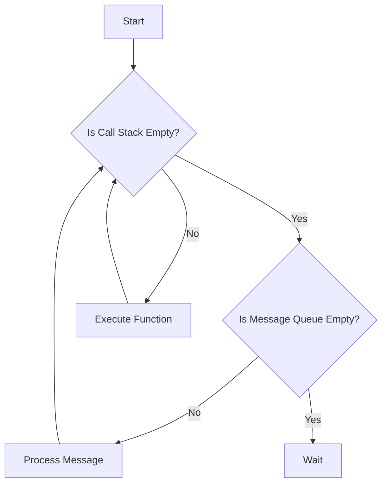
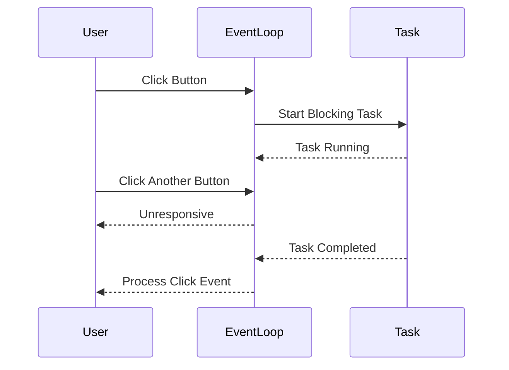

## 25.6 Blocking the Event Loop

In this section, we delve into the concept of blocking the event loop in JavaScript, a common pitfall that can lead to unresponsive applications. Understanding how the event loop operates and how blocking it can affect performance is crucial for any JavaScript developer aiming to create efficient and responsive applications.

### Understanding the Single-Threaded Nature of the Event Loop

JavaScript is inherently single-threaded, meaning it executes code in a single sequence of instructions. This single-threaded nature is managed by the event loop, which is responsible for executing code, collecting and processing events, and executing queued sub-tasks. 

#### The Event Loop Explained

The event loop continuously checks the call stack to see if there's any function that needs to run. If the call stack is empty, it looks at the message queue to see if there's any pending message to process. This process allows JavaScript to perform non-blocking operations, despite being single-threaded.



*Diagram: The Event Loop Process*

### How Blocking Operations Affect the Event Loop

Blocking operations occur when a task takes too long to execute, preventing the event loop from processing other tasks. This can lead to a sluggish or completely unresponsive application, as the event loop is unable to handle new events or user interactions until the blocking task is completed.

#### Examples of Blocking Code

1. **Heavy Computations**: Performing complex calculations or processing large datasets synchronously can block the event loop.
   
   ```javascript
   // Example of a blocking computation
   function heavyComputation() {
       let sum = 0;
       for (let i = 0; i < 1e9; i++) {
           sum += i;
       }
       return sum;
   }

   console.log(heavyComputation()); // Blocks the event loop
   ```

2. **Synchronous Loops**: Long-running loops that execute synchronously can also block the event loop.

   ```javascript
   // Example of a blocking loop
   while (true) {
       // Infinite loop, blocks the event loop
   }
   ```

### Strategies to Prevent Blocking

To maintain a responsive application, it's essential to avoid blocking the event loop. Here are some strategies to achieve this:

#### Breaking Tasks into Smaller Chunks

One effective way to prevent blocking is to break down large tasks into smaller, manageable chunks. This can be achieved using `setTimeout` or `setImmediate` to schedule smaller portions of the task, allowing the event loop to process other events in between.

```javascript
// Breaking a task into smaller chunks
function processLargeArray(array) {
    let index = 0;

    function processChunk() {
        const chunkSize = 1000;
        const end = Math.min(index + chunkSize, array.length);

        for (; index < end; index++) {
            // Process each item
        }

        if (index < array.length) {
            setTimeout(processChunk, 0); // Schedule next chunk
        }
    }

    processChunk();
}

processLargeArray(new Array(1e6).fill(0)); // Non-blocking
```

#### Using Web Workers for Computation-Intensive Tasks

In the browser, Web Workers provide a way to run scripts in background threads, allowing computation-intensive tasks to be offloaded from the main thread. This prevents the event loop from being blocked by heavy computations.

```javascript
// Main thread
const worker = new Worker('worker.js');

worker.onmessage = function(event) {
    console.log('Result from worker:', event.data);
};

worker.postMessage('Start computation');

// worker.js
self.onmessage = function(event) {
    let result = 0;
    for (let i = 0; i < 1e9; i++) {
        result += i;
    }
    self.postMessage(result);
};
```

#### Employing Worker Threads in Node.js

Node.js provides Worker Threads, which allow for parallel execution of JavaScript code. This is particularly useful for CPU-intensive operations that would otherwise block the event loop.

```javascript
const { Worker, isMainThread, parentPort } = require('worker_threads');

if (isMainThread) {
    const worker = new Worker(__filename);

    worker.on('message', (result) => {
        console.log('Result from worker:', result);
    });

    worker.postMessage('Start computation');
} else {
    parentPort.on('message', (message) => {
        let result = 0;
        for (let i = 0; i < 1e9; i++) {
            result += i;
        }
        parentPort.postMessage(result);
    });
}
```

### Impact on User Experience and Performance

Blocking the event loop can severely degrade the user experience by making applications unresponsive. Users may experience delays in UI updates, unresponsive buttons, or even browser crashes. By employing the strategies discussed, developers can ensure their applications remain responsive and performant.

### Visualizing the Impact of Blocking the Event Loop

To better understand the impact of blocking the event loop, consider the following sequence diagram illustrating how a blocking task affects the event loop's ability to process events:



*Diagram: Impact of Blocking the Event Loop on User Interaction*

### Try It Yourself

Experiment with the provided code examples by modifying the chunk size in the `processLargeArray` function or the computation in the Web Worker. Observe how these changes affect the responsiveness of your application.

### References and Further Reading

- [MDN Web Docs: Event Loop](https://developer.mozilla.org/en-US/docs/Web/JavaScript/EventLoop)
- [Node.js Documentation: Worker Threads](https://nodejs.org/api/worker_threads.html)
- [Web Workers API](https://developer.mozilla.org/en-US/docs/Web/API/Web_Workers_API)

### Knowledge Check

- What is the event loop, and why is it important in JavaScript?
- How can blocking the event loop affect user experience?
- What are some strategies to prevent blocking the event loop?
- How do Web Workers and Worker Threads help in preventing event loop blocking?

### Embrace the Journey

Remember, understanding and preventing event loop blocking is just the beginning. As you continue to explore JavaScript, you'll discover more techniques to optimize performance and enhance user experience. Keep experimenting, stay curious, and enjoy the journey!

## Quiz: Understanding and Preventing Event Loop Blocking



### What is the primary function of the event loop in JavaScript?

- [x] To manage the execution of code, process events, and execute queued sub-tasks.
- [ ] To handle only asynchronous operations.
- [ ] To execute code in parallel threads.
- [ ] To manage memory allocation.

> **Explanation:** The event loop is responsible for managing the execution of code, processing events, and executing queued sub-tasks in JavaScript.

### How does blocking the event loop affect a JavaScript application?

- [x] It makes the application unresponsive.
- [ ] It improves application performance.
- [ ] It allows for parallel execution of tasks.
- [ ] It has no effect on the application.

> **Explanation:** Blocking the event loop prevents the application from processing other tasks, making it unresponsive.

### Which of the following is a strategy to prevent blocking the event loop?

- [x] Breaking tasks into smaller chunks using `setTimeout`.
- [ ] Using synchronous loops for heavy computations.
- [ ] Increasing the size of the call stack.
- [ ] Ignoring asynchronous operations.

> **Explanation:** Breaking tasks into smaller chunks using `setTimeout` allows the event loop to process other tasks in between.

### What is the role of Web Workers in preventing event loop blocking?

- [x] They run scripts in background threads, offloading computation-intensive tasks.
- [ ] They execute code in the main thread.
- [ ] They are used for synchronous operations.
- [ ] They manage memory allocation.

> **Explanation:** Web Workers run scripts in background threads, preventing computation-intensive tasks from blocking the main thread.

### How can Worker Threads in Node.js help with event loop blocking?

- [x] By allowing parallel execution of JavaScript code.
- [ ] By executing code in the main thread.
- [ ] By handling only I/O operations.
- [ ] By managing the call stack size.

> **Explanation:** Worker Threads in Node.js allow for parallel execution of JavaScript code, preventing blocking of the event loop.

### What is a common symptom of a blocked event loop in a web application?

- [x] Unresponsive UI elements.
- [ ] Faster page load times.
- [ ] Increased memory usage.
- [ ] Improved user interaction.

> **Explanation:** A blocked event loop can lead to unresponsive UI elements, as the application cannot process new events.

### Which method can be used to break a large task into smaller chunks?

- [x] `setTimeout`
- [ ] `setInterval`
- [ ] `clearTimeout`
- [ ] `setImmediate`

> **Explanation:** `setTimeout` can be used to schedule smaller portions of a task, allowing the event loop to process other events in between.

### What is the impact of using synchronous loops in JavaScript?

- [x] They can block the event loop, making the application unresponsive.
- [ ] They improve application performance.
- [ ] They allow for parallel execution of tasks.
- [ ] They have no effect on the event loop.

> **Explanation:** Synchronous loops can block the event loop, preventing it from processing other tasks and making the application unresponsive.

### How does breaking tasks into smaller chunks improve application performance?

- [x] It allows the event loop to process other tasks in between chunks.
- [ ] It increases the call stack size.
- [ ] It reduces memory usage.
- [ ] It executes tasks in parallel threads.

> **Explanation:** Breaking tasks into smaller chunks allows the event loop to process other tasks in between, improving application responsiveness.

### True or False: Web Workers can be used in Node.js to prevent event loop blocking.

- [ ] True
- [x] False

> **Explanation:** Web Workers are a browser feature and cannot be used in Node.js. Instead, Node.js uses Worker Threads for parallel execution.


