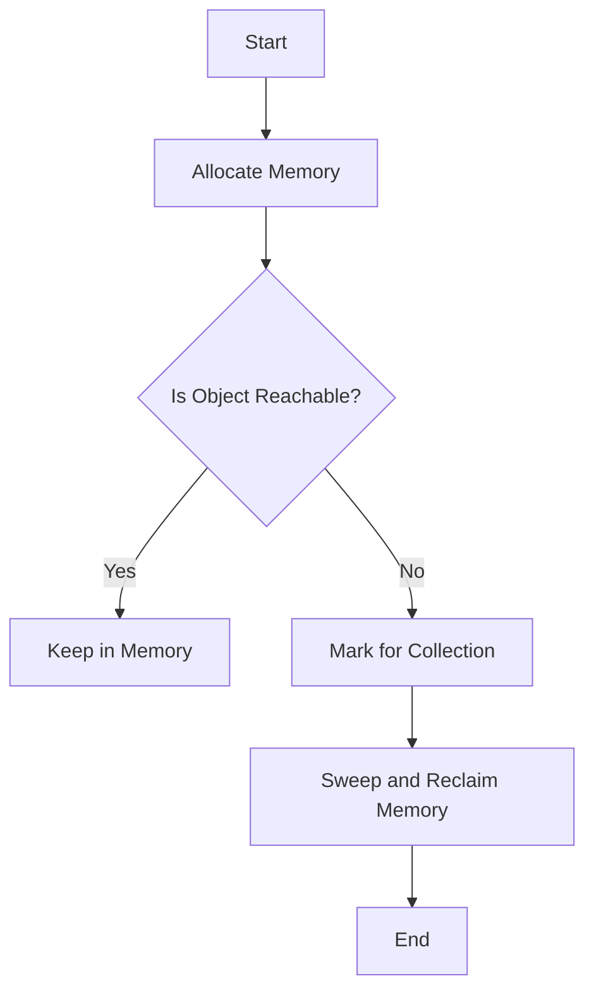

## 25.7 Memory Leaks and Poor Garbage Collection Practices

Memory management is a critical aspect of JavaScript development, especially in long-running applications like web pages and Node.js servers. Understanding how memory leaks occur and how to prevent them can significantly enhance the performance and reliability of your applications. In this section, we will explore memory management in JavaScript, identify common sources of memory leaks, and discuss best practices for effective memory management.

### Understanding Memory Management in JavaScript

JavaScript uses an automatic memory management system known as garbage collection. The garbage collector is responsible for reclaiming memory that is no longer in use by the program. It does this by identifying objects that are no longer reachable from the root, which is the global object in a browser environment or the global object in Node.js.

#### How Garbage Collection Works

Garbage collection in JavaScript is typically based on the concept of reachability. An object is considered reachable if it can be accessed in some way from the root. The garbage collector periodically checks for unreachable objects and reclaims their memory.

- **Mark-and-Sweep Algorithm**: This is the most common garbage collection algorithm used in JavaScript engines. It involves marking all reachable objects and sweeping away the unmarked ones.
- **Reference Counting**: Although not commonly used in modern JavaScript engines, reference counting involves keeping track of the number of references to an object. When the count drops to zero, the object can be collected.

### Common Sources of Memory Leaks

Memory leaks occur when memory that is no longer needed is not released. This can lead to increased memory usage and eventually cause the application to slow down or crash. Let's explore some common sources of memory leaks in JavaScript.

#### Unreleased Event Listeners

Event listeners that are not properly removed can lead to memory leaks. When an event listener is attached to a DOM element, it creates a reference to the callback function. If the DOM element is removed but the event listener is not, the memory used by the callback function is not released.

```javascript
// Example of unreleased event listener causing memory leak
function addClickListener() {
    const button = document.getElementById('myButton');
    button.addEventListener('click', function handleClick() {
        console.log('Button clicked');
    });
}

// Properly removing the event listener
function removeClickListener() {
    const button = document.getElementById('myButton');
    button.removeEventListener('click', handleClick);
}
```

#### Accidental Global Variables

Accidental global variables can occur when variables are declared without the `var`, `let`, or `const` keywords. These variables are attached to the global object and persist throughout the lifetime of the application.

```javascript
// Accidental global variable
function createGlobalVariable() {
    myGlobalVar = 'This is a global variable';
}

// Avoiding accidental global variables
function createLocalVariable() {
    let myLocalVar = 'This is a local variable';
}
```

#### Closures Holding Unnecessary References

Closures can lead to memory leaks if they hold references to variables that are no longer needed. This is because closures capture the variables in their lexical scope, which can prevent them from being garbage collected.

```javascript
// Closure holding unnecessary reference
function createClosure() {
    const largeArray = new Array(1000).fill('data');
    return function() {
        console.log(largeArray[0]);
    };
}

// Avoiding unnecessary references in closures
function createOptimizedClosure() {
    return function() {
        console.log('Optimized closure');
    };
}
```

#### Detached DOM Elements

Detached DOM elements are elements that have been removed from the DOM tree but are still referenced in JavaScript. This prevents them from being garbage collected.

```javascript
// Example of detached DOM element causing memory leak
let detachedElement;

function createElement() {
    const element = document.createElement('div');
    document.body.appendChild(element);
    detachedElement = element;
}

function removeElement() {
    document.body.removeChild(detachedElement);
    detachedElement = null; // Release reference
}
```

### Best Practices for Memory Management

To prevent memory leaks and ensure efficient memory management, consider the following best practices.

#### Properly Removing Event Listeners

Always remove event listeners when they are no longer needed. This can be done using the `removeEventListener` method.

```javascript
// Properly removing event listener
function manageEventListener() {
    const button = document.getElementById('myButton');
    function handleClick() {
        console.log('Button clicked');
    }
    button.addEventListener('click', handleClick);
    button.removeEventListener('click', handleClick);
}
```

#### Avoiding Unnecessary References

Avoid holding references to objects that are no longer needed. This includes clearing references in closures and setting variables to `null` when they are no longer needed.

```javascript
// Avoiding unnecessary references
let myObject = { data: 'important data' };
myObject = null; // Release reference
```

#### Using WeakMaps and WeakSets

WeakMaps and WeakSets are collections that hold weak references to their keys or values. This means that if there are no other references to the key or value, they can be garbage collected.

```javascript
// Using WeakMap to avoid memory leaks
const weakMap = new WeakMap();
let obj = { key: 'value' };
weakMap.set(obj, 'some data');
obj = null; // The entry in the WeakMap can be garbage collected
```

### Tools for Detecting Memory Leaks

Detecting memory leaks can be challenging, but there are tools available to help identify and fix them.

#### Browser DevTools Memory Profiler

Most modern browsers come with built-in developer tools that include a memory profiler. The memory profiler can be used to take heap snapshots, track memory allocations, and identify memory leaks.

- **Heap Snapshots**: Capture the state of memory at a specific point in time.
- **Allocation Timelines**: Track memory allocations over time to identify trends.
- **Retainers**: Identify what is keeping an object in memory.

#### Node.js Memory Profiling Tools

For Node.js applications, memory profiling tools such as `node-inspect` and `clinic.js` can be used to analyze memory usage and identify leaks.

- **node-inspect**: A built-in tool for debugging Node.js applications, including memory profiling.
- **clinic.js**: A suite of tools for profiling Node.js applications, including memory usage analysis.

### Visualizing Memory Management

To better understand how memory management works in JavaScript, let's visualize the process using a flowchart.



**Figure 1**: A flowchart illustrating the mark-and-sweep garbage collection process in JavaScript.

### Knowledge Check

- **What is a memory leak, and why is it problematic in JavaScript applications?**
- **How can accidental global variables lead to memory leaks?**
- **What are some best practices for removing event listeners to prevent memory leaks?**
- **How can WeakMaps help in managing memory more effectively?**

### Exercises

1. **Identify Memory Leaks**: Examine a sample JavaScript application and identify potential memory leaks. Use browser DevTools to confirm your findings.
2. **Optimize Memory Usage**: Refactor a given code snippet to optimize memory usage by removing unnecessary references and using WeakMaps where appropriate.

### Summary

In this section, we explored the intricacies of memory management in JavaScript and identified common sources of memory leaks. By understanding how garbage collection works and implementing best practices, we can prevent memory leaks and ensure efficient memory management in our applications. Remember, this is just the beginning. As you progress, you'll build more complex and interactive web pages. Keep experimenting, stay curious, and enjoy the journey!

## Quiz: Mastering Memory Management in JavaScript



### What is a memory leak in JavaScript?

- [x] Memory that is no longer needed but not released
- [ ] Memory that is actively in use
- [ ] Memory that is allocated but never used
- [ ] Memory that is released prematurely

> **Explanation:** A memory leak occurs when memory that is no longer needed is not released, leading to increased memory usage.

### How can accidental global variables lead to memory leaks?

- [x] They persist throughout the application's lifetime
- [ ] They are automatically garbage collected
- [ ] They are always released when the function exits
- [ ] They do not affect memory management

> **Explanation:** Accidental global variables are attached to the global object and persist throughout the application's lifetime, preventing garbage collection.

### What is the purpose of the `removeEventListener` method?

- [x] To remove an event listener and prevent memory leaks
- [ ] To add an event listener
- [ ] To modify an existing event listener
- [ ] To create a new event listener

> **Explanation:** The `removeEventListener` method is used to remove an event listener, which helps prevent memory leaks by releasing references to callback functions.

### How do WeakMaps help in managing memory?

- [x] They hold weak references that can be garbage collected
- [ ] They prevent all objects from being garbage collected
- [ ] They increase memory usage
- [ ] They create strong references to objects

> **Explanation:** WeakMaps hold weak references to their keys, allowing them to be garbage collected when there are no other references.

### Which tool can be used to detect memory leaks in Node.js applications?

- [x] node-inspect
- [ ] Chrome DevTools
- [x] clinic.js
- [ ] Firefox Memory Profiler

> **Explanation:** `node-inspect` and `clinic.js` are tools that can be used to detect memory leaks in Node.js applications.

### What is the mark-and-sweep algorithm used for?

- [x] Garbage collection
- [ ] Memory allocation
- [ ] Event handling
- [ ] Variable declaration

> **Explanation:** The mark-and-sweep algorithm is used for garbage collection, identifying and reclaiming memory that is no longer needed.

### What is a common source of memory leaks in JavaScript?

- [x] Unreleased event listeners
- [ ] Properly managed closures
- [x] Detached DOM elements
- [ ] Efficient memory allocation

> **Explanation:** Unreleased event listeners and detached DOM elements are common sources of memory leaks in JavaScript.

### How can closures lead to memory leaks?

- [x] By holding unnecessary references
- [ ] By releasing all references
- [ ] By preventing variable access
- [ ] By creating global variables

> **Explanation:** Closures can lead to memory leaks by holding references to variables that are no longer needed, preventing garbage collection.

### What is the role of heap snapshots in memory profiling?

- [x] Capture the state of memory at a specific point in time
- [ ] Modify memory allocations
- [ ] Automatically release memory
- [ ] Increase memory usage

> **Explanation:** Heap snapshots capture the state of memory at a specific point in time, helping identify memory leaks and analyze memory usage.

### True or False: WeakSets can hold strong references to objects.

- [ ] True
- [x] False

> **Explanation:** WeakSets hold weak references to objects, allowing them to be garbage collected when there are no other references.



By understanding and applying these concepts, you can significantly improve the memory management of your JavaScript applications, leading to more efficient and reliable software.
