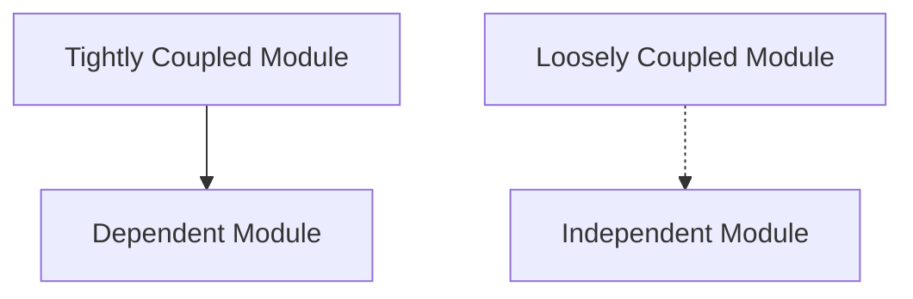

## 25.8 Tight Coupling and Poor Module Design

In the realm of software development, particularly in JavaScript, the concepts of tight coupling and poor module design are critical to understand and address. These anti-patterns can significantly hinder the flexibility, maintainability, and reusability of your code. In this section, we will delve into what tight coupling is, its drawbacks, and how to mitigate it through effective module design and the adoption of best practices.

### Understanding Tight Coupling

**Tight coupling** refers to a scenario where components or modules in a software system are highly dependent on each other. This dependency means that a change in one module often necessitates changes in another, leading to a fragile codebase that is difficult to maintain and extend.

#### Drawbacks of Tight Coupling

1. **Reduced Flexibility**: When modules are tightly coupled, it becomes challenging to modify or replace one module without affecting others. This lack of flexibility can stifle innovation and adaptation to new requirements.

2. **Difficult Maintenance**: Tightly coupled systems are harder to maintain because changes in one area can have ripple effects throughout the codebase. This complexity increases the risk of introducing bugs during updates.

3. **Limited Reusability**: Modules that are tightly coupled are often specific to a particular context, making them difficult to reuse in different projects or scenarios.

4. **Challenging Testing**: Testing tightly coupled modules can be cumbersome because they often require the presence of other modules, making unit testing less effective.

#### Example of Tightly Coupled Code

Consider the following example of tightly coupled JavaScript code:

```javascript
class User {
  constructor(name, email) {
    this.name = name;
    this.email = email;
    this.notificationService = new EmailNotificationService();
  }

  notify(message) {
    this.notificationService.sendEmail(this.email, message);
  }
}

class EmailNotificationService {
  sendEmail(email, message) {
    console.log(`Sending email to ${email}: ${message}`);
  }
}
```

In this example, the `User` class is tightly coupled with the `EmailNotificationService`. If we wanted to change the notification method (e.g., to SMS), we would need to modify the `User` class, violating the open/closed principle.

### Benefits of Loose Coupling

**Loose coupling** is the opposite of tight coupling and is characterized by components or modules that are independent of each other. This independence brings several advantages:

1. **Improved Maintainability**: Loose coupling allows developers to modify one module without affecting others, making the system easier to maintain.

2. **Easier Testing and Mocking**: Independent modules can be tested in isolation, simplifying the testing process and improving test coverage.

3. **Enhanced Reusability**: Loosely coupled modules are more generic and can be reused across different projects and contexts.

### Strategies to Reduce Coupling

To achieve loose coupling, consider implementing the following strategies:

#### 1. Implementing Interfaces or Abstract Classes

By defining interfaces or abstract classes, you can decouple the implementation details from the interface, allowing for more flexible and interchangeable components.

```javascript
class NotificationService {
  send(message) {
    throw new Error('Method not implemented.');
  }
}

class EmailNotificationService extends NotificationService {
  send(message) {
    console.log(`Sending email: ${message}`);
  }
}

class SMSNotificationService extends NotificationService {
  send(message) {
    console.log(`Sending SMS: ${message}`);
  }
}
```

#### 2. Using Dependency Injection

Dependency injection is a design pattern that allows a class to receive its dependencies from an external source rather than creating them internally. This approach promotes loose coupling and enhances testability.

```javascript
class User {
  constructor(name, email, notificationService) {
    this.name = name;
    this.email = email;
    this.notificationService = notificationService;
  }

  notify(message) {
    this.notificationService.send(message);
  }
}

// Usage
const emailService = new EmailNotificationService();
const user = new User('John Doe', 'john@example.com', emailService);
user.notify('Welcome to our service!');
```

#### 3. Applying Design Patterns

Design patterns like the Observer or Strategy pattern can help reduce coupling by promoting separation of concerns and enabling flexible interactions between components.

##### Observer Pattern

The Observer pattern allows an object (the subject) to notify other objects (observers) about changes in its state. This pattern is useful for implementing event-driven systems.

```javascript
class Subject {
  constructor() {
    this.observers = [];
  }

  addObserver(observer) {
    this.observers.push(observer);
  }

  notifyObservers(message) {
    this.observers.forEach(observer => observer.update(message));
  }
}

class Observer {
  update(message) {
    console.log(`Observer received message: ${message}`);
  }
}

// Usage
const subject = new Subject();
const observer1 = new Observer();
const observer2 = new Observer();

subject.addObserver(observer1);
subject.addObserver(observer2);

subject.notifyObservers('Hello Observers!');
```

##### Strategy Pattern

The Strategy pattern defines a family of algorithms, encapsulates each one, and makes them interchangeable. This pattern allows the algorithm to vary independently from clients that use it.

```javascript
class NotificationContext {
  constructor(strategy) {
    this.strategy = strategy;
  }

  executeStrategy(message) {
    this.strategy.send(message);
  }
}

// Usage
const smsService = new SMSNotificationService();
const notificationContext = new NotificationContext(smsService);
notificationContext.executeStrategy('This is a test message.');
```

### Best Practices in Module Design

To design effective modules, consider the following best practices:

1. **Separation of Concerns**: Ensure that each module has a single responsibility and does not overlap with the responsibilities of other modules.

2. **Encapsulation**: Hide the internal details of a module and expose only what is necessary through a well-defined interface.

3. **Modularity**: Design modules to be self-contained and independent, facilitating reuse and easier maintenance.

4. **Cohesion**: Ensure that the elements within a module are related and work together to achieve a common purpose.

5. **Avoid Global State**: Minimize the use of global variables and state to prevent unintended interactions between modules.

### Visualizing Tight vs. Loose Coupling

To better understand the difference between tight and loose coupling, consider the following diagram:



**Diagram Description**: The diagram illustrates the difference between tightly coupled and loosely coupled modules. In the tightly coupled scenario, Module A is directly dependent on Module B, whereas in the loosely coupled scenario, Module C interacts with Module D through an interface or abstraction, allowing for independence.

### Knowledge Check

To reinforce your understanding of tight coupling and poor module design, consider the following questions:

1. What is tight coupling, and why is it considered an anti-pattern?
2. How does loose coupling improve the maintainability of a codebase?
3. What are some strategies to achieve loose coupling in JavaScript?
4. How does the Observer pattern help in reducing coupling between components?
5. Why is dependency injection beneficial for module design?

### Embrace the Journey

Remember, mastering module design and reducing tight coupling is a journey. As you continue to develop your skills, you'll find that creating loosely coupled, well-designed modules will lead to more robust and adaptable software. Keep experimenting, stay curious, and enjoy the process of refining your code!

### References and Further Reading

- [MDN Web Docs: JavaScript Modules](https://developer.mozilla.org/en-US/docs/Web/JavaScript/Guide/Modules)
- [W3Schools: JavaScript Design Patterns](https://www.w3schools.com/js/js_design_patterns.asp)
- [Refactoring Guru: Design Patterns](https://refactoring.guru/design-patterns)

## Quiz: Understanding Tight Coupling and Module Design



### What is tight coupling in software design?

- [x] A scenario where components are highly dependent on each other
- [ ] A scenario where components are independent of each other
- [ ] A scenario where components are loosely connected
- [ ] A scenario where components are not connected at all

> **Explanation:** Tight coupling occurs when components or modules are highly dependent on each other, making changes in one component affect others.

### Which of the following is a benefit of loose coupling?

- [x] Improved maintainability
- [ ] Increased complexity
- [ ] Reduced flexibility
- [ ] More dependencies

> **Explanation:** Loose coupling improves maintainability by allowing changes in one module without affecting others.

### How can dependency injection help reduce coupling?

- [x] By allowing a class to receive its dependencies from an external source
- [ ] By embedding dependencies within the class
- [ ] By removing all dependencies
- [ ] By creating dependencies at runtime

> **Explanation:** Dependency injection allows a class to receive its dependencies from an external source, promoting loose coupling.

### What is the primary purpose of the Observer pattern?

- [x] To allow an object to notify other objects about changes in its state
- [ ] To encapsulate a family of algorithms
- [ ] To define a one-to-one relationship between objects
- [ ] To create a global state

> **Explanation:** The Observer pattern allows an object (the subject) to notify other objects (observers) about changes in its state.

### Which design pattern encapsulates a family of algorithms?

- [x] Strategy Pattern
- [ ] Observer Pattern
- [ ] Singleton Pattern
- [ ] Factory Pattern

> **Explanation:** The Strategy pattern encapsulates a family of algorithms, allowing them to be interchangeable.

### What is a key characteristic of a well-designed module?

- [x] It has a single responsibility
- [ ] It depends on multiple other modules
- [ ] It exposes all its internal details
- [ ] It uses global variables extensively

> **Explanation:** A well-designed module should have a single responsibility, promoting separation of concerns.

### Why is encapsulation important in module design?

- [x] It hides internal details and exposes only necessary interfaces
- [ ] It makes all internal details public
- [ ] It increases the complexity of the module
- [ ] It reduces the module's functionality

> **Explanation:** Encapsulation hides the internal details of a module and exposes only what is necessary through a well-defined interface.

### What is the effect of using global state in module design?

- [x] It can lead to unintended interactions between modules
- [ ] It simplifies module interactions
- [ ] It enhances module independence
- [ ] It reduces the need for interfaces

> **Explanation:** Using global state can lead to unintended interactions between modules, making the system harder to maintain.

### True or False: Loose coupling makes it easier to test modules in isolation.

- [x] True
- [ ] False

> **Explanation:** Loose coupling allows modules to be tested in isolation, simplifying the testing process.

### True or False: The Strategy pattern allows for dynamic selection of algorithms at runtime.

- [x] True
- [ ] False

> **Explanation:** The Strategy pattern allows for dynamic selection of algorithms at runtime, making them interchangeable.




