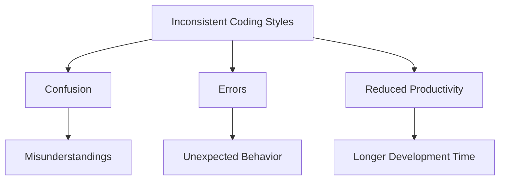

## 25.9 Inconsistent Coding Styles

In the realm of software development, especially in JavaScript, maintaining a consistent coding style is crucial for readability, collaboration, and overall code quality. Inconsistent coding styles can lead to confusion, errors, and reduced team productivity. Let's delve into why consistency matters, identify common inconsistencies, and explore tools and practices to enforce a uniform coding style.

### The Importance of Consistent Coding Styles

A consistent coding style is the backbone of a maintainable codebase. It ensures that code is readable and understandable, not just by the original author but by any developer who might work on it in the future. Here are some key reasons why consistent coding styles are vital:

- **Readability**: Consistent styles make it easier to read and understand code. Developers can quickly grasp the structure and flow of the code without being distracted by varying styles.
- **Collaboration**: In a team setting, a consistent style allows multiple developers to work on the same codebase without confusion. It reduces the cognitive load required to switch between different coding styles.
- **Reduced Errors**: Consistency helps in identifying errors more easily. When code follows a predictable pattern, deviations stand out, making it easier to spot mistakes.
- **Efficient Code Reviews**: Code reviews become more efficient when reviewers don't have to focus on style issues and can concentrate on logic and functionality instead.

### Common Inconsistencies in Coding Styles

Inconsistent coding styles can manifest in various forms. Here are some of the most common inconsistencies:

#### Naming Conventions

Naming conventions refer to how variables, functions, classes, and other identifiers are named. Inconsistencies in naming can lead to confusion and errors.

- **CamelCase vs. snake_case**: Mixing these styles can make it difficult to predict how a variable or function is named.
- **Abbreviations and Acronyms**: Inconsistent use of abbreviations can lead to misunderstandings. For example, using `btn` in one part of the code and `button` in another.
- **Descriptive vs. Non-descriptive Names**: Using non-descriptive names can obscure the purpose of a variable or function.

#### Indentation and Spacing

Proper indentation and spacing are crucial for code readability. Inconsistent indentation can make code difficult to follow.

- **Tabs vs. Spaces**: Mixing tabs and spaces can lead to misaligned code, especially when viewed in different editors.
- **Line Length**: Inconsistent line lengths can make code hard to read and maintain.
- **Spacing Around Operators**: Inconsistent spacing around operators can affect readability.

#### Code Formatting

Code formatting includes the arrangement of code elements, such as braces, parentheses, and semicolons.

- **Braces on New Lines vs. Same Line**: Different styles for placing braces can lead to confusion.
- **Semicolon Usage**: Inconsistent use of semicolons can lead to unexpected behavior in JavaScript.
- **Trailing Commas**: Inconsistent use of trailing commas can lead to syntax errors in some environments.

### Examples of Inconsistent Code and Its Impact

Let's look at an example of inconsistent code and how it can affect readability and maintainability:

```javascript
// Inconsistent Naming Conventions
function fetchData() {
    let user_data = getUserData(); // snake_case
    let UserInfo = processUserData(user_data); // PascalCase
    return userInfo; // camelCase
}

// Inconsistent Indentation and Spacing
function calculateSum(a,b){
    return a+b;
}

// Inconsistent Code Formatting
if (isValid) {
    doSomething()
} else
{
    doSomethingElse();
}
```

**Impact**: The above code is difficult to read and understand due to inconsistent naming conventions, indentation, and formatting. It can lead to errors, especially when multiple developers work on the same codebase.

### Tools and Practices to Enforce Consistency

To maintain a consistent coding style, it's essential to establish and adhere to team-wide coding standards. Here are some tools and practices that can help:

#### Code Style Guides

A code style guide is a set of conventions that a team agrees to follow. It serves as a reference for writing consistent code. Some popular JavaScript style guides include:

- **Airbnb JavaScript Style Guide**: A widely adopted style guide that covers various aspects of JavaScript coding.
- **Google JavaScript Style Guide**: Another comprehensive guide that provides detailed conventions for writing JavaScript code.

#### Automated Linters

Linters are tools that analyze code for potential errors and enforce coding standards. They can automatically detect and highlight inconsistencies in coding styles.

- **ESLint**: A popular linter for JavaScript that can be configured to enforce specific coding standards. It provides a wide range of rules and can be customized to fit a team's needs.

```json
// Example ESLint Configuration
{
  "extends": "airbnb",
  "rules": {
    "indent": ["error", 2],
    "quotes": ["error", "single"],
    "semi": ["error", "always"]
  }
}
```

#### Code Formatters

Code formatters automatically format code according to a predefined style. They can be integrated into development environments to ensure consistent formatting.

- **Prettier**: A popular code formatter that supports JavaScript and many other languages. It enforces a consistent style by automatically formatting code.

```bash
# Example Prettier Command
prettier --write "src/**/*.js"
```

### Establishing and Adhering to Team-Wide Coding Standards

To ensure consistency, it's crucial to establish team-wide coding standards and practices. Here are some steps to achieve this:

1. **Agree on a Style Guide**: Choose a style guide that fits the team's needs and agree to follow it.
2. **Configure Linters and Formatters**: Set up tools like ESLint and Prettier to automatically enforce the chosen style guide.
3. **Integrate Tools into Development Workflow**: Integrate linters and formatters into the development workflow, such as pre-commit hooks or continuous integration pipelines.
4. **Conduct Code Reviews**: Use code reviews to ensure adherence to coding standards and provide feedback.
5. **Educate Team Members**: Provide training and resources to help team members understand and follow the coding standards.

### Try It Yourself

To better understand the impact of inconsistent coding styles, try modifying the following code example to adhere to a consistent style:

```javascript
// Original Code
function fetchData() {
    let user_data = getUserData();
    let UserInfo = processUserData(user_data);
    return userInfo;
}

function calculateSum(a,b){
    return a+b;
}

if (isValid) {
    doSomething()
} else
{
    doSomethingElse();
}
```

**Challenge**: Refactor the code to use consistent naming conventions, indentation, and formatting. Consider using tools like ESLint and Prettier to automate the process.

### Visualizing the Impact of Inconsistent Coding Styles

To visualize the impact of inconsistent coding styles, consider the following diagram, which illustrates how different styles can lead to confusion and errors:



**Diagram Description**: This diagram shows how inconsistent coding styles can lead to confusion, errors, and reduced productivity, ultimately affecting the overall quality of the codebase.

### References and Links

For further reading on coding styles and tools, consider the following resources:

- [Airbnb JavaScript Style Guide](https://github.com/airbnb/javascript)
- [Google JavaScript Style Guide](https://google.github.io/styleguide/jsguide.html)
- [ESLint Documentation](https://eslint.org/docs/user-guide/getting-started)
- [Prettier Documentation](https://prettier.io/docs/en/index.html)

### Knowledge Check

To reinforce your understanding of inconsistent coding styles, consider the following questions:

1. What are the benefits of maintaining a consistent coding style in a codebase?
2. How can inconsistent naming conventions lead to confusion in a project?
3. Why is it important to agree on a style guide within a development team?
4. How can tools like ESLint and Prettier help enforce coding standards?
5. What are some common inconsistencies in code formatting?

### Embrace the Journey

Remember, maintaining a consistent coding style is an ongoing process that requires commitment and collaboration. As you progress in your development journey, continue to refine your coding practices and embrace the tools and resources available to you. Keep experimenting, stay curious, and enjoy the journey!

## Understanding Inconsistent Coding Styles in JavaScript



### What is a primary benefit of maintaining a consistent coding style?

- [x] Improved readability
- [ ] Faster execution
- [ ] Reduced file size
- [ ] Increased security

> **Explanation:** Consistent coding styles improve readability, making it easier for developers to understand and maintain the code.

### Which tool can be used to automatically format JavaScript code?

- [x] Prettier
- [ ] Babel
- [ ] Webpack
- [ ] Node.js

> **Explanation:** Prettier is a code formatter that automatically formats code according to a predefined style.

### What is a common inconsistency in naming conventions?

- [x] Mixing CamelCase and snake_case
- [ ] Using only lowercase letters
- [ ] Using numbers in variable names
- [ ] Using long variable names

> **Explanation:** Mixing CamelCase and snake_case can lead to confusion and inconsistency in naming conventions.

### Which of the following is a popular JavaScript style guide?

- [x] Airbnb JavaScript Style Guide
- [ ] Python PEP 8
- [ ] Ruby Style Guide
- [ ] Java Code Conventions

> **Explanation:** The Airbnb JavaScript Style Guide is a widely adopted style guide for JavaScript development.

### How can ESLint help in maintaining coding standards?

- [x] By analyzing code for potential errors and enforcing rules
- [ ] By compiling JavaScript code
- [ ] By optimizing code for performance
- [ ] By providing a graphical user interface

> **Explanation:** ESLint is a linter that analyzes code for potential errors and enforces coding standards through configurable rules.

### What is the impact of inconsistent indentation in code?

- [x] It makes code difficult to read and understand
- [ ] It increases code execution time
- [ ] It reduces code security
- [ ] It improves code performance

> **Explanation:** Inconsistent indentation makes code difficult to read and understand, leading to potential errors.

### Which practice can help enforce a consistent coding style across a team?

- [x] Conducting code reviews
- [ ] Writing code in different languages
- [ ] Using multiple style guides
- [ ] Avoiding documentation

> **Explanation:** Conducting code reviews helps ensure adherence to coding standards and provides feedback for improvement.

### What is a potential consequence of inconsistent code formatting?

- [x] Unexpected behavior in code execution
- [ ] Faster code execution
- [ ] Increased code security
- [ ] Reduced file size

> **Explanation:** Inconsistent code formatting can lead to unexpected behavior, especially in languages like JavaScript where formatting can affect execution.

### Which tool can be used to analyze JavaScript code for potential errors?

- [x] ESLint
- [ ] Prettier
- [ ] Babel
- [ ] Webpack

> **Explanation:** ESLint is a tool used to analyze JavaScript code for potential errors and enforce coding standards.

### True or False: Consistent coding styles are only important for large teams.

- [ ] True
- [x] False

> **Explanation:** Consistent coding styles are important for any team size, as they improve readability, maintainability, and collaboration.


