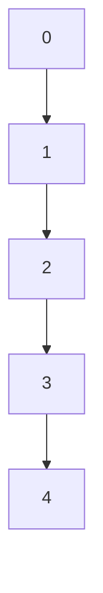
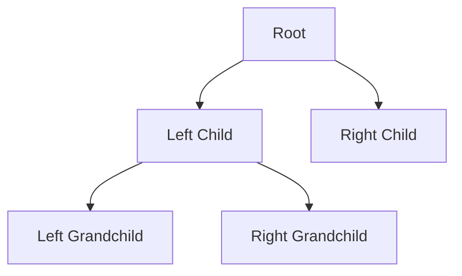

## 26.1 Importance of Algorithms and Data Structures

In the realm of software development, particularly in JavaScript, understanding algorithms and data structures is paramount. These foundational concepts are not just academic exercises but are crucial tools that empower developers to write efficient, scalable, and maintainable code. Let's delve into what algorithms and data structures are, why they are essential, and how they can significantly impact the performance and efficiency of your JavaScript applications.

### Understanding Algorithms and Data Structures

**Algorithms** are step-by-step procedures or formulas for solving problems. They are the backbone of computer programming, providing a clear set of instructions to achieve a desired outcome. Algorithms can range from simple operations like sorting a list to complex tasks like image processing or machine learning.

**Data Structures**, on the other hand, are ways of organizing and storing data so that it can be accessed and modified efficiently. Common data structures include arrays, linked lists, stacks, queues, trees, and graphs. Each data structure has its own strengths and weaknesses, making it suitable for different types of applications.

### Why Algorithms and Data Structures Matter

1. **Efficiency**: The right algorithm and data structure can drastically reduce the time complexity of a program. For instance, searching for an element in an unsorted array is O(n), but using a hash table can reduce this to O(1).

2. **Scalability**: As applications grow, the choice of data structures and algorithms becomes even more critical. Efficient algorithms and data structures ensure that applications can handle increased loads without performance degradation.

3. **Maintainability**: Code that uses appropriate data structures and algorithms is often easier to understand and maintain. This is because the logic is clear and follows well-established patterns.

4. **Problem Solving**: Mastering algorithms and data structures enhances your problem-solving skills. It allows you to break down complex problems into manageable parts and tackle them systematically.

### Examples of Performance Improvement

Let's explore some scenarios where choosing the right data structure can lead to significant performance improvements.

#### Example 1: Searching and Sorting

Consider a scenario where you need to search for an element in a collection. Using a simple array, the search operation might require iterating through each element, resulting in O(n) time complexity. However, if the data is stored in a binary search tree, the search operation can be reduced to O(log n).

```javascript
// Example of searching in an array
function linearSearch(arr, target) {
  for (let i = 0; i < arr.length; i++) {
    if (arr[i] === target) {
      return i;
    }
  }
  return -1;
}

// Example of searching in a binary search tree
class TreeNode {
  constructor(value) {
    this.value = value;
    this.left = null;
    this.right = null;
  }
}

function binarySearchTreeSearch(root, target) {
  if (!root) return null;
  if (root.value === target) return root;
  if (target < root.value) return binarySearchTreeSearch(root.left, target);
  return binarySearchTreeSearch(root.right, target);
}
```

#### Example 2: Data Retrieval

When dealing with frequent data retrieval operations, using a hash table can significantly improve performance. Hash tables provide average O(1) time complexity for lookups, making them ideal for applications like caching.

```javascript
// Example of using a hash table for fast data retrieval
const cache = new Map();

function getData(key) {
  if (cache.has(key)) {
    return cache.get(key);
  }
  // Simulate data retrieval
  const data = fetchDataFromDatabase(key);
  cache.set(key, data);
  return data;
}
```

### Visualizing Data Structures

To better understand how data structures work, let's visualize a few common ones using Mermaid.js diagrams.

#### Array



*Caption: An array is a linear data structure where elements are indexed.*

#### Binary Search Tree



*Caption: A binary search tree organizes data hierarchically, allowing for efficient searching.*

### Encouraging Further Exploration

Understanding algorithms and data structures is a journey that requires practice and continuous learning. Here are some steps you can take to deepen your knowledge:

- **Study Classic Algorithms**: Familiarize yourself with classic algorithms like sorting (quick sort, merge sort) and searching (binary search).

- **Explore Advanced Data Structures**: Learn about advanced data structures like heaps, graphs, and tries.

- **Solve Problems**: Engage in coding challenges on platforms like LeetCode or HackerRank to apply your knowledge in practical scenarios.

- **Read Books**: Consider reading books like "Introduction to Algorithms" by Cormen et al. or "Data Structures and Algorithms in JavaScript" by Michael McMillan.

- **Join Communities**: Participate in developer communities and forums to exchange knowledge and experiences.

### Setting the Stage for Further Learning

As we move forward in this guide, we will explore specific data structures and algorithms in detail. We will examine their implementation in JavaScript, discuss their use cases, and provide practical examples to solidify your understanding. Remember, mastering these concepts will not only make you a better developer but also open up new opportunities in your career.

### Knowledge Check

Before we conclude, let's test your understanding of the importance of algorithms and data structures with a few questions.

## Quiz: Mastering Algorithms and Data Structures in JavaScript



### What is the primary benefit of using efficient algorithms and data structures?

- [x] Improved performance and scalability
- [ ] Reduced code complexity
- [ ] Enhanced user interface design
- [ ] Simplified debugging process

> **Explanation:** Efficient algorithms and data structures improve performance and scalability by optimizing resource usage and reducing time complexity.

### Which data structure provides average O(1) time complexity for lookups?

- [x] Hash Table
- [ ] Array
- [ ] Linked List
- [ ] Binary Tree

> **Explanation:** Hash tables provide average O(1) time complexity for lookups due to their key-value mapping.

### What is the time complexity of searching an element in a binary search tree?

- [x] O(log n)
- [ ] O(n)
- [ ] O(n^2)
- [ ] O(1)

> **Explanation:** Searching in a balanced binary search tree has a time complexity of O(log n).

### Which of the following is a linear data structure?

- [x] Array
- [ ] Graph
- [ ] Tree
- [ ] Hash Table

> **Explanation:** An array is a linear data structure where elements are stored in contiguous memory locations.

### What is the primary purpose of using a binary search tree?

- [x] Efficient searching and sorting
- [ ] Storing data in a linear fashion
- [ ] Managing network connections
- [ ] Simplifying user input

> **Explanation:** Binary search trees are used for efficient searching and sorting due to their hierarchical structure.

### Which of the following is NOT a benefit of using appropriate data structures?

- [ ] Improved code maintainability
- [ ] Enhanced problem-solving skills
- [x] Increased code redundancy
- [ ] Better performance

> **Explanation:** Appropriate data structures reduce code redundancy, not increase it.

### What is the time complexity of linear search in an unsorted array?

- [x] O(n)
- [ ] O(log n)
- [ ] O(1)
- [ ] O(n^2)

> **Explanation:** Linear search in an unsorted array has a time complexity of O(n) as it requires checking each element.

### Which data structure is ideal for implementing a cache?

- [x] Hash Table
- [ ] Stack
- [ ] Queue
- [ ] Linked List

> **Explanation:** Hash tables are ideal for implementing caches due to their fast lookup times.

### What is the key advantage of using a binary search over a linear search?

- [x] Faster search time in sorted data
- [ ] Easier implementation
- [ ] Requires less memory
- [ ] Works with unsorted data

> **Explanation:** Binary search is faster than linear search in sorted data due to its divide-and-conquer approach.

### True or False: Understanding algorithms and data structures is only important for backend developers.

- [ ] True
- [x] False

> **Explanation:** Understanding algorithms and data structures is crucial for all developers, including frontend, backend, and full-stack, as it enhances problem-solving and code efficiency.



Remember, this is just the beginning. As you progress, you'll build more complex and interactive applications. Keep experimenting, stay curious, and enjoy the journey!
