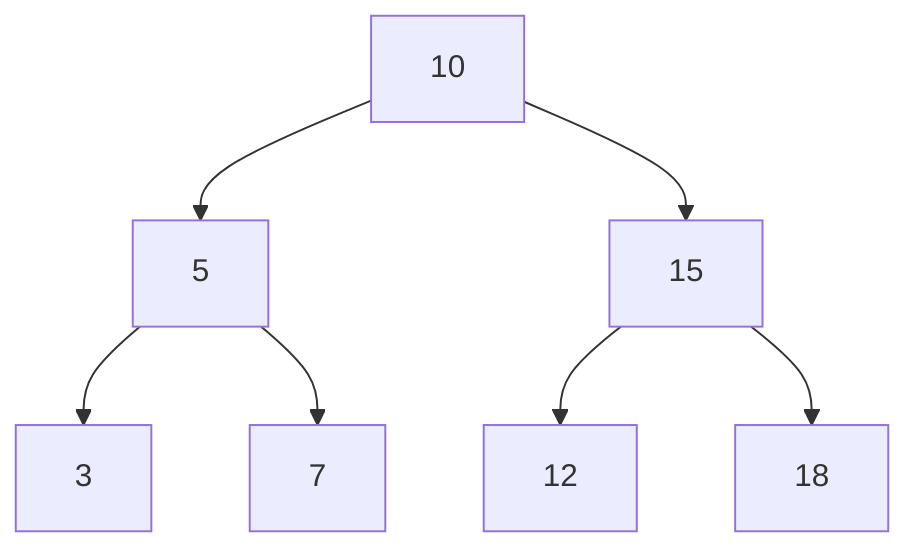

## 26.2 Arrays, Lists, and Trees

In the realm of programming, data structures are the backbone of efficient algorithms and applications. JavaScript, being a versatile language, offers a variety of data structures that can be leveraged to solve complex problems. In this section, we will delve into arrays, linked lists, and tree structures, exploring their implementation, use cases, and performance considerations.

### Arrays in JavaScript

Arrays are one of the most fundamental data structures in JavaScript. They are ordered collections of elements, which can be accessed by their index. JavaScript arrays are dynamic, meaning they can grow and shrink in size, and they can hold elements of different types.

#### Key Features of Arrays

- **Dynamic Sizing**: Arrays in JavaScript can change size dynamically, which means you can add or remove elements without worrying about the initial size.
- **Heterogeneous Elements**: Arrays can store elements of different types, including numbers, strings, objects, and even other arrays.
- **Built-in Methods**: JavaScript provides a plethora of built-in methods to manipulate arrays, such as `push`, `pop`, `shift`, `unshift`, `map`, `filter`, `reduce`, and many more.

#### Common Array Methods

```javascript
// Creating an array
let fruits = ['apple', 'banana', 'cherry'];

// Adding elements
fruits.push('date'); // ['apple', 'banana', 'cherry', 'date']

// Removing elements
let lastFruit = fruits.pop(); // 'date', fruits is now ['apple', 'banana', 'cherry']

// Iterating over an array
fruits.forEach(fruit => console.log(fruit));

// Transforming an array
let upperFruits = fruits.map(fruit => fruit.toUpperCase()); // ['APPLE', 'BANANA', 'CHERRY']
```

#### Use Cases for Arrays

- **Storing Collections**: Arrays are ideal for storing collections of data where order matters.
- **Iteration and Transformation**: Arrays are perfect for operations that require iteration and transformation of data.
- **Stack and Queue Implementations**: Arrays can be used to implement stacks (LIFO) and queues (FIFO) using methods like `push`/`pop` and `shift`/`unshift`.

#### Performance Considerations

- **Access Time**: Accessing an element by index is O(1), making arrays efficient for lookups.
- **Insertion/Deletion**: Inserting or deleting elements at the beginning or middle of an array can be costly (O(n)) due to the need to shift elements.

### Linked Lists

Linked lists are linear data structures where elements, called nodes, are linked using pointers. Unlike arrays, linked lists do not require contiguous memory allocation, making them more flexible in certain scenarios.

#### Singly Linked Lists

A singly linked list is a collection of nodes where each node contains data and a reference (or link) to the next node in the sequence.

```javascript
class Node {
  constructor(data) {
    this.data = data;
    this.next = null;
  }
}

class SinglyLinkedList {
  constructor() {
    this.head = null;
  }

  // Add a node at the end
  append(data) {
    const newNode = new Node(data);
    if (!this.head) {
      this.head = newNode;
      return;
    }
    let current = this.head;
    while (current.next) {
      current = current.next;
    }
    current.next = newNode;
  }

  // Print the list
  printList() {
    let current = this.head;
    while (current) {
      console.log(current.data);
      current = current.next;
    }
  }
}

const list = new SinglyLinkedList();
list.append(1);
list.append(2);
list.append(3);
list.printList(); // Outputs: 1 2 3
```

#### Doubly Linked Lists

A doubly linked list is similar to a singly linked list, but each node contains references to both the next and previous nodes, allowing bidirectional traversal.

```javascript
class DoublyNode {
  constructor(data) {
    this.data = data;
    this.next = null;
    this.prev = null;
  }
}

class DoublyLinkedList {
  constructor() {
    this.head = null;
    this.tail = null;
  }

  // Add a node at the end
  append(data) {
    const newNode = new DoublyNode(data);
    if (!this.head) {
      this.head = newNode;
      this.tail = newNode;
      return;
    }
    this.tail.next = newNode;
    newNode.prev = this.tail;
    this.tail = newNode;
  }

  // Print the list from head to tail
  printList() {
    let current = this.head;
    while (current) {
      console.log(current.data);
      current = current.next;
    }
  }
}

const dList = new DoublyLinkedList();
dList.append(1);
dList.append(2);
dList.append(3);
dList.printList(); // Outputs: 1 2 3
```

#### Use Cases for Linked Lists

- **Dynamic Memory Allocation**: Linked lists are useful when the size of the data structure is unknown or changes frequently.
- **Efficient Insertions/Deletions**: Inserting or deleting nodes in a linked list is O(1) if the node reference is known, making them efficient for such operations.

#### Performance Considerations

- **Access Time**: Accessing an element in a linked list is O(n) since it requires traversal from the head.
- **Memory Overhead**: Linked lists require extra memory for storing pointers, which can be a disadvantage compared to arrays.

### Tree Structures

Trees are hierarchical data structures consisting of nodes, where each node has zero or more child nodes. Trees are used to represent hierarchical relationships and are fundamental in various algorithms and applications.

#### Binary Trees

A binary tree is a tree data structure where each node has at most two children, referred to as the left child and the right child.

```javascript
class TreeNode {
  constructor(data) {
    this.data = data;
    this.left = null;
    this.right = null;
  }
}

class BinaryTree {
  constructor() {
    this.root = null;
  }

  // Insert a node in the tree
  insert(data) {
    const newNode = new TreeNode(data);
    if (!this.root) {
      this.root = newNode;
      return;
    }
    this._insertNode(this.root, newNode);
  }

  _insertNode(node, newNode) {
    if (newNode.data < node.data) {
      if (!node.left) {
        node.left = newNode;
      } else {
        this._insertNode(node.left, newNode);
      }
    } else {
      if (!node.right) {
        node.right = newNode;
      } else {
        this._insertNode(node.right, newNode);
      }
    }
  }

  // In-order traversal
  inOrder(node = this.root) {
    if (node) {
      this.inOrder(node.left);
      console.log(node.data);
      this.inOrder(node.right);
    }
  }
}

const bTree = new BinaryTree();
bTree.insert(10);
bTree.insert(5);
bTree.insert(15);
bTree.inOrder(); // Outputs: 5 10 15
```

#### Binary Search Trees (BST)

A binary search tree is a binary tree with the property that for each node, all elements in the left subtree are less than the node, and all elements in the right subtree are greater.

#### AVL Trees

An AVL tree is a self-balancing binary search tree where the difference between heights of left and right subtrees cannot be more than one for all nodes. This ensures O(log n) time complexity for insertions, deletions, and lookups.

#### Use Cases for Trees

- **Hierarchical Data Representation**: Trees are ideal for representing hierarchical data, such as file systems and organizational structures.
- **Efficient Searching and Sorting**: Binary search trees provide efficient searching and sorting operations.
- **Balancing and Optimization**: AVL trees and other balanced trees ensure optimal performance for dynamic datasets.

#### Performance Considerations

- **Access Time**: Accessing elements in a balanced tree is O(log n), while in an unbalanced tree, it can degrade to O(n).
- **Memory Usage**: Trees require additional memory for pointers, similar to linked lists.

### Visualizing Tree Structures

To better understand tree structures, let's visualize a binary search tree:



This diagram represents a binary search tree with the root node `10`, and its children and grandchildren.

### Try It Yourself

Experiment with the code examples provided by modifying the data or methods. For instance, try adding a method to delete a node from the linked list or binary tree. Observe how the structure changes and ensure the integrity of the data structure is maintained.

### Knowledge Check

- What are the advantages of using arrays over linked lists?
- How does a binary search tree differ from a binary tree?
- What are the benefits of using an AVL tree over a regular binary search tree?

### Summary

In this section, we explored arrays, linked lists, and tree structures in JavaScript. Each data structure has its unique advantages and use cases, and understanding them is crucial for efficient algorithm design and implementation. Remember, this is just the beginning. As you progress, you'll build more complex and interactive applications. Keep experimenting, stay curious, and enjoy the journey!

## Quiz: Mastering JavaScript Arrays, Lists, and Trees



### What is the time complexity of accessing an element by index in a JavaScript array?

- [x] O(1)
- [ ] O(n)
- [ ] O(log n)
- [ ] O(n^2)

> **Explanation:** Accessing an element by index in an array is O(1) because it is a direct lookup.

### Which data structure is best suited for dynamic memory allocation?

- [ ] Arrays
- [x] Linked Lists
- [ ] Binary Trees
- [ ] Stacks

> **Explanation:** Linked lists are ideal for dynamic memory allocation as they do not require contiguous memory.

### In a binary search tree, where are elements less than the root node stored?

- [x] Left subtree
- [ ] Right subtree
- [ ] At the root
- [ ] In a separate tree

> **Explanation:** In a binary search tree, elements less than the root node are stored in the left subtree.

### What is the main advantage of using a doubly linked list over a singly linked list?

- [x] Bidirectional traversal
- [ ] Faster access time
- [ ] Less memory usage
- [ ] Simpler implementation

> **Explanation:** A doubly linked list allows bidirectional traversal, which is not possible in a singly linked list.

### What is the time complexity of inserting a node in an AVL tree?

- [ ] O(1)
- [ ] O(n)
- [x] O(log n)
- [ ] O(n^2)

> **Explanation:** Inserting a node in an AVL tree is O(log n) due to its self-balancing property.

### Which method is used to add an element to the end of a JavaScript array?

- [x] push
- [ ] pop
- [ ] shift
- [ ] unshift

> **Explanation:** The `push` method adds an element to the end of an array.

### What is the main disadvantage of using linked lists compared to arrays?

- [x] O(n) access time
- [ ] Dynamic sizing
- [ ] Memory overhead
- [ ] Heterogeneous elements

> **Explanation:** Linked lists have O(n) access time because they require traversal from the head.

### In a binary tree, what is the maximum number of children a node can have?

- [x] 2
- [ ] 1
- [ ] 3
- [ ] Unlimited

> **Explanation:** In a binary tree, each node can have at most two children.

### What is the key difference between a binary tree and a binary search tree?

- [x] Order of elements
- [ ] Number of nodes
- [ ] Memory usage
- [ ] Implementation complexity

> **Explanation:** A binary search tree maintains an order where left subtree elements are less than the node, and right subtree elements are greater.

### True or False: Arrays in JavaScript can store elements of different types.

- [x] True
- [ ] False

> **Explanation:** JavaScript arrays can store elements of different types, such as numbers, strings, and objects.




