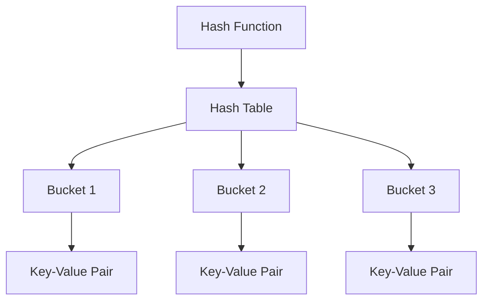

## 26.3 Hash Tables and Sets

In modern web development, efficient data retrieval is crucial for building responsive and scalable applications. Hash tables and sets are fundamental data structures that provide fast access to data. In this section, we will delve into the concepts of hash tables and sets in JavaScript, exploring their implementation, usage, and performance considerations.

### Understanding Hash Tables

Hash tables are data structures that store key-value pairs. They use a hash function to compute an index into an array of buckets or slots, from which the desired value can be found. The primary advantage of hash tables is their ability to provide average constant time complexity, O(1), for lookups, insertions, and deletions.

#### How Hash Tables Work

1. **Hash Function**: A hash function takes a key and computes an index in the hash table. The goal is to distribute keys uniformly across the table to minimize collisions.
2. **Buckets**: Each index in the hash table points to a bucket, which can store multiple key-value pairs in case of collisions.
3. **Collision Handling**: When two keys hash to the same index, a collision occurs. Common strategies to handle collisions include chaining (storing multiple elements in a bucket) and open addressing (finding another open slot).

### JavaScript's Implementation of Hash Tables

JavaScript provides several ways to implement hash tables, primarily through objects, `Map`, and `WeakMap`.

#### Objects as Hash Tables

In JavaScript, objects are often used as hash tables. They store key-value pairs, where keys are strings or symbols.

```javascript
// Using an object as a hash table
const hashTable = {};

// Adding key-value pairs
hashTable['name'] = 'Alice';
hashTable['age'] = 30;

// Accessing values
console.log(hashTable['name']); // Output: Alice

// Deleting a key-value pair
delete hashTable['age'];
```

**Limitations**: Objects have limitations, such as keys being limited to strings and symbols, and potential prototype pollution.

#### `Map` for Enhanced Hash Tables

The `Map` object in JavaScript is a more robust implementation of a hash table. It allows keys of any type and maintains the order of insertion.

```javascript
// Using Map as a hash table
const map = new Map();

// Adding key-value pairs
map.set('name', 'Bob');
map.set(42, 'The Answer');

// Accessing values
console.log(map.get('name')); // Output: Bob

// Checking existence
console.log(map.has(42)); // Output: true

// Deleting a key-value pair
map.delete(42);
```

**Advantages**: `Map` provides better performance for frequent additions and removals, and it supports keys of any type.

#### `WeakMap` for Memory-Sensitive Applications

`WeakMap` is similar to `Map`, but its keys must be objects, and it does not prevent garbage collection of keys.

```javascript
// Using WeakMap
const weakMap = new WeakMap();
const objKey = { id: 1 };

// Adding key-value pairs
weakMap.set(objKey, 'WeakValue');

// Accessing values
console.log(weakMap.get(objKey)); // Output: WeakValue

// objKey can be garbage collected when no longer referenced
```

**Use Cases**: `WeakMap` is ideal for cases where you need to associate data with objects without preventing their garbage collection.

### Sets in JavaScript

Sets are collections of unique values. They provide efficient operations for adding, deleting, and checking the existence of elements.

#### `Set` for Unique Collections

The `Set` object stores unique values of any type, whether primitive values or object references.

```javascript
// Using Set
const set = new Set();

// Adding values
set.add(1);
set.add(2);
set.add(2); // Duplicate, will not be added

// Checking existence
console.log(set.has(1)); // Output: true

// Deleting a value
set.delete(2);

// Iterating over a set
set.forEach(value => console.log(value)); // Output: 1
```

**Advantages**: `Set` provides fast access and ensures all elements are unique.

#### `WeakSet` for Object Collections

`WeakSet` is similar to `Set`, but it only stores objects and does not prevent their garbage collection.

```javascript
// Using WeakSet
const weakSet = new WeakSet();
const obj1 = { name: 'Object1' };

// Adding objects
weakSet.add(obj1);

// Checking existence
console.log(weakSet.has(obj1)); // Output: true

// obj1 can be garbage collected when no longer referenced
```

**Use Cases**: `WeakSet` is useful for tracking object references without preventing garbage collection.

### Handling Hash Collisions

Hash collisions occur when two keys hash to the same index. Effective collision handling is crucial for maintaining the performance of hash tables.

#### Chaining

Chaining involves storing multiple elements in a single bucket using a data structure like a linked list.

```javascript
// Example of chaining
class HashTable {
  constructor(size = 53) {
    this.keyMap = new Array(size);
  }

  _hash(key) {
    let total = 0;
    const WEIRD_PRIME = 31;
    for (let i = 0; i < Math.min(key.length, 100); i++) {
      const char = key[i];
      const value = char.charCodeAt(0) - 96;
      total = (total * WEIRD_PRIME + value) % this.keyMap.length;
    }
    return total;
  }

  set(key, value) {
    const index = this._hash(key);
    if (!this.keyMap[index]) {
      this.keyMap[index] = [];
    }
    this.keyMap[index].push([key, value]);
  }

  get(key) {
    const index = this._hash(key);
    if (this.keyMap[index]) {
      for (let i = 0; i < this.keyMap[index].length; i++) {
        if (this.keyMap[index][i][0] === key) {
          return this.keyMap[index][i][1];
        }
      }
    }
    return undefined;
  }
}

const ht = new HashTable();
ht.set('hello', 'world');
console.log(ht.get('hello')); // Output: world
```

#### Open Addressing

Open addressing finds another open slot in the hash table when a collision occurs. Techniques include linear probing, quadratic probing, and double hashing.

### Use Cases for Hash Tables and Sets

- **Hash Tables**: Ideal for scenarios requiring fast lookups, such as caching, indexing, and managing configurations.
- **Sets**: Useful for ensuring uniqueness, such as tracking unique users, tags, or categories.

### Performance Considerations

- **Load Factor**: The ratio of the number of elements to the number of buckets. A high load factor can lead to increased collisions and decreased performance.
- **Resizing**: Dynamically resizing the hash table when the load factor exceeds a threshold can help maintain performance.

### Try It Yourself

Experiment with the provided code examples by modifying keys, values, and operations. Observe how changes affect the behavior and performance of hash tables and sets.

### Visualizing Hash Tables and Sets



**Diagram Description**: This diagram illustrates the structure of a hash table, showing how a hash function maps keys to buckets, each containing key-value pairs.

### Knowledge Check

- What is a hash function, and why is it important in hash tables?
- How do `Map` and `WeakMap` differ in JavaScript?
- What are the advantages of using a `Set` over an array for storing unique values?
- How can hash collisions be handled in a hash table?
- Why might you choose a `WeakSet` over a `Set`?

### Summary

Hash tables and sets are powerful data structures that provide efficient data retrieval and management. By understanding their implementation and use cases, you can optimize your JavaScript applications for performance and scalability. Remember, this is just the beginning. As you progress, you'll build more complex and interactive web pages. Keep experimenting, stay curious, and enjoy the journey!

## Quiz: Mastering Hash Tables and Sets in JavaScript



### What is the primary advantage of using hash tables?

- [x] Fast average time complexity for lookups
- [ ] Simplified code structure
- [ ] Reduced memory usage
- [ ] Enhanced readability

> **Explanation:** Hash tables provide average constant time complexity, O(1), for lookups, insertions, and deletions.

### Which JavaScript object allows keys of any type?

- [ ] Object
- [x] Map
- [ ] Array
- [ ] Set

> **Explanation:** The `Map` object allows keys of any type, unlike objects which only allow strings and symbols as keys.

### How does `WeakMap` differ from `Map`?

- [x] `WeakMap` keys must be objects and can be garbage collected
- [ ] `WeakMap` allows primitive keys
- [ ] `WeakMap` maintains insertion order
- [ ] `WeakMap` prevents garbage collection of keys

> **Explanation:** `WeakMap` keys must be objects, and they do not prevent garbage collection of keys when no longer referenced.

### What is the purpose of a `Set` in JavaScript?

- [x] To store unique values
- [ ] To store key-value pairs
- [ ] To maintain insertion order
- [ ] To allow duplicate values

> **Explanation:** A `Set` stores unique values of any type, ensuring no duplicates.

### Which collision handling technique involves storing multiple elements in a single bucket?

- [x] Chaining
- [ ] Linear probing
- [ ] Quadratic probing
- [ ] Double hashing

> **Explanation:** Chaining involves storing multiple elements in a single bucket using a data structure like a linked list.

### What is a potential drawback of a high load factor in a hash table?

- [x] Increased collisions
- [ ] Reduced memory usage
- [ ] Faster lookups
- [ ] Simplified code

> **Explanation:** A high load factor can lead to increased collisions and decreased performance.

### Why might you use a `WeakSet` instead of a `Set`?

- [x] To allow objects to be garbage collected
- [ ] To store primitive values
- [ ] To maintain insertion order
- [ ] To prevent duplicates

> **Explanation:** `WeakSet` is useful for tracking object references without preventing their garbage collection.

### What is the main advantage of using `Map` over an object for key-value storage?

- [x] Supports keys of any type
- [ ] Simplified syntax
- [ ] Reduced memory usage
- [ ] Enhanced readability

> **Explanation:** `Map` supports keys of any type, unlike objects which only allow strings and symbols as keys.

### Which of the following is a characteristic of `WeakMap`?

- [x] Keys can be garbage collected
- [ ] Keys are primitive values
- [ ] Maintains insertion order
- [ ] Prevents garbage collection of keys

> **Explanation:** `WeakMap` keys can be garbage collected when no longer referenced.

### True or False: A `Set` can store duplicate values.

- [ ] True
- [x] False

> **Explanation:** A `Set` stores unique values, ensuring no duplicates.




