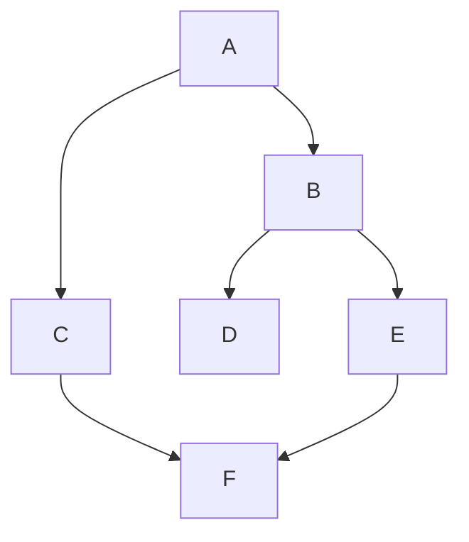

## 26.4 Graphs and Traversal Algorithms

Graphs are a fundamental data structure in computer science, used to model pairwise relations between objects. In this section, we will explore graphs, their representation in JavaScript, and traversal algorithms like Depth-First Search (DFS) and Breadth-First Search (BFS). These concepts are crucial for solving complex problems in various domains, such as social networks, routing, and more.

### Understanding Graphs

A **graph** is a collection of nodes, also known as vertices, and edges that connect pairs of nodes. Graphs can be either **directed** or **undirected**.

- **Nodes (Vertices)**: The fundamental units of a graph, representing entities.
- **Edges**: Connections between nodes, representing relationships.

#### Directed vs. Undirected Graphs

- **Directed Graphs**: Edges have a direction, indicating a one-way relationship. For example, in a social network, a "follows" relationship is directed.
- **Undirected Graphs**: Edges do not have a direction, indicating a two-way relationship. For example, a "friendship" relationship is undirected.

### Representing Graphs in JavaScript

Graphs can be represented in various ways, with the most common being adjacency lists and adjacency matrices.

#### Adjacency List

An **adjacency list** represents a graph as an array of lists. Each list corresponds to a node and contains the nodes that are directly connected to it.

```javascript
// Example of an adjacency list representation
const graph = {
  A: ['B', 'C'],
  B: ['A', 'D', 'E'],
  C: ['A', 'F'],
  D: ['B'],
  E: ['B', 'F'],
  F: ['C', 'E']
};

// Accessing neighbors of node 'A'
console.log(graph['A']); // Output: ['B', 'C']
```

#### Adjacency Matrix

An **adjacency matrix** is a 2D array where each cell at position (i, j) indicates whether there is an edge from node i to node j.

```javascript
// Example of an adjacency matrix representation
const graphMatrix = [
  [0, 1, 1, 0, 0, 0], // A
  [1, 0, 0, 1, 1, 0], // B
  [1, 0, 0, 0, 0, 1], // C
  [0, 1, 0, 0, 0, 0], // D
  [0, 1, 0, 0, 0, 1], // E
  [0, 0, 1, 0, 1, 0]  // F
];

// Checking if there's an edge between node 0 (A) and node 1 (B)
console.log(graphMatrix[0][1]); // Output: 1 (true)
```

### Graph Traversal Algorithms

Traversal algorithms are used to visit all the nodes in a graph. The two most common traversal algorithms are Depth-First Search (DFS) and Breadth-First Search (BFS).

#### Depth-First Search (DFS)

DFS explores as far as possible along each branch before backtracking. It uses a stack data structure, either explicitly or via recursion.

```javascript
// DFS implementation using recursion
function dfs(graph, start, visited = new Set()) {
  console.log(start);
  visited.add(start);

  for (const neighbor of graph[start]) {
    if (!visited.has(neighbor)) {
      dfs(graph, neighbor, visited);
    }
  }
}

// Using DFS to traverse the graph starting from node 'A'
dfs(graph, 'A');
```

#### Breadth-First Search (BFS)

BFS explores all neighbors at the present depth prior to moving on to nodes at the next depth level. It uses a queue data structure.

```javascript
// BFS implementation using a queue
function bfs(graph, start) {
  const visited = new Set();
  const queue = [start];

  while (queue.length > 0) {
    const node = queue.shift();
    if (!visited.has(node)) {
      console.log(node);
      visited.add(node);
      queue.push(...graph[node].filter(neighbor => !visited.has(neighbor)));
    }
  }
}

// Using BFS to traverse the graph starting from node 'A'
bfs(graph, 'A');
```

### Practical Applications of Graphs

Graphs are used in various applications, including:

- **Social Networks**: Representing users as nodes and relationships as edges.
- **Routing Algorithms**: Finding the shortest path in maps.
- **Dependency Resolution**: Managing dependencies in software projects.

### Avoiding Infinite Loops in Graph Traversal

When traversing graphs, it's crucial to avoid infinite loops, especially in cyclic graphs. This is achieved by keeping track of visited nodes, as demonstrated in the DFS and BFS examples.

### Visualizing Graph Traversal

Below is a visual representation of a graph and how DFS and BFS traverse it.



- **DFS Traversal**: A -> B -> D -> E -> F -> C
- **BFS Traversal**: A -> B -> C -> D -> E -> F

### Knowledge Check

- What is the difference between a directed and an undirected graph?
- How can you represent a graph using an adjacency list in JavaScript?
- What data structure does DFS use to keep track of nodes?
- Why is it important to track visited nodes during graph traversal?

### Exercises

1. Implement a function to detect cycles in a graph using DFS.
2. Modify the BFS implementation to return the shortest path between two nodes.
3. Create a graph representing a small social network and perform both DFS and BFS traversals.

### Summary

In this section, we explored graph data structures and traversal algorithms in JavaScript. We learned how to represent graphs using adjacency lists and matrices, implemented DFS and BFS, and discussed their practical applications. Remember, mastering these concepts is just the beginning. Keep experimenting and applying these techniques to solve complex problems in your projects.

## Quiz: Mastering Graphs and Traversal Algorithms



### What is a graph in computer science?

- [x] A collection of nodes and edges
- [ ] A linear data structure
- [ ] A type of tree
- [ ] A sorting algorithm

> **Explanation:** A graph is a collection of nodes (vertices) and edges that connect pairs of nodes.

### How is a directed graph different from an undirected graph?

- [x] Edges in a directed graph have a direction
- [ ] Nodes in a directed graph are connected in both directions
- [ ] A directed graph has no cycles
- [ ] An undirected graph has weighted edges

> **Explanation:** In a directed graph, edges have a direction, indicating a one-way relationship.

### Which data structure is commonly used in DFS?

- [x] Stack
- [ ] Queue
- [ ] Array
- [ ] Linked List

> **Explanation:** DFS uses a stack, either explicitly or via recursion, to keep track of nodes.

### What is the purpose of tracking visited nodes in graph traversal?

- [x] To avoid infinite loops
- [ ] To increase traversal speed
- [ ] To reduce memory usage
- [ ] To sort the nodes

> **Explanation:** Tracking visited nodes helps avoid revisiting nodes and prevents infinite loops in cyclic graphs.

### Which of the following is a practical application of graphs?

- [x] Social networks
- [x] Routing algorithms
- [ ] Sorting numbers
- [ ] Calculating averages

> **Explanation:** Graphs are used in social networks to represent relationships and in routing algorithms to find paths.

### What is an adjacency list?

- [x] A representation of a graph using an array of lists
- [ ] A 2D array representing graph connections
- [ ] A list of all nodes in a graph
- [ ] A list of all edges in a graph

> **Explanation:** An adjacency list represents a graph as an array of lists, where each list contains the nodes connected to a particular node.

### How does BFS differ from DFS in terms of traversal?

- [x] BFS explores all neighbors at the current depth before moving deeper
- [ ] BFS uses a stack for traversal
- [ ] DFS explores all neighbors at the current depth before moving deeper
- [ ] DFS uses a queue for traversal

> **Explanation:** BFS explores all neighbors at the current depth level before moving to nodes at the next depth level.

### What is an adjacency matrix?

- [x] A 2D array where each cell indicates an edge between nodes
- [ ] A list of nodes and their connections
- [ ] A matrix of node weights
- [ ] A matrix of node degrees

> **Explanation:** An adjacency matrix is a 2D array where each cell at position (i, j) indicates whether there is an edge from node i to node j.

### Can graphs be cyclic?

- [x] True
- [ ] False

> **Explanation:** Graphs can be cyclic, meaning they contain cycles where a path leads back to the starting node.

### Is it possible to represent a graph using both adjacency lists and matrices?

- [x] True
- [ ] False

> **Explanation:** Graphs can be represented using both adjacency lists and matrices, each having its own advantages and use cases.



Remember, this is just the beginning. As you progress, you'll build more complex and interactive applications using these concepts. Keep experimenting, stay curious, and enjoy the journey!
