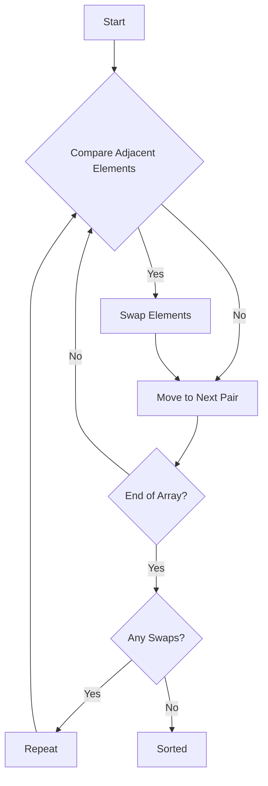

## 26.5 Sorting and Searching Algorithms

Sorting and searching are fundamental operations in computer science, crucial for optimizing data retrieval and manipulation. In JavaScript, understanding these algorithms is essential for efficient data handling, especially in large-scale applications. This section delves into the most common sorting and searching algorithms, their implementations, and their efficiencies.

### Why Sorting and Searching Matter

Sorting and searching algorithms are the backbone of data processing. Sorting organizes data, making it easier to search, analyze, and visualize. Searching algorithms, on the other hand, allow us to quickly locate specific data within a dataset. Together, they enhance the performance and usability of applications.

### Sorting Algorithms

Sorting algorithms arrange data in a specified order, typically ascending or descending. Let's explore some common sorting algorithms and their JavaScript implementations.

#### Bubble Sort

Bubble Sort is a simple comparison-based algorithm. It repeatedly steps through the list, compares adjacent elements, and swaps them if they are in the wrong order. This process is repeated until the list is sorted.

```javascript
function bubbleSort(arr) {
    let n = arr.length;
    let swapped;
    do {
        swapped = false;
        for (let i = 0; i < n - 1; i++) {
            if (arr[i] > arr[i + 1]) {
                // Swap elements
                [arr[i], arr[i + 1]] = [arr[i + 1], arr[i]];
                swapped = true;
            }
        }
    } while (swapped);
    return arr;
}

// Example usage
console.log(bubbleSort([5, 3, 8, 4, 2])); // Output: [2, 3, 4, 5, 8]
```

**Time Complexity**: O(n²) in the worst and average cases. Bubble Sort is inefficient on large lists and is generally used for educational purposes.

#### Selection Sort

Selection Sort divides the list into a sorted and an unsorted region. It repeatedly selects the smallest (or largest) element from the unsorted region and moves it to the end of the sorted region.

```javascript
function selectionSort(arr) {
    let n = arr.length;
    for (let i = 0; i < n - 1; i++) {
        let minIndex = i;
        for (let j = i + 1; j < n; j++) {
            if (arr[j] < arr[minIndex]) {
                minIndex = j;
            }
        }
        // Swap the found minimum element with the first element
        [arr[i], arr[minIndex]] = [arr[minIndex], arr[i]];
    }
    return arr;
}

// Example usage
console.log(selectionSort([5, 3, 8, 4, 2])); // Output: [2, 3, 4, 5, 8]
```

**Time Complexity**: O(n²) for all cases. Selection Sort is not suitable for large datasets but is easy to implement and understand.

#### Insertion Sort

Insertion Sort builds the final sorted array one item at a time. It is much less efficient on large lists than more advanced algorithms such as quicksort, heapsort, or merge sort.

```javascript
function insertionSort(arr) {
    let n = arr.length;
    for (let i = 1; i < n; i++) {
        let key = arr[i];
        let j = i - 1;
        while (j >= 0 && arr[j] > key) {
            arr[j + 1] = arr[j];
            j = j - 1;
        }
        arr[j + 1] = key;
    }
    return arr;
}

// Example usage
console.log(insertionSort([5, 3, 8, 4, 2])); // Output: [2, 3, 4, 5, 8]
```

**Time Complexity**: O(n²) in the worst case, but O(n) in the best case when the array is already sorted. Insertion Sort is efficient for small datasets or partially sorted arrays.

#### Mergesort

Mergesort is a divide-and-conquer algorithm that splits the array into halves, recursively sorts them, and then merges the sorted halves.

```javascript
function mergeSort(arr) {
    if (arr.length <= 1) {
        return arr;
    }

    const mid = Math.floor(arr.length / 2);
    const left = mergeSort(arr.slice(0, mid));
    const right = mergeSort(arr.slice(mid));

    return merge(left, right);
}

function merge(left, right) {
    let result = [];
    let leftIndex = 0;
    let rightIndex = 0;

    while (leftIndex < left.length && rightIndex < right.length) {
        if (left[leftIndex] < right[rightIndex]) {
            result.push(left[leftIndex]);
            leftIndex++;
        } else {
            result.push(right[rightIndex]);
            rightIndex++;
        }
    }

    return result.concat(left.slice(leftIndex)).concat(right.slice(rightIndex));
}

// Example usage
console.log(mergeSort([5, 3, 8, 4, 2])); // Output: [2, 3, 4, 5, 8]
```

**Time Complexity**: O(n log n) for all cases. Mergesort is efficient for large datasets and guarantees stable sorting.

#### Quicksort

Quicksort is another divide-and-conquer algorithm. It selects a 'pivot' element and partitions the array into elements less than and greater than the pivot, recursively sorting the partitions.

```javascript
function quickSort(arr) {
    if (arr.length <= 1) {
        return arr;
    }

    const pivot = arr[arr.length - 1];
    const left = [];
    const right = [];

    for (let i = 0; i < arr.length - 1; i++) {
        if (arr[i] < pivot) {
            left.push(arr[i]);
        } else {
            right.push(arr[i]);
        }
    }

    return [...quickSort(left), pivot, ...quickSort(right)];
}

// Example usage
console.log(quickSort([5, 3, 8, 4, 2])); // Output: [2, 3, 4, 5, 8]
```

**Time Complexity**: O(n log n) on average, but O(n²) in the worst case when the smallest or largest element is always chosen as the pivot. Quicksort is generally faster in practice than other O(n log n) algorithms.

### Searching Algorithms

Searching algorithms are used to find a specific element in a dataset. Let's explore two fundamental searching algorithms.

#### Linear Search

Linear Search is the simplest searching algorithm. It checks each element of the list until a match is found or the whole list has been searched.

```javascript
function linearSearch(arr, target) {
    for (let i = 0; i < arr.length; i++) {
        if (arr[i] === target) {
            return i;
        }
    }
    return -1;
}

// Example usage
console.log(linearSearch([5, 3, 8, 4, 2], 4)); // Output: 3
```

**Time Complexity**: O(n) in the worst case. Linear Search is useful for small or unsorted datasets.

#### Binary Search

Binary Search is a more efficient algorithm that works on sorted arrays. It divides the array into halves to locate the target value.

```javascript
function binarySearch(arr, target) {
    let left = 0;
    let right = arr.length - 1;

    while (left <= right) {
        const mid = Math.floor((left + right) / 2);
        if (arr[mid] === target) {
            return mid;
        } else if (arr[mid] < target) {
            left = mid + 1;
        } else {
            right = mid - 1;
        }
    }
    return -1;
}

// Example usage
console.log(binarySearch([2, 3, 4, 5, 8], 4)); // Output: 2
```

**Time Complexity**: O(log n). Binary Search is efficient for large, sorted datasets.

### Choosing the Right Algorithm

When selecting a sorting or searching algorithm, consider the following:

- **Data Size**: For small datasets, simple algorithms like Insertion Sort or Linear Search may suffice. For larger datasets, more efficient algorithms like Quicksort or Binary Search are preferable.
- **Data Characteristics**: If the data is nearly sorted, Insertion Sort can be very efficient. For sorted data, Binary Search is optimal.
- **Stability Requirements**: If maintaining the relative order of equal elements is important, use stable sorting algorithms like Mergesort.

### JavaScript Built-in Methods

JavaScript provides built-in methods like `Array.prototype.sort`, which uses a variation of Quicksort. However, it may not be stable and can have performance issues with large datasets. Always test and consider custom implementations for specific needs.

### Try It Yourself

Experiment with the provided code examples. Try modifying the input arrays or the algorithms themselves to see how they behave with different data. This hands-on approach will deepen your understanding of sorting and searching algorithms.

### Visualizing Sorting and Searching

To better understand these algorithms, let's visualize the process of sorting and searching using Mermaid.js diagrams.

#### Bubble Sort Visualization



**Description**: This diagram illustrates the Bubble Sort process, highlighting the comparison and swapping of adjacent elements.

#### Binary Search Visualization

```mermaid
graph TD;
    A[Start] --> B[Set Left and Right Pointers];
    B --> C{Left <= Right?};
    C -->|No| D[Not Found];
    C -->|Yes| E[Calculate Midpoint];
    E --> F{arr[mid] == target?};
    F -->|Yes| G[Found];
    F -->|No| H{arr[mid] < target?};
    H -->|Yes| I[Move Left Pointer];
    H -->|No| J[Move Right Pointer];
    I --> C;
    J --> C;
```

**Description**: This diagram shows the Binary Search process, illustrating how the array is divided and the pointers are adjusted.

### Knowledge Check

- What is the time complexity of Bubble Sort?
- How does Quicksort differ from Mergesort in terms of partitioning?
- Why is Binary Search more efficient than Linear Search on sorted arrays?
- When would you choose Insertion Sort over other sorting algorithms?
- How does JavaScript's `Array.prototype.sort` handle sorting by default?

### Summary

Sorting and searching algorithms are essential tools in any developer's toolkit. By understanding their implementations and efficiencies, you can choose the right algorithm for your specific needs. Remember, this is just the beginning. As you progress, you'll build more complex and interactive applications. Keep experimenting, stay curious, and enjoy the journey!

## Mastering Sorting and Searching Algorithms in JavaScript



### What is the time complexity of Bubble Sort in the worst case?

- [x] O(n²)
- [ ] O(n log n)
- [ ] O(n)
- [ ] O(log n)

> **Explanation:** Bubble Sort has a time complexity of O(n²) in the worst case due to the nested loops.

### Which sorting algorithm is stable and guarantees O(n log n) time complexity?

- [x] Mergesort
- [ ] Quicksort
- [ ] Bubble Sort
- [ ] Selection Sort

> **Explanation:** Mergesort is a stable sorting algorithm with a time complexity of O(n log n).

### What is the main advantage of Binary Search over Linear Search?

- [x] Efficiency on sorted arrays
- [ ] Simplicity
- [ ] Works on unsorted arrays
- [ ] Uses less memory

> **Explanation:** Binary Search is more efficient than Linear Search on sorted arrays due to its O(log n) time complexity.

### When is Insertion Sort particularly efficient?

- [x] On small or nearly sorted datasets
- [ ] On large datasets
- [ ] On unsorted datasets
- [ ] On datasets with unique elements

> **Explanation:** Insertion Sort is efficient on small or nearly sorted datasets due to its O(n) best-case time complexity.

### How does JavaScript's `Array.prototype.sort` handle sorting by default?

- [x] Lexicographically
- [ ] Numerically
- [ ] Randomly
- [ ] By length

> **Explanation:** By default, `Array.prototype.sort` sorts elements as strings lexicographically.

### What is the worst-case time complexity of Quicksort?

- [x] O(n²)
- [ ] O(n log n)
- [ ] O(n)
- [ ] O(log n)

> **Explanation:** Quicksort has a worst-case time complexity of O(n²) when the smallest or largest element is always chosen as the pivot.

### Which algorithm is not suitable for large datasets due to its O(n²) time complexity?

- [x] Selection Sort
- [ ] Mergesort
- [ ] Quicksort
- [ ] Binary Search

> **Explanation:** Selection Sort is not suitable for large datasets due to its O(n²) time complexity.

### What is the best-case time complexity of Insertion Sort?

- [x] O(n)
- [ ] O(n²)
- [ ] O(n log n)
- [ ] O(log n)

> **Explanation:** The best-case time complexity of Insertion Sort is O(n) when the array is already sorted.

### Which sorting algorithm uses a 'pivot' element for partitioning?

- [x] Quicksort
- [ ] Mergesort
- [ ] Bubble Sort
- [ ] Insertion Sort

> **Explanation:** Quicksort uses a 'pivot' element to partition the array into elements less than and greater than the pivot.

### True or False: Linear Search can be used on sorted and unsorted datasets.

- [x] True
- [ ] False

> **Explanation:** Linear Search can be used on both sorted and unsorted datasets, as it checks each element sequentially.




