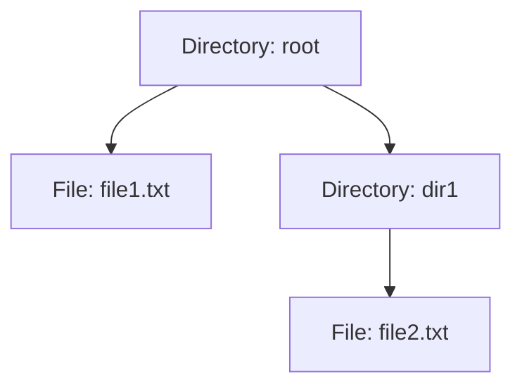
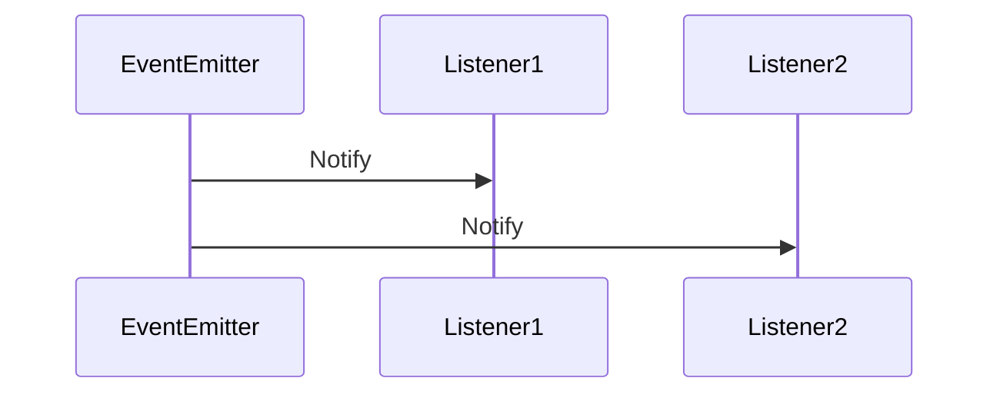

## 26.7 Applying Data Structures in Design Patterns

In the realm of software development, understanding how data structures can be applied within design patterns is crucial for creating efficient and scalable applications. This section explores the synergy between data structures and design patterns, providing insights into how they can be leveraged together to solve complex programming problems.

### Introduction to Data Structures in Design Patterns

Data structures are the backbone of efficient algorithms and are integral to implementing design patterns. They provide the means to manage and organize data, enabling patterns to function effectively. By understanding the relationship between data structures and design patterns, developers can make informed architectural decisions that enhance the performance and maintainability of their applications.

### Connecting Data Structures to Design Patterns

Let's delve into how specific data structures are utilized within various design patterns:

#### 1. Iterator Pattern and Data Structures

**Intent**: The Iterator pattern provides a way to access elements of a collection sequentially without exposing its underlying representation.

**Data Structures Used**: Arrays, Linked Lists, Trees

**Example**: Implementing an Iterator for a Binary Tree

```javascript
class TreeNode {
  constructor(value) {
    this.value = value;
    this.left = null;
    this.right = null;
  }
}

class BinaryTreeIterator {
  constructor(root) {
    this.stack = [];
    this._pushLeft(root);
  }

  _pushLeft(node) {
    while (node) {
      this.stack.push(node);
      node = node.left;
    }
  }

  next() {
    if (!this.hasNext()) {
      throw new Error("No more elements");
    }
    const node = this.stack.pop();
    this._pushLeft(node.right);
    return node.value;
  }

  hasNext() {
    return this.stack.length > 0;
  }
}

// Usage
const root = new TreeNode(10);
root.left = new TreeNode(5);
root.right = new TreeNode(15);

const iterator = new BinaryTreeIterator(root);
while (iterator.hasNext()) {
  console.log(iterator.next());
}
```

**Explanation**: In this example, a stack is used to traverse a binary tree in an in-order manner. The stack data structure is ideal for this pattern as it allows us to backtrack to previous nodes efficiently.

#### 2. Composite Pattern and Trees

**Intent**: The Composite pattern allows you to compose objects into tree structures to represent part-whole hierarchies.

**Data Structures Used**: Trees

**Example**: Implementing a File System Structure

```javascript
class FileSystemComponent {
  constructor(name) {
    this.name = name;
  }

  add(component) {
    throw new Error("Cannot add to a leaf");
  }

  remove(component) {
    throw new Error("Cannot remove from a leaf");
  }

  display(indent = 0) {
    throw new Error("Cannot display a leaf");
  }
}

class File extends FileSystemComponent {
  display(indent = 0) {
    console.log(`${' '.repeat(indent)}- ${this.name}`);
  }
}

class Directory extends FileSystemComponent {
  constructor(name) {
    super(name);
    this.children = [];
  }

  add(component) {
    this.children.push(component);
  }

  remove(component) {
    this.children = this.children.filter(child => child !== component);
  }

  display(indent = 0) {
    console.log(`${' '.repeat(indent)}+ ${this.name}`);
    this.children.forEach(child => child.display(indent + 2));
  }
}

// Usage
const root = new Directory('root');
const file1 = new File('file1.txt');
const dir1 = new Directory('dir1');
const file2 = new File('file2.txt');

root.add(file1);
root.add(dir1);
dir1.add(file2);

root.display();
```

**Explanation**: The Composite pattern uses a tree structure to represent a file system. Directories can contain files or other directories, demonstrating the hierarchical nature of trees.

#### 3. Observer Pattern and Queues

**Intent**: The Observer pattern defines a one-to-many dependency between objects so that when one object changes state, all its dependents are notified and updated automatically.

**Data Structures Used**: Queues

**Example**: Implementing an Event System

```javascript
class EventEmitter {
  constructor() {
    this.events = {};
  }

  on(event, listener) {
    if (!this.events[event]) {
      this.events[event] = [];
    }
    this.events[event].push(listener);
  }

  emit(event, data) {
    if (this.events[event]) {
      this.events[event].forEach(listener => listener(data));
    }
  }
}

// Usage
const emitter = new EventEmitter();
emitter.on('data', (data) => console.log(`Received data: ${data}`));

emitter.emit('data', 'Hello, World!');
```

**Explanation**: The Observer pattern can be implemented using queues to manage event listeners. When an event is emitted, all listeners in the queue are invoked, demonstrating the use of queues for managing dependencies.

### Enhancing Design Patterns with Data Structures

Understanding data structures enhances the use of design patterns by providing efficient ways to manage data. Here are some ways this integration is beneficial:

- **Efficiency**: Choosing the right data structure can significantly improve the performance of a design pattern. For example, using a hash table for the Flyweight pattern can optimize memory usage.
- **Scalability**: Data structures like trees and graphs can handle complex relationships and hierarchies, making patterns like Composite and Visitor more scalable.
- **Maintainability**: Well-chosen data structures simplify the implementation of design patterns, making the codebase easier to maintain and extend.

### Real-World Scenarios

Consider a real-world scenario where a social media platform needs to manage user notifications. The Observer pattern can be used to notify users of new messages or updates. By using a queue to manage notifications, the platform can efficiently handle a large number of users and ensure timely updates.

### Try It Yourself

Experiment with the provided code examples by modifying the data structures or adding new features. For instance, try implementing a priority queue for the Observer pattern to prioritize certain notifications.

### Visualizing Design Patterns with Data Structures

To better understand the interaction between data structures and design patterns, let's visualize some of these concepts using Mermaid.js diagrams.

#### Composite Pattern Tree Structure



**Description**: This diagram represents the hierarchical structure of the Composite pattern, where directories can contain files or other directories.

#### Observer Pattern Event Queue



**Description**: This sequence diagram illustrates the Observer pattern, showing how an event emitter notifies multiple listeners.

### Key Takeaways

- Data structures are integral to implementing design patterns effectively.
- Understanding the relationship between data structures and design patterns enhances efficiency, scalability, and maintainability.
- Real-world scenarios demonstrate the practical application of these concepts.
- Visualizations help clarify the interaction between data structures and design patterns.

### Knowledge Check

To reinforce your understanding, consider the following questions:

1. How does the choice of data structure impact the efficiency of a design pattern?
2. What are some real-world applications of the Composite pattern using tree structures?
3. How can queues be utilized in the Observer pattern to manage event listeners?
4. Why is it important to understand data structures when implementing design patterns?

### Embrace the Journey

Remember, mastering the integration of data structures and design patterns is a journey. As you continue to explore these concepts, you'll discover new ways to optimize and enhance your applications. Keep experimenting, stay curious, and enjoy the process!

## Quiz: Mastering Data Structures in Design Patterns



### Which data structure is commonly used in the Iterator pattern for traversing a binary tree?

- [x] Stack
- [ ] Queue
- [ ] Linked List
- [ ] Hash Table

> **Explanation:** A stack is used to traverse a binary tree in an in-order manner, allowing efficient backtracking to previous nodes.

### What is the primary data structure used in the Composite pattern?

- [x] Tree
- [ ] Array
- [ ] Queue
- [ ] Graph

> **Explanation:** The Composite pattern uses a tree structure to represent hierarchical relationships, such as a file system.

### In the Observer pattern, what data structure can be used to manage event listeners?

- [x] Queue
- [ ] Stack
- [ ] Tree
- [ ] Linked List

> **Explanation:** A queue can be used to manage event listeners, ensuring that all listeners are notified in the order they were added.

### How does understanding data structures enhance the use of design patterns?

- [x] It improves efficiency, scalability, and maintainability.
- [ ] It complicates the implementation.
- [ ] It reduces the need for design patterns.
- [ ] It has no impact on design patterns.

> **Explanation:** Understanding data structures enhances the use of design patterns by improving efficiency, scalability, and maintainability.

### Which design pattern is suitable for managing hierarchical data?

- [x] Composite
- [ ] Observer
- [ ] Iterator
- [ ] Singleton

> **Explanation:** The Composite pattern is suitable for managing hierarchical data, such as a file system or organizational structure.

### What is a real-world application of the Observer pattern?

- [x] Notification systems in social media platforms
- [ ] Sorting algorithms
- [ ] File compression
- [ ] Database indexing

> **Explanation:** The Observer pattern is commonly used in notification systems to update users about new messages or events.

### Which data structure is ideal for implementing a priority queue in the Observer pattern?

- [x] Heap
- [ ] Stack
- [ ] Linked List
- [ ] Tree

> **Explanation:** A heap is ideal for implementing a priority queue, allowing efficient retrieval of the highest priority element.

### What is the benefit of using a hash table in the Flyweight pattern?

- [x] Optimizes memory usage
- [ ] Increases complexity
- [ ] Reduces performance
- [ ] Limits scalability

> **Explanation:** Using a hash table in the Flyweight pattern optimizes memory usage by sharing common data among multiple objects.

### How can the Composite pattern be visualized?

- [x] As a tree structure
- [ ] As a sequence diagram
- [ ] As a stack
- [ ] As a queue

> **Explanation:** The Composite pattern can be visualized as a tree structure, representing part-whole hierarchies.

### True or False: Understanding data structures is not necessary for implementing design patterns.

- [ ] True
- [x] False

> **Explanation:** Understanding data structures is crucial for implementing design patterns effectively, as they provide the means to manage and organize data.


