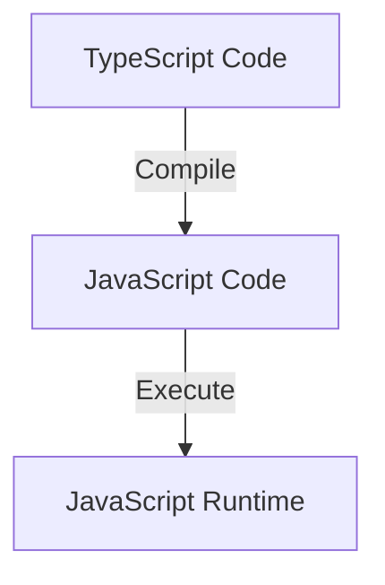

## 27.1 Introduction to TypeScript

### What is TypeScript?

TypeScript is a typed superset of JavaScript that compiles to plain JavaScript. It was developed by Microsoft and released in 2012 to address some of the shortcomings of JavaScript, particularly in large-scale applications. TypeScript builds on JavaScript by adding static types, which can help catch errors early in the development process and improve code quality and maintainability.

### The Relationship Between TypeScript and JavaScript

TypeScript is designed to be a superset of JavaScript, meaning any valid JavaScript code is also valid TypeScript code. This compatibility allows developers to gradually adopt TypeScript in existing JavaScript projects. TypeScript adds optional static typing, classes, interfaces, and other features that enhance JavaScript's capabilities without altering its core behavior.

### Benefits of Static Typing

Static typing is one of the most significant features of TypeScript. It allows developers to define variable types explicitly, which can lead to several benefits:

- **Error Detection**: Static typing helps catch type-related errors at compile time rather than runtime, reducing bugs and improving code reliability.
- **Code Readability**: Explicit types make code easier to understand and maintain, as they provide clear documentation of what each variable represents.
- **Refactoring**: TypeScript's type system makes it easier to refactor code safely, as the compiler can ensure that changes do not introduce type errors.
- **Tooling Support**: TypeScript's static types enable advanced tooling features, such as autocompletion, navigation, and refactoring in IDEs like Visual Studio Code.

### Basic TypeScript Syntax

Let's explore some basic TypeScript syntax to understand how it enhances JavaScript.

#### Variable Declarations

In TypeScript, you can declare variables with explicit types using the `let`, `const`, or `var` keywords, followed by a colon and the type.

```typescript
let message: string = "Hello, TypeScript!";
let count: number = 42;
let isActive: boolean = true;
```

#### Functions

TypeScript allows you to specify the types of function parameters and return values, providing more robust function signatures.

```typescript
function greet(name: string): string {
  return `Hello, ${name}!`;
}

let greeting: string = greet("Alice");
```

#### Interfaces

Interfaces in TypeScript define the shape of an object, specifying the properties and their types. They are a powerful way to enforce structure in your code.

```typescript
interface User {
  name: string;
  age: number;
  isAdmin: boolean;
}

let user: User = {
  name: "Bob",
  age: 30,
  isAdmin: false
};
```

#### Classes

TypeScript enhances JavaScript's class syntax with features like access modifiers and interfaces, making it easier to implement object-oriented patterns.

```typescript
class Animal {
  private name: string;

  constructor(name: string) {
    this.name = name;
  }

  public speak(): void {
    console.log(`${this.name} makes a noise.`);
  }
}

let dog = new Animal("Dog");
dog.speak();
```

### TypeScript Compilation

TypeScript code is not executed directly by browsers or Node.js. Instead, it is compiled to plain JavaScript, which can then be run in any JavaScript environment. The TypeScript compiler (`tsc`) performs this compilation, checking for type errors and generating JavaScript files.

#### Example Compilation

Consider the following TypeScript code:

```typescript
let message: string = "Hello, TypeScript!";
console.log(message);
```

When compiled with `tsc`, it produces the following JavaScript:

```javascript
var message = "Hello, TypeScript!";
console.log(message);
```

### Why Consider TypeScript for Large or Complex Projects?

TypeScript is particularly beneficial for large or complex projects due to its ability to catch errors early, improve code maintainability, and provide better tooling support. Here are some reasons to consider TypeScript:

- **Scalability**: TypeScript's static typing and interfaces make it easier to manage large codebases by enforcing consistent data structures and reducing runtime errors.
- **Collaboration**: Explicit types and interfaces serve as documentation, making it easier for teams to understand and collaborate on code.
- **Integration**: TypeScript integrates seamlessly with popular JavaScript libraries and frameworks, such as React, Angular, and Node.js, providing type definitions for many third-party packages.

### Try It Yourself

To get started with TypeScript, try modifying the code examples above. Change variable types, add new properties to interfaces, or create your own classes. Experiment with the TypeScript compiler to see how it transforms your code into JavaScript.

### Visualizing TypeScript's Interaction with JavaScript

Below is a simple diagram illustrating how TypeScript compiles to JavaScript and interacts with the JavaScript runtime environment.



**Description**: This diagram shows the process of compiling TypeScript code into JavaScript, which is then executed in a JavaScript runtime environment.

### Further Reading

For more information on TypeScript, consider exploring the following resources:

- [TypeScript Official Documentation](https://www.typescriptlang.org/docs/)
- [MDN Web Docs on TypeScript](https://developer.mozilla.org/en-US/docs/Web/JavaScript/Reference/Global_Objects/TypeError)

### Knowledge Check

- What is TypeScript, and how does it relate to JavaScript?
- How does static typing in TypeScript improve code quality?
- What are some basic TypeScript syntax features?
- Why is TypeScript beneficial for large or complex projects?

### Summary

TypeScript is a powerful tool for enhancing JavaScript development, offering static typing, improved tooling, and better code maintainability. By adopting TypeScript, developers can catch errors early, write more readable code, and build scalable applications. Remember, this is just the beginning. As you progress, you'll discover more advanced TypeScript features and integrations with popular frameworks. Keep experimenting, stay curious, and enjoy the journey!

## Mastering TypeScript Basics



### What is TypeScript?

- [x] A typed superset of JavaScript that compiles to plain JavaScript
- [ ] A new programming language unrelated to JavaScript
- [ ] A framework for building web applications
- [ ] A library for data visualization

> **Explanation:** TypeScript is a typed superset of JavaScript that compiles to plain JavaScript, enhancing code quality and developer productivity.

### How does static typing in TypeScript benefit developers?

- [x] It helps catch errors at compile time
- [ ] It makes code execution faster
- [ ] It reduces the need for comments
- [ ] It automatically generates documentation

> **Explanation:** Static typing helps catch errors at compile time, reducing bugs and improving code reliability.

### Which of the following is a valid TypeScript variable declaration?

- [x] `let message: string = "Hello, TypeScript!";`
- [ ] `var message = "Hello, TypeScript!";`
- [ ] `const message: number = "Hello, TypeScript!";`
- [ ] `let message = 42;`

> **Explanation:** `let message: string = "Hello, TypeScript!";` is a valid TypeScript variable declaration with an explicit type.

### What does the TypeScript compiler (`tsc`) do?

- [x] Compiles TypeScript code to JavaScript
- [ ] Executes TypeScript code directly
- [ ] Translates JavaScript to TypeScript
- [ ] Optimizes JavaScript code for performance

> **Explanation:** The TypeScript compiler (`tsc`) compiles TypeScript code to JavaScript, which can then be executed in any JavaScript environment.

### Why might TypeScript be particularly beneficial for large projects?

- [x] It provides static typing and interfaces for better code management
- [x] It enhances collaboration through clear documentation
- [ ] It reduces the need for testing
- [ ] It automatically scales applications

> **Explanation:** TypeScript's static typing and interfaces make it easier to manage large codebases and enhance collaboration through clear documentation.

### Which of the following is NOT a feature of TypeScript?

- [ ] Static typing
- [ ] Interfaces
- [ ] Classes
- [x] Automatic code execution

> **Explanation:** TypeScript does not execute code automatically; it compiles to JavaScript, which is then executed.

### How can TypeScript improve code readability?

- [x] By providing explicit types and interfaces
- [ ] By reducing the number of lines of code
- [ ] By using shorter variable names
- [ ] By removing comments

> **Explanation:** TypeScript improves code readability by providing explicit types and interfaces, making the code easier to understand.

### What is the relationship between TypeScript and JavaScript?

- [x] TypeScript is a superset of JavaScript
- [ ] TypeScript is a subset of JavaScript
- [ ] TypeScript is unrelated to JavaScript
- [ ] TypeScript replaces JavaScript

> **Explanation:** TypeScript is a superset of JavaScript, meaning any valid JavaScript code is also valid TypeScript code.

### Can TypeScript be used with popular JavaScript frameworks?

- [x] True
- [ ] False

> **Explanation:** TypeScript integrates seamlessly with popular JavaScript frameworks like React, Angular, and Node.js.

### What is one of the main goals of TypeScript?

- [x] To enhance JavaScript with static typing
- [ ] To replace JavaScript entirely
- [ ] To make JavaScript slower
- [ ] To remove JavaScript's dynamic features

> **Explanation:** One of the main goals of TypeScript is to enhance JavaScript with static typing, improving code quality and developer productivity.


