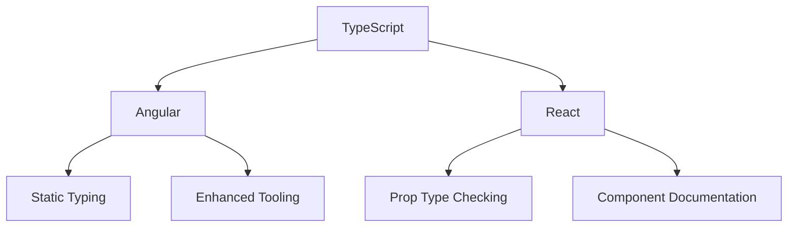

## 27.10 TypeScript in Front-End Frameworks: Angular and React

TypeScript has become an integral part of modern front-end development, especially in frameworks like Angular and React. By providing static typing, TypeScript enhances code quality, maintainability, and developer productivity. In this section, we'll explore how TypeScript is utilized in Angular and React, delve into its integration with JSX (TSX), and highlight the benefits it brings to front-end development.

### Angular and TypeScript: A Perfect Match

Angular is a comprehensive front-end framework that is built with TypeScript at its core. This integration offers several advantages:

1. **Static Typing**: TypeScript's static typing helps catch errors at compile time, reducing runtime errors and improving code reliability.
2. **Enhanced IDE Support**: With TypeScript, developers benefit from improved code completion, refactoring, and navigation features in IDEs like Visual Studio Code.
3. **Robust Tooling**: Angular CLI, a powerful command-line interface, leverages TypeScript to streamline project setup, testing, and deployment.
4. **Better Documentation**: TypeScript's type annotations serve as a form of documentation, making it easier to understand and maintain complex codebases.

#### Example: Angular Component with TypeScript

Let's create a simple Angular component using TypeScript:

```typescript
import { Component } from '@angular/core';

@Component({
  selector: 'app-hello-world',
  template: `<h1>Hello, {{ name }}!</h1>`
})
export class HelloWorldComponent {
  name: string;

  constructor() {
    this.name = 'Angular';
  }
}
```

In this example, we define a `HelloWorldComponent` with a `name` property of type `string`. The TypeScript compiler ensures that `name` is always a string, preventing potential type-related errors.

### React and TypeScript: Enhancing Component Development

React, a popular library for building user interfaces, can also benefit from TypeScript. By integrating TypeScript with React, developers gain:

1. **Prop Type Checking**: TypeScript provides compile-time checks for component props, reducing runtime errors.
2. **Component Documentation**: Type annotations serve as documentation, making it easier to understand component interfaces.
3. **Improved Refactoring**: With TypeScript, refactoring large codebases becomes more manageable and less error-prone.

#### Example: React Component with TypeScript

Here's how you can create a React component using TypeScript:

```typescript
import React from 'react';

interface HelloWorldProps {
  name: string;
}

const HelloWorld: React.FC<HelloWorldProps> = ({ name }) => {
  return <h1>Hello, {name}!</h1>;
};

export default HelloWorld;
```

In this example, we define a `HelloWorld` component with `HelloWorldProps` interface, ensuring that the `name` prop is always a string.

### Integrating TypeScript with JSX (TSX)

JSX, a syntax extension for JavaScript, is commonly used in React to describe UI components. TypeScript extends JSX with TSX, allowing developers to leverage TypeScript's features in JSX code.

#### Example: Using TSX in a React Component

```typescript
import React from 'react';

interface ButtonProps {
  label: string;
  onClick: () => void;
}

const Button: React.FC<ButtonProps> = ({ label, onClick }) => {
  return <button onClick={onClick}>{label}</button>;
};

export default Button;
```

In this example, we define a `Button` component with `ButtonProps` interface. The `onClick` prop is a function, and TypeScript ensures that it matches the expected signature.

### Benefits of TypeScript in Front-End Development

Integrating TypeScript into front-end frameworks like Angular and React offers several benefits:

- **Type Safety**: TypeScript's static typing catches errors early, reducing the likelihood of runtime issues.
- **Improved Code Quality**: Type annotations and interfaces enhance code readability and maintainability.
- **Better Tooling**: IDEs provide enhanced features like autocompletion and refactoring, boosting developer productivity.
- **Community Support**: Both Angular and React communities actively support TypeScript, providing resources, libraries, and tools.

### Tooling Support and Community Resources

TypeScript's integration with Angular and React is supported by a rich ecosystem of tools and resources:

- **Angular CLI**: A command-line interface for Angular projects, offering TypeScript support out of the box.
- **Create React App**: A tool for setting up React projects with TypeScript support.
- **TypeScript Playground**: An online editor for experimenting with TypeScript code.
- **Community Libraries**: Many popular libraries, such as Redux and React Router, offer TypeScript type definitions.

### Visualizing TypeScript's Role in Front-End Frameworks

Below is a diagram illustrating how TypeScript integrates with Angular and React:



**Diagram Description**: This diagram shows TypeScript's integration with Angular and React, highlighting key benefits like static typing, enhanced tooling, prop type checking, and component documentation.

### Knowledge Check

- **What are the benefits of using TypeScript in Angular?**
- **How does TypeScript improve prop type checking in React?**
- **What is TSX, and how does it relate to JSX?**
- **How does TypeScript enhance IDE support for front-end development?**

### Exercises

1. **Create an Angular Component**: Use TypeScript to create an Angular component with a property of type `number`. Ensure that the property is initialized correctly.
2. **Build a React Component**: Develop a React component using TypeScript that accepts an array of strings as a prop and renders a list.
3. **Experiment with TSX**: Modify a React component to use TSX, adding type annotations for props and state.

### Summary

In this section, we've explored how TypeScript enhances front-end development in Angular and React. By providing static typing, improved tooling, and better prop type checking, TypeScript helps developers build more reliable and maintainable applications. As you continue your journey, remember to leverage TypeScript's features to enhance your front-end projects.

### Embrace the Journey

Remember, this is just the beginning. As you progress, you'll build more complex and interactive applications. Keep experimenting, stay curious, and enjoy the journey!

### References and Links

- [TypeScript Documentation](https://www.typescriptlang.org/docs/)
- [Angular Documentation](https://angular.io/docs)
- [React Documentation](https://reactjs.org/docs/getting-started.html)
- [TypeScript with React](https://react-typescript-cheatsheet.netlify.app/)

## Mastering TypeScript in Angular and React



### What is a key benefit of using TypeScript in Angular?

- [x] Static typing
- [ ] Dynamic typing
- [ ] Reduced code size
- [ ] Faster runtime

> **Explanation:** TypeScript provides static typing, which helps catch errors at compile time.

### How does TypeScript improve prop type checking in React?

- [x] By providing compile-time checks
- [ ] By reducing runtime errors
- [ ] By increasing code complexity
- [ ] By eliminating the need for prop types

> **Explanation:** TypeScript provides compile-time checks for component props, reducing runtime errors.

### What is TSX?

- [x] A syntax extension for TypeScript and JSX
- [ ] A new JavaScript framework
- [ ] A CSS preprocessor
- [ ] A database query language

> **Explanation:** TSX is a syntax extension that allows TypeScript to be used with JSX.

### How does TypeScript enhance IDE support?

- [x] By providing better code completion and refactoring
- [ ] By reducing the need for documentation
- [ ] By increasing code complexity
- [ ] By eliminating runtime errors

> **Explanation:** TypeScript enhances IDE support with features like better code completion and refactoring.

### Which tool provides TypeScript support for React projects?

- [x] Create React App
- [ ] Angular CLI
- [ ] Vue CLI
- [ ] Node.js

> **Explanation:** Create React App is a tool for setting up React projects with TypeScript support.

### What is a benefit of using TypeScript in front-end development?

- [x] Improved code quality
- [ ] Increased runtime errors
- [ ] Reduced developer productivity
- [ ] Elimination of all bugs

> **Explanation:** TypeScript improves code quality by providing static typing and better tooling.

### How does TypeScript serve as documentation in code?

- [x] Through type annotations
- [ ] By reducing code size
- [ ] By increasing runtime speed
- [ ] By eliminating comments

> **Explanation:** Type annotations in TypeScript serve as documentation, making code easier to understand.

### What is a common tool for setting up Angular projects with TypeScript?

- [x] Angular CLI
- [ ] Create React App
- [ ] Node.js
- [ ] Vue CLI

> **Explanation:** Angular CLI is a command-line interface for setting up Angular projects with TypeScript support.

### What is a key feature of TypeScript in React?

- [x] Prop type checking
- [ ] Faster runtime
- [ ] Reduced code size
- [ ] Elimination of all bugs

> **Explanation:** TypeScript provides prop type checking in React, reducing runtime errors.

### True or False: TypeScript eliminates all runtime errors in Angular and React.

- [ ] True
- [x] False

> **Explanation:** While TypeScript reduces runtime errors by catching them at compile time, it does not eliminate all runtime errors.


