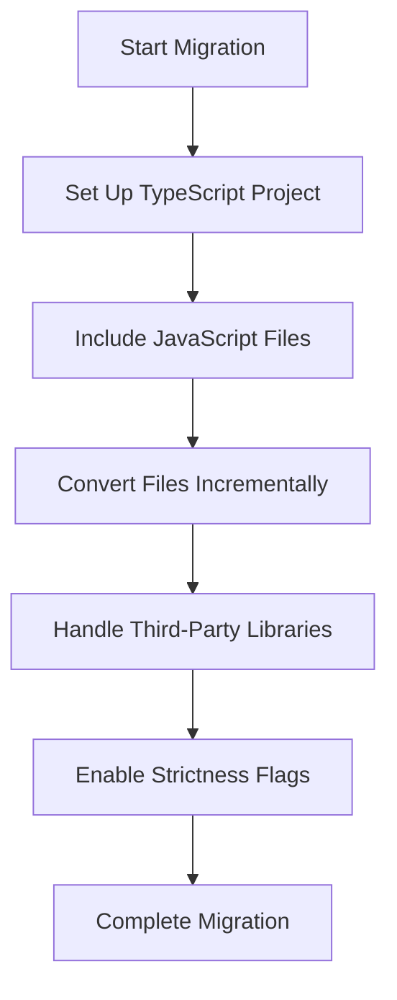

## 27.11 Migrating JavaScript Projects to TypeScript

Transitioning an existing JavaScript project to TypeScript can seem daunting, but with a structured approach, it becomes manageable and rewarding. TypeScript offers static typing, enhanced tooling, and improved code quality, making it a valuable addition to any JavaScript codebase. In this guide, we'll explore strategies for gradual migration, setting up a TypeScript project, handling third-party libraries, and overcoming common challenges.

### Why Migrate to TypeScript?

Before diving into the migration process, it's important to understand the benefits of TypeScript:

- **Type Safety**: TypeScript's static typing helps catch errors at compile time, reducing runtime errors.
- **Improved Tooling**: Enhanced code completion, navigation, and refactoring capabilities.
- **Better Documentation**: Types serve as a form of documentation, making code easier to understand and maintain.
- **Scalability**: TypeScript's features make it easier to manage larger codebases.

### Strategies for Gradual Migration

Migrating a large JavaScript project to TypeScript can be overwhelming if attempted all at once. Instead, consider a gradual approach:

1. **Start Small**: Begin with a small, non-critical part of the codebase. This allows you to experiment and learn without impacting the entire project.
2. **Incremental Adoption**: Convert files one at a time. This approach minimizes disruption and allows you to address issues as they arise.
3. **Use `allowJs`**: TypeScript's `allowJs` option lets you include JavaScript files in a TypeScript project, enabling a mixed codebase during the transition.
4. **Leverage `checkJs`**: This option allows TypeScript to check JavaScript files for errors, providing early feedback on potential issues.
5. **Adopt Strictness Flags Gradually**: Start with a relaxed configuration and progressively enable stricter type checks as the codebase stabilizes.

### Setting Up a TypeScript Project

To begin the migration, set up a TypeScript project within your existing JavaScript codebase:

1. **Install TypeScript**: Add TypeScript as a development dependency:
   ```bash
   npm install --save-dev typescript
   ```

2. **Initialize a TypeScript Configuration**: Create a `tsconfig.json` file to configure TypeScript options:
   ```json
   {
     "compilerOptions": {
       "target": "es6",
       "module": "commonjs",
       "strict": true,
       "allowJs": true,
       "checkJs": true,
       "outDir": "./dist",
       "rootDir": "./src"
     },
     "include": ["src/**/*"],
     "exclude": ["node_modules"]
   }
   ```

3. **Integrate with Build Tools**: Update your build scripts to compile TypeScript files. For example, add a script to your `package.json`:
   ```json
   "scripts": {
     "build": "tsc"
   }
   ```

4. **Compile and Run**: Use the TypeScript compiler to build your project:
   ```bash
   npm run build
   ```

### Including Existing JavaScript Files

During the migration, you'll likely need to include existing JavaScript files in your TypeScript project. Here's how:

- **Use `allowJs`**: As mentioned earlier, this option allows JavaScript files to coexist with TypeScript files.
- **Gradual Conversion**: Convert JavaScript files to TypeScript (`.ts`) one at a time. Start with files that have fewer dependencies to minimize complexity.
- **Type Annotations**: Begin adding type annotations to your JavaScript files to gradually introduce type safety.

### Handling Third-Party Libraries and Type Definitions

One of the challenges in migrating to TypeScript is dealing with third-party libraries. Here are some tips:

- **Install Type Definitions**: Use DefinitelyTyped, a repository of type definitions for popular JavaScript libraries. Install type definitions using:
  ```bash
  npm install --save-dev @types/library-name
  ```

- **Create Custom Type Definitions**: For libraries without existing type definitions, create your own `.d.ts` files to define types.

- **Use `any` Sparingly**: While `any` can be a quick fix for missing types, it negates the benefits of TypeScript. Use it sparingly and aim to replace it with specific types over time.

### Common Challenges and Solutions

Migrating to TypeScript can present several challenges. Here are some common issues and how to address them:

- **Complex Type Definitions**: For complex libraries, writing type definitions can be challenging. Break down the problem and tackle one part at a time.
- **Legacy Code**: Older code may rely on patterns that are not type-safe. Refactor these parts to align with TypeScript's type system.
- **Build Process Integration**: Ensure your build process supports TypeScript. This may involve updating build tools or scripts.

### Encouraging Strictness for Better Type Safety

TypeScript offers several strictness flags that enhance type safety. Consider enabling these gradually:

- **`strictNullChecks`**: Ensures that `null` and `undefined` are handled explicitly.
- **`noImplicitAny`**: Prevents variables from being implicitly typed as `any`.
- **`strictFunctionTypes`**: Enforces stricter function type checks.

### Try It Yourself

To get hands-on experience, try migrating a small JavaScript project to TypeScript. Start by setting up a TypeScript configuration, include JavaScript files, and gradually convert them to TypeScript. Experiment with strictness flags and observe how they improve type safety.

### Visualizing the Migration Process

Here's a flowchart to help visualize the migration process:



**Figure 1**: Visualizing the Migration Process from JavaScript to TypeScript.

### References and Links

For further reading and resources, consider the following:

- [TypeScript Handbook](https://www.typescriptlang.org/docs/handbook/intro.html)
- [DefinitelyTyped](https://github.com/DefinitelyTyped/DefinitelyTyped)
- [MDN Web Docs on TypeScript](https://developer.mozilla.org/en-US/docs/Web/JavaScript/Reference/Global_Objects/TypeError)

### Knowledge Check

- What are the benefits of migrating to TypeScript?
- How can `allowJs` and `checkJs` assist in the migration process?
- What are some strategies for handling third-party libraries in TypeScript?
- How can strictness flags improve type safety in TypeScript?

### Embrace the Journey

Remember, migrating to TypeScript is a journey, not a sprint. Take your time, learn from each step, and enjoy the process of enhancing your codebase. As you progress, you'll find that TypeScript not only improves code quality but also makes development more enjoyable.

### Quiz: Mastering TypeScript Migration



### What is the primary benefit of migrating to TypeScript?

- [x] Type safety and error reduction
- [ ] Faster runtime performance
- [ ] Reduced file size
- [ ] Easier syntax

> **Explanation:** TypeScript provides static typing, which helps catch errors at compile time, reducing runtime errors.

### Which TypeScript option allows JavaScript files to be included in a TypeScript project?

- [x] `allowJs`
- [ ] `checkJs`
- [ ] `includeJs`
- [ ] `jsSupport`

> **Explanation:** The `allowJs` option allows JavaScript files to be included in a TypeScript project, enabling a mixed codebase.

### What is the purpose of the `checkJs` option in TypeScript?

- [x] To check JavaScript files for errors
- [ ] To convert JavaScript files to TypeScript
- [ ] To ignore JavaScript files
- [ ] To compile JavaScript files

> **Explanation:** The `checkJs` option allows TypeScript to check JavaScript files for errors, providing early feedback on potential issues.

### How can you handle third-party libraries without existing type definitions?

- [x] Create custom `.d.ts` files
- [ ] Use `any` for all types
- [ ] Ignore the library
- [ ] Rewrite the library in TypeScript

> **Explanation:** Creating custom `.d.ts` files allows you to define types for libraries without existing type definitions.

### Which strictness flag ensures that `null` and `undefined` are handled explicitly?

- [x] `strictNullChecks`
- [ ] `noImplicitAny`
- [ ] `strictFunctionTypes`
- [ ] `noImplicitReturns`

> **Explanation:** The `strictNullChecks` flag ensures that `null` and `undefined` are handled explicitly in TypeScript.

### What is a recommended strategy for migrating a large JavaScript project to TypeScript?

- [x] Incremental adoption
- [ ] Complete rewrite
- [ ] Ignore legacy code
- [ ] Use only `any` types

> **Explanation:** Incremental adoption allows you to convert files one at a time, minimizing disruption and allowing you to address issues as they arise.

### Which tool can be used to install type definitions for popular JavaScript libraries?

- [x] DefinitelyTyped
- [ ] Babel
- [ ] Webpack
- [ ] ESLint

> **Explanation:** DefinitelyTyped is a repository of type definitions for popular JavaScript libraries, which can be installed using npm.

### What is the role of `tsconfig.json` in a TypeScript project?

- [x] Configures TypeScript options
- [ ] Compiles TypeScript files
- [ ] Runs TypeScript tests
- [ ] Lints TypeScript code

> **Explanation:** The `tsconfig.json` file is used to configure TypeScript options, such as compiler settings and file inclusions.

### True or False: Using `any` extensively in TypeScript negates the benefits of type safety.

- [x] True
- [ ] False

> **Explanation:** Using `any` extensively negates the benefits of type safety, as it allows any type of value, bypassing TypeScript's type checking.

### Which strictness flag prevents variables from being implicitly typed as `any`?

- [x] `noImplicitAny`
- [ ] `strictNullChecks`
- [ ] `strictFunctionTypes`
- [ ] `noImplicitReturns`

> **Explanation:** The `noImplicitAny` flag prevents variables from being implicitly typed as `any`, enforcing explicit type annotations.



By following this guide, you'll be well-equipped to migrate your JavaScript projects to TypeScript, enhancing your codebase with the benefits of static typing and improved tooling. Keep experimenting, stay curious, and enjoy the journey!
