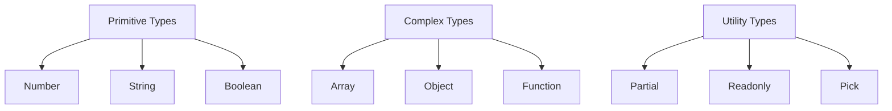

## 27.12 Best Practices for Type Safety

Type safety is a crucial aspect of modern software development, especially when working with TypeScript, a superset of JavaScript that introduces static typing. By enforcing type safety, developers can catch errors at compile time, leading to more robust and reliable code. In this section, we will explore best practices for maximizing type safety in TypeScript projects, reducing errors, and improving code reliability.

### Importance of Strict Typing and Using Strict Mode

Strict typing is the cornerstone of TypeScript's type safety. It ensures that variables, functions, and objects adhere to specified types, preventing common errors such as type mismatches. TypeScript's `strict` mode is a compilation setting that enforces strict typing rules, providing a more rigorous type-checking environment.

#### Enabling Strict Mode

To enable strict mode, add the following configuration to your `tsconfig.json` file:

```json
{
  "compilerOptions": {
    "strict": true
  }
}
```

This setting enables several strict type-checking options, including `noImplicitAny`, `strictNullChecks`, and `strictFunctionTypes`, among others. Each of these options contributes to a safer and more predictable codebase.

#### Benefits of Strict Typing

- **Error Prevention**: Catch errors at compile time, reducing runtime exceptions.
- **Improved Code Quality**: Enforce consistent coding practices and reduce ambiguity.
- **Enhanced Readability**: Make code more understandable by clearly defining data structures and function signatures.

### Encouraging Explicit Type Annotations

While TypeScript can infer types in many cases, explicit type annotations provide clarity and prevent unintended type coercions. They are particularly useful in complex functions, APIs, and when working with external libraries.

#### Example of Type Annotations

```typescript
function add(a: number, b: number): number {
  return a + b;
}

const user: { name: string; age: number } = {
  name: "Alice",
  age: 30
};
```

In the example above, the function `add` and the object `user` have explicit type annotations, ensuring that their usage is clear and consistent.

### Guidelines for Naming Conventions and Code Organization

Consistent naming conventions and code organization are vital for maintaining type safety and code readability. Here are some guidelines to follow:

- **Descriptive Names**: Use descriptive names for variables, functions, and types to convey their purpose and usage.
- **CamelCase for Variables and Functions**: Use camelCase for naming variables and functions, e.g., `calculateTotal`.
- **PascalCase for Types and Interfaces**: Use PascalCase for naming types and interfaces, e.g., `UserProfile`.
- **Organize Code by Feature**: Group related code into modules or folders based on features or functionality.

### Utilizing Utility Types and Type Guards

TypeScript provides several utility types and type guards to enhance type safety and flexibility.

#### Utility Types

Utility types are built-in types that transform existing types. Some common utility types include:

- **Partial<T>**: Makes all properties of type `T` optional.
- **Readonly<T>**: Makes all properties of type `T` read-only.
- **Pick<T, K>**: Creates a type by picking a set of properties `K` from type `T`.

#### Example of Utility Types

```typescript
interface User {
  name: string;
  age: number;
  email: string;
}

type PartialUser = Partial<User>;
type ReadonlyUser = Readonly<User>;
type UserNameAndEmail = Pick<User, "name" | "email">;
```

#### Type Guards

Type guards are functions or expressions that perform runtime checks to ensure a variable is of a specific type.

#### Example of Type Guards

```typescript
function isString(value: unknown): value is string {
  return typeof value === "string";
}

function printLength(value: unknown) {
  if (isString(value)) {
    console.log(value.length);
  } else {
    console.log("Not a string");
  }
}
```

In this example, the `isString` function is a type guard that checks if a value is a string, allowing for safe usage of string-specific properties.

### Writing Comprehensive Definitions for Complex Types

For complex data structures, writing comprehensive type definitions is essential for maintaining type safety and clarity.

#### Example of Complex Type Definitions

```typescript
interface Address {
  street: string;
  city: string;
  postalCode: string;
}

interface UserProfile {
  name: string;
  age: number;
  address: Address;
  getEmail: () => string;
}
```

By defining types for complex structures like `UserProfile`, we ensure that all properties and methods are explicitly defined and consistently used.

### Visualizing TypeScript's Type System

To better understand TypeScript's type system, let's visualize how types interact within a program.



**Diagram Description**: This diagram illustrates the hierarchy of TypeScript's type system, showing the relationship between primitive types, complex types, and utility types.

### References and Links

- [TypeScript Handbook](https://www.typescriptlang.org/docs/handbook/intro.html)
- [MDN Web Docs: TypeScript](https://developer.mozilla.org/en-US/docs/Web/JavaScript/Reference/Global_Objects/TypeScript)
- [TypeScript Utility Types](https://www.typescriptlang.org/docs/handbook/utility-types.html)

### Knowledge Check

- What is the purpose of enabling strict mode in TypeScript?
- How do explicit type annotations improve code reliability?
- What are some common utility types in TypeScript?
- How can type guards enhance type safety in TypeScript?

### Exercises

1. **Exercise 1**: Convert a JavaScript function to TypeScript by adding type annotations.
2. **Exercise 2**: Create a complex type definition for a shopping cart system.
3. **Exercise 3**: Implement a type guard for checking if a value is an array.

### Embrace the Journey

Remember, mastering type safety in TypeScript is a journey. As you progress, you'll build more robust and reliable applications. Keep experimenting, stay curious, and enjoy the journey!

## Mastering Type Safety in TypeScript



### What is the primary benefit of enabling strict mode in TypeScript?

- [x] It enforces strict type-checking rules.
- [ ] It allows for dynamic typing.
- [ ] It disables type inference.
- [ ] It improves runtime performance.

> **Explanation:** Enabling strict mode enforces strict type-checking rules, catching errors at compile time.

### Which utility type makes all properties of a type optional?

- [x] Partial<T>
- [ ] Readonly<T>
- [ ] Pick<T, K>
- [ ] Record<K, T>

> **Explanation:** The `Partial<T>` utility type makes all properties of a type optional.

### What is a type guard in TypeScript?

- [x] A function that performs runtime checks to ensure a variable is of a specific type.
- [ ] A type that restricts the use of certain properties.
- [ ] A method for converting types at runtime.
- [ ] A way to enforce strict mode.

> **Explanation:** A type guard is a function that performs runtime checks to ensure a variable is of a specific type.

### Which naming convention is recommended for types and interfaces in TypeScript?

- [x] PascalCase
- [ ] camelCase
- [ ] snake_case
- [ ] kebab-case

> **Explanation:** PascalCase is recommended for naming types and interfaces in TypeScript.

### What is the purpose of explicit type annotations?

- [x] To provide clarity and prevent unintended type coercions.
- [ ] To enable dynamic typing.
- [ ] To improve runtime performance.
- [ ] To disable type inference.

> **Explanation:** Explicit type annotations provide clarity and prevent unintended type coercions.

### Which utility type creates a type by picking a set of properties from another type?

- [x] Pick<T, K>
- [ ] Partial<T>
- [ ] Readonly<T>
- [ ] Record<K, T>

> **Explanation:** The `Pick<T, K>` utility type creates a type by picking a set of properties from another type.

### What is the recommended naming convention for variables and functions in TypeScript?

- [x] camelCase
- [ ] PascalCase
- [ ] snake_case
- [ ] kebab-case

> **Explanation:** camelCase is recommended for naming variables and functions in TypeScript.

### How can type guards enhance type safety?

- [x] By performing runtime checks to ensure a variable is of a specific type.
- [ ] By disabling type inference.
- [ ] By allowing dynamic typing.
- [ ] By enforcing strict mode.

> **Explanation:** Type guards enhance type safety by performing runtime checks to ensure a variable is of a specific type.

### What is the benefit of using utility types in TypeScript?

- [x] They enhance type safety and flexibility.
- [ ] They disable strict mode.
- [ ] They improve runtime performance.
- [ ] They allow for dynamic typing.

> **Explanation:** Utility types enhance type safety and flexibility by transforming existing types.

### True or False: TypeScript's strict mode improves runtime performance.

- [ ] True
- [x] False

> **Explanation:** TypeScript's strict mode does not improve runtime performance; it enhances type-checking at compile time.




