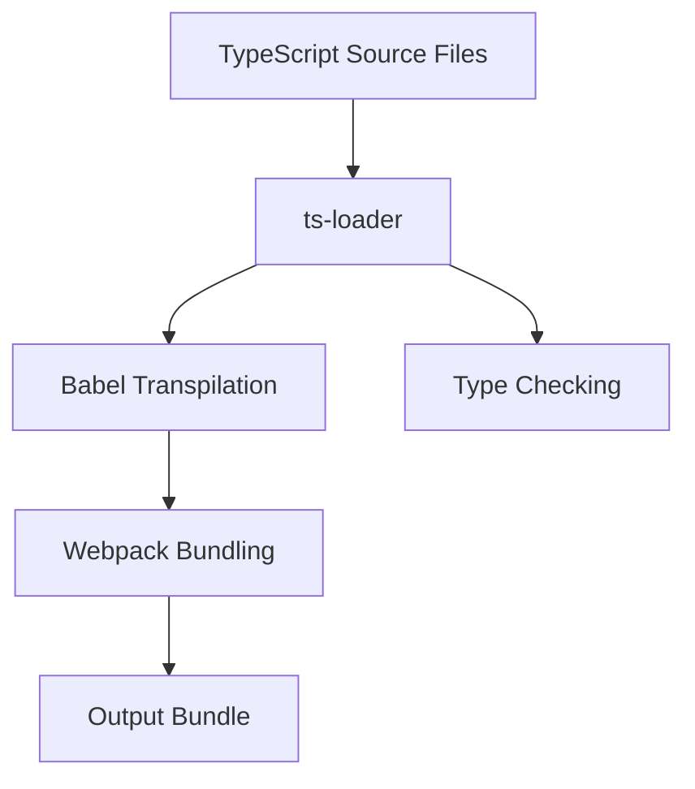

## 27.13 Combining TypeScript with Babel and Webpack

In modern web development, combining TypeScript with Babel and Webpack can significantly enhance your development workflow. This integration allows you to leverage TypeScript's powerful type system while utilizing Babel's extensive plugin ecosystem for transpilation. Webpack serves as the bundler, orchestrating the entire process and optimizing the output for production.

### Understanding the Benefits

Before diving into the configuration, let's explore why combining TypeScript with Babel and Webpack is beneficial:

1. **Type Safety**: TypeScript provides static typing, which helps catch errors early in the development process, improving code quality and maintainability.

2. **Transpilation Flexibility**: Babel allows you to use the latest JavaScript features by transpiling them to a version compatible with your target environments.

3. **Plugin Ecosystem**: Babel's rich plugin ecosystem enables you to extend your build process with additional features, such as polyfills and code transformations.

4. **Efficient Bundling**: Webpack bundles your code and assets, optimizing them for performance and reducing load times.

5. **Source Maps**: Both Babel and Webpack support source maps, facilitating easier debugging by mapping the transpiled code back to the original TypeScript source.

### Setting Up the Environment

To get started, ensure you have Node.js and npm installed on your system. Then, create a new project directory and initialize it with npm:

```bash
mkdir my-typescript-project
cd my-typescript-project
npm init -y
```

### Installing Dependencies

Next, install the necessary dependencies for TypeScript, Babel, and Webpack:

```bash
npm install --save-dev typescript @babel/core @babel/preset-env @babel/preset-typescript babel-loader ts-loader webpack webpack-cli
```

- **TypeScript**: The TypeScript compiler (`tsc`) is used for type checking.
- **@babel/core**: The core Babel library.
- **@babel/preset-env**: A Babel preset that allows you to use the latest JavaScript features.
- **@babel/preset-typescript**: A Babel preset for transpiling TypeScript.
- **babel-loader**: A Webpack loader for Babel.
- **ts-loader**: A Webpack loader for TypeScript.
- **webpack**: The module bundler.
- **webpack-cli**: The command-line interface for Webpack.

### Configuring TypeScript

Create a `tsconfig.json` file to configure TypeScript:

```json
{
  "compilerOptions": {
    "target": "ESNext",
    "module": "ESNext",
    "strict": true,
    "esModuleInterop": true,
    "skipLibCheck": true,
    "forceConsistentCasingInFileNames": true,
    "sourceMap": true
  },
  "include": ["src"]
}
```

- **target**: Specifies the ECMAScript target version.
- **module**: Specifies the module code generation.
- **strict**: Enables all strict type-checking options.
- **sourceMap**: Generates source maps for debugging.

### Configuring Babel

Create a `.babelrc` file to configure Babel:

```json
{
  "presets": [
    "@babel/preset-env",
    "@babel/preset-typescript"
  ]
}
```

- **@babel/preset-env**: Transpiles modern JavaScript to a compatible version.
- **@babel/preset-typescript**: Transpiles TypeScript to JavaScript.

### Configuring Webpack

Create a `webpack.config.js` file to configure Webpack:

```javascript
const path = require('path');

module.exports = {
  entry: './src/index.ts',
  output: {
    filename: 'bundle.js',
    path: path.resolve(__dirname, 'dist')
  },
  resolve: {
    extensions: ['.ts', '.js']
  },
  module: {
    rules: [
      {
        test: /\.ts$/,
        use: [
          {
            loader: 'babel-loader'
          },
          {
            loader: 'ts-loader',
            options: {
              transpileOnly: true
            }
          }
        ],
        exclude: /node_modules/
      }
    ]
  },
  devtool: 'source-map'
};
```

- **entry**: Specifies the entry point of your application.
- **output**: Defines the output file and directory.
- **resolve.extensions**: Allows importing files without specifying extensions.
- **module.rules**: Configures loaders for handling TypeScript files.
- **devtool**: Enables source map generation for debugging.

### Using `ts-loader` and `babel-loader`

In the Webpack configuration, we use both `ts-loader` and `babel-loader`:

- **ts-loader**: Handles TypeScript files and performs type checking.
- **babel-loader**: Transpiles the TypeScript code to JavaScript using Babel.

By setting `transpileOnly: true` in `ts-loader`, we skip type checking during the build process, delegating it to the TypeScript compiler (`tsc`). This improves build performance.

### Ensuring Source Maps and Debugging Support

Source maps are crucial for debugging, as they map the transpiled code back to the original TypeScript source. Ensure that both TypeScript and Webpack are configured to generate source maps:

- In `tsconfig.json`, set `"sourceMap": true`.
- In `webpack.config.js`, set `devtool: 'source-map'`.

### Best Practices for Build Optimization and Performance

1. **Code Splitting**: Use Webpack's code splitting feature to split your code into smaller chunks, improving load times.

2. **Tree Shaking**: Enable tree shaking to remove unused code from the final bundle.

3. **Caching**: Utilize caching mechanisms to speed up subsequent builds.

4. **Minification**: Minify your code using plugins like `TerserPlugin` to reduce bundle size.

5. **Environment Variables**: Use environment variables to configure your build process for different environments (development, production).

### Try It Yourself

Experiment with the configuration by modifying the `webpack.config.js` file to include additional plugins or loaders. For example, try adding a CSS loader to handle stylesheets:

```javascript
{
  test: /\.css$/,
  use: ['style-loader', 'css-loader']
}
```

### Visualizing the Build Process

Below is a flowchart illustrating the interaction between TypeScript, Babel, and Webpack during the build process:



**Figure 1**: The flow of TypeScript files through `ts-loader`, Babel, and Webpack to produce the final output bundle.

### References and Links

- [TypeScript Documentation](https://www.typescriptlang.org/docs/)
- [Babel Documentation](https://babeljs.io/docs/en/)
- [Webpack Documentation](https://webpack.js.org/concepts/)

### Knowledge Check

- What are the benefits of combining TypeScript with Babel and Webpack?
- How do you configure Webpack to handle TypeScript files?
- What is the role of `ts-loader` and `babel-loader` in the build process?
- How can you ensure source maps are generated for debugging?
- What are some best practices for optimizing the build process?

### Embrace the Journey

Remember, this is just the beginning. As you progress, you'll build more complex and interactive web applications. Keep experimenting, stay curious, and enjoy the journey!

## Quiz: Mastering TypeScript, Babel, and Webpack Integration



### What is the primary benefit of using TypeScript in a project?

- [x] Type safety and early error detection
- [ ] Faster runtime performance
- [ ] Smaller bundle sizes
- [ ] Easier syntax

> **Explanation:** TypeScript provides static typing, which helps catch errors early in the development process, improving code quality and maintainability.

### Which tool is used to transpile TypeScript to JavaScript in this setup?

- [ ] Webpack
- [x] Babel
- [ ] ESLint
- [ ] Prettier

> **Explanation:** Babel is used to transpile TypeScript to JavaScript using the `@babel/preset-typescript`.

### What is the purpose of `ts-loader` in the Webpack configuration?

- [x] To handle TypeScript files and perform type checking
- [ ] To minify JavaScript files
- [ ] To bundle CSS files
- [ ] To optimize images

> **Explanation:** `ts-loader` is used to handle TypeScript files and perform type checking during the build process.

### How can you ensure source maps are generated for debugging?

- [x] Set `"sourceMap": true` in `tsconfig.json` and `devtool: 'source-map'` in `webpack.config.js`
- [ ] Use `minify` option in Webpack
- [ ] Enable `tree shaking` in Webpack
- [ ] Use `uglify-js` for minification

> **Explanation:** Source maps are enabled by setting `"sourceMap": true` in `tsconfig.json` and `devtool: 'source-map'` in `webpack.config.js`.

### Which of the following is a best practice for optimizing the build process?

- [x] Code splitting and tree shaking
- [ ] Using only `babel-loader`
- [ ] Disabling source maps
- [ ] Avoiding environment variables

> **Explanation:** Code splitting and tree shaking are best practices for optimizing the build process by reducing bundle size and improving load times.

### What is the role of `babel-loader` in the Webpack configuration?

- [x] To transpile TypeScript code to JavaScript using Babel
- [ ] To bundle CSS files
- [ ] To optimize images
- [ ] To perform type checking

> **Explanation:** `babel-loader` is used to transpile TypeScript code to JavaScript using Babel.

### What is the purpose of the `@babel/preset-env`?

- [x] To transpile modern JavaScript to a compatible version
- [ ] To perform type checking
- [ ] To bundle CSS files
- [ ] To optimize images

> **Explanation:** `@babel/preset-env` is used to transpile modern JavaScript to a version compatible with target environments.

### How can you improve build performance when using `ts-loader`?

- [x] Set `transpileOnly: true` in `ts-loader` options
- [ ] Disable source maps
- [ ] Use only `babel-loader`
- [ ] Avoid using Webpack

> **Explanation:** Setting `transpileOnly: true` in `ts-loader` options skips type checking during the build process, improving performance.

### Which file specifies the entry point of your application in the Webpack configuration?

- [x] `webpack.config.js`
- [ ] `tsconfig.json`
- [ ] `.babelrc`
- [ ] `package.json`

> **Explanation:** The entry point of the application is specified in `webpack.config.js`.

### True or False: Webpack can only be used for JavaScript bundling.

- [ ] True
- [x] False

> **Explanation:** Webpack can be used for bundling various types of assets, including JavaScript, CSS, images, and more.


