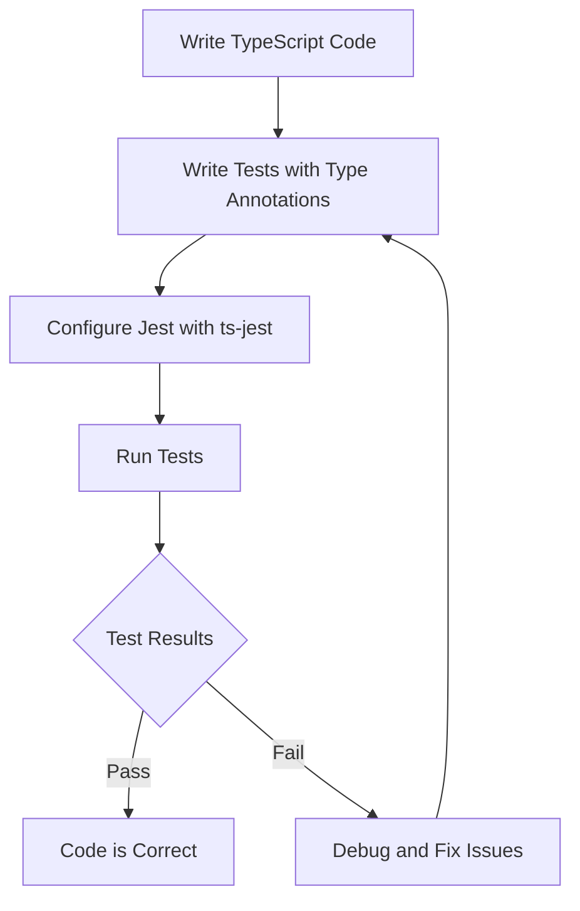

## 27.14 Testing TypeScript Code

Testing is a critical aspect of software development, ensuring that code behaves as expected and meets the requirements. With TypeScript, testing becomes even more crucial as it involves not only verifying functionality but also ensuring type correctness. In this section, we'll explore strategies for testing TypeScript code, including setting up testing frameworks, writing tests with type annotations, and verifying type definitions.

### Setting Up Testing Frameworks

To effectively test TypeScript code, we need to set up a testing framework that supports TypeScript. Two popular choices are Jest and Mocha, both of which can be configured to work seamlessly with TypeScript.

#### Jest

Jest is a delightful JavaScript testing framework with a focus on simplicity. It provides a rich API for assertions, mocking, and more. To use Jest with TypeScript, we can leverage `ts-jest`, a TypeScript preprocessor for Jest.

**Installation**

```bash
npm install --save-dev jest ts-jest @types/jest
```

**Configuration**

Create a `jest.config.js` file to configure Jest for TypeScript:

```javascript
module.exports = {
  preset: 'ts-jest',
  testEnvironment: 'node',
  testMatch: ['**/__tests__/**/*.ts?(x)', '**/?(*.)+(spec|test).ts?(x)'],
};
```

This configuration tells Jest to use `ts-jest` as the preset and specifies the test environment and file patterns.

#### Mocha

Mocha is a flexible testing framework for Node.js, known for its simplicity and support for asynchronous testing. To use Mocha with TypeScript, we need additional packages like `ts-node` and `chai` for assertions.

**Installation**

```bash
npm install --save-dev mocha ts-node @types/mocha chai @types/chai
```

**Configuration**

Create a `mocha.opts` file or configure Mocha in your `package.json`:

```text
--require ts-node/register
--watch-extensions ts
```

This setup ensures Mocha can run TypeScript files directly.

### Writing Tests with Type Annotations

TypeScript's type system allows us to write more robust tests by leveraging type annotations. Let's explore how to write unit tests with type annotations using Jest.

**Example: Testing a Calculator Module**

Suppose we have a simple calculator module:

```typescript
// calculator.ts
export function add(a: number, b: number): number {
  return a + b;
}

export function subtract(a: number, b: number): number {
  return a - b;
}
```

**Writing Tests**

```typescript
// calculator.test.ts
import { add, subtract } from './calculator';

describe('Calculator', () => {
  test('adds two numbers', () => {
    expect(add(1, 2)).toBe(3);
  });

  test('subtracts two numbers', () => {
    expect(subtract(5, 3)).toBe(2);
  });
});
```

In this example, we use Jest's `describe` and `test` functions to organize and define our tests. The type annotations in `add` and `subtract` ensure that only numbers are passed as arguments, reducing runtime errors.

### Testing Type Definitions and Interfaces

TypeScript's strength lies in its type system, which allows us to define interfaces and type aliases. Testing these type definitions ensures that they accurately represent the intended structure and constraints.

**Example: Testing an Interface**

Consider an interface for a user profile:

```typescript
// user.ts
export interface User {
  id: number;
  name: string;
  email: string;
}
```

**Testing the Interface**

While we can't directly test interfaces, we can create instances that conform to the interface and verify their behavior.

```typescript
// user.test.ts
import { User } from './user';

const mockUser: User = {
  id: 1,
  name: 'John Doe',
  email: 'john.doe@example.com',
};

describe('User Interface', () => {
  test('should have correct properties', () => {
    expect(mockUser).toHaveProperty('id');
    expect(mockUser).toHaveProperty('name');
    expect(mockUser).toHaveProperty('email');
  });
});
```

In this test, we create a mock user object that adheres to the `User` interface and verify its properties.

### Tools for Seamless Integration

To streamline the testing process, we can use tools like `ts-jest` for Jest and `ts-node` for Mocha. These tools enable us to run TypeScript tests without needing a separate compilation step.

#### ts-jest

`ts-jest` is a TypeScript preprocessor for Jest, allowing us to run TypeScript tests directly. It integrates seamlessly with Jest, providing type-checking and transpilation.

**Configuration**

Ensure `ts-jest` is set as the preset in your `jest.config.js`:

```javascript
module.exports = {
  preset: 'ts-jest',
  testEnvironment: 'node',
};
```

#### ts-node

`ts-node` is a TypeScript execution engine for Node.js, enabling us to run TypeScript files without precompiling them. It's particularly useful for running Mocha tests.

**Usage**

Add `--require ts-node/register` to your Mocha configuration to enable TypeScript support.

### Importance of Testing Functionality and Type Correctness

Testing in TypeScript involves verifying both functionality and type correctness. While functional tests ensure that the code behaves as expected, type tests validate that the type definitions are accurate and consistent.

#### Functional Testing

Functional tests focus on the behavior of the code. They ensure that functions return the correct results and handle edge cases appropriately.

#### Type Testing

Type testing involves verifying that the type definitions align with the intended design. This includes checking that interfaces and type aliases accurately represent the data structures.

### Try It Yourself

To deepen your understanding, try modifying the calculator module to include a `multiply` function. Write tests for this new function, ensuring both functionality and type correctness.

### Visualizing the Testing Workflow

Below is a diagram illustrating the workflow of testing TypeScript code with Jest and `ts-jest`.



This diagram shows the iterative process of writing code, testing, and debugging.

### References and Links

- [Jest Documentation](https://jestjs.io/docs/getting-started)
- [ts-jest Documentation](https://kulshekhar.github.io/ts-jest/)
- [Mocha Documentation](https://mochajs.org/)
- [Chai Documentation](https://www.chaijs.com/)

### Knowledge Check

- What are the benefits of using `ts-jest` with Jest?
- How can you test interfaces in TypeScript?
- Why is it important to test both functionality and type correctness?

### Summary

In this section, we've explored strategies for testing TypeScript code, including setting up frameworks like Jest and Mocha, writing tests with type annotations, and verifying type definitions. By testing both functionality and type correctness, we can ensure that our TypeScript code is robust and reliable.

### Embrace the Journey

Remember, testing is an ongoing process. As you continue to develop and refine your TypeScript code, keep experimenting with different testing strategies and tools. Stay curious, and enjoy the journey of creating high-quality software!

## Mastering TypeScript Testing Techniques



### What is the primary purpose of using `ts-jest` with Jest?

- [x] To enable Jest to run TypeScript tests directly
- [ ] To compile TypeScript to JavaScript before testing
- [ ] To provide additional assertion libraries
- [ ] To replace Jest's default test runner

> **Explanation:** `ts-jest` is a TypeScript preprocessor for Jest, allowing Jest to run TypeScript tests directly without a separate compilation step.

### Which tool is used to run TypeScript files directly in Mocha?

- [ ] ts-jest
- [x] ts-node
- [ ] Babel
- [ ] Webpack

> **Explanation:** `ts-node` is a TypeScript execution engine for Node.js, enabling Mocha to run TypeScript files directly.

### How can you verify that an object conforms to a TypeScript interface in a test?

- [x] By creating a mock object that adheres to the interface
- [ ] By using a type assertion
- [ ] By using the `typeof` operator
- [ ] By using a custom type checker

> **Explanation:** Creating a mock object that adheres to the interface allows you to verify its properties and behavior in a test.

### What is the benefit of writing tests with type annotations in TypeScript?

- [x] It ensures type correctness and reduces runtime errors
- [ ] It makes the code run faster
- [ ] It simplifies the test setup
- [ ] It eliminates the need for assertions

> **Explanation:** Writing tests with type annotations ensures that only valid types are used, reducing runtime errors and improving code reliability.

### Which of the following is a key aspect of functional testing?

- [x] Verifying the behavior of the code
- [ ] Checking the accuracy of type definitions
- [ ] Ensuring the code compiles correctly
- [ ] Optimizing performance

> **Explanation:** Functional testing focuses on verifying that the code behaves as expected and returns the correct results.

### What is the role of `chai` in testing with Mocha?

- [x] It provides assertion libraries for testing
- [ ] It compiles TypeScript to JavaScript
- [ ] It runs TypeScript files directly
- [ ] It configures the test environment

> **Explanation:** `chai` is an assertion library used with Mocha to provide a rich set of assertions for testing.

### How can you test type definitions in TypeScript?

- [x] By creating instances that conform to the type definitions
- [ ] By using the `typeof` operator
- [ ] By writing custom type checkers
- [ ] By using a type assertion

> **Explanation:** Creating instances that conform to the type definitions allows you to verify their structure and constraints in a test.

### What is an advantage of using Jest for testing TypeScript code?

- [x] It provides a rich API for assertions and mocking
- [ ] It eliminates the need for type annotations
- [ ] It compiles TypeScript to JavaScript
- [ ] It runs tests faster than other frameworks

> **Explanation:** Jest provides a rich API for assertions, mocking, and more, making it a powerful tool for testing TypeScript code.

### Why is it important to test both functionality and type correctness in TypeScript?

- [x] To ensure the code behaves as expected and the types are accurate
- [ ] To improve code performance
- [ ] To simplify the test setup
- [ ] To eliminate the need for assertions

> **Explanation:** Testing both functionality and type correctness ensures that the code behaves as expected and the type definitions are accurate and consistent.

### True or False: TypeScript interfaces can be directly tested using Jest or Mocha.

- [ ] True
- [x] False

> **Explanation:** TypeScript interfaces cannot be directly tested, but we can create instances that conform to the interfaces and verify their behavior in tests.


