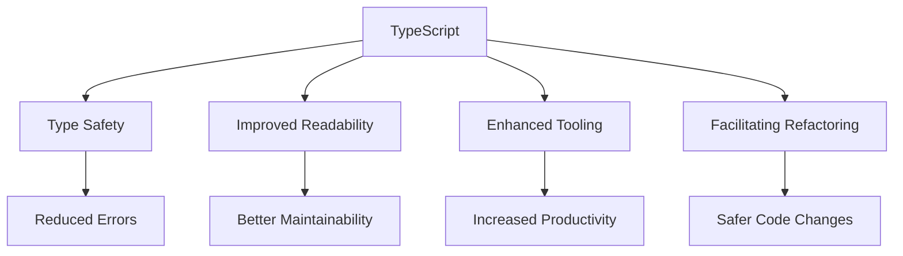

## 27.16 Leveraging TypeScript for Better Code Quality

In the ever-evolving landscape of web development, maintaining high code quality is paramount. TypeScript, a statically typed superset of JavaScript, has emerged as a powerful tool for enhancing code quality, maintainability, and scalability in JavaScript projects. This section explores how TypeScript contributes to these aspects, integrates with design patterns, and encourages best practices in modern web development.

### The Role of TypeScript in Enhancing Code Quality

TypeScript introduces static typing to JavaScript, which helps catch errors at compile time rather than runtime. This early error detection is crucial for maintaining code quality, especially in large-scale applications. Let's delve into the key benefits TypeScript offers:

#### 1. Type Safety

TypeScript's type system allows developers to define types for variables, function parameters, and return values. This ensures that the data types are consistent throughout the codebase, reducing the likelihood of type-related errors.

```typescript
function add(a: number, b: number): number {
    return a + b;
}

let result = add(5, 10); // Correct usage
// let wrongResult = add('5', '10'); // Error: Argument of type 'string' is not assignable to parameter of type 'number'.
```

#### 2. Improved Code Readability and Maintainability

With TypeScript, developers can use interfaces and type aliases to define complex data structures, making the code more readable and maintainable.

```typescript
interface User {
    id: number;
    name: string;
    email: string;
}

function getUserInfo(user: User): string {
    return `User: ${user.name}, Email: ${user.email}`;
}
```

#### 3. Enhanced Tooling and IDE Support

TypeScript's integration with popular IDEs like Visual Studio Code provides features such as autocompletion, refactoring, and real-time error checking, which significantly boost developer productivity.

#### 4. Facilitating Refactoring

TypeScript's static typing makes refactoring safer and more efficient. Developers can confidently change code knowing that TypeScript will catch any type mismatches.

### Integrating TypeScript with Design Patterns

TypeScript's features align well with design patterns, enabling developers to implement patterns more effectively and with greater confidence. Here are some examples:

#### Singleton Pattern

The Singleton pattern ensures a class has only one instance and provides a global point of access to it. TypeScript's class syntax and static properties make implementing this pattern straightforward.

```typescript
class Singleton {
    private static instance: Singleton;

    private constructor() {}

    static getInstance(): Singleton {
        if (!Singleton.instance) {
            Singleton.instance = new Singleton();
        }
        return Singleton.instance;
    }
}

const singleton1 = Singleton.getInstance();
const singleton2 = Singleton.getInstance();
console.log(singleton1 === singleton2); // true
```

#### Observer Pattern

The Observer pattern defines a one-to-many dependency between objects, so when one object changes state, all its dependents are notified. TypeScript's interfaces and classes facilitate the implementation of this pattern.

```typescript
interface Observer {
    update(data: any): void;
}

class Subject {
    private observers: Observer[] = [];

    addObserver(observer: Observer): void {
        this.observers.push(observer);
    }

    removeObserver(observer: Observer): void {
        this.observers = this.observers.filter(obs => obs !== observer);
    }

    notify(data: any): void {
        this.observers.forEach(observer => observer.update(data));
    }
}

class ConcreteObserver implements Observer {
    update(data: any): void {
        console.log(`Observer received data: ${data}`);
    }
}

const subject = new Subject();
const observer1 = new ConcreteObserver();
subject.addObserver(observer1);
subject.notify('Hello, Observers!');
```

### Real-World Examples and Case Studies

#### Case Study: Airbnb

Airbnb adopted TypeScript to improve the reliability and maintainability of their codebase. By leveraging TypeScript's type system, they reduced runtime errors and improved developer confidence in refactoring code. This transition also facilitated better collaboration among developers by providing clear contracts through interfaces and types.

#### Case Study: Slack

Slack's engineering team integrated TypeScript to enhance the scalability of their codebase. TypeScript's static typing helped them manage complex data flows and ensure consistency across different parts of the application. This transition resulted in fewer bugs and a more robust application architecture.

### Encouraging the Adoption of TypeScript

Adopting TypeScript can be a significant step towards professional development for developers. Here are some reasons to consider:

- **Career Advancement**: TypeScript is widely used in the industry, and proficiency in it can open up new career opportunities.
- **Community Support**: TypeScript has a vibrant community and extensive documentation, making it easier for developers to learn and adopt.
- **Seamless Integration**: TypeScript integrates seamlessly with existing JavaScript projects, allowing for gradual adoption without disrupting workflows.

### The Future of TypeScript in the JavaScript Ecosystem

TypeScript continues to evolve, with regular updates that introduce new features and improvements. Its growing popularity and adoption by major companies indicate a promising future. As the JavaScript ecosystem expands, TypeScript will play a crucial role in ensuring code quality and maintainability.

### Conclusion

Leveraging TypeScript for better code quality is a strategic decision that can lead to more robust, maintainable, and scalable applications. By integrating TypeScript with design patterns and best practices, developers can enhance their codebases and improve their development workflows. As we look to the future, TypeScript's role in the JavaScript ecosystem will only grow, making it an essential tool for modern web development.

### Try It Yourself

Experiment with the provided code examples by modifying the types or adding new methods to the classes. Observe how TypeScript's type system helps catch errors and guides you in maintaining code quality.

### Visualizing TypeScript's Impact on Code Quality



**Diagram Description**: This diagram illustrates how TypeScript contributes to various aspects of code quality, including type safety, readability, tooling, and refactoring.

### Knowledge Check

To reinforce your understanding, try answering the following questions:

## Quiz: Mastering TypeScript for Enhanced Code Quality



### What is one of the primary benefits of using TypeScript in JavaScript projects?

- [x] Type Safety
- [ ] Dynamic Typing
- [ ] Increased Code Complexity
- [ ] Reduced Tooling Support

> **Explanation:** TypeScript provides type safety, which helps catch errors at compile time, enhancing code quality.

### How does TypeScript improve code readability?

- [x] By allowing the use of interfaces and type aliases
- [ ] By enforcing strict coding styles
- [ ] By reducing the need for comments
- [ ] By automatically generating documentation

> **Explanation:** TypeScript allows developers to define complex data structures using interfaces and type aliases, making the code more readable.

### Which design pattern is easily implemented using TypeScript's class syntax and static properties?

- [x] Singleton Pattern
- [ ] Observer Pattern
- [ ] Factory Pattern
- [ ] Strategy Pattern

> **Explanation:** The Singleton pattern can be implemented using TypeScript's class syntax and static properties to ensure a single instance.

### What is a key advantage of TypeScript's integration with IDEs?

- [x] Real-time error checking
- [ ] Automatic code generation
- [ ] Reduced memory usage
- [ ] Built-in version control

> **Explanation:** TypeScript's integration with IDEs provides real-time error checking, enhancing developer productivity.

### How does TypeScript facilitate safer refactoring?

- [x] By providing static typing
- [ ] By enforcing coding standards
- [ ] By generating test cases
- [ ] By simplifying code logic

> **Explanation:** TypeScript's static typing allows developers to refactor code with confidence, knowing that type mismatches will be caught.

### Which company adopted TypeScript to improve the reliability of their codebase?

- [x] Airbnb
- [ ] Google
- [ ] Facebook
- [ ] Microsoft

> **Explanation:** Airbnb adopted TypeScript to enhance the reliability and maintainability of their codebase.

### What is a reason to consider adopting TypeScript for professional development?

- [x] Career Advancement
- [ ] Reduced Learning Curve
- [ ] Limited Community Support
- [ ] Decreased Code Complexity

> **Explanation:** Proficiency in TypeScript can open up new career opportunities, as it is widely used in the industry.

### What does TypeScript's type system help catch?

- [x] Type-related errors
- [ ] Syntax errors
- [ ] Logical errors
- [ ] Performance issues

> **Explanation:** TypeScript's type system helps catch type-related errors at compile time, improving code quality.

### How does TypeScript integrate with existing JavaScript projects?

- [x] Seamlessly, allowing for gradual adoption
- [ ] By requiring a complete rewrite
- [ ] By enforcing strict type checks
- [ ] By limiting JavaScript features

> **Explanation:** TypeScript integrates seamlessly with existing JavaScript projects, allowing for gradual adoption without disrupting workflows.

### True or False: TypeScript's role in the JavaScript ecosystem is expected to diminish in the future.

- [ ] True
- [x] False

> **Explanation:** TypeScript's role in the JavaScript ecosystem is expected to grow as it continues to enhance code quality and maintainability.



Remember, this is just the beginning. As you progress, you'll build more complex and interactive applications with TypeScript. Keep experimenting, stay curious, and enjoy the journey!
