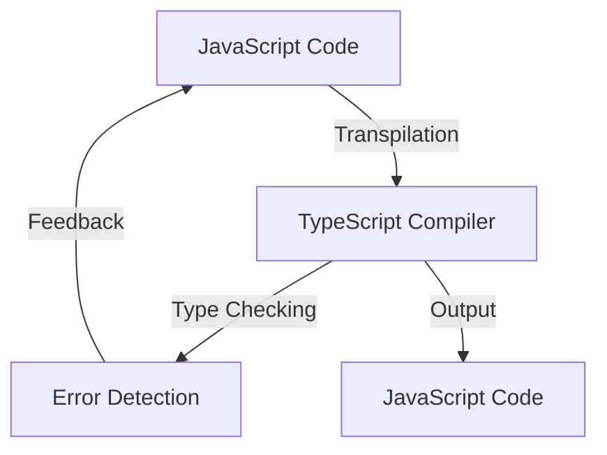

## 27.2 Benefits of Using TypeScript with JavaScript

As we delve into the world of modern web development, the integration of TypeScript with JavaScript emerges as a pivotal advancement. TypeScript, a statically typed superset of JavaScript, offers a plethora of benefits that enhance code quality, development efficiency, and team collaboration. In this section, we will explore these advantages in detail, providing insights into how TypeScript can transform your JavaScript projects.

### Type Safety: Catching Errors at Compile Time

One of the most significant benefits of using TypeScript is its ability to catch errors at compile time. Unlike JavaScript, which is dynamically typed, TypeScript introduces static typing, allowing developers to define types for variables, function parameters, and return values. This feature helps identify potential errors before the code is executed, reducing runtime errors and increasing code reliability.

#### Example: Type Safety in Action

Consider the following JavaScript code:

```javascript
function add(a, b) {
    return a + b;
}

console.log(add(5, "10")); // Outputs: 510
```

In this example, the function `add` is intended to perform arithmetic addition, but due to JavaScript's dynamic typing, it concatenates the number and string instead. Let's see how TypeScript can prevent this error:

```typescript
function add(a: number, b: number): number {
    return a + b;
}

// TypeScript will throw a compile-time error if you try to pass a string
console.log(add(5, 10)); // Outputs: 15
```

By specifying the types of `a` and `b` as numbers, TypeScript ensures that only numbers can be passed to the `add` function, preventing unintended behavior.

### Improved Code Readability and Documentation

TypeScript's type annotations serve as a form of documentation, making the code more readable and easier to understand. When developers specify types, they provide explicit information about the expected data structures and behavior, which can be invaluable for both new team members and future maintenance.

#### Example: Enhanced Readability

```typescript
interface User {
    id: number;
    name: string;
    email: string;
}

function getUserInfo(user: User): string {
    return `User Info: ${user.name} (${user.email})`;
}
```

In this example, the `User` interface clearly defines the structure of a user object, making it immediately apparent what properties are expected. This clarity reduces the cognitive load on developers and facilitates easier onboarding of new team members.

### Tooling Improvements: Enhanced Development Experience

TypeScript significantly enhances the development experience through improved tooling. Modern IDEs and editors leverage TypeScript's type system to provide features such as code completion, refactoring support, and code navigation.

#### Enhanced Code Completion

TypeScript's type information allows IDEs to offer more accurate and context-aware code completion. This feature not only speeds up development but also reduces the likelihood of errors by suggesting valid properties and methods.

#### Refactoring Support

Refactoring is a crucial aspect of maintaining and improving codebases. TypeScript's static typing enables more reliable refactoring tools, allowing developers to rename variables, extract methods, and perform other transformations with confidence that the changes won't introduce errors.

#### Code Navigation

Navigating large codebases can be challenging, but TypeScript simplifies this process. With features like "Go to Definition" and "Find All References," developers can quickly locate and understand the usage of variables, functions, and classes across the project.

### Improved Collaboration in Teams

TypeScript fosters better collaboration among team members by providing a common understanding of the codebase. The explicit type definitions act as a contract, ensuring that everyone adheres to the same expectations and reducing miscommunication.

#### Example: Team Collaboration

Imagine a scenario where multiple developers are working on a large project. With TypeScript, they can define shared interfaces and types, ensuring consistency across different modules. This approach minimizes integration issues and streamlines the development process.

### Integration with Existing JavaScript Libraries

One of TypeScript's strengths is its seamless integration with existing JavaScript libraries. TypeScript can consume JavaScript code without modification, and developers can gradually introduce TypeScript into their projects.

#### Example: Integrating JavaScript Libraries

```typescript
// Importing a JavaScript library
import * as _ from 'lodash';

// Using lodash in TypeScript
const numbers: number[] = [1, 2, 3, 4, 5];
const doubledNumbers = _.map(numbers, (n) => n * 2);

console.log(doubledNumbers); // Outputs: [2, 4, 6, 8, 10]
```

In this example, we use the popular JavaScript library Lodash within a TypeScript file. TypeScript's type definitions for Lodash provide type safety and improved tooling support, enhancing the development experience.

### Try It Yourself

To fully appreciate the benefits of TypeScript, try modifying the provided code examples. Experiment with different types, introduce intentional errors, and observe how TypeScript's type system helps catch them. This hands-on approach will deepen your understanding of TypeScript's capabilities.

### Visualizing TypeScript's Benefits

Let's visualize the interaction between TypeScript and JavaScript using a flowchart:



**Figure 1:** This flowchart illustrates how TypeScript compiles JavaScript code, performs type checking, and provides feedback on errors, ultimately outputting error-free JavaScript code.

### References and Links

For further reading on TypeScript and its integration with JavaScript, consider exploring the following resources:

- [TypeScript Official Documentation](https://www.typescriptlang.org/docs/)
- [MDN Web Docs: TypeScript](https://developer.mozilla.org/en-US/docs/Web/JavaScript/Reference/Global_Objects/TypeScript)
- [TypeScript Deep Dive](https://basarat.gitbook.io/typescript/)

### Knowledge Check

To reinforce your understanding of TypeScript's benefits, consider the following questions:

- How does TypeScript improve code readability?
- What are the advantages of catching errors at compile time?
- How does TypeScript enhance team collaboration?
- What tooling improvements does TypeScript offer?

### Embrace the Journey

Remember, integrating TypeScript into your JavaScript projects is a journey. As you progress, you'll discover more ways to leverage TypeScript's features to enhance your development process. Keep experimenting, stay curious, and enjoy the journey!

### Quiz: Mastering TypeScript Benefits



### What is one of the primary benefits of using TypeScript with JavaScript?

- [x] Catching errors at compile time
- [ ] Faster execution of code
- [ ] Reduced file size
- [ ] Increased runtime performance

> **Explanation:** TypeScript's static typing allows developers to catch errors at compile time, reducing runtime errors and increasing code reliability.

### How does TypeScript improve code readability?

- [x] By providing explicit type annotations
- [ ] By reducing the number of lines of code
- [ ] By automatically generating comments
- [ ] By enforcing a specific coding style

> **Explanation:** TypeScript's type annotations serve as a form of documentation, making the code more readable and easier to understand.

### What tooling improvement does TypeScript offer?

- [x] Enhanced code completion
- [ ] Automatic code generation
- [ ] Built-in testing framework
- [ ] Integrated version control

> **Explanation:** TypeScript's type information allows IDEs to offer more accurate and context-aware code completion.

### How does TypeScript facilitate better team collaboration?

- [x] By providing a common understanding of the codebase
- [ ] By enforcing strict coding standards
- [ ] By reducing the need for communication
- [ ] By automatically merging code changes

> **Explanation:** TypeScript's explicit type definitions act as a contract, ensuring that everyone adheres to the same expectations and reducing miscommunication.

### Can TypeScript be integrated with existing JavaScript libraries?

- [x] Yes, TypeScript can consume JavaScript code without modification
- [ ] No, TypeScript requires rewriting JavaScript libraries
- [ ] Only if the libraries are written in ES6
- [ ] Only if the libraries have TypeScript definitions

> **Explanation:** TypeScript can consume JavaScript code without modification, and developers can gradually introduce TypeScript into their projects.

### What is a benefit of TypeScript's type system?

- [x] It provides type safety and improved tooling support
- [ ] It increases the execution speed of JavaScript code
- [ ] It reduces the size of the final JavaScript bundle
- [ ] It automatically fixes syntax errors

> **Explanation:** TypeScript's type system provides type safety and improved tooling support, enhancing the development experience.

### How does TypeScript handle JavaScript code?

- [x] It compiles JavaScript code and performs type checking
- [ ] It converts JavaScript code to a different language
- [ ] It executes JavaScript code directly
- [ ] It ignores JavaScript code

> **Explanation:** TypeScript compiles JavaScript code, performs type checking, and provides feedback on errors.

### What is the role of TypeScript's type annotations?

- [x] They serve as a form of documentation
- [ ] They automatically generate test cases
- [ ] They enforce a specific coding style
- [ ] They reduce the number of lines of code

> **Explanation:** TypeScript's type annotations provide explicit information about the expected data structures and behavior, serving as a form of documentation.

### How does TypeScript improve refactoring?

- [x] By enabling more reliable refactoring tools
- [ ] By automatically refactoring code
- [ ] By reducing the need for refactoring
- [ ] By enforcing strict coding standards

> **Explanation:** TypeScript's static typing enables more reliable refactoring tools, allowing developers to perform transformations with confidence.

### True or False: TypeScript can only be used with new JavaScript projects.

- [ ] True
- [x] False

> **Explanation:** TypeScript can be integrated into existing JavaScript projects, allowing developers to gradually introduce TypeScript features.




