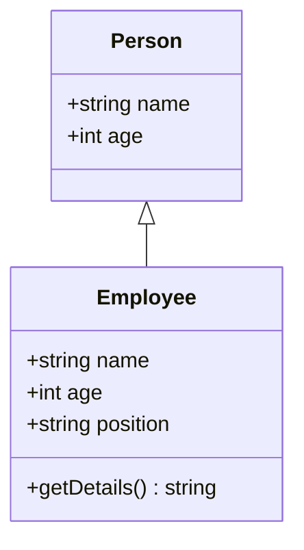

## 27.3 Type Annotations and Interfaces

In the world of JavaScript, where flexibility is both a strength and a challenge, TypeScript emerges as a powerful ally. By introducing static types, TypeScript helps developers catch errors early and write more robust code. In this section, we will delve into the essentials of type annotations and interfaces in TypeScript, exploring how they can be leveraged to define clear contracts within your code.

### Understanding Type Annotations

Type annotations in TypeScript allow you to specify the data types of variables, function parameters, and return values. This explicit declaration helps in maintaining code consistency and avoiding common pitfalls associated with dynamic typing.

#### Basic Type Annotations

Let's start with the basics: annotating variables with types. TypeScript supports a variety of primitive types such as `number`, `string`, `boolean`, `null`, `undefined`, and `symbol`.

```typescript
let age: number = 25;
let name: string = "Alice";
let isStudent: boolean = true;
```

In the above example, we have declared three variables with explicit types. This ensures that `age` can only hold numbers, `name` can only hold strings, and `isStudent` can only hold boolean values.

#### Function Type Annotations

Type annotations can also be applied to function parameters and return types. This is crucial for defining the expected input and output of functions.

```typescript
function greet(name: string): string {
    return `Hello, ${name}!`;
}

let greeting: string = greet("Alice");
```

Here, the `greet` function takes a `string` parameter and returns a `string`. This makes the function's behavior predictable and its usage clear.

#### Object Type Annotations

Objects in TypeScript can also have type annotations, allowing you to define the structure of an object.

```typescript
let person: { name: string; age: number } = {
    name: "Alice",
    age: 25
};
```

This object type annotation specifies that a `person` object must have a `name` property of type `string` and an `age` property of type `number`.

### Introducing Interfaces

Interfaces in TypeScript provide a way to define the shape of an object. They are a powerful tool for enforcing consistency and structuring your code.

#### Defining Interfaces

An interface is defined using the `interface` keyword followed by the interface name and its properties.

```typescript
interface Person {
    name: string;
    age: number;
}

let employee: Person = {
    name: "Bob",
    age: 30
};
```

In this example, the `Person` interface defines a contract that any object of type `Person` must have `name` and `age` properties.

#### Implementing Interfaces

Interfaces can be implemented by classes, ensuring that the class adheres to the defined structure.

```typescript
interface Animal {
    name: string;
    makeSound(): void;
}

class Dog implements Animal {
    name: string;

    constructor(name: string) {
        this.name = name;
    }

    makeSound(): void {
        console.log("Woof! Woof!");
    }
}

let myDog = new Dog("Buddy");
myDog.makeSound(); // Output: Woof! Woof!
```

Here, the `Dog` class implements the `Animal` interface, ensuring that it has a `name` property and a `makeSound` method.

### Optional Properties and Readonly Modifiers

TypeScript interfaces support optional properties and readonly modifiers, providing additional flexibility and control.

#### Optional Properties

Optional properties are denoted by a question mark (`?`) and indicate that a property is not required.

```typescript
interface Car {
    brand: string;
    model: string;
    year?: number;
}

let myCar: Car = {
    brand: "Toyota",
    model: "Corolla"
};
```

In this example, the `year` property is optional, allowing `myCar` to be a valid `Car` object without it.

#### Readonly Modifiers

The `readonly` modifier ensures that a property cannot be changed after it is initialized.

```typescript
interface Book {
    readonly title: string;
    author: string;
}

let myBook: Book = {
    title: "1984",
    author: "George Orwell"
};

// myBook.title = "Animal Farm"; // Error: Cannot assign to 'title' because it is a read-only property.
```

The `title` property in the `Book` interface is marked as `readonly`, preventing any modifications after its initial assignment.

### Structuring Code with Interfaces

Interfaces play a crucial role in structuring code, especially in large-scale applications. They help in defining clear contracts and ensuring that different parts of the application adhere to expected structures.

#### Enforcing Consistency

By using interfaces, you can enforce consistency across your codebase. This is particularly useful when working in teams, as it ensures that everyone follows the same structure.

```typescript
interface User {
    id: number;
    username: string;
    email: string;
}

function getUserInfo(user: User): string {
    return `User: ${user.username}, Email: ${user.email}`;
}

let user: User = {
    id: 1,
    username: "john_doe",
    email: "john@example.com"
};

console.log(getUserInfo(user));
```

In this example, the `User` interface ensures that any object passed to the `getUserInfo` function has the required properties.

#### Extending Interfaces

Interfaces can be extended to create more complex structures, promoting code reuse and modularity.

```typescript
interface Vehicle {
    brand: string;
    model: string;
}

interface ElectricVehicle extends Vehicle {
    batteryCapacity: number;
}

let tesla: ElectricVehicle = {
    brand: "Tesla",
    model: "Model S",
    batteryCapacity: 100
};
```

The `ElectricVehicle` interface extends the `Vehicle` interface, inheriting its properties and adding a new one.

### Visualizing Interfaces and Type Annotations

To better understand how interfaces and type annotations work together, let's visualize their interaction using a class diagram.



In this diagram, `Employee` extends `Person`, inheriting its properties and adding a `position` property and a `getDetails` method. This visual representation highlights how interfaces and classes can be structured to create complex, yet organized, codebases.

### Try It Yourself

Now that we've covered the basics of type annotations and interfaces, it's time to experiment. Try modifying the code examples to add new properties or methods. For instance, extend the `Animal` interface to include a `habitat` property, and update the `Dog` class accordingly.

### References and Further Reading

- [TypeScript Handbook: Interfaces](https://www.typescriptlang.org/docs/handbook/interfaces.html)
- [MDN Web Docs: TypeScript](https://developer.mozilla.org/en-US/docs/Web/JavaScript/Reference/Global_Objects/TypeScript)

### Knowledge Check

To reinforce your understanding, let's go through some questions and exercises.

## Quiz: Mastering TypeScript Type Annotations and Interfaces



### What is the primary purpose of type annotations in TypeScript?

- [x] To specify the data types of variables, function parameters, and return values.
- [ ] To execute JavaScript code faster.
- [ ] To make JavaScript code compatible with older browsers.
- [ ] To add new syntax features to JavaScript.

> **Explanation:** Type annotations in TypeScript are used to specify the data types of variables, function parameters, and return values, helping to catch errors early and maintain code consistency.

### How do you denote an optional property in a TypeScript interface?

- [x] By adding a question mark (`?`) after the property name.
- [ ] By using the `optional` keyword before the property name.
- [ ] By adding an exclamation mark (`!`) after the property name.
- [ ] By using the `nullable` keyword before the property name.

> **Explanation:** In TypeScript, an optional property is denoted by adding a question mark (`?`) after the property name.

### Which keyword is used to define an interface in TypeScript?

- [x] `interface`
- [ ] `class`
- [ ] `type`
- [ ] `struct`

> **Explanation:** The `interface` keyword is used in TypeScript to define an interface, which specifies the structure of an object.

### What does the `readonly` modifier do in a TypeScript interface?

- [x] It prevents a property from being changed after it is initialized.
- [ ] It makes a property optional.
- [ ] It allows a property to be accessed only within the same file.
- [ ] It makes a property accessible only within the class.

> **Explanation:** The `readonly` modifier in TypeScript prevents a property from being changed after it is initialized, ensuring immutability.

### Can interfaces in TypeScript be extended?

- [x] Yes
- [ ] No

> **Explanation:** Interfaces in TypeScript can be extended using the `extends` keyword, allowing for the creation of more complex structures by inheriting properties from other interfaces.

### What is the benefit of using interfaces in TypeScript?

- [x] They help enforce consistency and define clear contracts within the code.
- [ ] They make the code run faster.
- [ ] They allow the use of new JavaScript features.
- [ ] They automatically fix syntax errors.

> **Explanation:** Interfaces in TypeScript help enforce consistency and define clear contracts within the code, ensuring that different parts of the application adhere to expected structures.

### Which of the following is a correct way to implement an interface in a class?

- [x] `class Dog implements Animal { ... }`
- [ ] `class Dog extends Animal { ... }`
- [ ] `class Dog inherits Animal { ... }`
- [ ] `class Dog uses Animal { ... }`

> **Explanation:** The correct way to implement an interface in a class in TypeScript is by using the `implements` keyword.

### What happens if a class does not implement all properties of an interface?

- [x] TypeScript will throw a compile-time error.
- [ ] The class will still compile, but with warnings.
- [ ] The class will not be able to instantiate objects.
- [ ] The class will run, but with runtime errors.

> **Explanation:** If a class does not implement all properties of an interface, TypeScript will throw a compile-time error, ensuring that the class adheres to the interface's contract.

### How can you ensure a property in an interface is immutable?

- [x] By using the `readonly` modifier.
- [ ] By using the `const` keyword.
- [ ] By using the `immutable` keyword.
- [ ] By using the `final` keyword.

> **Explanation:** To ensure a property in an interface is immutable, you use the `readonly` modifier, which prevents the property from being changed after initialization.

### True or False: Type annotations are optional in TypeScript.

- [x] True
- [ ] False

> **Explanation:** Type annotations are optional in TypeScript. While they provide benefits like type safety and code clarity, TypeScript can infer types in many cases, allowing you to omit explicit annotations.



Remember, mastering TypeScript's type annotations and interfaces is a journey. As you continue to explore and experiment, you'll find new ways to enhance your JavaScript code with structure and consistency. Keep learning, stay curious, and enjoy the process!
