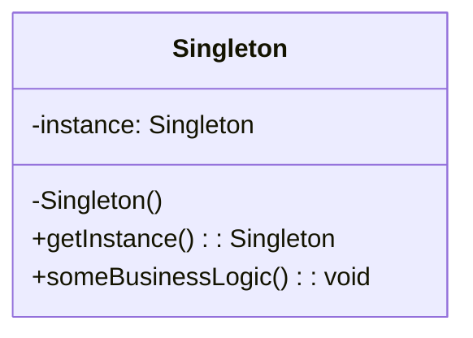
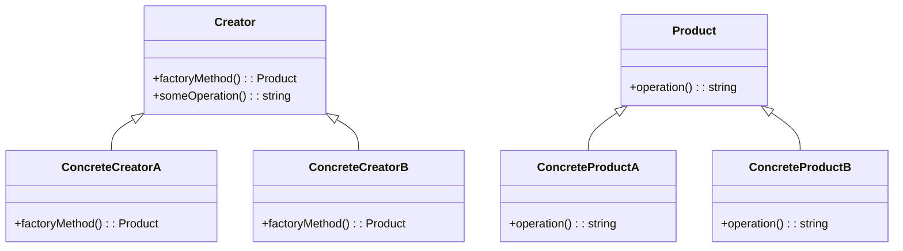
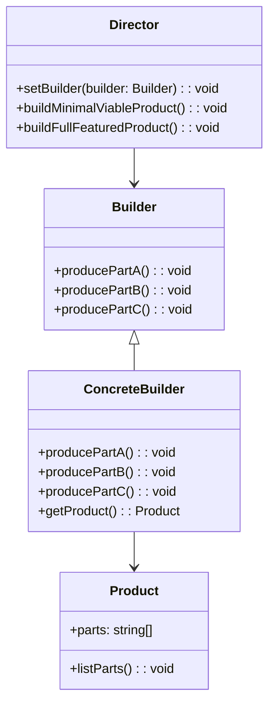

## 27.4 Implementing Creational Patterns in TypeScript

In this section, we will delve into the world of creational design patterns and explore how TypeScript enhances their implementation. Creational patterns are essential in object-oriented programming as they abstract the instantiation process, making your code more flexible and reusable. We will revisit some of the most common creational patterns, such as Singleton, Factory, and Builder, and demonstrate how TypeScript's features, like access modifiers, interfaces, abstract classes, and generics, can be leveraged to implement these patterns effectively.

### Singleton Pattern

**Intent**: Ensure a class has only one instance and provide a global point of access to it.

The Singleton pattern is one of the simplest yet most misunderstood patterns. It restricts the instantiation of a class to a single object. Let's see how TypeScript can be used to implement this pattern.

#### Key Participants

- **Singleton**: The class that is responsible for creating and managing its own unique instance.

#### TypeScript Implementation

```typescript
class Singleton {
  private static instance: Singleton;

  // Private constructor to prevent instantiation
  private constructor() {}

  // Static method to control access to the singleton instance
  public static getInstance(): Singleton {
    if (!Singleton.instance) {
      Singleton.instance = new Singleton();
    }
    return Singleton.instance;
  }

  public someBusinessLogic() {
    // Business logic here
    console.log("Executing business logic.");
  }
}

// Usage
const singleton1 = Singleton.getInstance();
const singleton2 = Singleton.getInstance();

console.log(singleton1 === singleton2); // true
```

**Design Considerations**: The Singleton pattern is often criticized for introducing global state into an application, which can make testing difficult. Use it judiciously.

**JavaScript Unique Features**: JavaScript's module system can naturally enforce a singleton by exporting a single instance of a class or object.

### Factory Pattern

**Intent**: Define an interface for creating an object, but let subclasses alter the type of objects that will be created.

The Factory pattern is a creational pattern that provides an interface for creating objects in a superclass but allows subclasses to alter the type of objects that will be created.

#### Key Participants

- **Factory**: Declares the method for creating objects.
- **ConcreteFactory**: Implements the creation method to return an instance of a ConcreteProduct.
- **Product**: Declares the interface for objects the factory method creates.
- **ConcreteProduct**: Implements the Product interface.

#### TypeScript Implementation

```typescript
interface Product {
  operation(): string;
}

class ConcreteProductA implements Product {
  public operation(): string {
    return "Result of ConcreteProductA";
  }
}

class ConcreteProductB implements Product {
  public operation(): string {
    return "Result of ConcreteProductB";
  }
}

abstract class Creator {
  // Factory method
  public abstract factoryMethod(): Product;

  public someOperation(): string {
    // Call the factory method to create a Product object.
    const product = this.factoryMethod();
    // Now, use the product.
    return `Creator: The same creator's code has just worked with ${product.operation()}`;
  }
}

class ConcreteCreatorA extends Creator {
  public factoryMethod(): Product {
    return new ConcreteProductA();
  }
}

class ConcreteCreatorB extends Creator {
  public factoryMethod(): Product {
    return new ConcreteProductB();
  }
}

// Usage
function clientCode(creator: Creator) {
  console.log("Client: I'm not aware of the creator's class, but it still works.");
  console.log(creator.someOperation());
}

clientCode(new ConcreteCreatorA());
clientCode(new ConcreteCreatorB());
```

**Design Considerations**: The Factory pattern is useful when the exact types and dependencies of the objects your code works with are not known until runtime.

**JavaScript Unique Features**: JavaScript's dynamic nature allows for more flexible factory implementations, such as using functions or closures.

### Builder Pattern

**Intent**: Separate the construction of a complex object from its representation so that the same construction process can create different representations.

The Builder pattern is used to construct a complex object step by step. Unlike other creational patterns, the Builder pattern does not require products to have a common interface.

#### Key Participants

- **Builder**: Specifies an abstract interface for creating parts of a Product object.
- **ConcreteBuilder**: Constructs and assembles parts of the product by implementing the Builder interface.
- **Director**: Constructs an object using the Builder interface.
- **Product**: Represents the complex object under construction.

#### TypeScript Implementation

```typescript
class Product {
  public parts: string[] = [];

  public listParts(): void {
    console.log(`Product parts: ${this.parts.join(', ')}`);
  }
}

interface Builder {
  producePartA(): void;
  producePartB(): void;
  producePartC(): void;
}

class ConcreteBuilder implements Builder {
  private product: Product;

  constructor() {
    this.reset();
  }

  public reset(): void {
    this.product = new Product();
  }

  public producePartA(): void {
    this.product.parts.push('PartA');
  }

  public producePartB(): void {
    this.product.parts.push('PartB');
  }

  public producePartC(): void {
    this.product.parts.push('PartC');
  }

  public getProduct(): Product {
    const result = this.product;
    this.reset();
    return result;
  }
}

class Director {
  private builder: Builder;

  public setBuilder(builder: Builder): void {
    this.builder = builder;
  }

  public buildMinimalViableProduct(): void {
    this.builder.producePartA();
  }

  public buildFullFeaturedProduct(): void {
    this.builder.producePartA();
    this.builder.producePartB();
    this.builder.producePartC();
  }
}

// Usage
const director = new Director();
const builder = new ConcreteBuilder();
director.setBuilder(builder);

console.log('Standard basic product:');
director.buildMinimalViableProduct();
builder.getProduct().listParts();

console.log('Standard full featured product:');
director.buildFullFeaturedProduct();
builder.getProduct().listParts();

console.log('Custom product:');
builder.producePartA();
builder.producePartC();
builder.getProduct().listParts();
```

**Design Considerations**: The Builder pattern is particularly useful when you need to create an object with many optional parts or configurations.

**JavaScript Unique Features**: JavaScript's object literals can sometimes serve as a simpler alternative to the Builder pattern for constructing objects.

### Abstract Factory Pattern

**Intent**: Provide an interface for creating families of related or dependent objects without specifying their concrete classes.

The Abstract Factory pattern is similar to the Factory pattern but is used to create families of related objects.

#### Key Participants

- **AbstractFactory**: Declares an interface for operations that create abstract product objects.
- **ConcreteFactory**: Implements the operations to create concrete product objects.
- **AbstractProduct**: Declares an interface for a type of product object.
- **ConcreteProduct**: Defines a product object to be created by the corresponding concrete factory.
- **Client**: Uses only interfaces declared by AbstractFactory and AbstractProduct classes.

#### TypeScript Implementation

```typescript
interface AbstractProductA {
  usefulFunctionA(): string;
}

interface AbstractProductB {
  usefulFunctionB(): string;
  anotherUsefulFunctionB(collaborator: AbstractProductA): string;
}

class ConcreteProductA1 implements AbstractProductA {
  public usefulFunctionA(): string {
    return 'The result of the product A1.';
  }
}

class ConcreteProductA2 implements AbstractProductA {
  public usefulFunctionA(): string {
    return 'The result of the product A2.';
  }
}

class ConcreteProductB1 implements AbstractProductB {
  public usefulFunctionB(): string {
    return 'The result of the product B1.';
  }

  public anotherUsefulFunctionB(collaborator: AbstractProductA): string {
    const result = collaborator.usefulFunctionA();
    return `The result of the B1 collaborating with the (${result})`;
  }
}

class ConcreteProductB2 implements AbstractProductB {
  public usefulFunctionB(): string {
    return 'The result of the product B2.';
  }

  public anotherUsefulFunctionB(collaborator: AbstractProductA): string {
    const result = collaborator.usefulFunctionA();
    return `The result of the B2 collaborating with the (${result})`;
  }
}

interface AbstractFactory {
  createProductA(): AbstractProductA;
  createProductB(): AbstractProductB;
}

class ConcreteFactory1 implements AbstractFactory {
  public createProductA(): AbstractProductA {
    return new ConcreteProductA1();
  }

  public createProductB(): AbstractProductB {
    return new ConcreteProductB1();
  }
}

class ConcreteFactory2 implements AbstractFactory {
  public createProductA(): AbstractProductA {
    return new ConcreteProductA2();
  }

  public createProductB(): AbstractProductB {
    return new ConcreteProductB2();
  }
}

// Usage
function clientCode(factory: AbstractFactory) {
  const productA = factory.createProductA();
  const productB = factory.createProductB();

  console.log(productB.usefulFunctionB());
  console.log(productB.anotherUsefulFunctionB(productA));
}

console.log('Client: Testing client code with the first factory type...');
clientCode(new ConcreteFactory1());

console.log('');

console.log('Client: Testing the same client code with the second factory type...');
clientCode(new ConcreteFactory2());
```

**Design Considerations**: The Abstract Factory pattern is useful when a system must be independent of how its products are created, composed, and represented.

**JavaScript Unique Features**: JavaScript's dynamic typing and prototype-based inheritance can simplify the implementation of abstract factories.

### Prototype Pattern

**Intent**: Specify the kinds of objects to create using a prototypical instance, and create new objects by copying this prototype.

The Prototype pattern is used to create a new object by copying an existing object, known as the prototype.

#### Key Participants

- **Prototype**: Declares an interface for cloning itself.
- **ConcretePrototype**: Implements the operation for cloning itself.
- **Client**: Creates a new object by asking a prototype to clone itself.

#### TypeScript Implementation

```typescript
interface Prototype {
  clone(): Prototype;
}

class ConcretePrototype1 implements Prototype {
  public field: string;

  constructor(field: string) {
    this.field = field;
  }

  public clone(): Prototype {
    return new ConcretePrototype1(this.field);
  }
}

class ConcretePrototype2 implements Prototype {
  public field: number;

  constructor(field: number) {
    this.field = field;
  }

  public clone(): Prototype {
    return new ConcretePrototype2(this.field);
  }
}

// Usage
const prototype1 = new ConcretePrototype1('Prototype 1');
const clone1 = prototype1.clone();

console.log(clone1);

const prototype2 = new ConcretePrototype2(42);
const clone2 = prototype2.clone();

console.log(clone2);
```

**Design Considerations**: The Prototype pattern can be used when the cost of creating a new instance of a class is more expensive than copying an existing instance.

**JavaScript Unique Features**: JavaScript's prototypal inheritance naturally supports the Prototype pattern, making it easy to implement.

### Try It Yourself

Now that we've explored these creational patterns, try modifying the code examples to better understand how they work. For instance, you could:

- Add more concrete products to the Factory pattern.
- Implement a new method in the Singleton class.
- Create a new type of product in the Builder pattern.

### Visualizing Creational Patterns

Let's visualize the relationships and workflows of these patterns using Mermaid.js diagrams.

#### Singleton Pattern Diagram



#### Factory Pattern Diagram



#### Builder Pattern Diagram



### Knowledge Check

To reinforce your understanding, try answering the following questions:

1. What is the main purpose of the Singleton pattern?
2. How does TypeScript's `private` keyword help in implementing the Singleton pattern?
3. What is the difference between a Factory and an Abstract Factory?
4. How can generics be used in the Factory pattern?
5. Why might you choose the Builder pattern over other creational patterns?

### Summary

In this section, we've explored how TypeScript enhances the implementation of creational design patterns. By leveraging TypeScript's features like access modifiers, interfaces, abstract classes, and generics, we can create more robust and maintainable code. Remember, design patterns are tools in your toolbox—use them wisely to solve specific problems in your applications.

### Embrace the Journey

Remember, this is just the beginning. As you progress, you'll build more complex and interactive applications. Keep experimenting, stay curious, and enjoy the journey!

## Quiz: Mastering Creational Patterns in TypeScript



### What is the primary purpose of the Singleton pattern?

- [x] To ensure a class has only one instance and provide a global point of access to it.
- [ ] To create a family of related objects.
- [ ] To separate the construction of a complex object from its representation.
- [ ] To define an interface for creating an object.

> **Explanation:** The Singleton pattern ensures that a class has only one instance and provides a global point of access to it.

### How does TypeScript's `private` keyword assist in implementing the Singleton pattern?

- [x] It prevents the instantiation of the class from outside.
- [ ] It allows multiple instances of the class.
- [ ] It makes the class immutable.
- [ ] It enables inheritance.

> **Explanation:** The `private` keyword in TypeScript prevents the instantiation of the class from outside, ensuring only one instance is created.

### What distinguishes a Factory from an Abstract Factory?

- [x] A Factory creates a single product, while an Abstract Factory creates families of related products.
- [ ] A Factory uses interfaces, while an Abstract Factory does not.
- [ ] A Factory is used for complex objects, while an Abstract Factory is not.
- [ ] A Factory is a structural pattern, while an Abstract Factory is not.

> **Explanation:** A Factory creates a single product, while an Abstract Factory creates families of related products.

### How can generics be utilized in the Factory pattern?

- [x] To create a factory method that can produce different types of objects.
- [ ] To enforce a single instance of a class.
- [ ] To separate the construction of a complex object.
- [ ] To define an interface for creating an object.

> **Explanation:** Generics allow the factory method to produce different types of objects, enhancing flexibility.

### Why might you choose the Builder pattern over other creational patterns?

- [x] To construct a complex object step by step.
- [ ] To ensure a class has only one instance.
- [ ] To create a family of related objects.
- [ ] To define an interface for creating an object.

> **Explanation:** The Builder pattern is chosen to construct a complex object step by step, allowing for more control over the construction process.

### Which TypeScript feature is particularly useful for implementing the Factory pattern?

- [x] Interfaces
- [ ] Enums
- [ ] Decorators
- [ ] Modules

> **Explanation:** Interfaces in TypeScript are particularly useful for defining the contract for products in the Factory pattern.

### What is a key benefit of using the Prototype pattern?

- [x] It allows for the creation of new objects by copying existing ones.
- [ ] It ensures a class has only one instance.
- [ ] It separates the construction of a complex object.
- [ ] It defines an interface for creating an object.

> **Explanation:** The Prototype pattern allows for the creation of new objects by copying existing ones, which can be more efficient than creating a new instance from scratch.

### In the Builder pattern, what role does the Director play?

- [x] It constructs an object using the Builder interface.
- [ ] It defines the interface for creating parts of a Product object.
- [ ] It implements the operation for cloning itself.
- [ ] It declares an interface for cloning itself.

> **Explanation:** The Director constructs an object using the Builder interface, orchestrating the building process.

### What is the primary role of a ConcreteProduct in the Factory pattern?

- [x] To implement the Product interface.
- [ ] To declare the interface for objects the factory method creates.
- [ ] To define an interface for creating an object.
- [ ] To provide a global point of access to an instance.

> **Explanation:** A ConcreteProduct implements the Product interface, providing the specific implementation of the product.

### True or False: The Builder pattern is useful when you need to create an object with many optional parts or configurations.

- [x] True
- [ ] False

> **Explanation:** True. The Builder pattern is particularly useful for creating objects with many optional parts or configurations.




