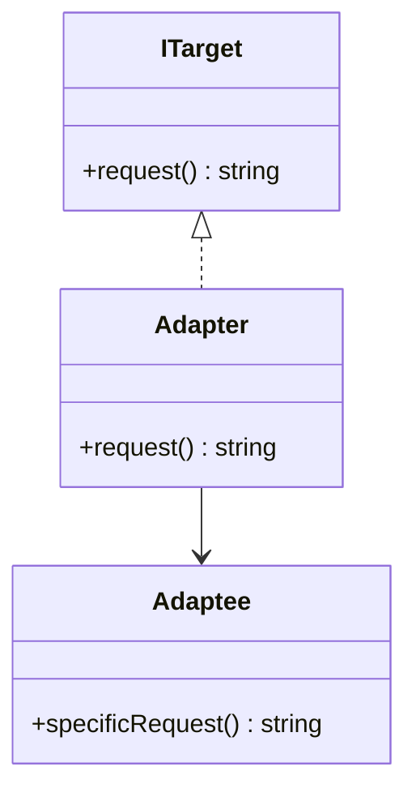
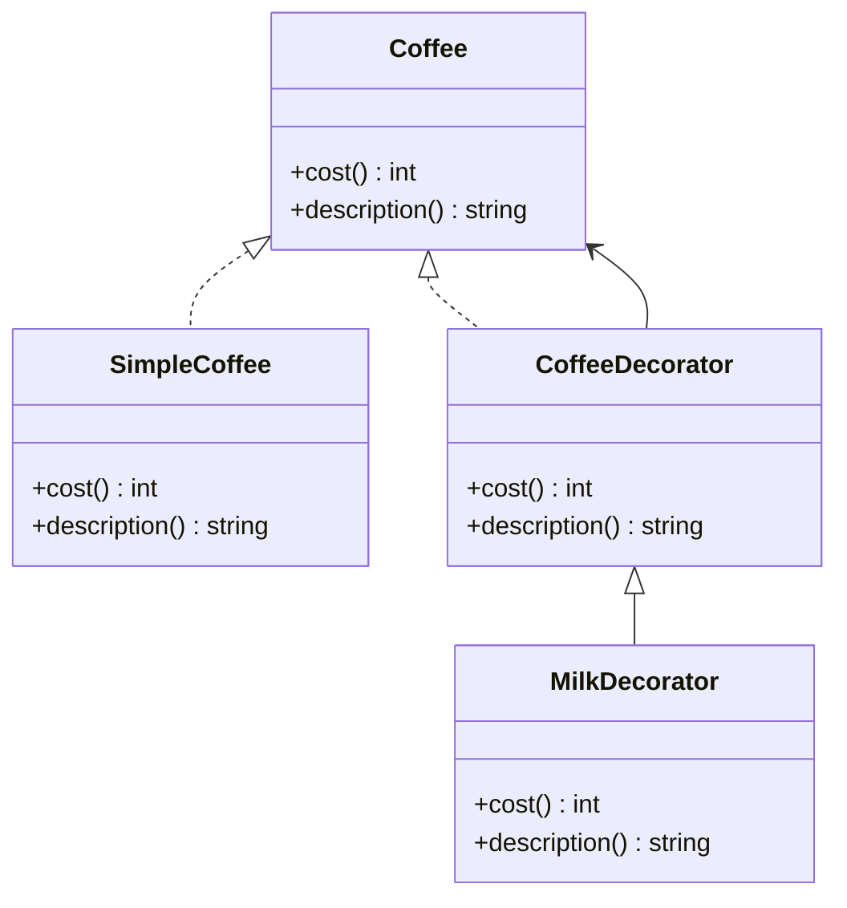
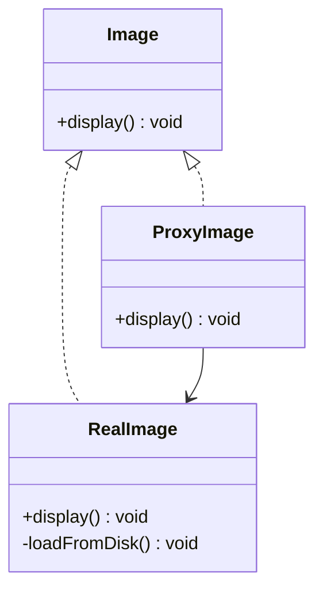

## 27.5 Structural Patterns with Strong Typing

In this section, we will delve into how TypeScript's robust type system enhances the implementation of structural design patterns. Structural patterns are concerned with object composition and typically identify simple ways to realize relationships between different objects. We'll focus on three key patterns: Adapter, Decorator, and Proxy. These patterns are commonly used in software design to create flexible and reusable code structures. By leveraging TypeScript's type safety and interfaces, we can significantly improve the reliability and maintainability of our code.

### Understanding Structural Patterns

Structural patterns define how objects and classes can be composed to form larger structures. They help ensure that if one part of a system changes, the entire system does not need to be rewritten. Let's explore how TypeScript can be used to implement these patterns effectively.

### Adapter Pattern

**Intent**: Convert the interface of a class into another interface that clients expect. The Adapter pattern allows classes to work together that couldn't otherwise because of incompatible interfaces.

**Key Participants**:
- **Target**: Defines the domain-specific interface that Client uses.
- **Adapter**: Adapts the interface of Adaptee to the Target interface.
- **Adaptee**: Defines an existing interface that needs adapting.
- **Client**: Collaborates with objects conforming to the Target interface.

#### TypeScript Implementation

In TypeScript, we can use interfaces to define the expected interface and create an adapter class that implements this interface.

```typescript
// Target interface
interface ITarget {
  request(): string;
}

// Adaptee class with a different interface
class Adaptee {
  specificRequest(): string {
    return "Adaptee's specific request";
  }
}

// Adapter class
class Adapter implements ITarget {
  private adaptee: Adaptee;

  constructor(adaptee: Adaptee) {
    this.adaptee = adaptee;
  }

  public request(): string {
    return `Adapter: (TRANSLATED) ${this.adaptee.specificRequest()}`;
  }
}

// Client code
function clientCode(target: ITarget) {
  console.log(target.request());
}

const adaptee = new Adaptee();
const adapter = new Adapter(adaptee);
clientCode(adapter);
```

**Explanation**: In this example, the `Adapter` class implements the `ITarget` interface and translates the `specificRequest` of the `Adaptee` into a `request` that the `Client` can use. This pattern is particularly useful when integrating third-party libraries or legacy code.

#### Benefits of TypeScript

- **Type Safety**: Ensures that the adapter correctly implements the target interface.
- **Interfaces**: Clearly define the expected behavior, making the code more understandable and maintainable.
- **Advanced Types**: Allow for more flexible and reusable adapter implementations.

### Decorator Pattern

**Intent**: Attach additional responsibilities to an object dynamically. Decorators provide a flexible alternative to subclassing for extending functionality.

**Key Participants**:
- **Component**: Defines the interface for objects that can have responsibilities added to them dynamically.
- **ConcreteComponent**: Defines an object to which additional responsibilities can be attached.
- **Decorator**: Maintains a reference to a Component object and defines an interface that conforms to Component's interface.
- **ConcreteDecorator**: Adds responsibilities to the component.

#### TypeScript Implementation

TypeScript's class and interface features make it easy to implement the Decorator pattern.

```typescript
// Component interface
interface Coffee {
  cost(): number;
  description(): string;
}

// ConcreteComponent
class SimpleCoffee implements Coffee {
  cost(): number {
    return 5;
  }

  description(): string {
    return "Simple coffee";
  }
}

// Decorator
class CoffeeDecorator implements Coffee {
  protected coffee: Coffee;

  constructor(coffee: Coffee) {
    this.coffee = coffee;
  }

  cost(): number {
    return this.coffee.cost();
  }

  description(): string {
    return this.coffee.description();
  }
}

// ConcreteDecorator
class MilkDecorator extends CoffeeDecorator {
  cost(): number {
    return super.cost() + 1;
  }

  description(): string {
    return `${super.description()}, milk`;
  }
}

// Client code
const myCoffee = new MilkDecorator(new SimpleCoffee());
console.log(`${myCoffee.description()} costs $${myCoffee.cost()}`);
```

**Explanation**: The `CoffeeDecorator` class implements the `Coffee` interface and holds a reference to a `Coffee` object. The `MilkDecorator` extends `CoffeeDecorator` to add milk to the coffee, demonstrating how decorators can be stacked to add multiple functionalities.

#### Benefits of TypeScript

- **Type Safety**: Ensures that decorators conform to the component interface.
- **Reusability**: Decorators can be easily reused and combined in different configurations.
- **Flexibility**: New decorators can be added without modifying existing code.

### Proxy Pattern

**Intent**: Provide a surrogate or placeholder for another object to control access to it.

**Key Participants**:
- **Subject**: Defines the common interface for RealSubject and Proxy so that a Proxy can be used anywhere a RealSubject is expected.
- **RealSubject**: Defines the real object that the proxy represents.
- **Proxy**: Controls access to the RealSubject and may be responsible for creating and managing it.

#### TypeScript Implementation

TypeScript's interfaces and classes make it straightforward to implement the Proxy pattern.

```typescript
// Subject interface
interface Image {
  display(): void;
}

// RealSubject
class RealImage implements Image {
  private filename: string;

  constructor(filename: string) {
    this.filename = filename;
    this.loadFromDisk();
  }

  private loadFromDisk(): void {
    console.log(`Loading ${this.filename}`);
  }

  display(): void {
    console.log(`Displaying ${this.filename}`);
  }
}

// Proxy
class ProxyImage implements Image {
  private realImage: RealImage | null = null;
  private filename: string;

  constructor(filename: string) {
    this.filename = filename;
  }

  display(): void {
    if (this.realImage === null) {
      this.realImage = new RealImage(this.filename);
    }
    this.realImage.display();
  }
}

// Client code
const image = new ProxyImage("test.jpg");
image.display(); // Loading test.jpg
image.display(); // Displaying test.jpg
```

**Explanation**: The `ProxyImage` class implements the `Image` interface and controls access to the `RealImage`. It delays the creation of the `RealImage` until it is needed, demonstrating lazy initialization.

#### Benefits of TypeScript

- **Type Safety**: Ensures that the proxy and real subject conform to the same interface.
- **Encapsulation**: Hides the complexity of the real subject from the client.
- **Lazy Initialization**: Delays the creation of expensive objects until they are needed.

### Advanced TypeScript Features

TypeScript offers advanced types that can further enhance the implementation of structural patterns:

- **Union and Intersection Types**: Allow for more flexible type definitions, enabling the combination of multiple types.
- **Mapped Types**: Provide a way to create new types based on existing ones, useful for creating variations of patterns.
- **Conditional Types**: Enable type definitions that depend on conditions, allowing for more dynamic and adaptable patterns.

### Visualizing Structural Patterns

To better understand how these patterns work, let's visualize the relationships between the components using Mermaid.js diagrams.

#### Adapter Pattern Diagram



**Caption**: This diagram shows how the `Adapter` class implements the `ITarget` interface and interacts with the `Adaptee` class.

#### Decorator Pattern Diagram



**Caption**: This diagram illustrates how decorators extend the functionality of the `SimpleCoffee` by implementing the `Coffee` interface.

#### Proxy Pattern Diagram



**Caption**: This diagram depicts the `ProxyImage` controlling access to the `RealImage`, both implementing the `Image` interface.

### Try It Yourself

Experiment with the code examples provided by making the following modifications:

- **Adapter Pattern**: Create a new `Adaptee` class with a different method and adapt it using the `Adapter`.
- **Decorator Pattern**: Implement additional decorators, such as `SugarDecorator` or `VanillaDecorator`, and combine them with existing decorators.
- **Proxy Pattern**: Add logging functionality to the `ProxyImage` to track how many times the `display` method is called.

### Knowledge Check

To reinforce your understanding, consider the following questions:

- How does TypeScript's type system enhance the implementation of structural patterns?
- What are the benefits of using interfaces in TypeScript for design patterns?
- How can advanced TypeScript features like union and intersection types be used in structural patterns?

### Key Takeaways

- **TypeScript's type system** provides significant benefits in implementing structural patterns, ensuring type safety and enhancing code reliability.
- **Interfaces** play a crucial role in defining expected behaviors and facilitating the implementation of patterns like Adapter, Decorator, and Proxy.
- **Advanced TypeScript features** offer additional flexibility and adaptability, allowing for more dynamic and reusable code structures.

### Embrace the Journey

Remember, mastering design patterns is a journey. As you continue to explore and experiment with these patterns, you'll gain a deeper understanding of how to create flexible and maintainable code structures. Keep experimenting, stay curious, and enjoy the journey!

## Mastering Structural Patterns with TypeScript Quiz



### What is the primary intent of the Adapter pattern?

- [x] To convert the interface of a class into another interface that clients expect.
- [ ] To attach additional responsibilities to an object dynamically.
- [ ] To provide a surrogate or placeholder for another object to control access to it.
- [ ] To define a family of algorithms, encapsulate each one, and make them interchangeable.

> **Explanation:** The Adapter pattern's primary intent is to convert the interface of a class into another interface that clients expect, allowing incompatible interfaces to work together.

### Which TypeScript feature is crucial for implementing the Decorator pattern?

- [ ] Union Types
- [x] Interfaces
- [ ] Conditional Types
- [ ] Mapped Types

> **Explanation:** Interfaces are crucial for implementing the Decorator pattern as they define the expected behavior and ensure that decorators conform to the component interface.

### What is a key benefit of using the Proxy pattern?

- [ ] It allows for the dynamic addition of responsibilities to an object.
- [x] It controls access to another object and may be responsible for creating and managing it.
- [ ] It provides a way to create new types based on existing ones.
- [ ] It defines a family of algorithms, encapsulates each one, and makes them interchangeable.

> **Explanation:** The Proxy pattern controls access to another object and may be responsible for creating and managing it, providing a surrogate or placeholder for the real object.

### How does TypeScript's type system enhance structural patterns?

- [x] By ensuring type safety and enhancing code reliability.
- [ ] By allowing for the dynamic addition of methods to objects.
- [ ] By providing a way to create new types based on existing ones.
- [ ] By defining a family of algorithms, encapsulating each one, and making them interchangeable.

> **Explanation:** TypeScript's type system enhances structural patterns by ensuring type safety and enhancing code reliability, making the code more maintainable and understandable.

### Which advanced TypeScript feature allows for more flexible type definitions?

- [ ] Interfaces
- [ ] Classes
- [x] Union and Intersection Types
- [ ] Decorators

> **Explanation:** Union and Intersection Types allow for more flexible type definitions, enabling the combination of multiple types and enhancing the adaptability of patterns.

### What is the role of the `Adapter` class in the Adapter pattern?

- [x] It adapts the interface of the `Adaptee` to the `Target` interface.
- [ ] It defines the domain-specific interface that the client uses.
- [ ] It defines an existing interface that needs adapting.
- [ ] It collaborates with objects conforming to the `Target` interface.

> **Explanation:** The `Adapter` class adapts the interface of the `Adaptee` to the `Target` interface, allowing classes with incompatible interfaces to work together.

### In the Decorator pattern, what does the `ConcreteDecorator` do?

- [ ] It defines the interface for objects that can have responsibilities added to them dynamically.
- [ ] It defines an object to which additional responsibilities can be attached.
- [ ] It maintains a reference to a `Component` object and defines an interface that conforms to `Component`'s interface.
- [x] It adds responsibilities to the component.

> **Explanation:** The `ConcreteDecorator` adds responsibilities to the component, extending its functionality dynamically.

### What is a common use case for the Proxy pattern?

- [ ] Integrating third-party libraries or legacy code.
- [ ] Extending the functionality of an object dynamically.
- [x] Lazy initialization and access control.
- [ ] Creating new types based on existing ones.

> **Explanation:** A common use case for the Proxy pattern is lazy initialization and access control, where the proxy controls access to the real object and may delay its creation until needed.

### How can TypeScript's interfaces improve the implementation of structural patterns?

- [x] By clearly defining expected behaviors and ensuring type safety.
- [ ] By allowing for the dynamic addition of methods to objects.
- [ ] By providing a way to create new types based on existing ones.
- [ ] By defining a family of algorithms, encapsulating each one, and making them interchangeable.

> **Explanation:** TypeScript's interfaces improve the implementation of structural patterns by clearly defining expected behaviors and ensuring type safety, making the code more understandable and maintainable.

### True or False: The Proxy pattern can be used to provide a surrogate or placeholder for another object.

- [x] True
- [ ] False

> **Explanation:** True. The Proxy pattern can be used to provide a surrogate or placeholder for another object, controlling access to it and potentially managing its lifecycle.




