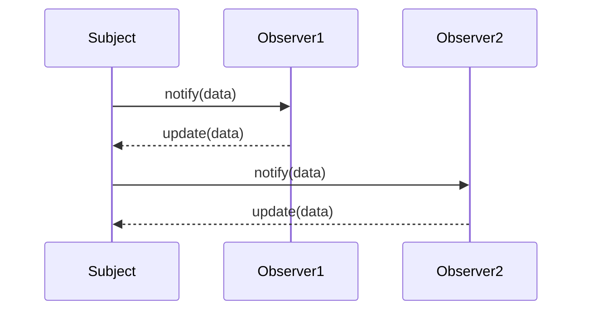

## 27.6 Behavioral Patterns and Generics

In this section, we delve into the world of behavioral design patterns in JavaScript, specifically focusing on how TypeScript's generics can enhance these patterns. Behavioral patterns are concerned with algorithms and the assignment of responsibilities between objects. They help in defining how objects interact in a system, promoting flexibility and communication.

### Introduction to TypeScript Generics

Generics in TypeScript are a powerful feature that allows developers to create reusable and flexible components. They enable you to define functions, interfaces, and classes that work with a variety of data types while maintaining type safety.

#### Syntax of Generics

The syntax for generics involves using angle brackets (`<>`) to denote a type parameter. Here's a simple example:

```typescript
function identity<T>(arg: T): T {
    return arg;
}

let output1 = identity<string>("Hello");
let output2 = identity<number>(42);
```

In this example, `T` is a type parameter that acts as a placeholder for the actual type that will be used when the function is called. This allows the `identity` function to accept any type of argument and return a value of the same type.

### Behavioral Patterns with Generics

Let's explore how generics can be used to implement some common behavioral design patterns, such as the Observer and Strategy patterns, in a more flexible and reusable manner.

#### Observer Pattern

**Intent**: Define a one-to-many dependency between objects so that when one object changes state, all its dependents are notified and updated automatically.

**Key Participants**:
- **Subject**: Maintains a list of observers and notifies them of any state changes.
- **Observer**: Defines an updating interface for objects that should be notified of changes in a subject.

**Using Generics in Observer Pattern**

Generics can be used to create a type-safe Observer pattern where the subject can notify observers with specific data types.

```typescript
// Observer interface
interface Observer<T> {
    update(data: T): void;
}

// Subject interface
interface Subject<T> {
    subscribe(observer: Observer<T>): void;
    unsubscribe(observer: Observer<T>): void;
    notify(data: T): void;
}

// Concrete Subject
class ConcreteSubject<T> implements Subject<T> {
    private observers: Observer<T>[] = [];

    subscribe(observer: Observer<T>): void {
        this.observers.push(observer);
    }

    unsubscribe(observer: Observer<T>): void {
        this.observers = this.observers.filter(obs => obs !== observer);
    }

    notify(data: T): void {
        for (const observer of this.observers) {
            observer.update(data);
        }
    }
}

// Concrete Observer
class ConcreteObserver<T> implements Observer<T> {
    update(data: T): void {
        console.log(`Observer received data: ${data}`);
    }
}

// Usage
const subject = new ConcreteSubject<number>();
const observer1 = new ConcreteObserver<number>();
const observer2 = new ConcreteObserver<number>();

subject.subscribe(observer1);
subject.subscribe(observer2);

subject.notify(42);
```

**Explanation**: In this implementation, the `ConcreteSubject` class can notify observers with any data type, thanks to the generic type `T`. This makes the Observer pattern more reusable and type-safe.

#### Strategy Pattern

**Intent**: Define a family of algorithms, encapsulate each one, and make them interchangeable. Strategy lets the algorithm vary independently from clients that use it.

**Key Participants**:
- **Strategy**: Declares an interface common to all supported algorithms.
- **Context**: Maintains a reference to a Strategy object and uses it to call the algorithm defined by a Strategy.

**Using Generics in Strategy Pattern**

Generics can be used to create a flexible Strategy pattern where different strategies can operate on various data types.

```typescript
// Strategy interface
interface Strategy<T> {
    execute(data: T): void;
}

// Concrete Strategy A
class ConcreteStrategyA<T> implements Strategy<T> {
    execute(data: T): void {
        console.log(`Strategy A processing data: ${data}`);
    }
}

// Concrete Strategy B
class ConcreteStrategyB<T> implements Strategy<T> {
    execute(data: T): void {
        console.log(`Strategy B processing data: ${data}`);
    }
}

// Context
class Context<T> {
    private strategy: Strategy<T>;

    constructor(strategy: Strategy<T>) {
        this.strategy = strategy;
    }

    setStrategy(strategy: Strategy<T>): void {
        this.strategy = strategy;
    }

    executeStrategy(data: T): void {
        this.strategy.execute(data);
    }
}

// Usage
const context = new Context<number>(new ConcreteStrategyA<number>());
context.executeStrategy(10);

context.setStrategy(new ConcreteStrategyB<number>());
context.executeStrategy(20);
```

**Explanation**: The `Context` class can switch between different strategies that operate on the same data type, thanks to the generic type `T`. This makes the Strategy pattern more adaptable and reusable.

### Benefits of Using Generics

Generics promote code reusability and type safety, allowing you to write more flexible and maintainable code. By using generics, you can create components that work with any data type, reducing the need for duplicate code and minimizing errors.

#### Type-Safe Event Handling

Generics can also be used to implement type-safe event handling and callback mechanisms. Consider a simple event emitter:

```typescript
class EventEmitter<T> {
    private listeners: Array<(event: T) => void> = [];

    addListener(listener: (event: T) => void): void {
        this.listeners.push(listener);
    }

    removeListener(listener: (event: T) => void): void {
        this.listeners = this.listeners.filter(l => l !== listener);
    }

    emit(event: T): void {
        for (const listener of this.listeners) {
            listener(event);
        }
    }
}

// Usage
const numberEmitter = new EventEmitter<number>();
numberEmitter.addListener((event) => console.log(`Received number: ${event}`));
numberEmitter.emit(5);
```

**Explanation**: The `EventEmitter` class uses a generic type `T` to ensure that listeners receive the correct type of event data, enhancing type safety and reducing runtime errors.

### Visualizing the Observer Pattern

To better understand the Observer pattern, let's visualize the interaction between the subject and its observers using a sequence diagram.



**Description**: This diagram illustrates how the `Subject` notifies each `Observer` with data, and each `Observer` updates itself accordingly.

### Try It Yourself

To deepen your understanding, try modifying the code examples:

1. **Observer Pattern**: Implement a new observer that performs a different action when notified.
2. **Strategy Pattern**: Create a new strategy that processes data differently and switch strategies in the `Context`.
3. **Event Emitter**: Add a new event type and listener to the `EventEmitter` class.

### Knowledge Check

Reflect on the following questions to reinforce your understanding:

- How do generics enhance the flexibility of design patterns?
- What are the benefits of using generics for event handling?
- How does the Observer pattern differ from the Strategy pattern in terms of structure and intent?

### Summary

In this section, we've explored how TypeScript's generics can be leveraged to implement behavioral design patterns in a more flexible and reusable manner. By using generics, we can create type-safe and adaptable components that enhance the maintainability and robustness of our code.

Remember, mastering these patterns and techniques is a journey. Keep experimenting, stay curious, and enjoy the process of learning and applying these concepts in your projects!

## Quiz: Mastering Behavioral Patterns and Generics in TypeScript



### What is the main benefit of using generics in TypeScript?

- [x] They allow for flexible and reusable code components.
- [ ] They make the code run faster.
- [ ] They automatically optimize memory usage.
- [ ] They eliminate the need for type annotations.

> **Explanation:** Generics enable the creation of flexible and reusable code components by allowing functions, interfaces, and classes to work with various data types while maintaining type safety.

### In the Observer pattern, what role does the Subject play?

- [x] It maintains a list of observers and notifies them of state changes.
- [ ] It defines the interface for observers.
- [ ] It processes data using different algorithms.
- [ ] It encapsulates a family of algorithms.

> **Explanation:** The Subject in the Observer pattern maintains a list of observers and is responsible for notifying them of any changes in state.

### How do generics enhance the Strategy pattern?

- [x] They allow strategies to operate on various data types.
- [ ] They make strategies execute faster.
- [ ] They reduce the number of strategies needed.
- [ ] They automatically choose the best strategy.

> **Explanation:** Generics allow strategies to operate on various data types, making the Strategy pattern more adaptable and reusable.

### What is a key feature of the EventEmitter class using generics?

- [x] Type-safe event handling.
- [ ] Automatic event logging.
- [ ] Built-in error handling.
- [ ] Dynamic event prioritization.

> **Explanation:** The EventEmitter class uses generics to ensure type-safe event handling, allowing listeners to receive the correct type of event data.

### Which of the following is a behavioral design pattern?

- [x] Observer
- [ ] Singleton
- [ ] Factory
- [ ] Adapter

> **Explanation:** The Observer pattern is a behavioral design pattern, focusing on the interaction and communication between objects.

### What does the Strategy pattern encapsulate?

- [x] A family of algorithms.
- [ ] A list of observers.
- [ ] A set of classes.
- [ ] A group of interfaces.

> **Explanation:** The Strategy pattern encapsulates a family of algorithms, allowing them to be interchangeable.

### How can you modify the Observer pattern to handle different data types?

- [x] Use generics to define the data type.
- [ ] Use multiple inheritance.
- [ ] Implement a new interface for each data type.
- [ ] Use a switch statement to handle different types.

> **Explanation:** Using generics allows the Observer pattern to handle different data types by defining a type parameter.

### What is the purpose of the `update` method in the Observer pattern?

- [x] To notify the observer of changes in the subject.
- [ ] To initialize the observer.
- [ ] To delete the observer.
- [ ] To create a new subject.

> **Explanation:** The `update` method in the Observer pattern is used to notify the observer of changes in the subject.

### How does the Context class in the Strategy pattern use the strategy?

- [x] It maintains a reference to a Strategy object and uses it to call the algorithm.
- [ ] It defines the algorithm itself.
- [ ] It creates new strategies dynamically.
- [ ] It logs the execution of the strategy.

> **Explanation:** The Context class maintains a reference to a Strategy object and uses it to call the algorithm defined by the Strategy.

### True or False: Generics can only be used with classes in TypeScript.

- [ ] True
- [x] False

> **Explanation:** False. Generics can be used with functions, interfaces, and classes in TypeScript, providing flexibility and type safety across various components.



By understanding and applying these concepts, you'll be well-equipped to leverage TypeScript's generics to enhance the flexibility and reusability of behavioral design patterns in your projects. Keep exploring and refining your skills!
